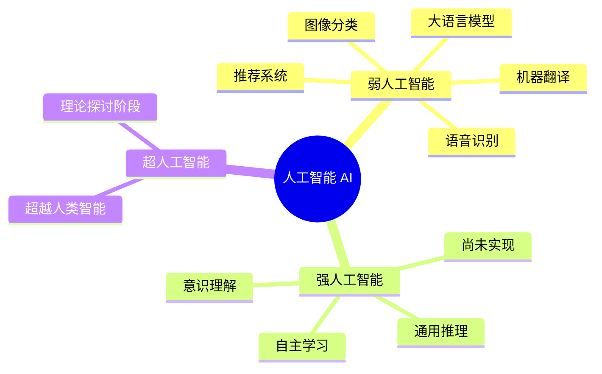
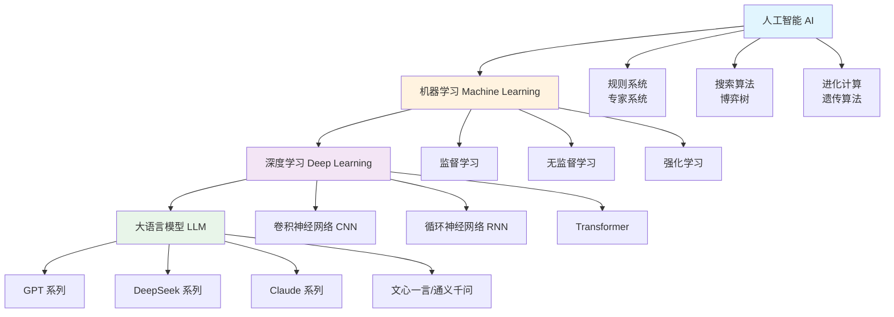
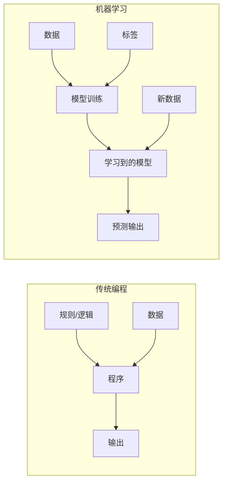
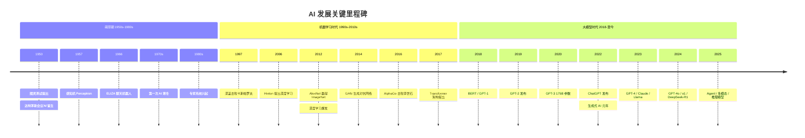
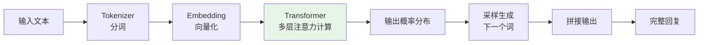
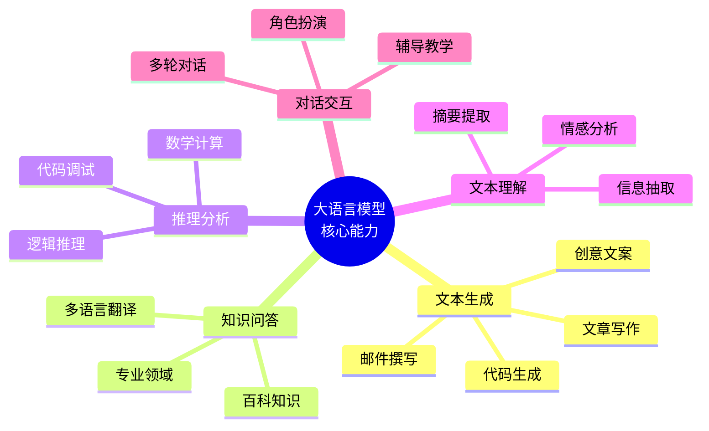
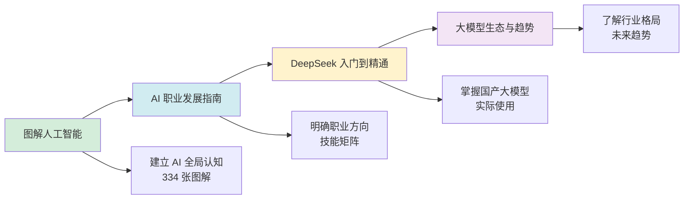
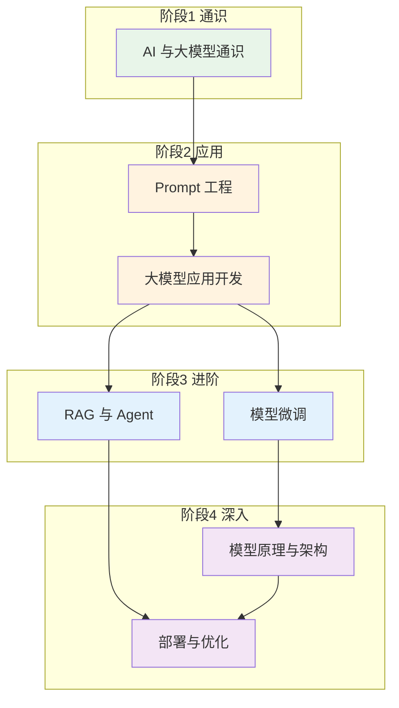

# 第一阶段：AI 与大模型通识

> **资料来源**：综合《图解人工智能》（多田智史）、吴恩达《How to Build a Career in AI》、清华大学《DeepSeek：从入门到精通》、行业公开报告及技术文档整理

## 学习目标

本阶段面向零基础或刚接触 AI 的读者，目标是建立对人工智能和大语言模型的全局认知，不需要编程基础即可理解。完成本阶段后，你将能够：

- 清晰区分人工智能、机器学习、深度学习、大语言模型的概念边界
- 了解 AI 发展历史与关键里程碑
- 掌握当前大模型生态格局
- 明确 AI 职业发展方向与技能要求
- 熟练使用 DeepSeek 等国产大模型辅助工作与学习

## 核心问题

- 什么是人工智能、机器学习、深度学习、大语言模型？
- 大模型能做什么？不能做什么？
- 如何规划 AI 职业道路？
- 国产大模型（DeepSeek）的能力和特点？

---

## 一、人工智能全景导论

### 1.1 AI 的定义与范畴

**人工智能（Artificial Intelligence, AI）** 是研究、开发用于模拟、延伸和扩展人类智能的理论、方法、技术及应用系统的技术科学。AI 的目标是让机器能够执行通常需要人类智能才能完成的任务，如视觉感知、语言理解、决策推理等。

**注意**：当前所有商用 AI 系统（包括 GPT-4、DeepSeek、Claude 等）都属于**弱人工智能（Narrow AI）**，即在特定任务上表现优异，但不具备通用推理能力。强人工智能（AGI）仍是研究目标。

### 1.2 AI 的核心技术层次

AI 技术体系可分为三个层次，理解它们的区别是入门的关键：

| 层次 | 定义 | 核心思想 | 代表技术/产品 |
|------|------|----------|--------------|
| **人工智能 (AI)** | 让机器模拟人类智能的广泛领域 | 符号推理、知识表示、学习 | 专家系统、搜索引擎、机器人 |
| **机器学习 (ML)** | 让机器从数据中自动学习规律 | 用数据训练模型，而非硬编码规则 | 线性回归、决策树、SVM、随机森林 |
| **深度学习 (DL)** | 基于多层神经网络的机器学习方法 | 自动学习数据的层次化特征表示 | CNN、RNN、Transformer、ResNet |
| **大语言模型 (LLM)** | 基于 Transformer 的超大规模预训练语言模型 | 通过海量文本自监督学习语言规律 | GPT-4、DeepSeek-V3、Claude 3.5 |

### 1.3 关键概念辨析

**机器学习 vs. 传统编程**

传统编程中，人类编写规则，机器执行规则得到结果。机器学习中，人类提供数据和期望输出，机器自动学习规则（模型），然后用学到的规则处理新数据。

**深度学习为何"深"**

"深"指的是神经网络的**层数多**。浅层网络（如单层感知机）只能学习简单的线性关系，而深层网络可以学习复杂的非线性特征层次：

- 第一层：学习边缘、颜色等低级特征
- 中间层：学习纹理、形状等中级特征
- 深层：学习物体部件、语义等高级特征

---

## 二、AI 发展简史

### 2.1 关键里程碑时间线

### 2.2 三次 AI 浪潮

| 浪潮 | 时间 | 核心技术 | 代表成果 | 局限 |
|------|------|----------|----------|------|
| **第一次** | 1950s-1980s | 符号主义、专家系统 | 深蓝、ELIZA | 知识获取瓶颈、规则难以维护 |
| **第二次** | 1990s-2010s | 统计机器学习 | SVM、随机森林、早期神经网络 | 特征工程依赖、数据需求大 |
| **第三次** | 2012-至今 | 深度学习、大模型 | AlexNet、GPT、AlphaGo | 算力消耗大、可解释性差 |

**关键转折点**：2012 年 AlexNet 在 ImageNet 竞赛中以远超第二名的成绩获胜，证明了深度卷积神经网络在图像识别上的威力，开启了第三次 AI 浪潮。2017 年 Transformer 架构的提出则为后来的大语言模型奠定了技术基础。

---

## 三、大语言模型（LLM）入门

### 3.1 什么是大语言模型

**大语言模型（Large Language Model, LLM）** 是基于 Transformer 架构、在海量文本数据上预训练的超大规模神经网络。其核心能力是**预测下一个词（Next Token Prediction）**，通过这一简单目标，模型学会了语法、语义、推理、知识表示等复杂能力。

### 3.2 大模型的核心能力

### 3.3 大模型的局限性

**重要提醒：大模型不是万能的**

1. **幻觉（Hallucination）**：模型可能生成看似合理但实际错误的内容
2. **知识截止**：模型训练数据有截止日期，不了解最新事件
3. **无实时信息**：无法主动访问互联网（除非配备工具）
4. **数学计算**：复杂计算可能出错，不应替代计算器
5. **无真正理解**：基于统计模式匹配，非真正的理解或意识
6. **上下文限制**：有最大输入长度限制（如 4K、128K tokens）

---

## 四、推荐学习路径

### 4.1 本阶段学习顺序

### 4.2 完整学习路线图

---

## 五、实践建议

### 5.1 立即行动清单

- [ ] 注册 ChatGPT / Claude / DeepSeek 账号并实际体验
- [ ] 尝试用自然语言描述问题，观察模型回答质量
- [ ] 测试模型的边界：问它不知道的事情，观察幻觉
- [ ] 记录使用中的困惑，为后续 Prompt 工程学习做准备
- [ ] 阅读本目录下的其他四篇文档，建立系统认知

### 5.2 预计学习时间

| 内容 | 时间 |
|------|------|
| 图解人工智能 | 5-7 天 |
| AI 职业发展指南 | 2-3 天 |
| DeepSeek 入门到精通 | 3-5 天 |
| 大模型生态与趋势 | 2-3 天 |
| **总计** | **2-3 周（每天 1-2 小时）** |

**学习建议**：不要只阅读，要动手实践。每读完一章，就打开大模型尝试相关功能。实践是建立直觉的最佳方式。

---

## 六、关键术语速查

| 术语 | 英文 | 含义 |
|------|------|------|
| 人工智能 | Artificial Intelligence (AI) | 模拟人类智能的技术科学 |
| 机器学习 | Machine Learning (ML) | 让机器从数据中学习规律 |
| 深度学习 | Deep Learning (DL) | 基于多层神经网络的 ML |
| 大语言模型 | Large Language Model (LLM) | 超大规模预训练语言模型 |
| Transformer | Transformer | 基于自注意力机制的神经网络架构 |
| 预训练 | Pre-training | 在大规模语料上学习通用知识 |
| 微调 | Fine-tuning | 在特定任务数据上调整模型 |
| 提示工程 | Prompt Engineering | 优化输入以获得更好输出 |
| Token | Token | 模型处理的最小文本单元 |
| 幻觉 | Hallucination | 模型生成虚假内容 |
| 上下文窗口 | Context Window | 模型能处理的最大文本长度 |
| RAG | Retrieval-Augmented Generation | 检索增强生成 |
| RLHF | Reinforcement Learning from Human Feedback | 基于人类反馈的强化学习 |
