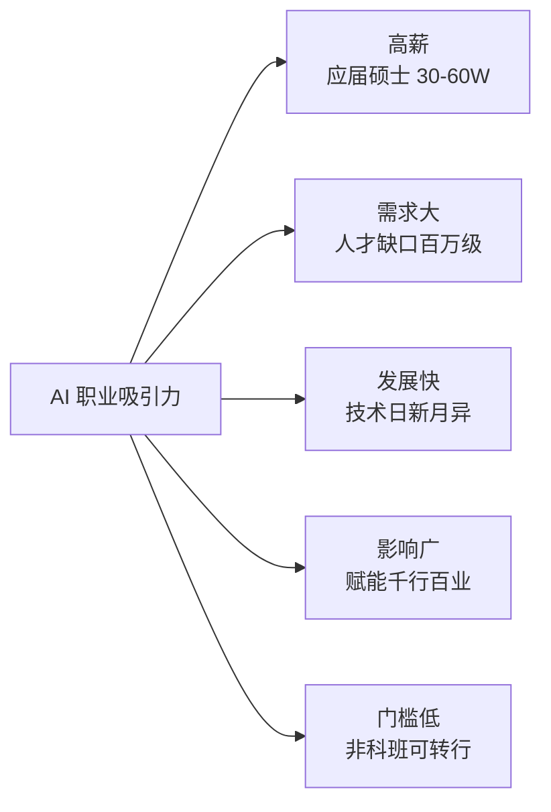
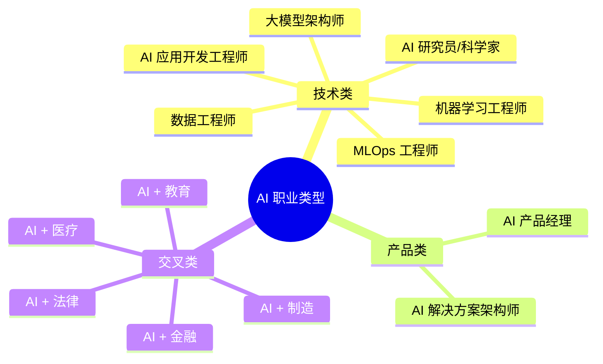
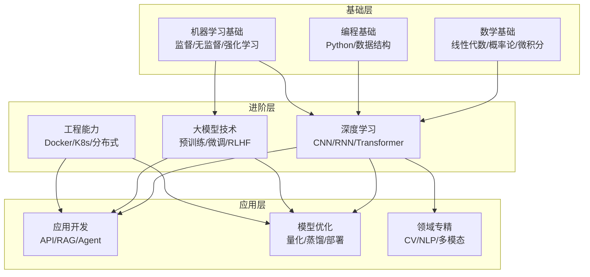
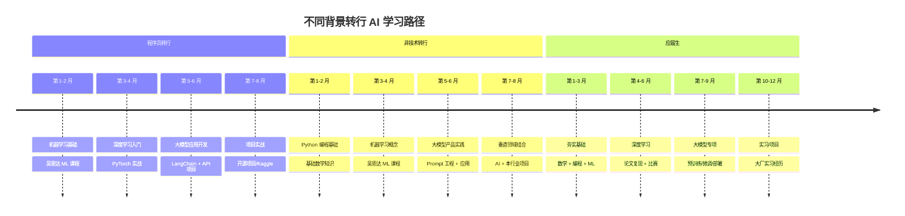
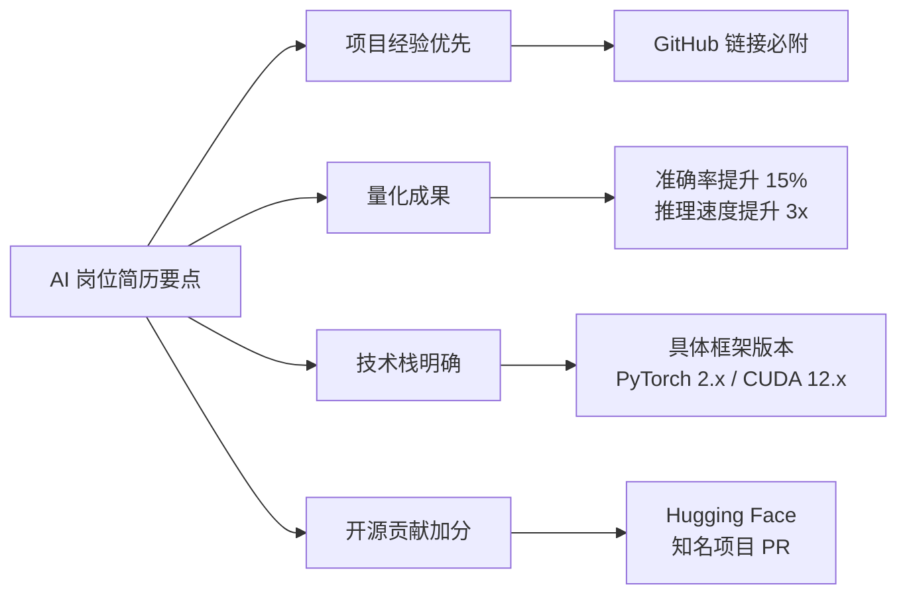
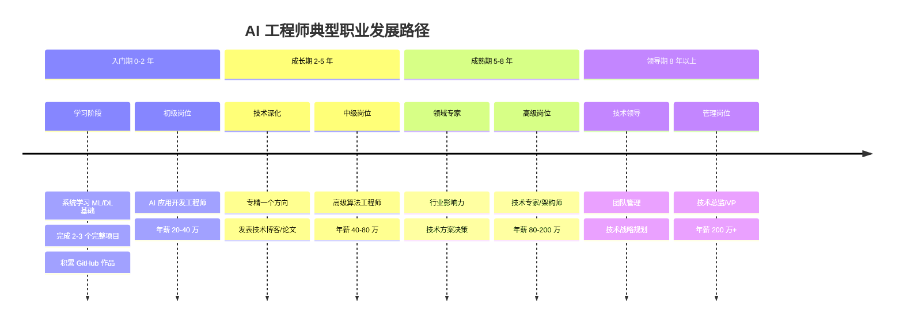

# AI 职业发展指南

> **资料来源**：综合吴恩达《How to Build a Career in AI》、猎聘/BOSS 直聘 2024-2025 AI 岗位报告、各大厂招聘 JD 及行业公开信息整理

## 一、AI 行业概览

### 1.1 为什么选择 AI 职业

人工智能正处于第三次浪潮的爆发期，大语言模型的出现让 AI 从实验室走向了千行百业。根据工信部数据，2024 年中国 AI 核心产业规模超过 5000 亿元，带动相关产业规模超过 1.8 万亿元。AI 人才缺口持续扩大，是当下最具发展潜力的职业方向之一。

### 1.2 AI 职业类型全景

---

## 二、核心岗位详解

### 2.1 AI 应用开发工程师

**职责**：基于大模型 API 开发应用产品，将 AI 能力集成到业务系统中。

**日常工作**：
- 调用 OpenAI / DeepSeek / Claude 等 API 开发功能
- 设计 Prompt 模板和对话流程
- 构建 RAG 知识库问答系统
- 开发 AI Agent 自动化工作流

**技能要求**：

| 技能类别 | 具体要求 | 重要程度 |
|----------|----------|----------|
| 编程语言 | Python（必备）、JavaScript/TypeScript | ⭐⭐⭐⭐⭐ |
| 框架工具 | LangChain、LlamaIndex、FastAPI | ⭐⭐⭐⭐ |
| 大模型 API | OpenAI API、DeepSeek API、Claude API | ⭐⭐⭐⭐⭐ |
| 数据库 | PostgreSQL、Redis、向量数据库 | ⭐⭐⭐⭐ |
| 前端基础 | React/Vue（全栈方向） | ⭐⭐⭐ |
| 工程能力 | Git、Docker、CI/CD | ⭐⭐⭐⭐ |

**薪资范围（2024-2025）**：

| 级别 | 年薪范围 | 经验要求 |
|------|----------|----------|
| 初级 | 20-40 万 | 0-2 年 |
| 中级 | 40-80 万 | 2-5 年 |
| 高级 | 80-150 万 | 5-8 年 |
| 专家 | 150-300 万 | 8 年以上 |

### 2.2 大模型架构师

**职责**：设计模型架构、优化训练方案、解决技术难题。

**日常工作**：
- 设计和优化 Transformer 架构变体
- 负责预训练、微调、对齐的技术方案
- 模型压缩与推理加速
- 分布式训练工程

**技能要求**：

| 技能类别 | 具体要求 | 重要程度 |
|----------|----------|----------|
| 深度学习理论 | Transformer、注意力机制、优化算法 | ⭐⭐⭐⭐⭐ |
| 框架 | PyTorch、DeepSpeed、Megatron-LM | ⭐⭐⭐⭐⭐ |
| 分布式系统 | 数据并行、模型并行、流水线并行 | ⭐⭐⭐⭐⭐ |
| 硬件知识 | GPU/TPU 架构、CUDA 编程 | ⭐⭐⭐⭐ |
| 数学基础 | 线性代数、概率论、微积分、信息论 | ⭐⭐⭐⭐⭐ |

**薪资范围**：

| 级别 | 年薪范围 | 经验要求 |
|------|----------|----------|
| 中级 | 60-100 万 | 3-5 年 |
| 高级 | 100-200 万 | 5-8 年 |
| 首席/专家 | 200-500 万 | 8 年以上 |

### 2.3 MLOps / 部署工程师

**职责**：负责模型的部署、监控、维护和规模化服务。

**日常工作**：
- 模型量化、剪枝、蒸馏
- 推理服务部署（vLLM、TGI、TensorRT-LLM）
- 模型版本管理与 A/B 测试
- 性能监控与自动扩缩容

**技能要求**：

| 技能类别 | 具体要求 | 重要程度 |
|----------|----------|----------|
| 容器化 | Docker、Kubernetes | ⭐⭐⭐⭐⭐ |
| 云平台 | AWS/Azure/阿里云/华为云 | ⭐⭐⭐⭐⭐ |
| 推理框架 | vLLM、TGI、TensorRT-LLM | ⭐⭐⭐⭐⭐ |
| 模型优化 | 量化、剪枝、蒸馏 | ⭐⭐⭐⭐ |
| 监控运维 | Prometheus、Grafana、ELK | ⭐⭐⭐⭐ |

**薪资范围**：

| 级别 | 年薪范围 | 经验要求 |
|------|----------|----------|
| 初级 | 25-45 万 | 1-3 年 |
| 中级 | 45-80 万 | 3-5 年 |
| 高级 | 80-150 万 | 5 年以上 |

### 2.4 AI 产品经理

**职责**：规划 AI 产品方向，协调技术与业务。

**日常工作**：
- 调研 AI 技术能力与业务场景的结合点
- 设计 AI 功能的产品方案
- 与技术团队沟通可行性
- 跟踪 AI 行业动态和竞品

**技能要求**：

| 技能类别 | 具体要求 | 重要程度 |
|----------|----------|----------|
| 产品能力 | 需求分析、原型设计、数据分析 | ⭐⭐⭐⭐⭐ |
| AI 理解 | 了解大模型能力边界、Prompt 工程 | ⭐⭐⭐⭐⭐ |
| 行业知识 | 垂直领域业务理解 | ⭐⭐⭐⭐ |
| 技术沟通 | 能与工程师有效沟通 | ⭐⭐⭐⭐ |

**薪资范围**：

| 级别 | 年薪范围 | 经验要求 |
|------|----------|----------|
| 初级 | 20-40 万 | 1-3 年 |
| 中级 | 40-80 万 | 3-5 年 |
| 高级 | 80-150 万 | 5 年以上 |

---

## 三、技能矩阵与学习路径

### 3.1 通用技能矩阵

### 3.2 不同背景转行者路径

---

## 四、面试准备指南

### 4.1 高频面试题

#### 机器学习基础

1. **过拟合和欠拟合是什么？如何解决？**
   - 过拟合：模型在训练集表现好，测试集差。解决：正则化、Dropout、早停、数据增强、简化模型
   - 欠拟合：模型在训练集和测试集都差。解决：增加模型复杂度、增加特征、减少正则化

2. **梯度下降是什么？有哪些变种？**
   - 批量梯度下降（BGD）、随机梯度下降（SGD）、小批量梯度下降（Mini-batch）
   - 优化器：Momentum、AdaGrad、RMSprop、Adam

3. **L1 和 L2 正则化的区别？**
   - L1：产生稀疏解，可做特征选择
   - L2：权重平滑，防止过拟合

#### 深度学习

4. **Transformer 架构的核心是什么？**
   - 自注意力机制（Self-Attention）：计算序列中每个位置与其他位置的相关性
   - 多头注意力：并行计算多组注意力，捕捉不同子空间信息
   - 位置编码：为序列添加位置信息

5. **CNN 和 RNN 的区别？为什么 NLP 现在用 Transformer？**
   - CNN：局部连接、权值共享，适合图像；对长序列依赖捕捉有限
   - RNN：顺序处理，有梯度消失问题，难以并行
   - Transformer：完全并行、长距离依赖直接建模，成为主流

#### 大模型专项

6. **什么是预训练和微调？**
   - 预训练：在大规模无标注数据上学习通用表示
   - 微调：在特定任务有标注数据上调整模型参数

7. **RLHF 是什么？为什么需要它？**
   - Reinforcement Learning from Human Feedback
   - 让模型输出符合人类偏好（有用、无害、诚实）
   - 流程：训练奖励模型 → PPO 优化策略模型

8. **大模型推理加速有哪些方法？**
   - 量化（INT8/INT4/FP8）
   - KV Cache 优化
   - 投机采样（Speculative Decoding）
   - 连续批处理（Continuous Batching）
   - 模型并行（张量并行、流水线并行）

### 4.2 项目准备建议

**面试官最看重的三件事**：

1. **有实际可演示的项目**（GitHub 仓库 + 在线 Demo）
2. **对技术选型的深入理解**（为什么选 A 不选 B）
3. **解决问题的思路**（遇到什么问题，如何解决的）

**推荐项目方向**：

| 方向 | 项目示例 | 技术栈 |
|------|----------|--------|
| RAG 应用 | 企业知识库问答系统 | LangChain + 向量数据库 + LLM API |
| AI Agent | 自动化研报生成助手 | AutoGPT / CrewAI + 工具调用 |
| 模型微调 | 垂直领域对话模型 | LoRA + QLoRA + 自定义数据集 |
| 模型部署 | 本地大模型推理服务 | vLLM + Docker + FastAPI |

### 4.3 简历要点

---

## 五、学习资源推荐

### 5.1 在线课程

| 课程 | 平台 | 适合阶段 | 特点 |
|------|------|----------|------|
| 机器学习 | Coursera（吴恩达） | 入门 | 经典，概念清晰 |
| 深度学习专项 | Coursera（吴恩达） | 入门-进阶 | 系统全面 |
| Stanford CS224N | YouTube/B站 | 进阶 | NLP 经典课程 |
| Stanford CS231N | YouTube/B站 | 进阶 | CV 经典课程 |
| 李沐《动手学深度学习》 | B站/知乎 | 入门-进阶 | 中文，代码实践 |
| 大模型技术公开课 | 智源/B站 | 进阶 | 国内前沿 |

### 5.2 必读论文

| 论文 | 年份 | 意义 |
|------|------|------|
| Attention Is All You Need | 2017 | Transformer 架构 |
| BERT | 2018 | 双向预训练 |
| GPT-3 | 2020 | 大模型能力涌现 |
| InstructGPT | 2022 | RLHF 对齐 |
| LLaMA | 2023 | 开源大模型标杆 |
| DeepSeek-R1 | 2025 | 国产推理模型 |

### 5.3 社区与平台

- **GitHub**：关注 awesome-llm、langchain 等仓库
- **Hugging Face**：模型、数据集、Spaces 演示
- **Kaggle**：数据竞赛，学习实战
- **Papers With Code**：论文 + 代码复现
- **知乎/掘金**：中文技术博客

---

## 六、职业发展时间线

**重要建议**：AI 领域技术更新极快，持续学习是职业发展的核心。建议每周投入 5-10 小时学习新技术、阅读论文、参与开源社区。保持好奇心和动手能力，是在这个领域立足的根本。

