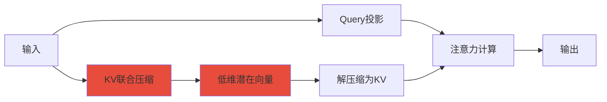
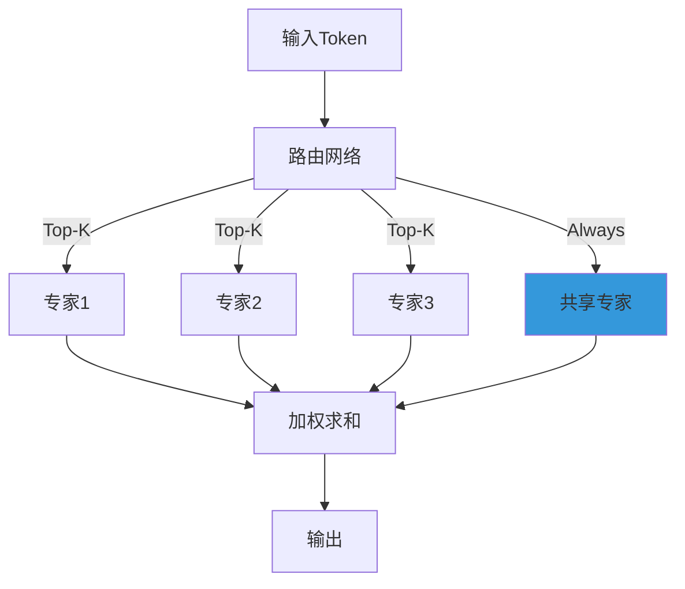
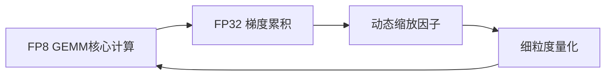
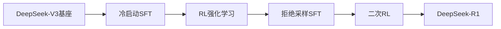
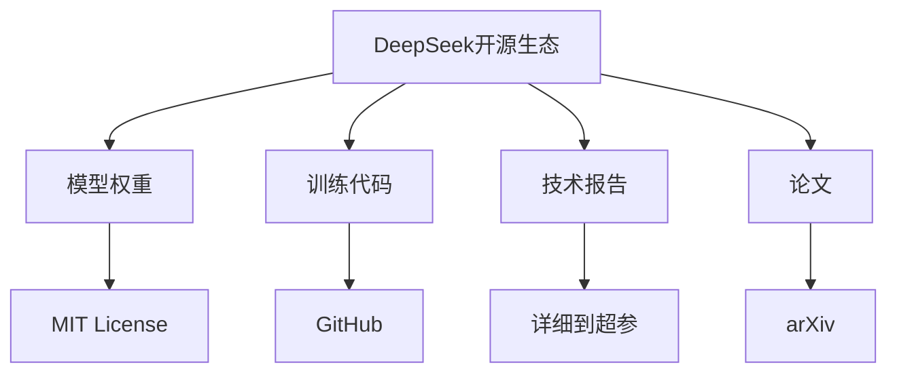

# DeepSeek 系列大模型详解

> **资料来源**：DeepSeek 官方技术报告与开源模型
> **适合人群**：想了解国产大模型发展的读者
> **难度**：⭐⭐（容易）

---

## 1. DeepSeek 公司背景

DeepSeek（深度求索）成立于 2023 年，是中国 AI 公司中技术开源最激进的一家。其核心理念是：**用最少的资源做最好的模型**。

### 发展历程

| 时间 | 模型 | 参数量 | 特点 |
|------|------|--------|------|
| 2023.11 | DeepSeek-Coder | 1B-33B | 代码专用模型 |
| 2024.01 | DeepSeek-LLM | 7B/67B | 通用大模型 |
| 2024.05 | DeepSeek-V2 | 236B (MoE) | MLA 注意力，成本极低 |
| 2024.12 | DeepSeek-V3 | 671B (MoE) | 性能对标 GPT-4o |
| 2025.01 | DeepSeek-R1 | 671B (MoE) | 推理能力对标 o1 |

---

## 2. 核心技术创新

### 2.1 MLA（Multi-Head Latent Attention）

传统 Transformer 的 KV Cache 随序列长度线性增长，是推理瓶颈。DeepSeek 提出 MLA，将 KV 压缩到低维潜在空间。



**效果**：KV Cache 减少 93%，推理速度大幅提升，API 价格降至行业最低水平。

### 2.2 DeepSeekMoE

采用**细粒度专家划分** + **共享专家**的混合专家架构：



- **细粒度**：每个专家更小、更专精，256 个路由专家
- **共享专家**：部分专家始终激活，捕获通用知识
- **负载均衡**：辅助损失确保专家利用率均匀

### 2.3 多 Token 预测（MTP）

训练时不仅预测下一个 token，同时预测未来多个 token：

```
输入：The cat sat on the
预测：mat [并同时预测未来2个token: and, looked]
```

效果：训练信号更密集，模型学到更丰富的表示。

### 2.4 FP8 混合精度训练

首次在超大规模模型上成功应用 FP8 训练：



**挑战与解决**：FP8 动态范围小，DeepSeek 采用：
-  tile-wise 量化（按块缩放）
-  在线统计分布，动态调整缩放因子

**结果**：训练成本仅为同规模模型的 1/10。

---

## 3. DeepSeek-R1：推理模型

### 3.1 训练流程



**关键创新**：
1. **无需人工标注的 RL**：直接对基座模型做强化学习，模型自发涌现"长思维链"
2. **Group Relative Policy Optimization（GRPO）**：省去 Critic 模型，降低 RL 训练成本
3. **格式奖励 + 准确性奖励**：双奖励信号引导模型生成结构化推理过程

### 3.2 R1-Zero：纯 RL 的惊人发现

DeepSeek-R1-Zero 是**完全没有 SFT 数据**，直接用 RL 训练的版本：

```
现象：模型在 RL 过程中自发学会
1. 延长思考时间（从几百 token 到几千 token）
2. 自我反思（"等等，这似乎不对，让我重新思考"）
3. 多路径尝试（"另一种方法是..."）
```

**意义**：证明推理能力可以通过纯 RL 涌现，无需人类示范。

### 3.3 蒸馏小模型

将 R1 的推理能力蒸馏到小模型：

| 模型 | 参数量 | AIME 2024 | 训练方式 |
|------|--------|-----------|----------|
| DeepSeek-R1 | 671B | 79.8% | RL + SFT |
| Qwen-32B 蒸馏 | 32B | 72.6% | SFT on R1 输出 |
| Llama-70B 蒸馏 | 70B | 70.0% | SFT on R1 输出 |
| Qwen-7B 蒸馏 | 7B | 55.5% | SFT on R1 输出 |

**启示**：小模型可以通过学习大模型的推理轨迹获得强推理能力。

---

## 4. 开源策略与影响

### 4.1 全栈开源



### 4.2 对行业的影响

1. **价格战**：API 价格降至每百万 token 几毛钱，迫使 OpenAI/Google 降价
2. **技术民主化**：证明不需要天价算力也能训练顶尖模型
3. **开源闭源之争**：开源模型首次在推理能力上接近闭源顶尖水平

---

## 5. 快速上手

### 5.1 使用 API

```python
import requests

response = requests.post(
    "https://api.deepseek.com/chat/completions",
    headers={"Authorization": "Bearer YOUR_KEY"},
    json={
        "model": "deepseek-chat",  # V3
        "messages": [{"role": "user", "content": "你好"}]
    }
)
```

### 5.2 本地部署

```python
from transformers import AutoModelForCausalLM, AutoTokenizer

model = AutoModelForCausalLM.from_pretrained(
    "deepseek-ai/DeepSeek-R1-Distill-Qwen-7B",
    torch_dtype="auto",
    device_map="auto"
)
tokenizer = AutoTokenizer.from_pretrained("deepseek-ai/DeepSeek-R1-Distill-Qwen-7B")
```

---

## 面试考点

1. **MLA 为什么能减少 KV Cache？**
   - 将 Key/Value 压缩到低维潜在空间，存储的是压缩后的向量而非完整 KV

2. **DeepSeekMoE 与传统 MoE 的区别？**
   - 细粒度专家 + 共享专家 + 更精细的路由策略

3. **R1-Zero 的 RL 训练为何能涌现推理能力？**
   - 准确性奖励驱动模型延长思考时间以提升正确率，长思维链是优化过程中的涌现行为

4. **FP8 训练的技术难点？**
   - 动态范围小导致的精度损失，通过细粒度量化和动态缩放解决
