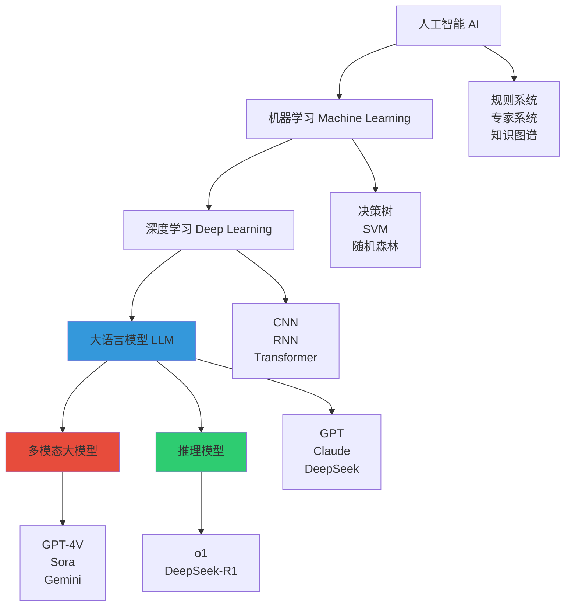
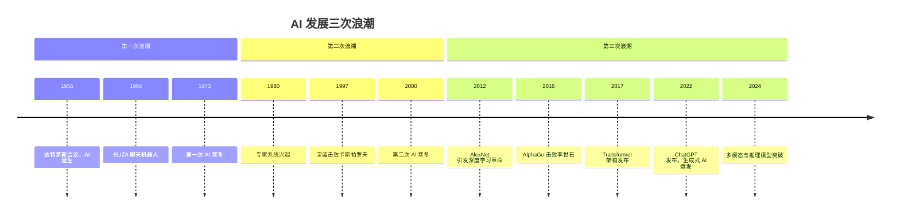
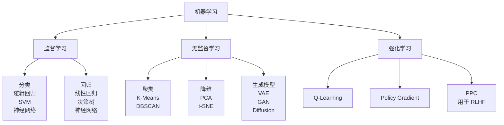
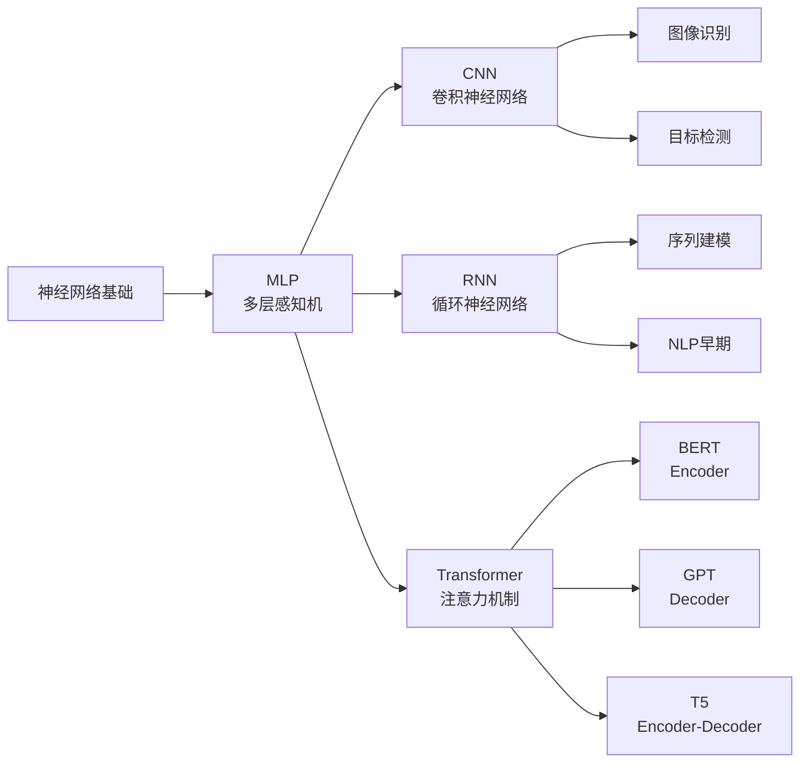
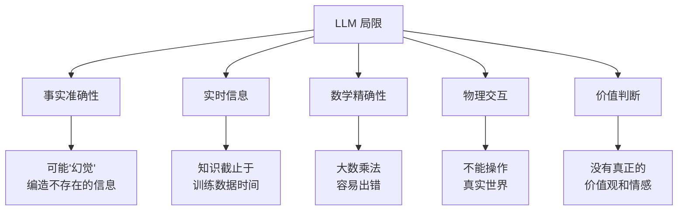
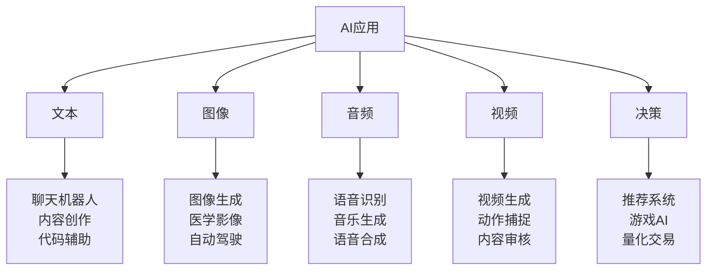
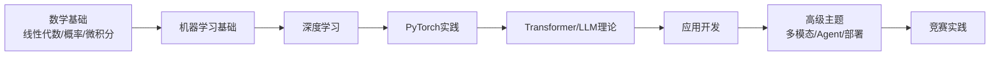

# 图解人工智能：AI 发展全景图

> **资料来源**：《图解人工智能》（科普向 AI 全景书籍）
> **适合人群**：零基础入门者，需要建立 AI 全局认知
> **难度**：⭐（入门）

---

## 1. 人工智能的层次结构



**关系理解**：
- **AI 最宽泛**：任何让机器表现智能的方法
- **机器学习**：AI 的一个分支，让机器从数据中学习规律
- **深度学习**：机器学习的子集，使用深层神经网络
- **大语言模型**：深度学习的特定应用，基于 Transformer 架构

---

## 2. AI 发展简史

### 2.1 三次浪潮



### 2.2 关键里程碑

| 年份 | 事件 | 意义 |
|------|------|------|
| 1956 | 达特茅斯会议 | "人工智能"术语诞生 |
| 1986 | 反向传播算法普及 | 神经网络可训练 |
| 1997 | 深蓝击败国际象棋冠军 | 机器在特定任务超越人类 |
| 2012 | AlexNet 赢得 ImageNet | 深度学习时代开启 |
| 2017 | Transformer 论文发表 | 现代 NLP 基础架构 |
| 2020 | GPT-3 发布 | 大模型时代开始 |
| 2022 | ChatGPT 发布 | 生成式 AI 进入大众视野 |
| 2024 | Sora / o1 / R1 发布 | 多模态与推理能力突破 |

---

## 3. AI 核心技术图谱

### 3.1 机器学习算法分类



### 3.2 深度学习架构演进



---

## 4. 大语言模型的能力边界

### 4.1 能做什么

| 能力 | 示例 | 原理 |
|------|------|------|
| 文本生成 | 写文章、邮件、代码 | 自回归预测下一个 token |
| 知识问答 | 解释概念、回答问题 | 预训练时记忆了海量知识 |
| 推理分析 | 数学计算、逻辑推导 | 模式匹配 + 逐步推理 |
| 翻译 | 中英文互译 | 多语言数据的统计规律 |
| 摘要 | 长文压缩 | 提取关键信息并重述 |

### 4.2 不能做什么（当前局限）



### 4.3 幻觉（Hallucination）详解

**什么是幻觉**：模型生成看似合理但实际错误的内容。

```
示例：
用户：请介绍张三的论文《论AI》
模型：张三在2020年发表了《论AI》，提出了XX理论...

现实：张三可能不存在，论文也不存在
```

**为什么会幻觉**：
1. 训练目标是最小化预测误差，不是追求事实准确
2. 模型被训练成"总是给出看起来合理的回答"
3. 对罕见知识，统计规律不够明确

**缓解方法**：
- RAG（检索增强生成）：先查资料再回答
- 工具调用：让模型使用搜索引擎/计算器
- 人类反馈强化学习（RLHF）：教会模型说"我不知道"

---

## 5. AI 应用场景地图



### 5.1 各行业的 AI 应用

| 行业 | 典型应用 | 代表产品 |
|------|----------|----------|
| 医疗 | 影像诊断、药物发现 | AlphaFold、Google Med-PaLM |
| 金融 | 风控、量化交易 | 各类风控模型 |
| 教育 | 个性化辅导、自动批改 | Khanmigo、各类AI tutor |
| 内容 | 写作、设计、剪辑 | Midjourney、Sora、Jasper |
| 编程 | 代码补全、Bug修复 | GitHub Copilot、Cursor |
| 客服 | 智能问答、工单处理 | 各企业客服机器人 |

---

## 6. 如何系统学习 AI

### 6.1 学习路径（与本书结构对应）



### 6.2 关键概念速查表

| 术语 | 一句话解释 |
|------|-----------|
| 神经网络 | 模仿生物神经元的计算模型，由层层连接的节点组成 |
| 参数 | 模型中可学习的数字，大模型有数十亿到数千亿个 |
| 训练 | 用数据调整参数，使模型输出更接近正确答案 |
| 推理 | 用训练好的模型对新输入做预测 |
| 过拟合 | 模型记住了训练数据，但不能泛化到新数据 |
| 损失函数 | 衡量模型预测与真实答案差距的指标 |
| 梯度下降 | 通过计算损失函数的梯度来更新参数 |
| 注意力机制 | 让模型决定输入中哪些部分更重要 |
| Token | 文本的最小单位，可以是字、词或子词 |
| Embedding | 将离散符号映射到连续向量空间的表示 |

---

## 7. AI 伦理与安全

### 7.1 主要风险

| 风险 | 说明 | 案例 |
|------|------|------|
| 偏见 | 训练数据中的偏见被模型学习 | 招聘 AI 对女性/少数族裔打分更低 |
| 隐私 | 模型可能泄露训练数据中的个人信息 | 从 GPT 中套出真实个人信息 |
| 滥用 | 生成虚假信息、深度伪造 | AI 生成的假新闻、诈骗 |
| 失业 | 自动化替代部分工作 | 翻译、客服、基础编程 |
| 对齐 | 模型行为与人类价值观不一致 | 给出有害建议 |

### 7.2 AI 安全研究前沿

- **对齐（Alignment）**：确保 AI 目标与人类一致
- **可解释性（Interpretability）**：理解模型内部工作机制
- **红队测试**：主动寻找模型的安全漏洞
- **宪法 AI**：用规则约束模型行为
