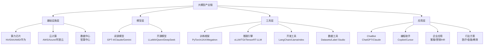
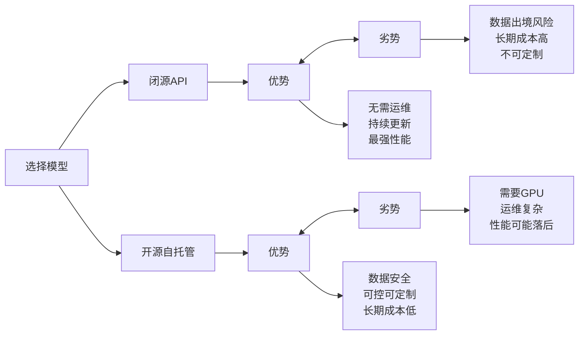
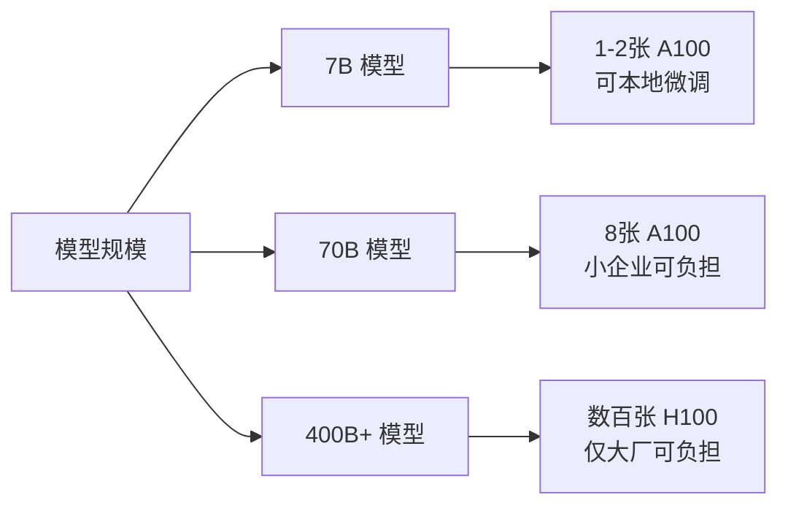
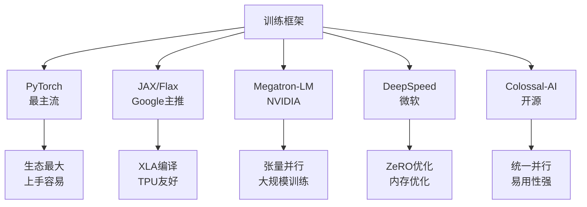
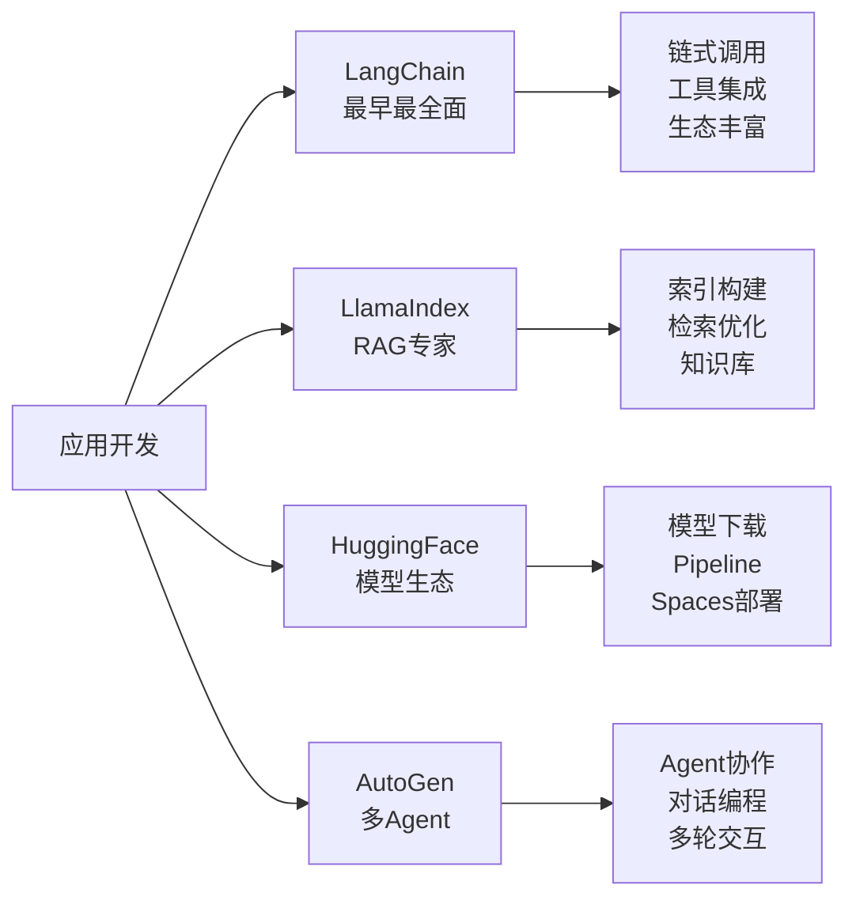
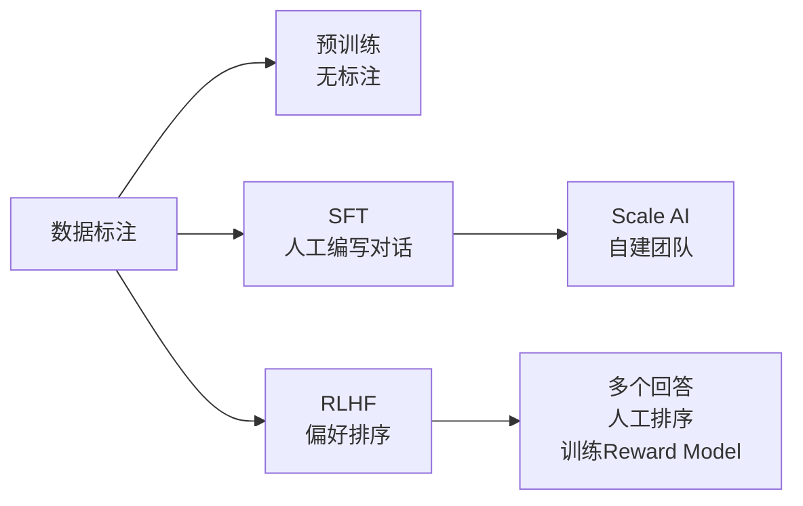
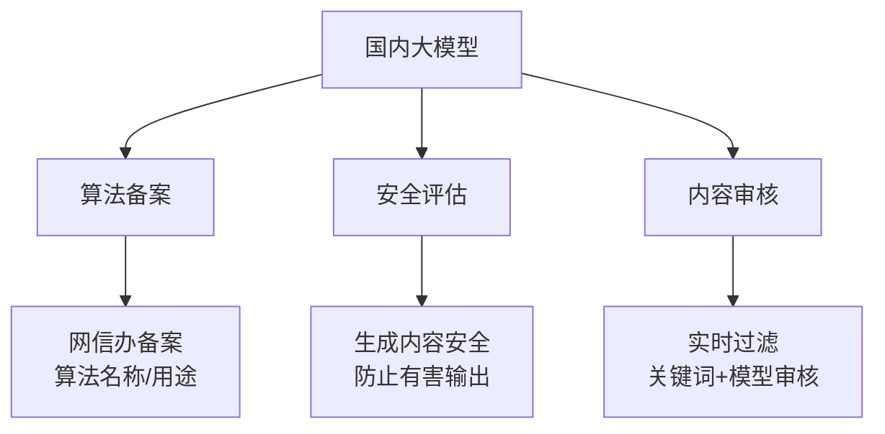
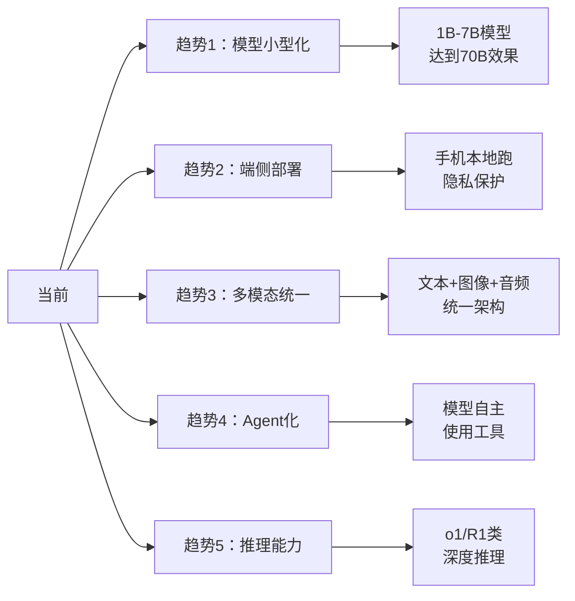
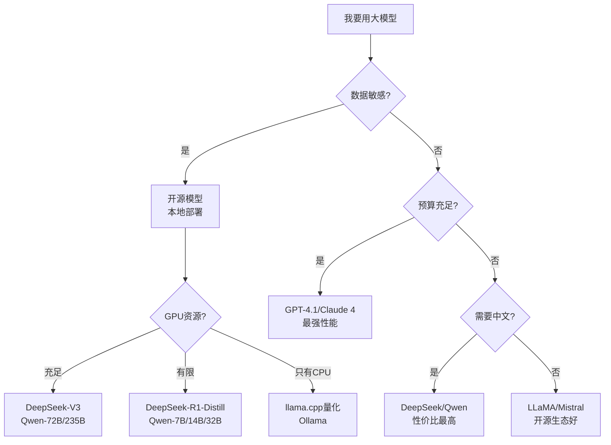

# 大模型生态系统全景

> **资料来源**：综合各厂商公开资料与行业分析
> **适合人群**：希望了解大模型产业格局的读者
> **难度**：⭐⭐（容易）

---

## 1. 大模型产业链全景

---

## 2. 全球大模型格局（2024-2025）

### 2.1 闭源模型阵营

| 公司 | 旗舰模型 | 特点 | API 价格（每百万 token） |
|------|----------|------|------------------------|
| OpenAI | GPT-4.1 / o3 / o4-mini | 综合能力最强，生态完善 | $2 / $10-40 |
| Anthropic | Claude 4 Sonnet / Opus | 编码能力强，上下文长 | $3 / $15 |
| Google | Gemini 2.5 Pro / Flash | 多模态强，长上下文 2M | $1.25 / $10 |
| 百度 | 文心 4.0 | 中文优化，国内合规 | 按量计费 |
| 阿里 | 通义千问 Max | 开源+闭源双轨 | 按量计费 |
| 字节 | 豆包 Pro | 中文对话，价格极低 | 极低 |

### 2.2 开源模型阵营

| 系列 | 最新版本 | 参数量 | 特点 | License |
|------|----------|--------|------|---------|
| **LLaMA** | LLaMA 4 | 17B-400B+ | Meta 出品，原生多模态 | 商业友好 |
| **Qwen** | Qwen3 | 0.6B-235B | 阿里，中文强，混合推理 | Apache 2.0 |
| **DeepSeek** | DeepSeek-V3/R1 | 671B MoE | 性价比之王 | MIT |
| **Mistral** | Mistral Large 2 | 123B | 欧洲代表 | 商业许可 |
| **Yi** | Yi-1.5 | 6B-34B | 零一万物，长上下文 | Apache 2.0 |
| **ChatGLM** | GLM-4 | 9B | 清华，中文优化 | 商业许可 |

### 2.3 开源 vs 闭源对比

---

## 3. 算力基础设施

### 3.1 AI 芯片格局

| 厂商 | 产品 | 定位 | 显存 | 适用场景 |
|------|------|------|------|----------|
| NVIDIA | H100 / H200 | 训练+推理旗舰 | 80-141GB | 大模型训练 |
| NVIDIA | A100 | 上一代旗舰 | 40-80GB | 训练/推理 |
| NVIDIA | RTX 4090 | 消费级旗舰 | 24GB | 本地推理/微调 |
| NVIDIA | L40S | 推理专用 | 48GB | 推理服务 |
| AMD | MI300X | 追赶者 | 192GB | 训练/推理 |
| 华为 | Ascend 910B | 国产替代 | 64GB | 国产训练 |
| 寒武纪 | MLU370 | 国产推理 | 48GB | 国产推理 |

### 3.2 训练算力需求

**DeepSeek 的突破**：用 2048 张 H800（降级版 H100）训练出 671B 参数的顶尖模型，成本约 600 万美元，仅为 GPT-4 的 1/10。

---

## 4. 开发工具链

### 4.1 训练框架

### 4.2 推理引擎

| 引擎 | 公司 | 特点 | 适用场景 |
|------|------|------|----------|
| **vLLM** | Berkeley | PagedAttention，吞吐高 | 高并发服务 |
| **TensorRT-LLM** | NVIDIA | GPU 极致优化 | 生产部署 |
| **Text Generation Inference** | HuggingFace | 易用，支持多模型 | 快速部署 |
| **llama.cpp** | 社区 | CPU/GPU 混合，量化强 | 本地运行 |
| **Ollama** | 社区 | 一键运行，极简单 | 个人开发者 |
| **sglang** | 社区 | RadixAttention，长文本友好 | 多轮对话 |

### 4.3 应用开发框架

---

## 5. 数据生态

### 5.1 预训练数据来源

| 类型 | 占比 | 来源 | 例子 |
|------|------|------|------|
| Web 文本 | ~60% | CommonCrawl | 网页抓取 |
| 代码 | ~15% | GitHub/StackOverflow | 开源代码 |
| 书籍 | ~10% | Gutenberg/扫描书 | 文学作品 |
| 百科 | ~5% | Wikipedia | 维基百科 |
| 学术 | ~5% | arXiv/论文 | 学术论文 |
| 其他 | ~5% | 对话/社交媒体 | Reddit/对话数据 |

### 5.2 数据集平台

- **HuggingFace Datasets**：最大的开源数据集仓库
- **RedPajama**：开源预训练数据集，复制 LLaMA 数据分布
- **The Pile**：800GB 多样化英文语料
- **C4/Google T5**：清洗后的网页语料
- **中文语料**：WuDao、CLUE、以及各种自建语料

### 5.3 数据标注

---

## 6. 国内大模型生态特色

### 6.1 监管与合规

### 6.2 国内特色应用

| 应用类型 | 代表产品 | 特点 |
|----------|----------|------|
| 通用对话 | 文心一言、通义千问、豆包 | 中文优化，集成搜索 |
| 编程助手 | 文心快码、通义灵码 | 中文注释理解强 |
| 办公助手 | WPS AI、钉钉魔法棒 | 与办公软件深度集成 |
| 创作工具 | 剪映 AI、可灵 AI | 短视频/图文创作 |
| 教育 | 学而思 MathGPT、讯飞星火 | K12 教育场景 |

---

## 7. 未来趋势

---

## 快速参考：选型决策树

