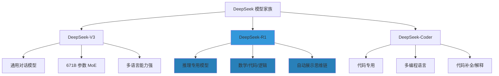
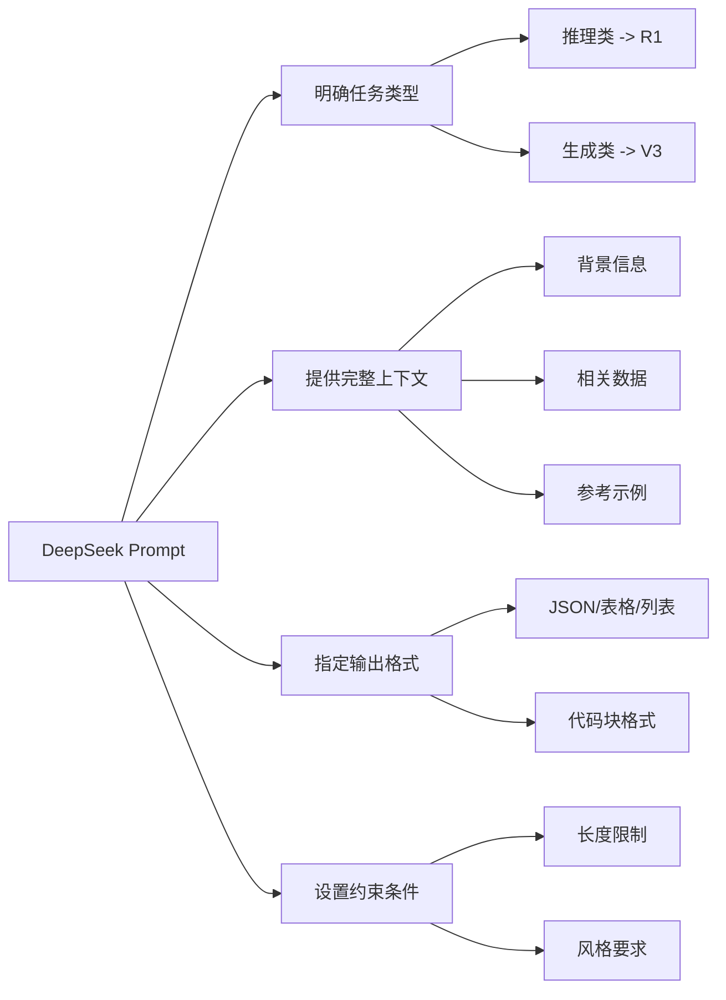
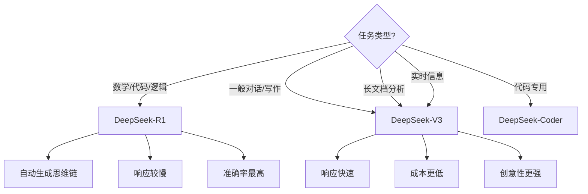

# DeepSeek 提示词技巧与实战

> **资料来源**：北京大学《DeepSeek 系列 - 提示词工程和落地场景》、清华大学《DeepSeek 从入门到精通》、《50 个 DeepSeek 学术指令》
> **适合人群**：使用 DeepSeek 系列模型的开发者和研究者
> **难度**：⭐⭐（容易）

---

## 1. DeepSeek 模型家族概览



### 1.1 DeepSeek-V3

- **定位**：通用大语言模型
- **架构**：Mixture-of-Experts (MoE)，总参数 671B，每次激活 37B
- **特点**：
  - 中文理解能力优秀
  - 支持 64K 上下文
  - Function Calling 支持良好
  - API 价格极具竞争力（约为 GPT-4 的 1/10）

### 1.2 DeepSeek-R1（推理模型）

- **定位**：专注推理能力
- **特点**：
  - 数学推理对标 OpenAI o1
  - 代码生成能力顶尖
  - **自动生成思维链**（thinking process）
  - 开源权重，可本地部署
- **关键差异**：不需要手动添加"请一步一步思考"，模型会自动展示推理过程

### 1.3 DeepSeek-Coder

- **定位**：代码专用模型
- **训练数据**：80% 代码 + 20% 自然语言
- **支持语言**：Python、JavaScript、Java、C++、Go、Rust 等 40+ 种
- **应用场景**：代码补全、代码解释、Bug 修复、代码转换

---

## 2. DeepSeek-R1 的推理机制

### 2.1 思维链自动生成

DeepSeek-R1 的核心特色是**自动推理**：

```
用户：解方程 3x² - 5x + 2 = 0

DeepSeek-R1 输出：
<think>
这是一个一元二次方程 ax² + bx + c = 0。
其中 a = 3, b = -5, c = 2。

判别式 Δ = b² - 4ac
       = (-5)² - 4(3)(2)
       = 25 - 24
       = 1

因为 Δ > 0，方程有两个不同实数根。

x₁ = (-b + √Δ) / 2a = (5 + 1) / 6 = 1
x₂ = (-b - √Δ) / 2a = (5 - 1) / 6 = 2/3
</think>

解为 x = 1 或 x = 2/3。
```

**优势**：
- 不需要复杂的 CoT Prompt
- 推理过程透明，便于验证
- 复杂问题准确率显著提升

### 2.2 何时使用 DeepSeek-R1

| 场景 | 推荐模型 | 原因 |
|------|----------|------|
| 数学计算 | R1 | 自动推理，准确率高 |
| 代码生成 | R1 / Coder | 逻辑严密，bug 少 |
| 逻辑分析 | R1 | 多步推理能力强 |
| 一般对话 | V3 | 响应更快，成本更低 |
| 创意写作 | V3 | 更灵活，风格多样 |
| 实时信息 | V3 | R1 推理慢，不适合时效性任务 |

---

## 3. DeepSeek 专用 Prompt 技巧

### 3.1 通用原则



### 3.2 代码生成最佳实践

**DeepSeek-Coder 专用 Prompt**：

```
你是一位资深 {{language}} 开发工程师。

请实现以下功能：
{{功能描述}}

要求：
1. 代码遵循 {{style_guide}} 规范
2. 包含完整的错误处理
3. 添加清晰的注释说明关键逻辑
4. 包含 2-3 个单元测试用例
5. 时间复杂度不超过 {{complexity}}

输入示例：
{{input_example}}

预期输出：
{{expected_output}}
```

**示例：Python 函数生成**

```
请实现一个函数，将嵌套的字典扁平化。

示例输入：
{"a": 1, "b": {"c": 2, "d": {"e": 3}}}

预期输出：
{"a": 1, "b.c": 2, "b.d.e": 3}

要求：
1. 使用递归实现
2. 支持自定义分隔符（默认 "."）
3. 处理循环引用（抛出 ValueError）
4. 包含类型提示
```

### 3.3 数学推理 Prompt

**DeepSeek-R1 的数学 Prompt**：

```
请解决以下数学问题，展示完整的推导过程。

问题：{{math_problem}}

要求：
1. 列出已知条件和要求解的目标
2. 选择合适的数学方法
3. 逐步推导，每一步说明依据
4. 最后验证答案的正确性
5. 如果有多解，列出所有可能
```

**高级技巧：要求多种解法**

```
请用至少两种不同的方法解决这道题，并比较它们的优劣。

方法 1：{{approach_1}}
方法 2：{{approach_2}}

比较维度：
- 简洁程度
- 计算复杂度
- 通用性（是否适用于类似问题）
```

### 3.4 文档分析 Prompt

DeepSeek 支持文件上传，可进行文档分析：

```
请分析上传的 PDF 文档，完成以下任务：

1. 【摘要】用 200 字概括文档核心内容
2. 【关键发现】列出 3-5 个最重要的结论
3. 【方法】描述文档使用的主要方法/技术
4. 【局限】指出文档自己承认的局限性
5. 【关联】这个文档与 {{related_topic}} 有什么关系？

输出格式：Markdown，每个任务一个二级标题
```

### 3.5 中英混合处理

DeepSeek 对中英混合内容处理优秀：

```
请将以下中文技术文档翻译为英文，要求：
1. 专业术语保留英文（如 "神经网络" -> "neural network"）
2. 代码片段和变量名不翻译
3. 保持原有的 Markdown 格式
4. 语气正式，适合学术论文

文档内容：
{{chinese_document}}
```

---

## 4. 学术场景 Prompt 模板

### 4.1 文献综述

```
请帮我总结 [{{field}}] 领域近 {{years}} 年的研究进展。

要求：
1. 按时间线梳理关键里程碑
2. 列出 8-10 篇最具代表性的论文（作者、年份、会议/期刊、核心贡献）
3. 用表格对比各阶段方法的优缺点
4. 分析该领域的发展趋势
5. 指出当前的研究空白和潜在的研究方向

输出格式：
- 二级标题组织
- 论文列表用表格
- 趋势分析用 bullet points
```

### 4.2 论文对比

```
请对比以下两篇论文的异同：

论文 A：《{{paper_a_title}}》（{{author_a}}, {{year_a}}）
论文 B：《{{paper_b_title}}》（{{author_b}}, {{year_b}}）

对比维度：
1. 研究动机和问题定义
2. 核心方法（用流程图描述）
3. 实验设置（数据集、评价指标）
4. 主要结果和结论
5. 局限性和可改进之处

请用表格呈现对比结果，最后一列给出你的评价。
```

### 4.3 实验设计

```
请为我的研究设计实验方案。

研究问题：{{research_question}}
数据集：{{dataset}}
基线方法：{{baseline_methods}}

要求：
1. 明确实验目标和假设
2. 设计至少 3 组对比实验
3. 选择合适的评价指标（说明理由）
4. 设计消融实验验证各组件的贡献
5. 考虑可能的 confounding factors 和控制方法
6. 给出统计显著性检验方案

输出格式：每个实验一个子章节
```

### 4.4 论文润色

```
请润色以下学术论文段落，要求：
1. 保持学术语气和专业术语准确
2. 提高逻辑连贯性和段落衔接
3. 精简冗余表达，避免重复
4. 检查语法、拼写和标点
5. 确保时态一致（方法用过去时，结论用现在时）

原文：
"""
{{text}}
"""

请输出：
1. 润色后的版本
2. 修改说明（逐条列出改动和原因）
```

### 4.5 代码解释

```
请解释以下代码的功能和原理：

```python
{{code}}
```

要求：
1. 先给出整体功能概述
2. 逐函数/逐类解释
3. 解释关键算法或数据结构的选择
4. 分析时间复杂度和空间复杂度
5. 指出潜在问题或优化空间
6. 给出一个简化的使用示例
```

---

## 5. 职场应用 Prompt

### 5.1 公文写作

```
请帮我撰写一份 {{document_type}}。

背景：{{background}}
目的：{{purpose}}
收件人：{{recipient}}

要求：
1. 格式符合 {{organization}} 的规范
2. 语气 {{tone}}
3. 包含以下要点：{{key_points}}
4. 长度控制在 {{word_count}} 字以内
```

### 5.2 数据分析报告

```
请基于以下数据生成分析报告。

数据概览：
{{data_summary}}

分析要求：
1. 描述性统计（均值、中位数、分布）
2. 趋势分析（如有时间序列数据）
3. 异常值识别和解释
4. 相关性分析
5.  actionable insights（可执行的建议）

输出格式：
- 执行摘要（3 句话）
- 详细分析（分章节）
- 建议（编号列表）
```

### 5.3 会议纪要

```
请根据以下会议录音转录文本，生成结构化会议纪要。

会议信息：
- 主题：{{topic}}
- 时间：{{time}}
- 参与者：{{participants}}

转录文本：
"""
{{transcript}}
"""

要求：
1. 会议目标和背景
2. 讨论要点（按议题分类）
3. 达成的决议（Decision）
4. 行动项（Action Items），包含负责人和截止日期
5. 待解决的问题（Open Issues）
6. 下次会议安排（如有）

输出格式：Markdown，使用 checkbox 标记行动项
```

---

## 6. DeepSeek API 调用示例

### 6.1 基础调用

```python
import requests

API_KEY = "your-api-key"
API_URL = "https://api.deepseek.com/v1/chat/completions"

def deepseek_chat(messages, model="deepseek-chat", temperature=0.7):
    """
    model options:
    - deepseek-chat: DeepSeek-V3 (通用对话)
    - deepseek-reasoner: DeepSeek-R1 (推理模型)
    """
    headers = {
        "Authorization": f"Bearer {API_KEY}",
        "Content-Type": "application/json"
    }

    payload = {
        "model": model,
        "messages": messages,
        "temperature": temperature,
        "max_tokens": 4096
    }

    response = requests.post(API_URL, headers=headers, json=payload)
    return response.json()["choices"][0]["message"]["content"]

# 通用对话
response = deepseek_chat([
    {"role": "user", "content": "解释什么是量子计算"}
])

# 推理任务（自动展示思维链）
response = deepseek_chat([
    {"role": "user", "content": "证明：对于任意正整数 n，n³ - n 能被 6 整除"}
], model="deepseek-reasoner")
```

### 6.2 流式输出

```python
import requests

def deepseek_stream(messages, model="deepseek-chat"):
    headers = {
        "Authorization": f"Bearer {API_KEY}",
        "Content-Type": "application/json"
    }

    payload = {
        "model": model,
        "messages": messages,
        "stream": True  # 启用流式输出
    }

    response = requests.post(API_URL, headers=headers, json=payload, stream=True)

    for line in response.iter_lines():
        if line:
            line = line.decode('utf-8')
            if line.startswith('data: '):
                data = line[6:]
                if data == '[DONE]':
                    break
                # 解析并输出内容
                import json
                chunk = json.loads(data)
                content = chunk['choices'][0]['delta'].get('content', '')
                print(content, end='', flush=True)
```

### 6.3 Function Calling

```python
# DeepSeek 支持 OpenAI 兼容的 Function Calling 格式
tools = [
    {
        "type": "function",
        "function": {
            "name": "get_weather",
            "description": "获取指定城市的天气信息",
            "parameters": {
                "type": "object",
                "properties": {
                    "city": {
                        "type": "string",
                        "description": "城市名称，如 '北京'"
                    }
                },
                "required": ["city"]
            }
        }
    }
]

response = requests.post(API_URL, headers=headers, json={
    "model": "deepseek-chat",
    "messages": [{"role": "user", "content": "北京今天天气怎么样？"}],
    "tools": tools
})

# 模型可能返回 tool_calls
result = response.json()
if result["choices"][0]["message"].get("tool_calls"):
    tool_call = result["choices"][0]["message"]["tool_calls"][0]
    print(f"调用函数: {tool_call['function']['name']}")
    print(f"参数: {tool_call['function']['arguments']}")
```

---

## 7. 模型对比与选择



| 维度 | DeepSeek-V3 | DeepSeek-R1 | GPT-4 | Claude 3.5 |
|------|-------------|-------------|-------|------------|
| 中文 | ⭐⭐⭐⭐⭐ | ⭐⭐⭐⭐⭐ | ⭐⭐⭐⭐ | ⭐⭐⭐⭐ |
| 数学 | ⭐⭐⭐⭐ | ⭐⭐⭐⭐⭐ | ⭐⭐⭐⭐⭐ | ⭐⭐⭐⭐ |
| 代码 | ⭐⭐⭐⭐ | ⭐⭐⭐⭐⭐ | ⭐⭐⭐⭐⭐ | ⭐⭐⭐⭐⭐ |
| 推理 | ⭐⭐⭐⭐ | ⭐⭐⭐⭐⭐ | ⭐⭐⭐⭐⭐ | ⭐⭐⭐⭐ |
| 速度 | ⭐⭐⭐⭐⭐ | ⭐⭐⭐ | ⭐⭐⭐⭐ | ⭐⭐⭐⭐ |
| 成本 | ⭐⭐⭐⭐⭐ | ⭐⭐⭐⭐⭐ | ⭐⭐⭐ | ⭐⭐⭐ |
| 开源 | ✅ | ✅ | ❌ | ❌ |

---

## 8. 常见问题

### Q1：DeepSeek-R1 的 thinking 过程可以隐藏吗？

**A**：通过 API 调用时，`reasoning_content` 字段包含思维链，`content` 字段只包含最终答案。前端可以只展示 `content`。

### Q2：DeepSeek 支持多模态吗？

**A**：DeepSeek-V3 支持图片输入（文档 OCR），但不支持图片生成。专注文本处理能力。

### Q3：本地部署需要什么配置？

**A**：
- DeepSeek-R1 蒸馏版（1.5B-70B）：消费级 GPU 可跑
- DeepSeek-R1 完整版（671B）：需要 8×A100/H100 或专业推理服务器
- 推荐使用 Ollama、vLLM 或 llama.cpp 部署

### Q4：API 有免费额度吗？

**A**：DeepSeek API 提供少量免费额度用于测试。生产使用价格极具竞争力，约为 GPT-4 的 1/10。

---

## 学习建议

1. **从 V3 开始**：熟悉基础对话能力，再尝试 R1 的推理能力
2. **善用文件上传**：DeepSeek 的文档分析能力很强
3. **对比实验**：同样的 Prompt 在 V3 和 R1 上测试，理解差异
4. **关注官方更新**：DeepSeek 迭代很快，新功能及时跟进
