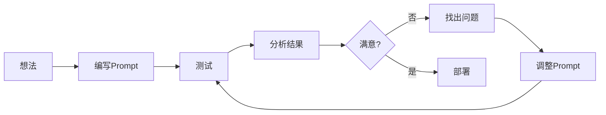
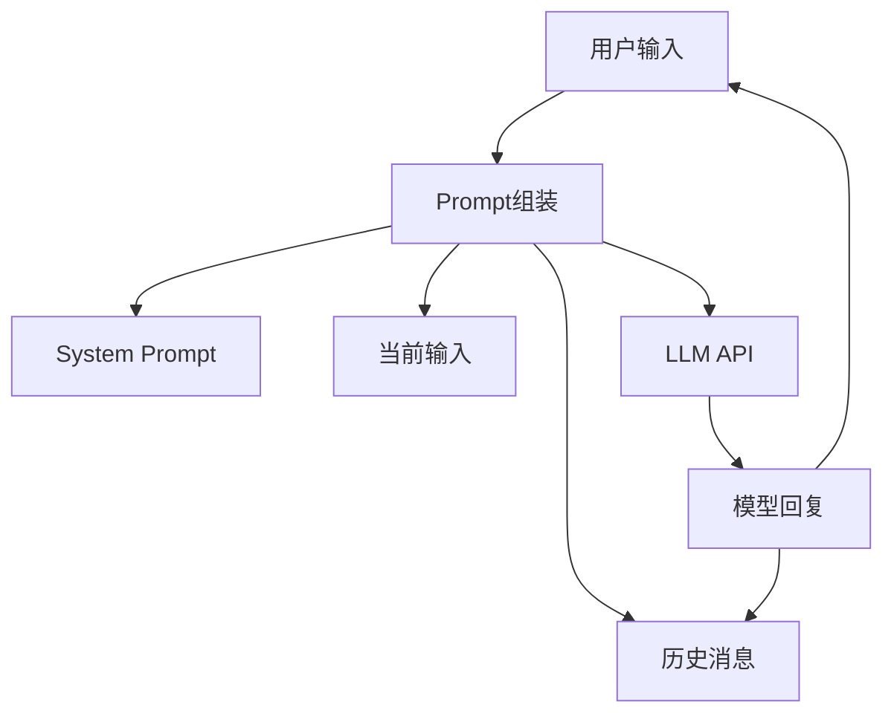
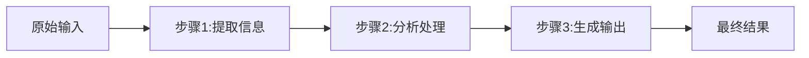
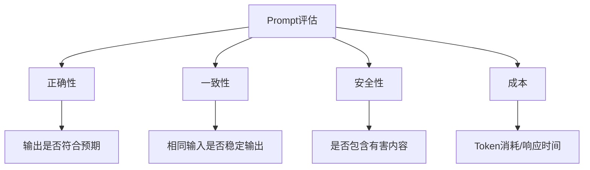

# 面向开发者的 Prompt 工程

> **资料来源**：吴恩达《Prompt Engineering for Developers》（Datawhale 中文整理版）
> **适合人群**：有 Python 基础，想要基于 LLM 开发应用的开发者
> **难度**：⭐⭐⭐（中等）

---

## 1. Prompt 构建两大核心原则

### 原则一：清晰而具体（Clear and Specific）

模型无法理解你的隐含意图，指令越清晰具体，输出越可控。

**反面示例**：
```
给我写个东西。
```

**正面示例**：
```
请用 Python 编写一个函数，功能是将用户输入的日期字符串
转换为标准 ISO 8601 格式。

要求：
1. 支持 "YYYY-MM-DD"、"DD/MM/YYYY"、"MM-DD-YY" 等常见格式
2. 输入无效时返回 None 并打印错误信息
3. 包含 3 个单元测试用例
4. 使用 datetime 模块，不引入第三方库
```

**清晰性检查清单**：
- [ ] 使用了明确的动作动词（生成、分析、比较、转换）
- [ ] 指定了输出格式（代码、JSON、表格、列表）
- [ ] 说明了约束条件（长度、范围、禁止项）
- [ ] 提供了必要的上下文（编程语言、框架版本）

### 原则二：给模型思考时间（Give Model Time to Think）

复杂任务不要期望模型一步得出正确答案，引导它分步推理。

**反面示例**：
```
判断这段评论的情感倾向。
```

**正面示例**：
```
请按以下步骤分析这段评论的情感倾向：

步骤 1：提取评论中的关键情感词和短语
步骤 2：判断每个情感词的正负倾向
步骤 3：综合评估整体情感（正面/负面/中性）
步骤 4：给出置信度评分（0-100%）

评论内容：
"""
{{comment}}
"""

请以 JSON 格式输出结果。
```

---

## 2. 迭代开发 Prompt

Prompt 工程是一个迭代过程，很少有第一次就完美的 Prompt。



**迭代示例：产品描述生成**

**第一轮**：
```
为这款咖啡机写一段产品描述。
```
**问题**：太泛泛，没有针对目标用户

**第二轮**：
```
为这款全自动咖啡机写一段产品描述，面向 25-35 岁的都市白领。
```
**问题**：有方向了，但缺乏卖点结构

**第三轮**：
```
为这款全自动咖啡机写一段产品描述，要求：
- 目标用户：25-35 岁都市白领，追求品质生活
- 突出 3 个核心卖点：一键操作、15秒出咖啡、自清洁功能
- 语气：轻奢、有格调
- 长度：100-150 字
- 结尾加一个行动号召
```
**结果**：可用

---

## 3. 文本处理四大任务

### 3.1 文本总结（Summarizing）

**基础用法**：
```python
prompt = f"""
请用一句话总结以下产品评价的核心观点：

评价内容：
"""
{review_text}
"""
"""
```

**进阶：指定关注点**：
```python
prompt = f"""
请总结以下产品评价，重点关注：
1. 用户最满意的方面
2. 用户最不满意的地方
3. 用户提到的具体使用场景

每个方面不超过 20 字。

评价内容：
"""
{review_text}
"""
"""
```

**批量处理**：
```python
def summarize_reviews(reviews, max_words=30):
    """批量总结多条评价"""
    prompt = f"""
    请将以下 {len(reviews)} 条产品评价分别总结为不超过 {max_words} 字的短评。
    输出格式：编号. 总结内容

    评价列表：
    """
    for i, review in enumerate(reviews, 1):
        prompt += f"\n{i}. {review}\n"
    prompt += "\"\"\""

    return get_completion(prompt)
```

### 3.2 文本推断（Inferring）

**情感分析**：
```python
prompt = f"""
判断以下评论的情感倾向。可选标签：正面、负面、中性。
同时提取评论中提到的产品方面（质量、价格、服务等）。

输出 JSON 格式：
{{
  "sentiment": "正面/负面/中性",
  "confidence": 0-1,
  "aspects": ["质量", "物流"],
  "aspect_sentiments": {{"质量": "正面", "物流": "负面"}}
}}

评论："""
{review}
"""
"""
```

**主题提取**：
```python
prompt = f"""
从以下客户反馈中提取主要主题。每个主题用 2-4 个字概括。
同时标注该主题出现的次数（估算）。

输出 Markdown 表格：
| 主题 | 出现次数 | 示例原文 |

反馈内容：
"""
{feedback_text}
"""
"""
```

**意图识别**：
```python
prompt = f"""
分析以下用户查询的意图。可选意图：
- 查询产品信息
- 寻求技术支持
- 投诉/反馈
- 价格咨询
- 其他

同时提取关键实体（产品名、问题描述等）。

查询："""
{user_query}
"""
"""
```

### 3.3 文本转换（Transforming）

**翻译**：
```python
prompt = f"""
将以下文本翻译为 {target_language}。
要求：
1. 保持专业术语的准确性
2. 保留原始格式（如 Markdown、代码块）
3. 语气与原文一致

文本：
"""
{text}
"""
"""
```

**格式转换**：
```python
prompt = f"""
将以下 JSON 数据转换为 Markdown 表格。
要求表头为中文。

数据：
```json
{json_data}
```
"""
```

**语气转换**：
```python
prompt = f"""
请将以下正式邮件改写为轻松友好的微信消息风格。
保留所有关键信息。

原文：
"""
{formal_email}
"""
"""
```

**拼写和语法检查**：
```python
prompt = f"""
请检查以下文本中的拼写和语法错误，并给出修正版本。
对每个修改，说明原因。

文本：
"""
{text}
"""
"""
```

### 3.4 文本扩展（Expanding）

**自动生成回复**：
```python
def generate_reply(customer_email, sentiment):
    """根据客户邮件情感和关键内容生成回复"""
    prompt = f"""
    你是一位专业的客服代表。请根据以下客户邮件生成回复。

    回复要求：
    - 语气：{"诚恳道歉并解决问题" if sentiment == "negative" else "热情友好"}
    - 长度：100-150 字
    - 必须包含：对客户问题的确认、解决方案或下一步行动、结束语
    - 语言：中文

    客户邮件：
    """
    {customer_email}
    """
    """
    return get_completion(prompt)
```

**温度参数影响**：

| temperature | 效果 | 适用 |
|------------|------|------|
| 0.3 | 礼貌、标准化 | 客服回复、正式邮件 |
| 0.7 | 自然、有变化 | 一般写作、营销文案 |
| 1.0 | 创意、多样化 | 头脑风暴、创意写作 |

---

## 4. 聊天机器人开发

### 4.1 对话系统的核心组件



### 4.2 System Prompt 设计

System Prompt 定义了机器人的全局行为：

```python
system_message = {
    "role": "system",
    "content": """你是一位专业的技术支持助手，帮助用户解决软件使用问题。

规则：
1. 回答简洁，不超过 3 句话
2. 如果不确定，诚实说明，不要猜测
3. 对于复杂问题，先确认用户遇到的具体场景
4. 提供操作步骤时，使用编号列表
5. 不要询问用户的账户密码等敏感信息
"""
}
```

### 4.3 上下文管理

```python
class ChatBot:
    def __init__(self, system_prompt, max_history=10):
        self.messages = [{"role": "system", "content": system_prompt}]
        self.max_history = max_history

    def chat(self, user_input):
        # 添加用户消息
        self.messages.append({"role": "user", "content": user_input})

        # 调用 API
        response = openai.ChatCompletion.create(
            model="gpt-4o-mini",
            messages=self.messages,
            temperature=0.7
        )

        # 提取回复
        assistant_reply = response.choices[0].message.content

        # 添加助手回复到历史
        self.messages.append({"role": "assistant", "content": assistant_reply})

        # 截断历史（保留 system + 最近 N 轮）
        if len(self.messages) > self.max_history * 2 + 1:
            self.messages = [self.messages[0]] + self.messages[-(self.max_history * 2):]

        return assistant_reply
```

**上下文截断策略**：
- **保留最近 N 轮**：简单，但丢失早期信息
- **摘要压缩**：用 LLM 总结历史，保留关键信息
- **关键词检索**：从长历史中检索相关片段

### 4.4 输入分类与路由

对于复杂对话系统，先分类用户意图，再路由到不同处理模块：

```python
def classify_intent(user_input):
    """将用户输入分类到不同意图"""
    prompt = f"""
    将以下用户输入分类到一个意图类别。

    可选类别：
- account: 账户相关问题（登录、注册、密码）
- billing: 账单和支付问题
- technical: 技术问题（bug、功能使用）
- general: 一般咨询
- complaint: 投诉

只输出类别名称，不要解释。

用户输入："""
{user_input}
"""
"""
    return get_completion(prompt).strip().lower()

# 路由处理
intent = classify_intent(user_input)

if intent == "account":
    response = handle_account_issue(user_input)
elif intent == "billing":
    response = handle_billing_issue(user_input)
elif intent == "technical":
    response = handle_technical_issue(user_input)
else:
    response = general_chat(user_input)
```

---

## 5. 提示链（Chaining Prompts）

复杂任务分解为多个子任务，串联执行。



**示例：产品评价分析 pipeline**

```python
def analyze_product_review(review):
    """多步骤分析产品评价"""

    # 步骤 1：提取关键信息
    step1_prompt = f"""
    从产品评价中提取以下信息：
    1. 提到的产品方面（质量、价格、物流、客服等）
    2. 每个方面的关键词（正面/负面）

    评价："""
{review}
"""
    输出 JSON 格式。
    """
    extracted_info = get_completion(step1_prompt)

    # 步骤 2：分析情感
    step2_prompt = f"""
    基于以下提取的信息，判断每个方面的情感倾向（正面/负面/中性）。
    信息：{extracted_info}
    输出 JSON 格式。
    """
    sentiment_analysis = get_completion(step2_prompt)

    # 步骤 3：生成总结
    step3_prompt = f"""
    基于以下情感分析，生成一段 50 字以内的评价总结。
    分析结果：{sentiment_analysis}
    """
    summary = get_completion(step3_prompt)

    return {
        "extracted_info": extracted_info,
        "sentiment": sentiment_analysis,
        "summary": summary
    }
```

**提示链的优势**：
- 每步更简单，准确率更高
- 中间结果可审查和修改
- 某步出错可单独重试
- 便于调试和优化

---

## 6. 端到端评估系统

### 6.1 评估维度



### 6.2 建立测试集

```python
test_cases = [
    {
        "input": "请总结这段关于气候变化的新闻",
        "expected_keywords": ["气候", "全球变暖", "碳排放"],
        "max_length": 100
    },
    {
        "input": "将这段代码从 Python 2 转换为 Python 3",
        "expected_contains": ["print(", "input("],
        "forbidden_contains": ["print ", "raw_input"]
    }
]

def evaluate_prompt(prompt_template, test_cases):
    """评估 Prompt 在测试集上的表现"""
    results = []
    for case in test_cases:
        output = get_completion(prompt_template.format(input=case["input"]))

        # 检查关键词
        keyword_match = all(kw in output for kw in case.get("expected_keywords", []))

        # 检查禁用词
        forbidden = any(kw in output for kw in case.get("forbidden_contains", []))

        # 检查长度
        length_ok = len(output) <= case.get("max_length", float('inf'))

        results.append({
            "input": case["input"],
            "pass": keyword_match and not forbidden and length_ok,
            "keyword_match": keyword_match,
            "forbidden_found": forbidden,
            "length_ok": length_ok
        })

    pass_rate = sum(r["pass"] for r in results) / len(results)
    return pass_rate, results
```

---

## 7. 关键代码模式

### 7.1 基础 API 调用封装

```python
import openai
import os

# 设置 API Key
openai.api_key = os.getenv("OPENAI_API_KEY")

def get_completion(prompt, model="gpt-4o-mini", temperature=0, max_tokens=500):
    """基础调用函数"""
    messages = [{"role": "user", "content": prompt}]
    response = openai.ChatCompletion.create(
        model=model,
        messages=messages,
        temperature=temperature,
        max_tokens=max_tokens
    )
    return response.choices[0].message["content"]

def get_completion_from_messages(messages, model="gpt-4o-mini", temperature=0):
    """支持多轮对话的调用"""
    response = openai.ChatCompletion.create(
        model=model,
        messages=messages,
        temperature=temperature
    )
    return response.choices[0].message["content"]
```

### 7.2 带重试的调用

```python
import time
from functools import wraps

def retry_on_error(max_retries=3, delay=1):
    """API 调用重试装饰器"""
    def decorator(func):
        @wraps(func)
        def wrapper(*args, **kwargs):
            for attempt in range(max_retries):
                try:
                    return func(*args, **kwargs)
                except Exception as e:
                    if attempt == max_retries - 1:
                        raise
                    time.sleep(delay * (2 ** attempt))  # 指数退避
            return None
        return wrapper
    return decorator

@retry_on_error(max_retries=3)
def robust_completion(prompt):
    return get_completion(prompt)
```

### 7.3 Token 计数

```python
import tiktoken

def count_tokens(text, model="gpt-4o-mini"):
    """计算文本的 token 数量"""
    encoding = tiktoken.encoding_for_model(model)
    return len(encoding.encode(text))

def estimate_cost(prompt, response, model="gpt-4o-mini"):
    """估算 API 调用成本"""
    pricing = {
        "gpt-4o-mini": {"input": 0.00015, "output": 0.0006},  # 每 1K tokens
        "gpt-4o": {"input": 0.0025, "output": 0.01},
        "gpt-4.1": {"input": 0.002, "output": 0.008}
    }

    input_tokens = count_tokens(prompt, model)
    output_tokens = count_tokens(response, model)

    cost = (input_tokens / 1000 * pricing[model]["input"] +
            output_tokens / 1000 * pricing[model]["output"])

    return {
        "input_tokens": input_tokens,
        "output_tokens": output_tokens,
        "total_cost_usd": round(cost, 4)
    }
```

---

## 8. 常见陷阱与最佳实践

### 8.1 陷阱

| 陷阱 | 表现 | 解决 |
|------|------|------|
| **指令过载** | 一个 Prompt 里塞太多要求 | 分解为多个 Prompt 或步骤 |
| **示例偏见** | Few-shot 示例太少或太偏 | 提供 3-5 个多样化示例 |
| **格式漂移** | 输出格式不稳定 | 明确指定格式并提供示例 |
| **幻觉** | 模型编造不存在的信息 | 要求引用来源、设置保守 temperature |
| **过度拟合示例** | 输出与示例过于相似 | 增加示例多样性 |

### 8.2 最佳实践

1. **先写 System Prompt**：定义全局行为，减少重复指令
2. **使用变量占位符**：`{user_input}` 便于复用和测试
3. **版本控制 Prompt**：用 Git 管理 Prompt 的迭代版本
4. **A/B 测试**：同时维护多个版本，对比效果
5. **监控成本**：记录 token 消耗和响应时间
6. **处理边界情况**：测试空输入、超长输入、特殊字符

---

## 学习建议

1. **边写边测**：每写一个 Prompt 立即测试 3-5 个不同输入
2. **建立 Prompt 库**：按场景分类保存有效的 Prompt
3. **关注成本**：生产环境要平衡效果和成本
4. **学习 LangChain**：将 Prompt 工程系统化、模块化
