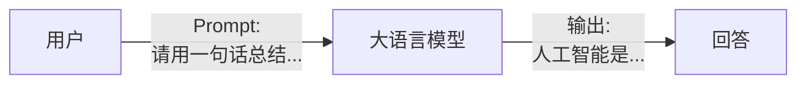
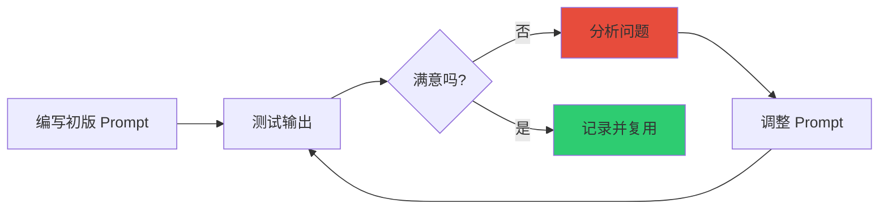

# Prompting Guide 101

> **资料来源**：《Prompting Guide 101》
> **适合人群**：Prompt 工程初学者
> **难度**：⭐（非常容易）

---

## 1. Prompt 是什么

Prompt（提示词）是你与大语言模型交互时输入的文本。模型根据 Prompt 生成输出。Prompt 的质量直接决定输出的质量。



**核心原则**：Garbage In, Garbage Out —— 输入质量决定输出质量。

---

## 2. Prompt 基本公式

```
好的 Prompt = 角色设定 + 具体任务 + 上下文 + 输出要求 + （可选）示例
```

### 2.1 各组件说明

| 组件 | 作用 | 示例 |
|------|------|------|
| **角色设定** | 让模型以特定身份回答 | "你是一位资深营养师" |
| **具体任务** | 明确告诉模型做什么 | "请为糖尿病患者设计一份一周食谱" |
| **上下文** | 提供必要的背景信息 | "患者 60 岁，偏好中餐，不吃海鲜" |
| **输出要求** | 指定格式、长度、风格 | "用表格呈现，每天三餐" |
| **示例** | 展示期望的输入输出格式 | "例如：周一早餐：燕麦粥..." |

### 2.2 完整 Prompt 示例

```
你是一位资深营养师（角色）。

请为一位 60 岁的糖尿病患者设计一份一周食谱（任务）。
患者偏好中餐口味，不吃海鲜，对鸡蛋过敏（上下文）。

要求：
1. 用表格呈现，包含周一至周日
2. 每天包含早餐、午餐、晚餐
3. 标注每餐的碳水化合物的估算克数
4. 语言简洁，适合打印贴在冰箱上（输出要求）

示例格式：
| 日期 | 早餐 | 午餐 | 晚餐 |
|------|------|------|------|
| 周一 | 燕麦粥（30g碳水） | ... | ... |
```

---

## 3. 基础任务模板

### 3.1 文本总结

```
请用 {N} 句话总结以下内容，要求：
1. 保留核心观点和关键数据
2. 语言简洁
3. 适合 {目标受众} 理解

内容：
"""
{text}
"""
```

**示例**：
```
请用 3 句话总结以下内容，要求保留核心观点和关键数据：

内容：
"""
OpenAI 于 2022 年 11 月发布 ChatGPT，基于 GPT-3.5 架构。
该产品在发布两个月内活跃用户超过 1 亿，成为历史上增长最快的消费者应用。
ChatGPT 的推出引发了全球 AI 竞赛，Google、百度、阿里等公司相继发布竞品。
"""
```

**期望输出**：
```
ChatGPT 是 OpenAI 于 2022 年 11 月发布的对话 AI 产品，两个月内用户突破 1 亿。
它成为史上增长最快的消费者应用，引发全球科技巨头竞相推出类似产品。
该产品标志着大语言模型进入大众消费领域。
```

### 3.2 文本分类

```
请将以下文本分类到最符合的类别中。
可选类别：{类别 A}、{类别 B}、{类别 C}

只输出类别名称，不要解释。

文本："""
{text}
"""
```

### 3.3 代码生成

```
请用 {编程语言} 编写一个函数/程序，实现以下功能：
{功能描述}

要求：
1. {约束条件 1}
2. {约束条件 2}
3. 包含函数注释和类型注解
4. 包含 2-3 个测试用例
```

**示例**：
```
请用 Python 编写一个函数，实现快速排序算法。

要求：
1. 使用原地排序（in-place），空间复杂度 O(log n)
2. 处理边界情况（空列表、单元素列表）
3. 包含函数注释和类型注解
4. 包含 3 个测试用例
```

### 3.4 翻译

```
请将以下文本翻译成 {目标语言}。

要求：
1. 保持专业术语准确
2. {风格要求：正式/口语化/文学性}
3. 保留原文的段落结构

文本："""
{text}
"""
```

### 3.5 头脑风暴

```
请为 {主题} 提供 {N} 个创意想法/解决方案。

约束条件：
1. {约束 1}
2. {约束 2}
3. {约束 3}

请用 bullet points 列出，每个想法包含：
- 标题
- 一句话描述
- 可行性评估（高/中/低）
```

---

## 4. 常见错误与修正

### 4.1 错误清单

| 错误类型 | 错误示例 | 修正后 |
|---------|---------|--------|
| **过于模糊** | "写一篇文章" | "写一篇 800 字的科普文章，面向中学生，介绍光合作用的过程" |
| **一次要求太多** | "写一篇文章，翻译成法语，然后总结" | 分三个 Prompt 依次执行 |
| **没有约束** | "评价这个产品" | "评价这个产品，从价格、性能、外观三个维度，每个维度 1-2 句话" |
| **忽略模型限制** | "告诉我今天的天气" | "今天的天气我无法获取实时信息，但我可以告诉你如何查询..." |
| **负向指令** | "不要写得太长" | "请控制在 200 字以内" |

### 4.2 为什么负向指令效果差

模型对"不要做什么"的理解不如"要做什么"清晰。

❌ "不要写得太复杂"
✅ "请用高中生能听懂的语言解释"

❌ "不要遗漏关键点"
✅ "请务必包含以下要点：1... 2... 3..."

---

## 5. 迭代优化流程



### 5.1 迭代检查清单

每轮迭代回答以下问题：

- [ ] 输出是否回答了问题？
- [ ] 长度是否符合预期？
- [ ] 格式是否正确？
- [ ] 是否包含幻觉/错误信息？
- [ ] 语气/风格是否合适？
- [ ] 是否遗漏了关键信息？

### 5.2 迭代示例

**第 1 版**：
```
介绍一下 Transformer。
```
**输出**：太简短，只有概述。

**第 2 版**：
```
请详细介绍 Transformer 架构，包括：
1. 自注意力机制的原理
2. 多头注意力的作用
3. 位置编码的方式
4. 与 RNN 的对比

目标读者：有深度学习基础的学生
```
**输出**：内容全面但太学术。

**第 3 版**：
```
请用类比和图示的方式介绍 Transformer 架构。

要求：
1. 每个组件用一个生活类比解释
2. 包含一个简化的架构图（用文字描述）
3. 最后用一个表格对比 Transformer 和 RNN

目标读者：刚学完神经网络基础的本科生
```
**输出**：✅ 满意

---

## 6. 快速参考卡

### 6.1 Prompt 结构速查

```
[角色]：你是一位...
[任务]：请帮我...
[背景]：当前情况是...
[输入]：具体内容："""..."""
[要求]：
1. 格式：...
2. 长度：...
3. 风格：...
4. 其他：...
[示例]：例如：...
```

### 6.2 常用指令词

| 指令 | 作用 |
|------|------|
| "请一步一步思考" | 触发思维链（CoT） |
| "请用表格呈现" | 强制表格输出 |
| "请用 bullet points" | 列表输出 |
| "用 {N} 句话总结" | 控制长度 |
| "面向 {受众}" | 调整语言难度 |
| "如果确定，请说'确定'" | 减少幻觉 |

---

## 7. 实践练习

### 练习 1：总结优化

原始 Prompt：
```
总结这篇文章。
```

请改写为更具体的 Prompt，要求：
- 指定总结长度
- 指定保留的信息类型
- 指定输出格式

<details>
<summary>参考答案</summary>

```
请用 5 个 bullet points 总结以下文章。

每个 bullet point 包含：
- 一个核心观点
- 支撑该观点的关键数据（如有）

要求：
1. 保留所有涉及金额的数据
2. 保留时间线和关键人物
3. 每个 bullet point 不超过 30 字

文章：
"""
{文章}
"""
```

</details>

### 练习 2：分类任务

原始 Prompt：
```
分类这些评论。
```

请改写为更具体的 Prompt。

<details>
<summary>参考答案</summary>

```
请将以下用户评论分类为：好评 / 中评 / 差评。

分类标准：
- 好评：明确表达满意，无负面描述
- 中评：有正面也有负面描述，或表述模糊
- 差评：明确表达不满

只输出分类结果，格式：
评论 [编号]：[分类]

评论：
1. ...
2. ...
3. ...
```

</details>

---

## 学习建议

1. **从模板开始**：先用本节的模板，再逐步个性化
2. **建立 Prompt 库**：将有效的 Prompt 分类保存（写作/代码/分析/翻译）
3. **对比实验**：同样的任务用不同 Prompt 测试，记录效果差异
4. **关注输出质量**：不仅看内容，还要看格式、长度、结构
