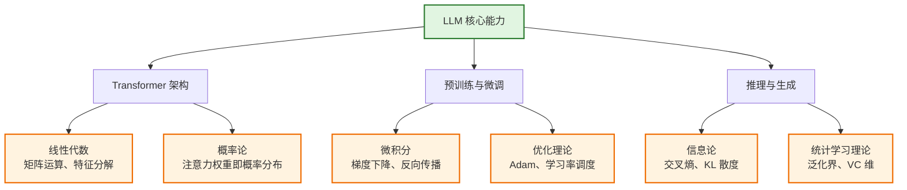
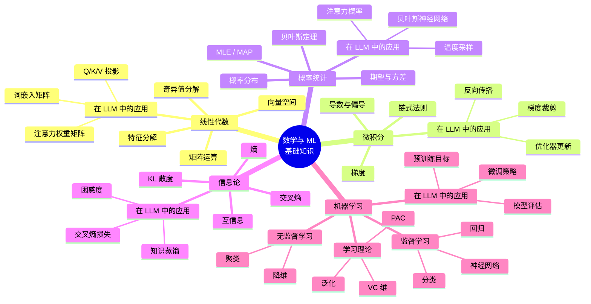

# 第三阶段：数学与机器学习基础

> **资料来源**：综合《Foundation Mathematics for Computer Science》（Springer 2024）、Andrew Ng《Machine Learning》课程、Stanford ML Algorithms 讲义、《Understanding Machine Learning: From Theory to Algorithms》等教材与课程笔记，结合 LLM 领域实践整理。

---

## 为什么数学与机器学习是 LLM 的基石

大语言模型（LLM）并非凭空出现的“黑魔法”，而是建立在严密的数学与机器学习理论之上。从 Transformer 的注意力机制到预训练的目标函数，从优化器的收敛性到模型的泛化能力——每一个环节都需要数学工具的精确描述。

理解数学能让你：

- **真正理解模型为什么有效**：注意力机制的本质是缩放点积的 softmax 概率分布
- **调试和优化模型时找到问题根源**：梯度消失/爆炸、学习率过大导致 loss 震荡
- **阅读前沿论文，跟进最新研究**：从理论推导中捕捉研究趋势

---

## 学习路径总览

| 周次 | 主题 | 核心内容 | 与 LLM 的关联 |
|:---:|:---|:---|:---|
| 1 | 线性代数与微积分 | 向量、矩阵、特征值、导数、梯度、链式法则 | Transformer 的矩阵运算、反向传播 |
| 2 | 概率统计与信息论 | 概率分布、贝叶斯定理、熵、KL 散度 | 注意力机制、损失函数、困惑度 |
| 3 | 监督学习 | 回归、分类、SVM、决策树、集成学习 | 分类任务微调、特征工程 |
| 4 | 无监督学习与神经网络 | 聚类、降维、MLP、激活函数 | 预训练（无监督）、Embedding |
| 5 | 学习理论 | PAC 学习、VC 维、泛化界 | 理解大模型为什么需要海量数据 |
| 6 | 正则化与优化理论 | 正则化、SGD 收敛性、稳定性 | Dropout、权重衰减、学习率调度 |

---

## 核心知识概念地图

---

## 核心知识清单

### 线性代数
- [ ] 向量、矩阵、张量
- [ ] 矩阵乘法、转置、逆
- [ ] 特征值和特征向量
- [ ] 奇异值分解（SVD）

### 概率统计
- [ ] 概率分布（正态、伯努利、多项式）
- [ ] 期望、方差、协方差
- [ ] 最大似然估计（MLE）
- [ ] 贝叶斯定理

### 微积分
- [ ] 导数和偏导数
- [ ] 梯度、梯度下降
- [ ] 链式法则（反向传播的核心）

### 机器学习基础
- [ ] 监督学习 vs 无监督学习
- [ ] 线性回归、逻辑回归
- [ ] 决策树、SVM
- [ ] 聚类、降维
- [ ] 交叉验证、过拟合/欠拟合

---

## 预计学习时间

4-6 周（视数学基础而定）

---

## 学习建议

- **不要追求证明每一个定理，先建立直觉理解**：例如，理解“梯度指向函数增长最快的方向”比背诵梯度公式更重要
- **用 Python + NumPy 动手实现算法**：手写一个逻辑回归或单层神经网络，比读十遍公式更有效
- **每学完一个算法，思考它在大模型中的应用场景**：SVM 的最大间隔思想如何启发了对比学习？PCA 的降维思想与 Transformer 的低秩适配（LoRA）有何联系？
