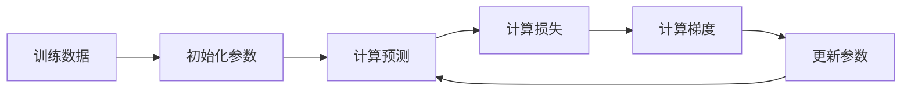
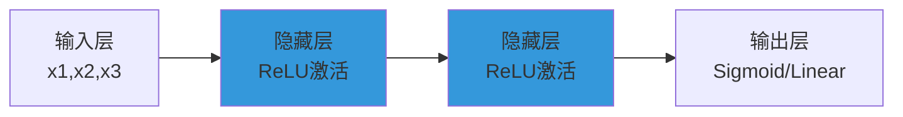
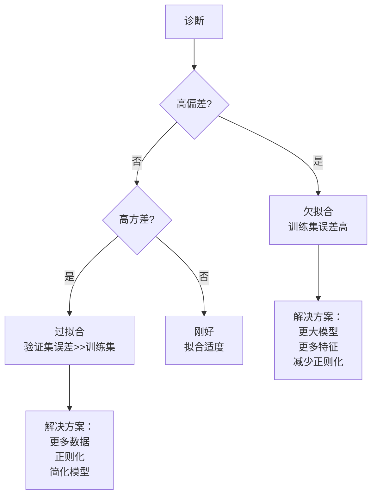
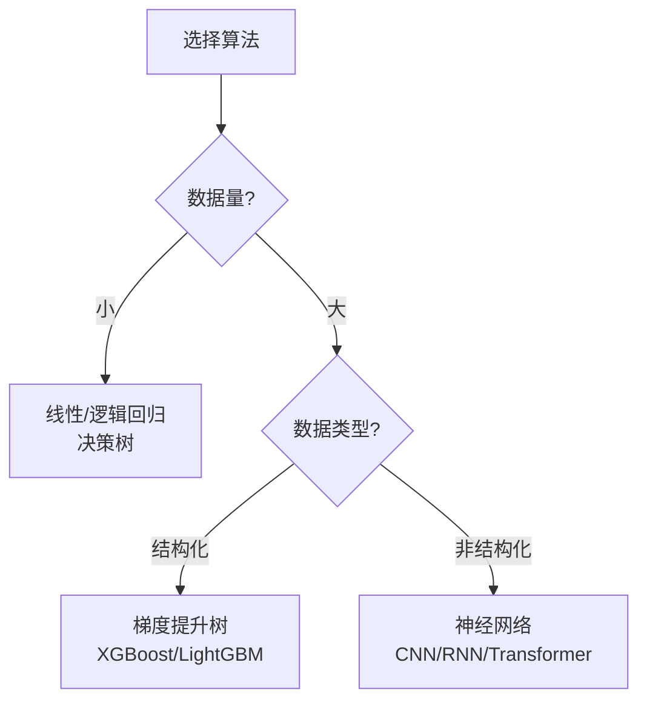

# 吴恩达机器学习笔记

> **资料来源**：Andrew Ng《Machine Learning Specialization》（Coursera）
> **适合人群**：机器学习入门者
> **难度**：⭐⭐（容易）

---

## 1. 课程概览

吴恩达的机器学习课程是全球最受欢迎的 ML 入门课程，分为三个专项：

| 专项 | 内容 | 时长 |
|------|------|------|
| 1. 监督学习 | 回归、分类、神经网络基础 | ~4 周 |
| 2. 高级学习算法 | 决策树、集成、神经网络调参 | ~4 周 |
| 3. 无监督学习 | 聚类、降维、异常检测、推荐系统 | ~4 周 |

---

## 2. 监督学习核心概念

### 2.1 线性回归

**模型**：
$$f_{w,b}(x) = wx + b$$

**代价函数（均方误差）**：
$$J(w,b) = \frac{1}{2m} \sum_{i=1}^{m} (f_{w,b}(x^{(i)}) - y^{(i)})^2$$

**梯度下降更新**：
$$w := w - \alpha \frac{\partial J}{\partial w}$$
$$b := b - \alpha \frac{\partial J}{\partial b}$$

其中 $\alpha$ 是学习率。

### 2.2 逻辑回归

**Sigmoid 函数**：
$$g(z) = \frac{1}{1 + e^{-z}}$$

**模型输出概率**：
$$f(x) = g(wx + b) = \frac{1}{1 + e^{-(wx+b)}}$$

**损失函数（交叉熵）**：
$$L(f(x), y) = -y\log(f(x)) - (1-y)\log(1-f(x))$$

**多分类（Softmax）**：
$$P(y=j|x) = \frac{e^{z_j}}{\sum_{k=1}^{K} e^{z_k}}$$

### 2.3 神经网络基础

**前向传播**：
$$a^{[l]} = g(W^{[l]} a^{[l-1]} + b^{[l]})$$

**反向传播**：从输出层向输入层计算梯度，核心链式法则。

---

## 3. 实用建议

### 3.1 模型评估

**训练集/验证集/测试集划分**：
- 训练集：训练模型参数
- 验证集：选择超参数、模型选择
- 测试集：最终评估（只能用一次）

**偏差（Bias）与方差（Variance）**：

### 3.2 正则化

| 方法 | 公式 | 效果 |
|------|------|------|
| L2 正则化 | $J + \lambda \sum w^2$ | 权重变小，防止过拟合 |
| Dropout | 随机丢弃神经元 | 防止共适应 |
| 早停 | 验证集损失上升时停止 | 简单有效 |

---

## 4. 关键决策流程

### 4.1 选择算法

### 4.2 误差分析

吴恩达强调的**误差分析流程**：

1. 在验证集上运行模型
2. 找出模型预测错误的样本
3. 按错误类型分类（如：模糊图像、遮挡、光线差）
4. 优先解决导致最多错误的类型

**原则**：不要凭直觉优化，用数据指导优先级。

---

## 5. 迁移学习

**何时使用**：
- 你的数据量小
- 预训练任务与目标任务相关

**微调策略**：

| 场景 | 做法 |
|------|------|
| 小数据集 | 只训练最后的分类层 |
| 中等数据集 | 训练最后几层 |
| 大数据集 | 全部微调 |

---

## 6. 核心公式速查

| 概念 | 公式 | 用途 |
|------|------|------|
| 均方误差 | $\frac{1}{m}\sum(y_{pred}-y)^2$ | 回归损失 |
| 交叉熵 | $-\sum y\log(\hat{y})$ | 分类损失 |
| Sigmoid | $\frac{1}{1+e^{-z}}$ | 二分类输出 |
| Softmax | $\frac{e^{z_j}}{\sum e^{z_k}}$ | 多分类输出 |
| ReLU | $\max(0, z)$ | 隐藏层激活 |
| 学习率衰减 | $\alpha = \frac{1}{1 + decay \cdot epoch} \alpha_0$ | 稳定收敛 |

---

## 7. 学习建议

1. **不要跳过数学推导**：理解梯度下降为什么有效
2. **动手实现**：先用 NumPy 实现线性回归，再用框架
3. **做课程作业**：Octave/Python 的编程练习是精髓
4. **看深度学习专项**：是这门课的进阶版本
5. **关注 Machine Learning Yearning**：免费的 ML 工程实践书
