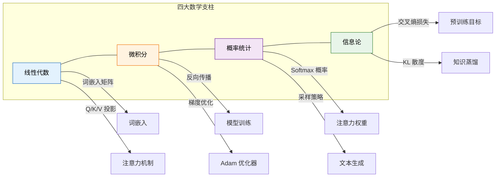

# 计算机科学数学基础：LLM 核心数学工具

> **资料来源**：综合《Foundation Mathematics for Computer Science: A Visual Approach》(Springer 2024)、Goodfellow《深度学习》、以及 LLM 领域经典论文中的数学应用整理。

---

## 概述

大语言模型的每一个核心组件——从词嵌入到注意力机制，从反向传播到优化器——都建立在四大数学支柱之上：**线性代数**、**微积分**、**概率统计**和**信息论**。本章从几何直观出发，结合 LLM 中的实际应用场景，系统讲解这些数学工具。



---

## 一、线性代数

### 1.1 向量与向量空间

**向量**是有大小和方向的量。在机器学习中，一个数据样本通常表示为一个向量 $\mathbf{x} \in \mathbb{R}^d$，其中 $d$ 是特征维度。

在 LLM 中，每个词首先被映射为一个**词嵌入向量** $\mathbf{e}_i \in \mathbb{R}^{d_{model}}$（如 GPT-3 中 $d_{model} = 12288$）。这些向量构成了模型的输入表示。

**向量的基本运算**：

- **点积（内积）**：$\mathbf{a} \cdot \mathbf{b} = \sum_{i=1}^{d} a_i b_i = \|\mathbf{a}\| \|\mathbf{b}\| \cos\theta$

  点积衡量两个向量的相似度。在注意力机制中，Query 和 Key 的点积决定了注意力权重的大小。

- **范数**：$\|\mathbf{x}\|_2 = \sqrt{\sum_{i=1}^{d} x_i^2}$

  L2 范数用于权重衰减（Weight Decay）正则化，防止模型过拟合。

```mermaid
graph LR
    subgraph 向量空间
        V1[词'猫'] --> E1[$\mathbf{e}_{猫} \in \mathbb{R}^d$]
        V2[词'狗'] --> E2[$\mathbf{e}_{狗} \in \mathbb{R}^d$]
        V3[词'汽车'] --> E3[$\mathbf{e}_{汽车} \in \mathbb{R}^d$]
    end

    E1 ---|点积高| E2
    E1 ---|点积低| E3
    E2 ---|点积低| E3

    style E1 fill:#e3f2fd,stroke:#1565c0,color:#000
    style E2 fill:#e3f2fd,stroke:#1565c0,color:#000
    style E3 fill:#fff3e0,stroke:#ef6c00,color:#000
```

### 1.2 矩阵与矩阵运算

**矩阵** $A \in \mathbb{R}^{m \times n}$ 是 $m$ 行 $n$ 列的数表。在神经网络中，权重通常以矩阵形式存储。

**核心运算**：

- **矩阵乘法**：若 $A \in \mathbb{R}^{m \times n}$，$B \in \mathbb{R}^{n \times p}$，则

$$
  (AB)_{ij} = \sum_{k=1}^{n} A_{ik} B_{kj}
  $$

- **转置**：$A^T$，$(A^T)_{ij} = A_{ji}$

- **逆矩阵**：$A^{-1}$，满足 $AA^{-1} = I$（仅方阵且满秩时存在）

**LLM 中的应用**：

在 Transformer 中，输入序列 $X \in \mathbb{R}^{n \times d_{model}}$（$n$ 为序列长度）通过三个权重矩阵投影为 Query、Key、Value：

$$
Q = X W^Q, \quad K = X W^K, \quad V = X W^V
$$

其中 $W^Q, W^K, W^V \in \mathbb{R}^{d_{model} \times d_k}$ 是可学习的参数矩阵。

### 1.3 特征值与特征向量

对于方阵 $A$，若存在非零向量 $\mathbf{v}$ 和标量 $\lambda$ 使得：

$$
A\mathbf{v} = \lambda\mathbf{v}
$$

则 $\lambda$ 称为**特征值**，$\mathbf{v}$ 称为**特征向量**。

**直观理解**：特征向量是矩阵变换下“只被拉伸、不被旋转”的特殊方向，特征值是拉伸的倍数。

**在 LLM 中的应用**：

- **主成分分析（PCA）**：对协方差矩阵进行特征分解，找到数据方差最大的方向。这启发了 Transformer 中的低秩适配（LoRA）方法——用低秩矩阵近似全秩权重更新。
- **稳定性分析**：分析 Hessian 矩阵的特征值分布，可以判断优化曲面的局部几何性质。

### 1.4 奇异值分解（SVD）

对于任意矩阵 $A \in \mathbb{R}^{m \times n}$，存在分解：

$$
A = U \Sigma V^T
$$

其中 $U \in \mathbb{R}^{m \times m}$ 和 $V \in \mathbb{R}^{n \times n}$ 是正交矩阵，$\Sigma \in \mathbb{R}^{m \times n}$ 是对角矩阵，对角线元素 $\sigma_1 \geq \sigma_2 \geq \cdots \geq 0$ 称为**奇异值**。

**在 LLM 中的应用**：

- **模型压缩**：通过截断小的奇异值，可以用低秩矩阵近似原始权重矩阵，实现模型压缩。
- **注意力模式分析**：对注意力矩阵进行 SVD，可以分析模型关注的语义模式。

```mermaid
graph TD
    A[权重矩阵 $W \in \mathbb{R}^{m \times n}$] -->|SVD| B[$W = U \Sigma V^T$]
    B --> C[取前 $r$ 个奇异值]
    C --> D[$W \approx U_r \Sigma_r V_r^T$]
    D --> E[参数量从 $mn$ 降至 $r(m+n)$]

    style A fill:#e3f2fd,stroke:#1565c0,color:#000
    style E fill:#e8f5e9,stroke:#2e7d32,color:#000
```

---

## 二、微积分

### 2.1 导数与偏导数

**导数**描述函数在某一点的变化率：

$$
f'(x) = \lim_{h \to 0} \frac{f(x+h) - f(x)}{h}
$$

**偏导数**是多元函数对某一个变量的导数（保持其他变量不变）：

$$
\frac{\partial f}{\partial x_i} = \lim_{h \to 0} \frac{f(x_1, \ldots, x_i+h, \ldots, x_n) - f(x_1, \ldots, x_n)}{h}
$$

**梯度**是所有偏导数组成的向量：

$$
\nabla f = \left( \frac{\partial f}{\partial x_1}, \frac{\partial f}{\partial x_2}, \ldots, \frac{\partial f}{\partial x_n} \right)
$$

**关键性质**：梯度 $\nabla f(\mathbf{x})$ 指向函数 $f$ 在点 $\mathbf{x}$ 处**增长最快**的方向。

### 2.2 梯度下降

梯度下降是机器学习中最重要的优化算法。为了最小化损失函数 $L(\theta)$，我们沿着梯度的反方向更新参数：

$$
\theta_{t+1} = \theta_t - \eta \nabla L(\theta_t)
$$

其中 $\eta > 0$ 是**学习率**（learning rate）。

```mermaid
graph LR
    subgraph 梯度下降
        direction TB
        S1[初始化 $\theta_0$] --> S2[计算梯度 $\nabla L(\theta_t)$]
        S2 --> S3[更新参数 $\theta_{t+1} = \theta_t - \eta \nabla L(\theta_t)$]
        S3 --> S4{收敛？}
        S4 -->|否| S2
        S4 -->|是| S5[得到最优参数]
    end
```

**学习率的影响**：

| 学习率 | 效果 | 类比 |
|:---:|:---|:---|
| 过大 | loss 震荡不收敛，甚至发散 | 下山时步子太大，越过谷底 |
| 过小 | 收敛极慢，可能陷入局部最优 | 下山时步子太小，耗时过长 |
| 适中 | 稳定收敛到最优解 | 稳步下山 |

**LLM 中的优化器**：现代 LLM 训练使用更复杂的优化器：

- **Adam**：自适应学习率，为每个参数维护独立的学习率
- **AdamW**：解耦权重衰减，是训练大模型的标准选择
- **学习率预热 + 余弦退火**：训练初期逐渐增大学习率，之后按余弦曲线衰减

### 2.3 链式法则与反向传播

**链式法则**是复合函数求导的核心工具。若 $y = f(g(x))$，则：

$$
\frac{dy}{dx} = \frac{dy}{dg} \cdot \frac{dg}{dx}
$$

对于多元函数，若 $z = f(x, y)$，$x = g(t)$，$y = h(t)$，则：

$$
\frac{dz}{dt} = \frac{\partial z}{\partial x} \frac{dx}{dt} + \frac{\partial z}{\partial y} \frac{dy}{dt}
$$

**反向传播（Backpropagation）**就是链式法则在神经网络中的系统应用。

**示例：简单神经网络的反向传播**

考虑一个两层网络：

$$
z = W_2 \sigma(W_1 x + b_1) + b_2
$$

其中 $\sigma$ 是激活函数（如 ReLU）。

损失函数 $L$ 对 $W_1$ 的梯度通过链式法则计算：

$$
\frac{\partial L}{\partial W_1} = \frac{\partial L}{\partial z} \cdot \frac{\partial z}{\partial h} \cdot \frac{\partial h}{\partial W_1}
$$

其中 $h = \sigma(W_1 x + b_1)$。

```mermaid
graph TD
    subgraph 前向传播
        X[$x$] -->|"$W_1 x + b_1$"| H1[$h_1$]
        H1 -->|"$\sigma$"| H[$h$]
        H -->|"$W_2 h + b_2$"| Z[$z$]
        Z -->|"损失函数"| L[$L$]
    end

    subgraph 反向传播
        L -->|"$\frac{\partial L}{\partial z}$"| GZ
        GZ -->|"$\frac{\partial z}{\partial h}$"| GH
        GH -->|"$\frac{\partial h}{\partial W_1}$"| GW1[$\frac{\partial L}{\partial W_1}$]
    end

    style X fill:#e3f2fd,stroke:#1565c0,color:#000
    style L fill:#ffebee,stroke:#c62828,color:#000
    style GW1 fill:#e8f5e9,stroke:#2e7d32,color:#000
```

**在 LLM 中的应用**：Transformer 有数十亿参数，反向传播通过计算图自动求导，高效计算所有参数的梯度。PyTorch/TensorFlow 等框架的核心就是自动微分引擎。

---

## 三、概率统计

### 3.1 概率基础

**概率**描述随机事件发生的可能性。对于离散随机变量 $X$，概率质量函数（PMF）满足：

$$
P(X = x) \geq 0, \quad \sum_{x} P(X = x) = 1
$$

对于连续随机变量，用概率密度函数（PDF）$p(x)$ 描述，满足：

$$
p(x) \geq 0, \quad \int_{-\infty}^{\infty} p(x) dx = 1
$$

**期望**（均值）：

$$
\mathbb{E}[X] = \sum_{x} x P(X = x) \quad \text{（离散）}
$$

$$
\mathbb{E}[X] = \int_{-\infty}^{\infty} x p(x) dx \quad \text{（连续）}
$$

**方差**衡量随机变量的离散程度：

$$
\text{Var}(X) = \mathbb{E}[(X - \mathbb{E}[X])^2] = \mathbb{E}[X^2] - (\mathbb{E}[X])^2
$$

### 3.2 常见概率分布

| 分布 | 类型 | 概率函数 | 应用场景 |
|:---|:---:|:---|:---|
| **伯努利分布** | 离散 | $P(X=1) = p, P(X=0) = 1-p$ | 二分类问题 |
| **二项分布** | 离散 | $P(X=k) = \binom{n}{k} p^k (1-p)^{n-k}$ | $n$ 次独立试验的成功次数 |
| **正态分布** | 连续 | $p(x) = \frac{1}{\sqrt{2\pi}\sigma} e^{-\frac{(x-\mu)^2}{2\sigma^2}}$ | 噪声建模、权重初始化 |
| **多项分布** | 离散 | $P(X_1=k_1, \ldots, X_m=k_m) = \frac{n!}{k_1! \cdots k_m!} p_1^{k_1} \cdots p_m^{k_m}$ | 多分类问题 |

**在 LLM 中的应用**：

- **权重初始化**：Xavier/Glorot 初始化使用正态分布，使得前向传播时各层输出的方差保持一致
- **Dropout**：以伯努利概率 $p$ 随机丢弃神经元，防止过拟合
- **词生成**：语言模型输出的是词表上的概率分布（多项分布），通过采样生成下一个词

### 3.3 贝叶斯定理

**贝叶斯定理**是概率推理的核心：

$$
P(H | D) = \frac{P(D | H) P(H)}{P(D)}
$$

其中：
- $P(H)$：**先验概率**（Prior）——在观察到数据前对假设的信念
- $P(D | H)$：**似然**（Likelihood）——在假设成立下观察到数据的概率
- $P(H | D)$：**后验概率**（Posterior）——观察到数据后对假设的更新信念
- $P(D)$：**证据**（Evidence）——归一化常数

**在 LLM 中的应用**：

- **贝叶斯神经网络**：将网络权重视为随机变量，通过后验推断得到不确定性估计
- **提示工程（Prompt Engineering）**：可以形式化为贝叶斯推断——给定提示 $P$，寻找最可能的回复 $R$：

$$
  R^* = \arg\max_R P(R | P) = \arg\max_R \frac{P(P | R) P(R)}{P(P)}
  $$

### 3.4 最大似然估计（MLE）

给定数据集 $\{x_1, x_2, \ldots, x_n\}$，假设数据来自参数为 $\theta$ 的分布，MLE 寻找使数据出现概率最大的参数：

$$
\hat{\theta}_{MLE} = \arg\max_\theta \prod_{i=1}^{n} p(x_i | \theta) = \arg\max_\theta \sum_{i=1}^{n} \log p(x_i | \theta)
$$

**在 LLM 中的应用**：

语言模型的预训练目标就是**最大似然估计**。给定语料中的句子 $w_1, w_2, \ldots, w_T$，模型最大化：

$$
\mathcal{L} = \sum_{t=1}^{T} \log P(w_t | w_1, \ldots, w_{t-1}; \theta)
$$

这就是**自回归语言建模**的目标函数。GPT 系列模型就是通过最大化这个目标来学习的。

---

## 四、信息论

### 4.1 熵（Entropy）

**熵**衡量随机变量的不确定性，由香农定义：

$$
H(X) = -\sum_{x} P(x) \log P(x) = \mathbb{E}[-\log P(X)]
$$

**直观理解**：
- 确定性事件（$P(x) = 1$）的熵为 0
- 均匀分布的熵最大（不确定性最大）

**在 LLM 中的应用**：

- **困惑度（Perplexity）**：语言模型的标准评估指标，定义为 $PP = 2^{H(P, Q)}$，其中 $H(P, Q)$ 是交叉熵。困惑度越低，模型对文本的预测越准确。

### 4.2 交叉熵（Cross-Entropy）

对于真实分布 $P$ 和模型预测分布 $Q$，交叉熵定义为：

$$
H(P, Q) = -\sum_{x} P(x) \log Q(x)
$$

**性质**：$H(P, Q) \geq H(P)$，当且仅当 $Q = P$ 时取等号。

**在 LLM 中的应用**：

交叉熵是语言模型预训练的**标准损失函数**。对于每个位置 $t$，真实分布 $P$ 是 one-hot 编码（只有正确词的概率为 1），模型预测分布为 $Q$：

$$
\mathcal{L}_{CE} = -\sum_{t=1}^{T} \log Q(w_t | w_1, \ldots, w_{t-1})
$$

### 4.3 KL 散度（Kullback-Leibler Divergence）

KL 散度衡量两个概率分布之间的差异：

$$
D_{KL}(P \| Q) = \sum_{x} P(x) \log \frac{P(x)}{Q(x)} = H(P, Q) - H(P)
$$

**性质**：
- $D_{KL}(P \| Q) \geq 0$（非负性）
- $D_{KL}(P \| Q) = 0$ 当且仅当 $P = Q$
- **不对称**：$D_{KL}(P \| Q) \neq D_{KL}(Q \| P)$

**在 LLM 中的应用**：

| 应用场景 | KL 散度的作用 |
|:---|:---|
| **知识蒸馏** | 学生模型学习教师模型的输出分布：$\min D_{KL}(P_{teacher} \| P_{student})$ |
| **强化学习微调（RLHF）** | 限制策略模型与参考模型的偏离：$D_{KL}(\pi_{RL} \| \pi_{ref}) \leq \epsilon$ |
| **变分推断** | 用近似后验 $q$ 逼近真实后验 $p$：$\min D_{KL}(q \| p)$ |
| **模型对齐** | 防止微调后的模型偏离原始分布太远 |

```mermaid
graph LR
    subgraph 知识蒸馏
        T[教师模型<br/>大模型] -->|输出分布 $P_T$| KL{最小化 $D_{KL}$}
        S[学生模型<br/>小模型] -->|输出分布 $P_S$| KL
        KL -->|学习软标签| S2[压缩后的小模型]
    end

    style T fill:#e3f2fd,stroke:#1565c0,color:#000
    style S fill:#fff3e0,stroke:#ef6c00,color:#000
    style S2 fill:#e8f5e9,stroke:#2e7d32,color:#000
```

### 4.4 互信息（Mutual Information）

互信息衡量两个随机变量之间的依赖程度：

$$
I(X; Y) = D_{KL}(P(X, Y) \| P(X)P(Y)) = H(X) - H(X | Y)
$$

**直观理解**：知道 $Y$ 后，$X$ 的不确定性减少了多少。

**在 LLM 中的应用**：

- **表示学习**：好的词嵌入应该保留词与上下文之间的互信息
- **信息瓶颈理论**：解释神经网络如何在学习过程中压缩输入信息，保留与任务相关的信息

---

## 五、数学工具在 LLM 中的综合应用

### 5.1 Transformer 注意力机制的数学本质

自注意力机制的计算过程是上述所有数学工具的综合运用：

```mermaid
graph TD
    X[输入 $X \in \mathbb{R}^{n \times d}$] -->|"线性投影"| QKV[Q, K, V]
    QKV -->|"点积"| S[相似度矩阵 $S = QK^T$]
    S -->|"缩放"| SS[$S / \sqrt{d_k}$]
    SS -->|"Softmax"| A[注意力权重 $A$]
    A -->|"加权求和"| O[输出 $O = AV$]

    style X fill:#e3f2fd,stroke:#1565c0,color:#000
    style A fill:#fff3e0,stroke:#ef6c00,color:#000
    style O fill:#e8f5e9,stroke:#2e7d32,color:#000
```

**数学公式**：

$$
\text{Attention}(Q, K, V) = \text{softmax}\left(\frac{QK^T}{\sqrt{d_k}}\right) V
$$

其中：
- $QK^T$：矩阵乘法（线性代数）
- $\sqrt{d_k}$：缩放因子，防止点积过大导致 softmax 梯度消失（数值稳定性）
- $\text{softmax}(x_i) = \frac{e^{x_i}}{\sum_j e^{x_j}}$：将相似度转化为概率分布（概率论）
- 输出是 Value 的加权平均，权重由注意力分布决定

### 5.2 训练目标函数的数学结构

LLM 预训练的完整目标函数通常包含多个项：

$$
\mathcal{L} = \underbrace{\mathcal{L}_{CE}}_{\text{交叉熵损失}} + \underbrace{\lambda \|\theta\|_2^2}_{\text{L2 正则化}} + \underbrace{\beta D_{KL}(\pi_{RL} \| \pi_{ref})}_{\text{KL 约束（RLHF 中）}}
$$

| 项 | 数学形式 | 作用 |
|:---|:---|:---|
| 交叉熵 | $-\sum \log P(w_t \| \text{context})$ | 学习语言结构 |
| L2 正则化 | $\lambda \sum \theta_i^2$ | 防止过拟合 |
| KL 约束 | $\beta D_{KL}(\pi \| \pi_{ref})$ | 保持模型稳定性 |

---

## 六、学习建议与练习

### 6.1 关键公式速查表

| 概念 | 公式 | LLM 应用 |
|:---|:---|:---|
| 点积 | $\mathbf{a} \cdot \mathbf{b}$ | Q-K 相似度 |
| 矩阵乘法 | $(AB)_{ij} = \sum_k A_{ik} B_{kj}$ | 线性变换 |
| 梯度 | $\nabla f$ | 参数更新方向 |
| 链式法则 | $\frac{dz}{dx} = \frac{dz}{dy} \frac{dy}{dx}$ | 反向传播 |
| 贝叶斯定理 | $P(H\|D) = \frac{P(D\|H)P(H)}{P(D)}$ | 概率推理 |
| 熵 | $H(X) = -\sum P(x) \log P(x)$ | 不确定性度量 |
| 交叉熵 | $H(P, Q) = -\sum P(x) \log Q(x)$ | 训练损失 |
| KL 散度 | $D_{KL}(P\|Q) = \sum P(x) \log \frac{P(x)}{Q(x)}$ | 分布对齐 |

### 6.2 动手练习

1. **用 NumPy 实现矩阵乘法**：验证 $(AB)C = A(BC)$ 的结合律
2. **计算 softmax 的梯度**：推导 $\frac{\partial \text{softmax}(x_i)}{\partial x_j}$
3. **实现简单线性回归**：用梯度下降拟合 $y = ax + b$
4. **计算两个分布的 KL 散度**：用 Python 实现 $D_{KL}(P \| Q)$
5. **可视化梯度下降**：在二维损失曲面上绘制优化轨迹

### 6.3 进阶阅读

- 《深度学习》（Goodfellow 等）第 2-3 章（线性代数与概率论）
- 《Mathematics for Machine Learning》（Deisenroth 等）
- Transformer 论文《Attention Is All You Need》中的数学推导
