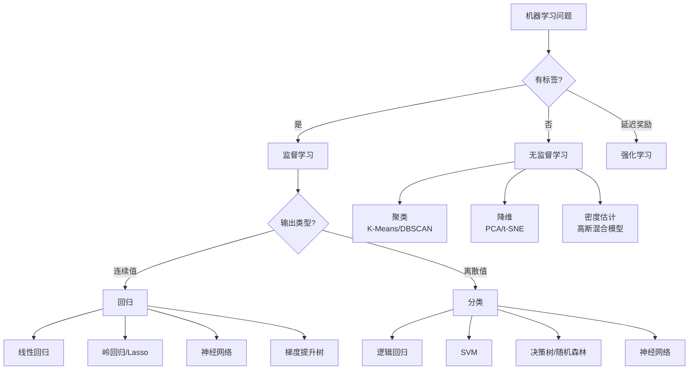
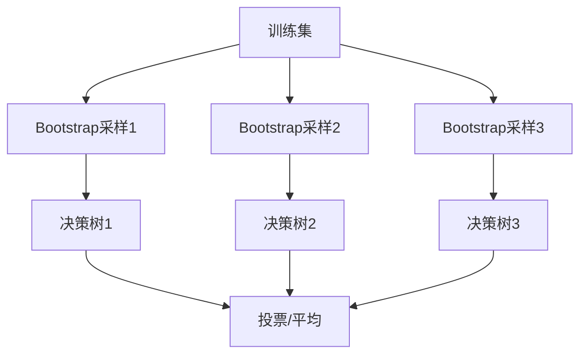
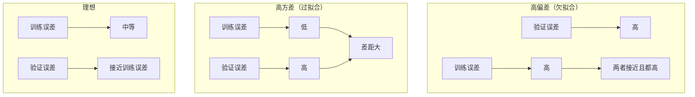

# 斯坦福机器学习算法速查

> **资料来源**：斯坦福大学 CS229 课程精华
> **适合人群**：需要快速查阅 ML 算法原理与选择的读者
> **难度**：⭐⭐⭐（中等）

---

## 1. 算法选择决策树



---

## 2. 监督学习算法详解

### 2.1 线性回归

**假设函数**：$h_\theta(x) = \theta^T x = \sum_{j=0}^{n} \theta_j x_j$

**代价函数**：$J(\theta) = \frac{1}{2m} \sum_{i=1}^{m} (h_\theta(x^{(i)}) - y^{(i)})^2$

**正规方程**：$\theta = (X^T X)^{-1} X^T y$

| 方法 | 适用场景 | 优缺点 |
|------|----------|--------|
| 梯度下降 | 大规模数据 | 需调学习率，迭代收敛 |
| 正规方程 | 小规模数据（n<10000） | 直接求解，无需迭代，但$O(n^3)$ |

### 2.2 逻辑回归

**假设函数**：$h_\theta(x) = \frac{1}{1 + e^{-\theta^T x}}$

**代价函数**：$J(\theta) = -\frac{1}{m} \sum [y^{(i)} \log h(x^{(i)}) + (1-y^{(i)}) \log(1-h(x^{(i)}))]$

**多分类**：One-vs-All 或 Softmax

### 2.3 支持向量机（SVM）

**核心思想**：找到最大间隔超平面


**核技巧**：将数据映射到高维空间

| 核函数 | 公式 | 适用 |
|--------|------|------|
| 线性 | $K(x,z) = x^T z$ | 线性可分 |
| 多项式 | $K(x,z) = (x^T z + c)^d$ | 多项式关系 |
| RBF（高斯） | $K(x,z) = \exp(-\frac{\|x-z\|^2}{2\sigma^2})$ | 通用，非线性 |

**在大模型中的关联**：
- SVM 的核方法思想影响了 Attention 机制
- 最大间隔原则与对比学习有理论联系

### 2.4 决策树与集成方法

**决策树**：递归划分数据，基于信息增益或 Gini 不纯度

**随机森林**：多棵决策树 + Bagging



**梯度提升树**：串行训练，每棵树纠正前一棵的错误

```python
# XGBoost 伪代码
for i in range(n_trees):
    residuals = y - prediction_so_far
    tree = fit_tree(X, residuals)
    prediction_so_far += learning_rate * tree.predict(X)
```

**与深度学习的对比**：

| 特性 | 梯度提升树 | 神经网络 |
|------|-----------|----------|
| 数据类型 | 表格数据最佳 | 非结构化数据最佳 |
| 训练速度 | 快 | 慢 |
| 超参敏感 | 较敏感 | 非常敏感 |
| 特征工程 | 需要较少 | 需要较多 |
| 可解释性 | 好 | 差 |
| 大数据扩展 | 有限 | 优秀 |

---

## 3. 无监督学习

### 3.1 K-Means 聚类

**算法步骤**：
1. 随机初始化 K 个中心点
2. 将每个点分配到最近的中心
3. 重新计算中心点位置
4. 重复 2-3 直到收敛

**目标函数**：$J = \sum_{i=1}^{m} \|x^{(i)} - \mu_{c^{(i)}}\|^2$

**选择 K**：肘部法则

### 3.2 主成分分析（PCA）

**目标**：将数据投影到低维空间，保留最大方差

**步骤**：
1. 数据标准化
2. 计算协方差矩阵
3. 特征值分解
4. 取前 k 个最大特征值对应的特征向量
5. 投影

**与大模型的关联**：
- PCA 是理解 Embedding 降维的基础
- Transformer 的注意力机制可视为一种自适应降维

---

## 4. 算法评估与诊断

### 4.1 评估指标

| 问题类型 | 指标 | 公式 | 适用场景 |
|----------|------|------|----------|
| 回归 | MSE | $\frac{1}{m}\sum(y-\hat{y})^2$ | 通用 |
| 回归 | MAE | $\frac{1}{m}\sum\|y-\hat{y}\|$ | 异常值鲁棒 |
| 分类 | 准确率 | $\frac{TP+TN}{TP+TN+FP+FN}$ | 均衡数据 |
| 分类 | F1 | $2 \cdot \frac{Precision \cdot Recall}{Precision + Recall}$ | 不均衡数据 |
| 分类 | AUC-ROC | ROC曲线下面积 | 排序质量 |

### 4.2 学习曲线诊断



### 4.3 误差分析方法论

吴恩达推荐的误差分析流程：

1. 在验证集上运行模型
2. 找出错误样本
3. 按错误类型分类
4. 计算每类错误占比
5. 优先解决占比最高的错误类型

---

## 5. 与大模型的直接联系

### 5.1 预训练 = 大规模无监督学习

大模型的预训练本质上是无监督学习：
- **自回归语言建模**：预测下一个 token
- **掩码语言建模**：预测被遮挡的 token（BERT）

### 5.2 微调 = 迁移学习


### 5.3 正则化技术共通

| 经典 ML | 深度学习/大模型 |
|---------|----------------|
| L2 正则化 | Weight Decay (AdamW) |
| Dropout | 广泛用于 Transformer |
| 早停 | 训练时监控验证集 loss |
| Bagging | 模型集成、Self-Ensemble |

---

## 快速参考卡

```
数据量小 + 结构化 → 随机森林/XGBoost
数据量大 + 非结构化 → 神经网络/Transformer
需要解释性 → 决策树/线性模型
追求极致性能 → 深度学习
表格数据竞赛 → 梯度提升树
图像/NLP/语音 → 深度学习
```
