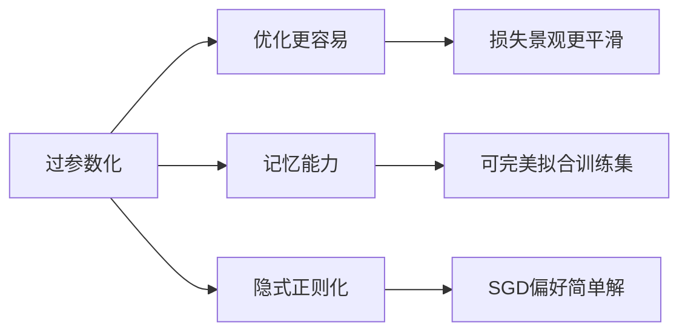
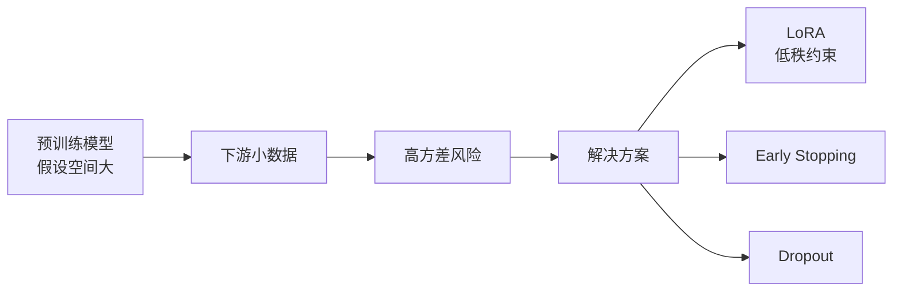

# 理解机器学习：从理论到算法

> **资料来源**：《Understanding Machine Learning: From Theory to Algorithms》(Shai Shalev-Shwartz & Shai Ben-David)
> **适合人群**：希望深入理解 ML 理论本质的学习者
> **难度**：⭐⭐⭐⭐（较难）

---

## 1. 学习理论的统一框架

### 1.1 什么是"可学习"？

机器学习理论的核心问题是：**从有限样本中学习的模型，为什么能在未见数据上表现好？**


**PAC 学习框架（Probably Approximately Correct）**：
- Probably：以高概率（$1-\delta$）
- Approximately：近似正确（误差 $\leq \epsilon$）
- 如果算法能在多项式样本内满足上述条件，则问题是 PAC 可学习的

### 1.2 泛化误差界

**Hoeffding 不等式**：
$$P(|\hat{R}(h) - R(h)| > \epsilon) \leq 2e^{-2m\epsilon^2}$$

其中 $\hat{R}$ 是经验风险，$R$ 是真实风险，$m$ 是样本数。

**含义**：样本越多，经验风险越接近真实风险。

---

## 2. 复杂度度量

### 2.1 VC 维（Vapnik-Chervonenkis Dimension）

**定义**：假设类能够"打散"（shatter）的最大样本数。

**直观理解**：

```
二维平面上的线性分类器：
- 3 个点任意 labeling：总能分开 → VC维 ≥ 3
- 4 个点存在 labeling：无法分开 → VC维 = 3
```

**泛化界**：
$$R(h) \leq \hat{R}(h) + O\left(\sqrt{\frac{d + \log(1/\delta)}{m}}\right)$$

其中 $d$ 是 VC 维，$m$ 是样本数。

**关键洞察**：模型复杂度（VC 维）与样本量的平方根成反比。模型越复杂，需要的样本越多。

### 2.2 Rademacher 复杂度

比 VC 维更精细的复杂度度量：

$$\mathfrak{R}_m(\mathcal{H}) = E_\sigma \left[\sup_{h \in \mathcal{H}} \frac{1}{m} \sum_{i=1}^{m} \sigma_i h(x_i) \right]$$

其中 $\sigma_i \in \{-1, +1\}$ 是随机 Rademacher 变量。

**含义**：衡量假设类能够"拟合噪声"的能力。

---

## 3. 偏差-方差分解

### 3.1 数学分解

对于平方损失：
$$E[(y - \hat{f}(x))^2] = \underbrace{(f(x) - E[\hat{f}(x)])^2}_{偏差^2} + \underbrace{E[(\hat{f}(x) - E[\hat{f}(x)])^2]}_{方差} + \underbrace{\sigma^2}_{噪声}$$

### 3.2 直观理解


---

## 4. 正则化的理论解释

### 4.1 结构风险最小化

$$\min_{h \in \mathcal{H}} \hat{R}(h) + \lambda \cdot \Omega(h)$$

**解释**：
- $\hat{R}(h)$：经验风险（拟合训练数据）
- $\Omega(h)$：正则项（模型复杂度惩罚）
- $\lambda$：平衡参数

### 4.2 正则化与稳定性

**均匀稳定性**：算法对单个样本的扰动不敏感，则泛化好。

**关键定理**：
- 正则化经验风险最小化具有均匀稳定性
- 这解释了为什么 L2 正则化能改善泛化

---

## 5. 深度学习时代的理论挑战

### 5.1 传统理论的失效

传统学习理论预测：
- 参数量 $d$ 远大于样本量 $m$ 时应该过拟合
- 但深度学习模型（$d \gg m$）却能泛化很好

**矛盾**：

| 理论预测 | 实际观察 |
|----------|----------|
| 复杂模型过拟合 | 深度网络泛化好 |
| 需要正则化 | 有时无正则化也泛化好 |
| 局部最小值差 | SGD 找到的局部最小值很好 |

### 5.2 现代解释尝试

**1. 隐式正则化（Implicit Regularization）**

SGD 本身就有正则化效果：
- 小批量噪声防止过拟合
-  early stopping 等价于 L2 正则化
-  平坦最小值（Flat Minima）泛化更好

**2. 过参数化的好处**



**3. 双下降现象（Double Descent）**

```
传统 U 型曲线：
错误率 ↑
     │  ╲    ╱
     │   ╲  ╱
     │    ╲╱
     └──────────→ 模型复杂度

双下降曲线：
错误率 ↑
     │  ╲       ╱
     │   ╲     ╱
     │    ╲___╱
     │         ╲___
     └──────────────→ 模型复杂度
              ↑
         插值阈值
```

在过参数化区域（超过插值阈值后），增加模型复杂度反而降低测试误差！

### 5.3 大模型的 Scaling Laws

从学习理论角度理解 Scaling Laws：

$$L(N, D) = \frac{A}{N^\alpha} + \frac{B}{D^\beta} + L_\infty$$

- $N$：模型参数量
- $D$：训练数据量
- $L_\infty$：不可约误差

**与泛化界的联系**：
- 这类似于结构风险最小化中的复杂度-数据权衡
- 大模型时代，$N$ 和 $D$ 需要同步增长

---

## 6. 核心定理速查

| 定理 | 内容 | 意义 |
|------|------|------|
| No Free Lunch | 没有算法在所有问题上都最优 | 针对特定问题设计算法 |
| PAC 学习 | 有限样本 + 多项式时间 → 近似正确 | 可学习性的形式定义 |
| VC 泛化界 | $R \leq \hat{R} + O(\sqrt{d/m})$ | 复杂度与样本的权衡 |
| 一致收敛 | 经验风险 → 真实风险（一致地） | ERM 的理论基础 |

---

## 7. 与大模型训练的直接关联

### 7.1 预训练为何有效？

从学习理论角度：
1. **大数据降低了方差**：$m$ 极大，经验风险接近真实风险
2. **大模型降低了偏差**：足够大的网络可以逼近任何函数
3. **预训练是正则化**：学习通用表示，限制假设空间

### 7.2 微调时的过拟合风险



### 7.3 涌现能力（Emergent Abilities）的理论视角

传统理论难以解释：为什么模型超过某个规模后突然获得新能力？

可能解释：
- **相变（Phase Transition）**：复杂系统中常见的现象
- **多步推理的累积**：小模型每步准确率不足，多步后急剧下降
- **表示空间的质变**：某规模后形成了新的有效表示

---

## 阅读建议

1. **重点章节**：PAC 学习、VC 维、均匀稳定性、正则化
2. **可跳过**：过于复杂的证明细节
3. **配合阅读**：与《深度学习小书》的直觉理解互补
4. **面试准备**：理解偏差-方差、过拟合、泛化界的核心概念
