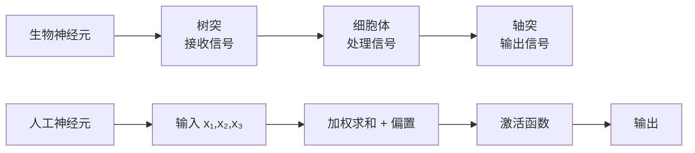
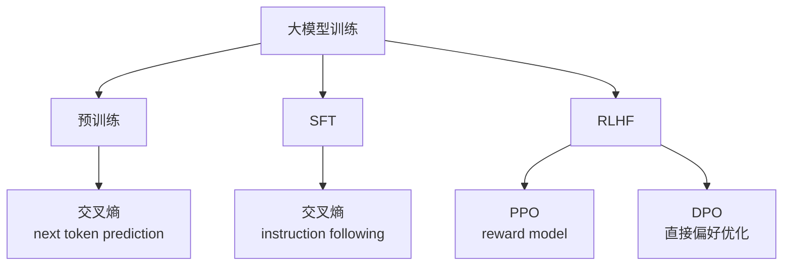
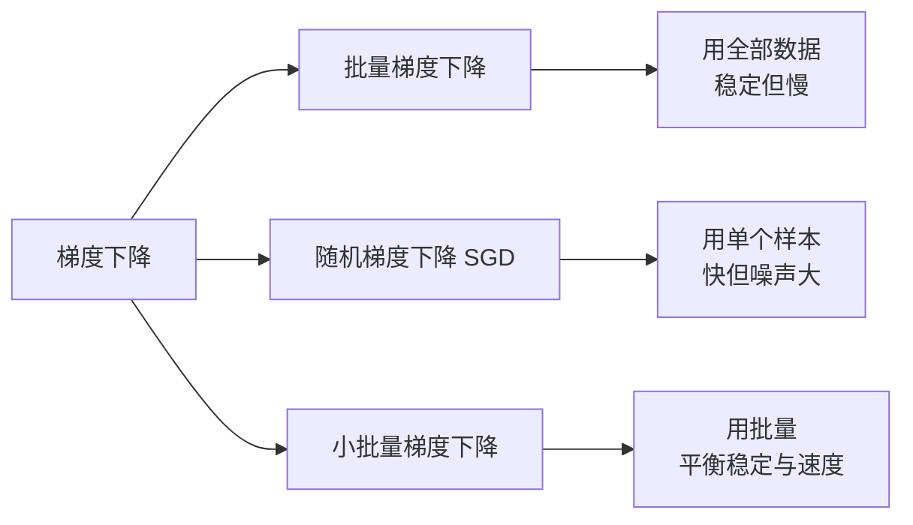
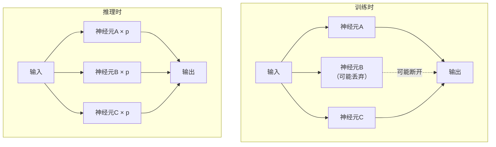
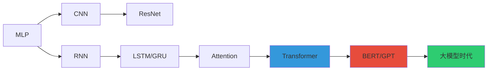

# 深度学习小书：核心概念速查

> **资料来源**：综合多本深度学习教材精华
> **适合人群**：需要快速复习深度学习核心概念的读者
> **难度**：⭐⭐⭐（中等）

---

## 1. 神经网络基础

### 1.1 从生物神经元到人工神经元



**人工神经元数学**：
$$y = f(w_1 x_1 + w_2 x_2 + w_3 x_3 + b) = f(w^T x + b)$$

### 1.2 多层感知机（MLP）


**为什么需要多层？**
- 单层 = 线性分类器
- 多层 + 非线性激活 = 通用函数逼近器

---

## 2. 激活函数对比

| 激活函数 | 公式 | 输出范围 | 优点 | 缺点 | 使用场景 |
|----------|------|----------|------|------|----------|
| **Sigmoid** | $\frac{1}{1+e^{-x}}$ | (0,1) | 平滑可导 | 梯度消失，非零均值 | 二分类输出 |
| **Tanh** | $\frac{e^x - e^{-x}}{e^x + e^{-x}}$ | (-1,1) | 零均值 | 仍有梯度消失 | RNN 隐藏层 |
| **ReLU** | $\max(0, x)$ | [0,∞) | 计算快，缓解梯度消失 | 神经元死亡 | 隐藏层默认 |
| **Leaky ReLU** | $\max(\alpha x, x)$ | (-∞,∞) | 解决死亡 ReLU | 需调 $\alpha$ | 替代 ReLU |
| **GELU** | $x \cdot \Phi(x)$ | (-∞,∞) | 平滑，Transformer 用 | 计算稍慢 | BERT/GPT |
| **Swish** | $x \cdot \sigma(x)$ | (-∞,∞) | 自门控 | 计算稍慢 | 部分网络 |

**为什么隐藏层需要非线性激活？**

如果没有非线性激活，多层网络等价于单层：
$$W_2(W_1 x) = (W_2 W_1)x = W'x$$

### 激活函数可视化

```
ReLU:          Sigmoid:           Tanh:
  │    ╱        │  ╭──╮            │  ╭─╮
  │   ╱         │ ╱    ╲           │ ╱   ╲
──┼──┼──       ──┼────┼──         ──┼────┼──
  │  ╱          │╱      ╲          │╲    ╱
  │ ╱           │                    ╲__╱
```

---

## 3. 损失函数

### 3.1 回归损失

| 损失 | 公式 | 特点 |
|------|------|------|
| MSE | $\frac{1}{m}\sum(y-\hat{y})^2$ | 对大误差惩罚重 |
| MAE | $\frac{1}{m}\sum\|y-\hat{y}\|$ | 对异常值鲁棒 |
| Huber | 混合 MSE/MAE | 两者折中 |

### 3.2 分类损失

| 损失 | 公式 | 特点 |
|------|------|------|
| 交叉熵 | $-\sum y \log(\hat{y})$ | 分类标准 |
| 二元交叉熵 | $-\sum[y\log(\hat{y}) + (1-y)\log(1-\hat{y})]$ | 二分类 |
| Focal Loss | 加权交叉熵 | 处理类别不平衡 |

### 3.3 大模型专用损失



---

## 4. 优化算法

### 4.1 梯度下降家族



### 4.2 自适应学习率方法

| 方法 | 核心思想 | 适用 |
|------|----------|------|
| **AdaGrad** | 累加梯度平方，自适应衰减 | 稀疏数据 |
| **RMSprop** | 指数移动平均梯度平方 | 通用 |
| **Adam** | Momentum + RMSprop | 默认首选 |
| **AdamW** | Adam + 解耦 Weight Decay | Transformer 标配 |

**Adam 公式**：
$$m_t = \beta_1 m_{t-1} + (1-\beta_1)g_t$$
$$v_t = \beta_2 v_{t-1} + (1-\beta_2)g_t^2$$
$$\hat{m}_t = \frac{m_t}{1-\beta_1^t}, \quad \hat{v}_t = \frac{v_t}{1-\beta_2^t}$$
$$\theta_{t+1} = \theta_t - \frac{\alpha}{\sqrt{\hat{v}_t}+\epsilon}\hat{m}_t$$

**大模型训练配置**：
- 优化器：AdamW
- $\beta_1 = 0.9, \beta_2 = 0.95$ 或 $0.999$
- Weight Decay：0.1
- 学习率：预热 + 余弦衰减

---

## 5. 正则化技术

### 5.1 防止过拟合的方法

| 方法 | 原理 | 实现 |
|------|------|------|
| L2 正则化 | 惩罚大权值 | $\lambda \sum w^2$ |
| Dropout | 随机丢弃神经元 | 训练时以概率 p 置零 |
| 早停 | 验证集 loss 上升时停止 | 监控 val_loss |
| 数据增强 | 扩充训练数据 | 旋转/裁剪/噪声等 |
| 批归一化 | 稳定分布 | 标准化 + 缩放偏移 |

### 5.2 Dropout 详解



**解释**：Dropout 可视为训练多个子网络的集成方法。

### 5.3 Batch Normalization

**公式**：
$$\hat{x}_i = \frac{x_i - \mu_B}{\sqrt{\sigma_B^2 + \epsilon}}$$
$$y_i = \gamma \hat{x}_i + \beta$$

**作用**：
- 加速训练（允许更大学习率）
- 减少内部协变量偏移
- 轻微正则化效果

**在大模型中的变体**：
- LayerNorm（Transformer 用）：对每个样本的所有特征归一化
- RMSNorm（LLaMA 用）：去掉均值中心化，更快

---

## 6. 架构演进路线



### 关键里程碑

| 年份 | 架构 | 突破 |
|------|------|------|
| 1986 | MLP + Backprop | 可训练的深层网络 |
| 1998 | LeNet | 第一个成功的 CNN |
| 2012 | AlexNet | 深度学习复兴 |
| 2014 | VGGNet | 小卷积核，深层网络 |
| 2015 | ResNet | 残差连接，可训练 100+ 层 |
| 2017 | Transformer | 自注意力取代 RNN |
| 2018 | BERT/GPT | 预训练 + 微调范式 |
| 2020 | GPT-3 | 大模型时代开启 |

---

## 7. 面试速查

### 7.1 必会概念

1. **为什么用 ReLU 而不是 Sigmoid？**
   - ReLU 缓解梯度消失，计算更快
   - Sigmoid 在深层网络中梯度趋近于 0

2. **BatchNorm 和 LayerNorm 的区别？**
   - BatchNorm：跨 batch 维度归一化
   - LayerNorm：跨特征维度归一化，适合变长序列

3. **Adam vs SGD？**
   - Adam：自适应学习率，收敛快
   - SGD + Momentum：泛化可能更好，大模型微调常用

4. **Dropout 在推理时怎么做？**
   - 推理时关闭 Dropout，输出乘以保留概率 p

5. **1×1 卷积的作用？**
   - 降维/升维、跨通道信息融合、减少参数量

### 7.2 公式记忆清单

```python
# 必须能手写
1. Softmax: exp(z_i) / sum(exp(z_j))
2. Sigmoid: 1 / (1 + exp(-z))
3. CrossEntropy: -sum(y * log(y_hat))
4. MSE: mean((y - y_hat)^2)
5. LayerNorm: (x - mean(x)) / sqrt(var(x) + eps) * gamma + beta
```
