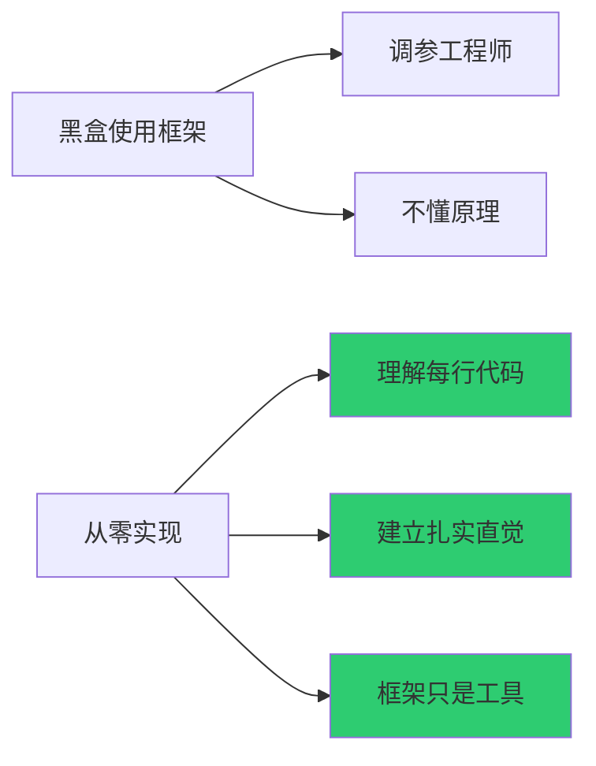
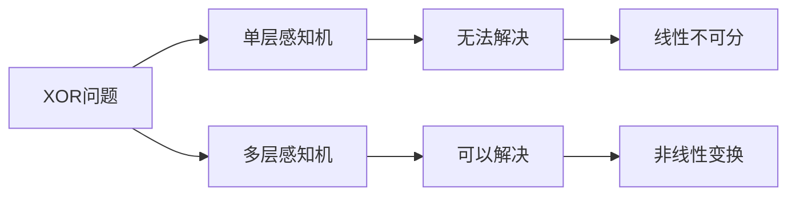
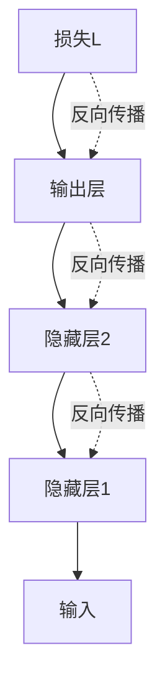
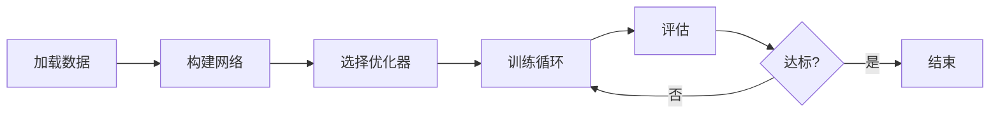

# 深度学习入门：基于 Python 的理论与实现

> **资料来源**：《深度学习入门：基于Python的理论与实现》（斋藤康毅 著）
> **适合人群**：希望从零手写神经网络的学习者
> **难度**：⭐⭐⭐（中等）

---

## 1. 为什么从零实现

本书的核心价值：**不使用 PyTorch/TensorFlow，完全用 NumPy 实现神经网络**。



**学完本书后，你将**：
- 完全理解前向传播和反向传播
- 能够用 NumPy 实现任何简单神经网络
- 对 PyTorch/TensorFlow 的底层原理有深刻理解
- 为学习 Transformer 和大模型做好准备

---

## 2. 感知机到神经网络

### 2.1 感知机（Perceptron）

最简单的线性分类器：

```python
import numpy as np

def perceptron(x, w, b):
    """感知机
    x: 输入向量
    w: 权重向量
    b: 偏置
    """
    tmp = np.sum(w * x) + b
    return 1 if tmp > 0 else 0
```

**感知机的局限**：只能解决线性可分问题（如 AND、OR），无法解决 XOR。

### 2.2 多层感知机解决 XOR



```python
# XOR 的 MLP 实现
import numpy as np

def sigmoid(x):
    return 1 / (1 + np.exp(-x))

# 网络结构：2输入 -> 2隐藏 -> 1输出
W1 = np.array([[0.1, 0.3], [0.2, 0.4]])  # 输入→隐藏
b1 = np.array([0.1, 0.2])
W2 = np.array([[0.1], [0.2]])             # 隐藏→输出
b2 = np.array([0.1])

def forward(x):
    z1 = np.dot(x, W1) + b1
    a1 = sigmoid(z1)
    z2 = np.dot(a1, W2) + b2
    y = sigmoid(z2)
    return y

# 测试 XOR
test_cases = [
    np.array([0, 0]),  # → 0
    np.array([1, 0]),  # → 1
    np.array([0, 1]),  # → 1
    np.array([1, 1]),  # → 0
]
```

---

## 3. 神经网络学习

### 3.1 损失函数

**均方误差（MSE）**：
$$L = \frac{1}{2} \sum (y_k - t_k)^2$$

**交叉熵误差**：
$$L = -\sum t_k \log(y_k)$$

```python
def mean_squared_error(y, t):
    return 0.5 * np.sum((y - t)**2)

def cross_entropy_error(y, t):
    delta = 1e-7  # 防止log(0)
    return -np.sum(t * np.log(y + delta))
```

### 3.2 数值微分

理解梯度的直观方法：

```python
def numerical_diff(f, x):
    """数值微分"""
    h = 1e-4
    return (f(x + h) - f(x - h)) / (2 * h)

# 示例：f(x) = x^2 在 x=3 处的导数
def function_1(x):
    return x**2

print(numerical_diff(function_1, 3.0))  # ≈ 6.0
```

**问题**：数值微分需要计算 $O(n)$ 次前向传播（$n$ 是参数数量），对于大网络太慢。

### 3.3 误差反向传播

**核心思想**：用链式法则高效计算梯度



**链式法则**：
$$\frac{\partial L}{\partial x} = \frac{\partial L}{\partial y} \cdot \frac{\partial y}{\partial x}$$

**计算图示例**：

```
        x
        │
        ▼
    ┌───────┐
    │  ×    │───► z = x * y
    │       │      │
    └───┬───┘      │
        │ y        ▼
                   L = z + c
                   │
                   ▼
                   c

反向传播：
∂L/∂z = 1
∂L/∂x = ∂L/∂z * ∂z/∂x = 1 * y = y
∂L/∂y = ∂L/∂z * ∂z/∂y = 1 * x = x
```

### 3.4 完整反向传播实现

```python
class Sigmoid:
    def __init__(self):
        self.out = None

    def forward(self, x):
        out = 1 / (1 + np.exp(-x))
        self.out = out
        return out

    def backward(self, dout):
        # sigmoid 的导数 = sigmoid(x) * (1 - sigmoid(x))
        return dout * self.out * (1.0 - self.out)

class Affine:
    """全连接层（矩阵乘法 + 偏置）"""
    def __init__(self, W, b):
        self.W = W
        self.b = b
        self.x = None
        self.dW = None
        self.db = None

    def forward(self, x):
        self.x = x
        out = np.dot(x, self.W) + self.b
        return out

    def backward(self, dout):
        dx = np.dot(dout, self.W.T)
        self.dW = np.dot(self.x.T, dout)
        self.db = np.sum(dout, axis=0)
        return dx
```

---

## 4. 训练技巧

### 4.1 SGD 实现

```python
class SGD:
    def __init__(self, lr=0.01):
        self.lr = lr

    def update(self, params, grads):
        for key in params.keys():
            params[key] -= self.lr * grads[key]
```

**问题**：SGD 在梯度方向变化剧烈的区域（如峡谷）会震荡。

### 4.2 Momentum

```python
class Momentum:
    def __init__(self, lr=0.01, momentum=0.9):
        self.lr = lr
        self.momentum = momentum
        self.v = None

    def update(self, params, grads):
        if self.v is None:
            self.v = {}
            for key, val in params.items():
                self.v[key] = np.zeros_like(val)

        for key in params.keys():
            self.v[key] = self.momentum * self.v[key] - self.lr * grads[key]
            params[key] += self.v[key]
```

**物理直觉**：像小球在损失平面上滚动，有惯性。

### 4.3 学习率衰减

```python
# 逐步衰减
lr = initial_lr * (decay_rate ** (epoch // decay_steps))

# 余弦衰减（大模型常用）
lr = min_lr + 0.5 * (max_lr - min_lr) * (1 + cos(pi * epoch / total_epochs))
```

### 4.4 权重初始化

**为什么不能初始化为 0？**
- 所有神经元学到相同的特征

**Xavier 初始化**：
$$W \sim N(0, \sqrt{\frac{2}{n_{in} + n_{out}}})$$

**He 初始化（ReLU 专用）**：
$$W \sim N(0, \sqrt{\frac{2}{n_{in}}})$$

```python
def he_init(input_size, output_size):
    return np.random.randn(input_size, output_size) * np.sqrt(2.0 / input_size)
```

---

## 5. 卷积神经网络（CNN）

### 5.1 卷积操作

```python
def conv2d_simple(x, W, b, stride=1, pad=0):
    """简化版 2D 卷积
    x: 输入 (N, C, H, W)
    W: 滤波器 (FN, C, FH, FW)
    """
    FN, C, FH, FW = W.shape
    N, C, H, W = x.shape

    # 填充
    x_padded = np.pad(x, [(0,0), (0,0), (pad,pad), (pad,pad)], 'constant')

    # 输出尺寸
    out_h = (H + 2*pad - FH) // stride + 1
    out_w = (W + 2*pad - FW) // stride + 1

    out = np.zeros((N, FN, out_h, out_w))

    for n in range(N):
        for fn in range(FN):
            for oh in range(out_h):
                for ow in range(out_w):
                    h_start = oh * stride
                    w_start = ow * stride
                    region = x_padded[n, :, h_start:h_start+FH, w_start:w_start+FW]
                    out[n, fn, oh, ow] = np.sum(region * W[fn]) + b[fn]

    return out
```

**卷积的核心思想**：
- 局部连接：每个神经元只连接输入的一小块区域
- 权值共享：同一滤波器在整张图上滑动
- 平移等变性：目标移动，检测结果相应移动

### 5.2 池化层

```python
def max_pooling(x, pool_size=2, stride=2):
    N, C, H, W = x.shape
    out_h = H // stride
    out_w = W // stride
    out = np.zeros((N, C, out_h, out_w))

    for n in range(N):
        for c in range(C):
            for oh in range(out_h):
                for ow in range(out_w):
                    region = x[n, c, oh*stride:oh*stride+pool_size,
                                      ow*stride:ow*stride+pool_size]
                    out[n, c, oh, ow] = np.max(region)
    return out
```

**池化的作用**：
- 降维，减少计算量
- 平移不变性：小幅位置变化不影响输出

---

## 6. 完整训练流程



```python
# 训练循环模板
for epoch in range(num_epochs):
    for batch in dataloader:
        x, t = batch

        # 前向传播
        y = model.forward(x)

        # 计算损失
        loss = cross_entropy_error(y, t)

        # 反向传播
        model.backward()

        # 参数更新
        optimizer.update(model.params, model.grads)

    # 评估
    accuracy = evaluate(model, test_data)
    print(f"Epoch {epoch}: accuracy = {accuracy}")
```

---

## 7. 学习建议

1. **逐章敲代码**：不要复制粘贴，手写每行代码
2. **画计算图**：反向传播的核心是计算图，多画图
3. **修改超参数**：观察学习率、批次大小对结果的影响
4. **对比框架实现**：学完后看 PyTorch 对应实现，理解框架封装了什么
5. **向 Transformer 过渡**：理解基础后，开始学习 Self-Attention 机制
