# 李宏毅深度学习教程

> **资料来源**：Datawhale 整理《李宏毅深度学习教程 LeeDL Tutorial》
> **适合人群**：喜欢中文讲解、需要视频辅助的学习者
> **难度**：⭐⭐⭐（中等）

---

## 1. 为什么推荐李宏毅

李宏毅是台湾大学教授，其《机器学习》课程是**中文世界最受欢迎的深度学习入门课**：

- **幽默风趣**：用宝可梦等有趣例子讲解复杂概念
- **中文讲解**：母语学习，效率更高
- **内容全面**：覆盖深度学习的绝大多数领域
- **公式详细**：涉及公式的知识点都给出详细推导

---

## 2. 核心内容精讲

### 2.1 回归与分类基础

**回归 vs 分类**：

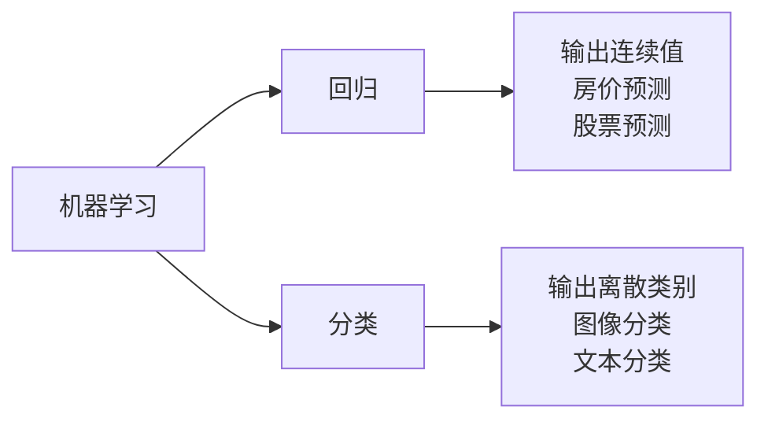

**线性回归的梯度下降可视化**：

```
损失函数等高线图：
        w
        ↑
        │    ╭────╮
        │   ╱      ╲
        │  ╱   ●    ╲
        │ ╱   最优   ╲
        │╱            ╲
        └──────────────→ b
```

**分类的关键：Softmax**

为什么分类不直接用回归？
- 回归输出范围无界，分类需要概率（和为 1）
- Softmax 将任意实数转换为概率分布

### 2.2 反向传播详解

李宏毅的讲解特色：**用计算图和链式法则逐步推导**

```mermaid
graph TB
    A[输入 x] --> B[线性变换 z=wx+b]
    B --> C[激活 a=sigmoid(z)]
    C --> D[输出 y]
    D --> E[损失 L]

    E -.->|∂L/∂y| D
    D -.->|∂y/∂a| C
    C -.->|∂a/∂z| B
    B -.->|∂z/∂w| A
```

**核心步骤**：
1. 前向传播：计算每层的输出
2. 反向传播：从损失开始，逐层计算梯度
3. 参数更新：用梯度下降更新权重

### 2.3 卷积神经网络（CNN）

**李宏毅的 CNN 讲解特色**：

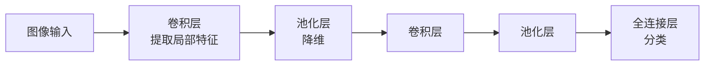

**关键洞察**：
- 卷积 = 滤波器在图像上滑动检测模式
- 浅层检测边缘/颜色，深层检测复杂模式（如眼睛、轮胎）
- 权值共享大幅减少参数量

**经典架构对比**：

| 架构 | 特点 | 参数量 |
|------|------|--------|
| LeNet (1998) | 5层，手写数字 | 60K |
| AlexNet (2012) | 8层，ReLU+Dropout | 60M |
| VGGNet (2014) | 16-19层，3×3小卷积 | 138M |
| ResNet (2015) | 残差连接，可训练 152+ 层 | 60M |

### 2.4 循环神经网络（RNN）

**RNN 的核心思想**：引入"记忆"，处理序列数据

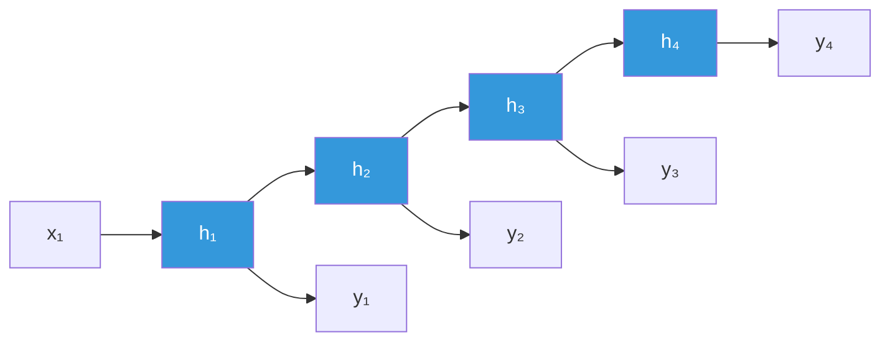

**公式**：
$$h_t = f(W_{hh} h_{t-1} + W_{xh} x_t + b_h)$$
$$y_t = g(W_{hy} h_t + b_y)$$

**RNN 的问题**：

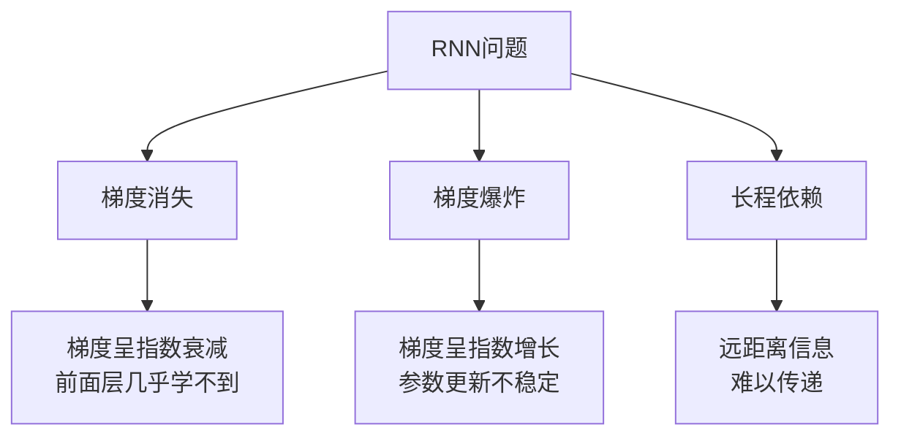

**解决方案：LSTM**

LSTM 引入"门控机制"：
- **遗忘门**：决定丢弃多少旧信息
- **输入门**：决定加入多少新信息
- **输出门**：决定输出什么

```python
# LSTM 核心逻辑（简化）
def lstm_step(x, h_prev, c_prev):
    # 遗忘门
    f = sigmoid(W_f @ [h_prev, x] + b_f)
    # 输入门
    i = sigmoid(W_i @ [h_prev, x] + b_i)
    # 候选记忆
    c_tilde = tanh(W_c @ [h_prev, x] + b_c)
    # 更新记忆
    c = f * c_prev + i * c_tilde
    # 输出门
    o = sigmoid(W_o @ [h_prev, x] + b_o)
    # 隐藏状态
    h = o * tanh(c)
    return h, c
```

### 2.5 Transformer（重点）

李宏毅课程中 Transformer 是**最核心章节**，直接衔接大模型。

**Self-Attention 的直觉**：

```
句子："我 喜欢 深度 学习"

每个词都要看其他所有词，决定"关注"谁：

"我" → 关注"喜欢"（主谓关系）
"深度" → 关注"学习"（修饰关系）
```

**Q/K/V 的解释**：

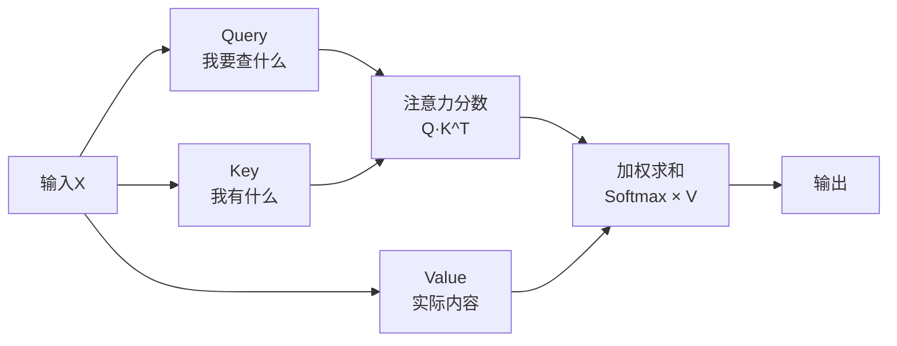

**详细公式**：

$$Attention(Q, K, V) = softmax(\frac{QK^T}{\sqrt{d_k}})V$$

**除以 $\sqrt{d_k}$ 的原因**：防止点积过大导致 Softmax 梯度消失。

**Multi-Head Attention**：

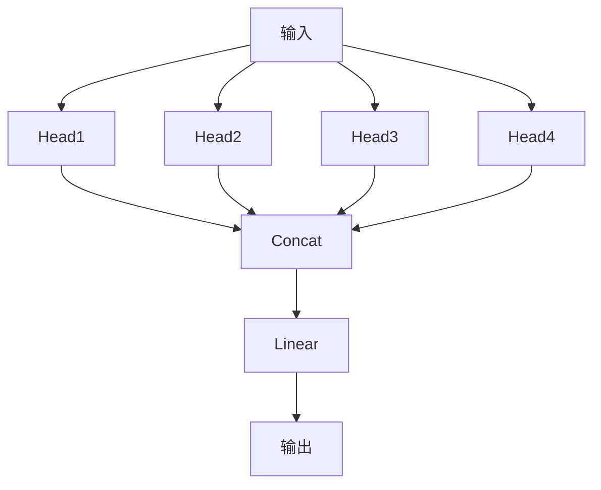

- 多个头学习不同的"关注模式"
- 如：一个头学语法关系，一个头学语义关系

---

## 3. 生成模型

### 3.1 VAE（变分自编码器）

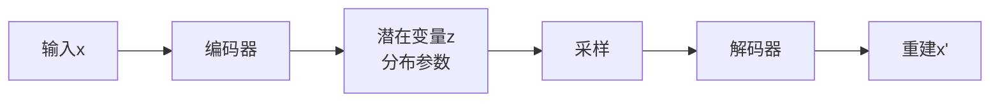

**损失函数**：
$$L = \underbrace{\|x - x'\|^2}_{重建损失} + \underbrace{D_{KL}(q(z|x) \| p(z))}_{KL散度}$$

### 3.2 GAN（生成对抗网络）

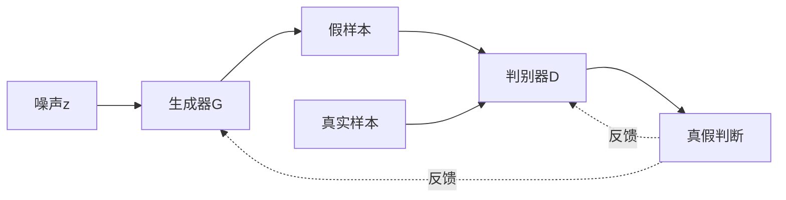

**博弈过程**：
- G 试图骗过 D
- D 试图区分真假
- 达到纳什均衡时，G 生成以假乱真的样本

### 3.3 Diffusion Model（扩散模型）

**核心思想**：逐步加噪再逐步去噪

```mermaid
graph LR
    A[清晰图像x₀] --> B[加噪x₁]
    B --> C[加噪x₂]
    C --> D[...]
    D --> E[纯噪声x_T]

    E --> F[去噪x_{T-1}]
    F --> G[去噪x_{T-2}]
    G --> H[...]
    H --> I[清晰图像]
```

**与大模型的关联**：
- DALL-E、Stable Diffusion 的底层技术
- 扩散模型 + Transformer 是当前图像生成主流

---

## 4. 自监督学习与大模型

### 4.1 BERT（Encoder）

**训练任务**：

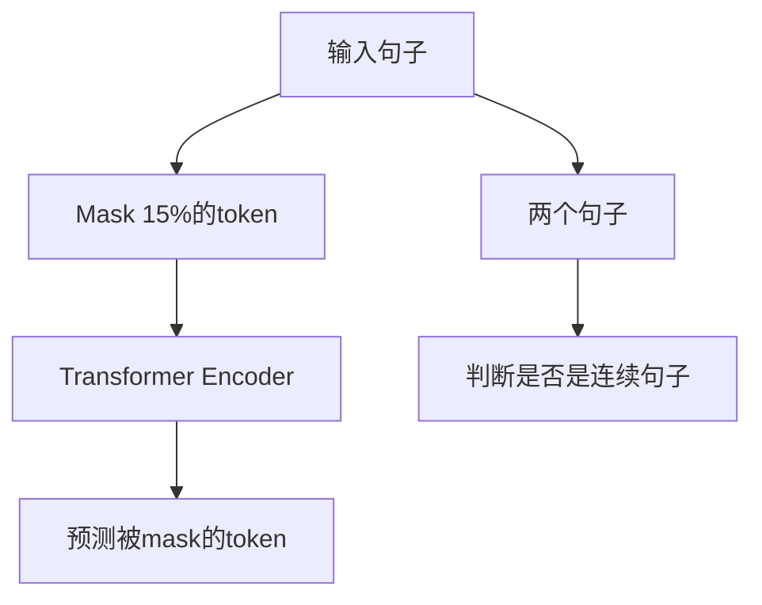

**特点**：
- 双向编码：每个词都能看到左右上下文
- 适合：文本理解任务（分类、NER、问答）

### 4.2 GPT（Decoder）

**训练任务**：自回归预测下一个 token

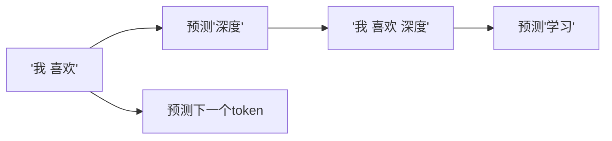

**特点**：
- 单向生成：只能看左边上下文
- 适合：文本生成任务

### 4.3 从 BERT/GPT 到大模型

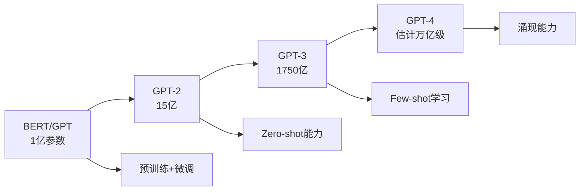

---

## 5. 学习路径建议

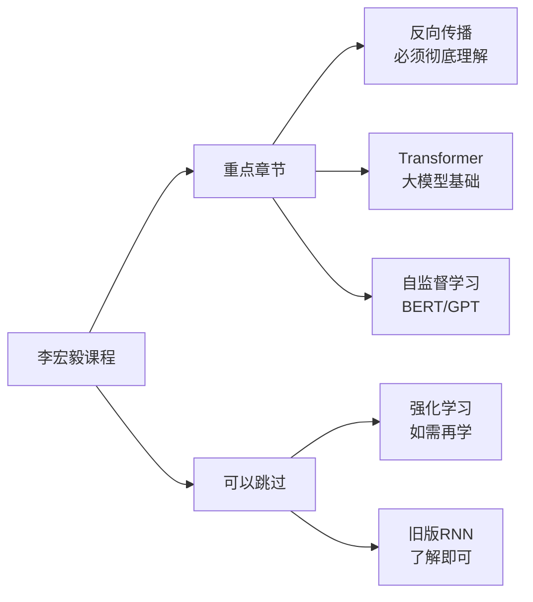

**推荐配合资料**：

| 李宏毅章节 | 配合资料 | 目的 |
|-----------|----------|------|
| 神经网络基础 | 《深度学习入门：基于Python》 | 代码实践 |
| CNN | 经典论文 + PyTorch 练习 | 图像任务 |
| Transformer | 《大模型基础》 | 衔接大模型 |
| BERT/GPT | HuggingFace 文档 | 实际使用 |
