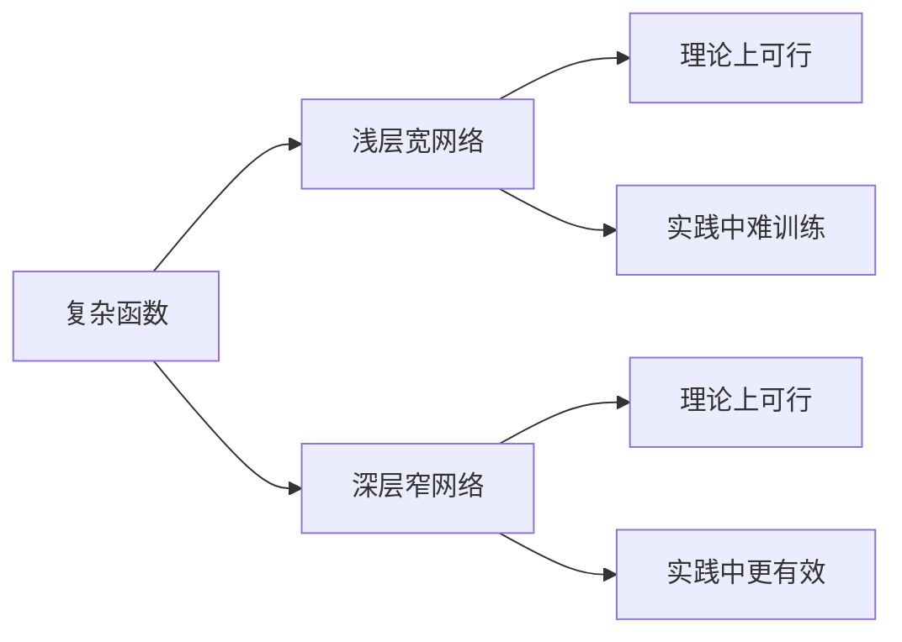
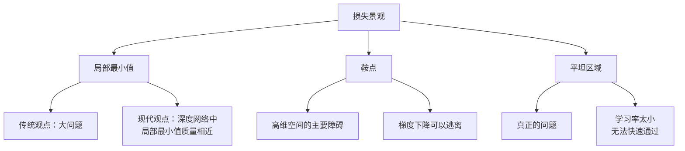
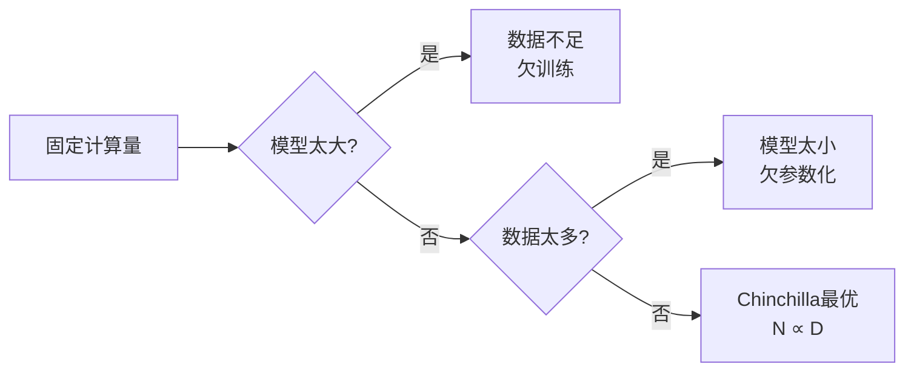
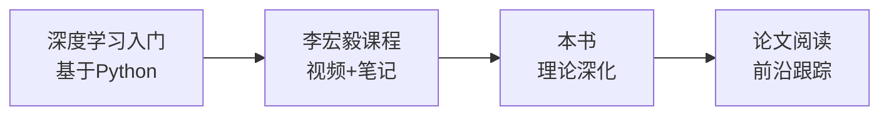

# 麻省理工：深入理解深度学习

> **资料来源**：Understanding Deep Learning (Simon J.D. Prince, MIT Press, 2025)
> **适合人群**：希望深入理解深度学习理论本质的学习者
> **难度**：⭐⭐⭐⭐（较难）

---

## 1. 书籍定位与特色

这是一本**深入讲解深度学习原理**的教材，MIT 出版，核心特色是：

- **理论深度**：不仅讲"怎么做"，更讲"为什么"
- **可视化解释**：大量高质量图表，用几何直觉解释抽象概念
- **前沿覆盖**：扩散模型、Transformer、Scaling Laws

---

## 2. 监督学习的深入理解

### 2.1 为什么深度网络能拟合任意函数？

**通用近似定理（Universal Approximation Theorem）**：

一个具有足够多隐藏单元的单隐藏层神经网络，可以以任意精度近似任何连续函数。



**深层 vs 浅层**：
- 深层网络用更少的参数表达复杂函数
- 深层网络的层次化结构与数据的层次化模式匹配

### 2.2 梯度消失与梯度爆炸的数学分析

**梯度消失的数学原因**：

对于 sigmoid 激活函数：
$$\sigma'(x) = \sigma(x)(1 - \sigma(x)) \leq \frac{1}{4}$$

反向传播时，梯度乘以多个小于 1 的数：
$$\frac{\partial L}{\partial W_1} = \frac{\partial L}{\partial W_L} \cdot \prod_{l=1}^{L-1} \sigma'(z_l) \cdot W_l$$

如果 $L=10$，每层的梯度缩放因子约为 0.25：
$$0.25^{10} \approx 10^{-6}$$

**解决方案**：

| 方案 | 原理 | 效果 |
|------|------|------|
| ReLU | 导数为 1（x>0） | 缓解梯度消失 |
| 残差连接 | 跳跃连接 | 梯度直接回传 |
| 批归一化 | 稳定每层的分布 | 稳定梯度 |
| 合适的初始化 | He/Xavier | 控制初始梯度规模 |

---

## 3. 优化景观（Optimization Landscape）

### 3.1 损失函数的形状



### 3.2 高维空间的反直觉

在高维空间中：
- **局部最小值很少**：大多数临界点是鞍点
- **鞍点可以逃离**：至少有一个方向是下降的
- **平坦最小值更好**：泛化能力更强

```
低维想象：    高维现实：
  ╭─╮           ·
 ╱   ╲         /|\
│  ●  │       / | \  鞍点（可以下降的方向很多）
 ╲   ╱       /  |  \
  ╰─╯
局部最小值（无处可去）
```

---

## 4. 生成模型深入

### 4.1 归一化流（Normalizing Flows）

**核心思想**：通过可逆变换将简单分布（如高斯）映射到复杂分布

```mermaid
graph LR
    A[简单分布<br/>z ~ N(0,I)] --> B[可逆变换f]
    B --> C[复杂分布<br/>x = f(z)]

    C -.->|密度计算| D[p(x) = p(z)|det(J)|⁻¹]
```

**优势**：精确似然计算
**局限**：需要可逆架构，表达能力受限

### 4.2 扩散模型的数学原理

**前向过程（加噪）**：

$$q(x_t | x_{t-1}) = N(x_t; \sqrt{1-\beta_t}x_{t-1}, \beta_t I)$$

**逆向过程（去噪）**：

$$p_\theta(x_{t-1}|x_t) = N(x_{t-1}; \mu_\theta(x_t, t), \Sigma_\theta(x_t, t))$$

**训练目标**：预测噪声

$$L = E_{x_0, \epsilon, t}[\|\epsilon - \epsilon_\theta(x_t, t)\|^2]$$

**与大模型的关联**：
- DALL-E 3、Stable Diffusion 3 使用 Transformer 作为噪声预测网络
- 扩散模型 + LLM = 文本到图像生成

---

## 5. Transformer 的深入分析

### 5.1 注意力机制的数学本质

**Softmax 注意力 = 可学习的核方法**

$$Attention(Q, K, V) = \sum_j \frac{\exp(q_i^T k_j)}{\sum_l \exp(q_i^T k_l)} v_j$$

这类似于核密度估计，其中 $q_i^T k_j$ 定义了输入之间的相似度。

### 5.2 位置编码的几何解释

**正弦位置编码**：

$$PE_{(pos, 2i)} = \sin(pos / 10000^{2i/d})$$
$$PE_{(pos, 2i+1)} = \cos(pos / 10000^{2i/d})$$

**为什么这样设计？**


对于位置 $pos+k$ 的编码，可以通过位置 $pos$ 的编码线性变换得到：

$$\begin{bmatrix} \sin(w \cdot (pos+k)) \\ \cos(w \cdot (pos+k)) \end{bmatrix} = \begin{bmatrix} \cos(wk) & \sin(wk) \\ -\sin(wk) & \cos(wk) \end{bmatrix} \begin{bmatrix} \sin(w \cdot pos) \\ \cos(w \cdot pos) \end{bmatrix}$$

这解释了为什么 Transformer 能够理解相对位置关系。

### 5.3 自注意力的计算复杂度

```mermaid
graph LR
    A[序列长度n] --> B[自注意力<br/>O(n²d)]
    A --> C[卷积<br/>O(nkd)]
    A --> D[RNN<br/>O(nd²)]

    B --> B1[长序列瓶颈]
    C --> C1[局部感受野]
    D --> D1[顺序计算]
```

**长序列解决方案**：
- Sparse Attention：只关注部分位置
- Linear Attention：将 Softmax 换成核函数，降低复杂度
- FlashAttention：IO-aware 算法，减少内存访问

---

## 6. 大模型的 Scaling Laws

### 6.1 幂律关系

$$L(N, D) = \frac{A}{N^\alpha} + \frac{B}{D^\beta} + L_\infty$$

**含义**：
- 增加模型参数量 $N$ 可以降低损失
- 增加训练数据量 $D$ 也可以降低损失
- 两者需要**同步增长**

### 6.2 Chinchilla 最优



**Chinchilla 法则**：
- 最优参数量 $N$ 与数据量 $D$ 成比例
- 具体地：$D \approx 20N$（token 数约为参数量的 20 倍）
- 许多大模型实际上是"数据饥饿"的

---

## 7. 阅读建议

### 7.1 重点章节（与大模型直接相关）

| 章节 | 核心内容 | 重要性 |
|------|----------|--------|
| 自注意力机制 | Transformer 核心 | ⭐⭐⭐⭐⭐ |
| 位置编码 | 序列建模关键 | ⭐⭐⭐⭐⭐ |
| 正则化 | 防止过拟合 | ⭐⭐⭐⭐ |
| 优化器 | AdamW、学习率调度 | ⭐⭐⭐⭐ |
| 生成模型 | GPT 的生成原理 | ⭐⭐⭐⭐ |
| Scaling Laws | 大模型训练指导 | ⭐⭐⭐⭐⭐ |

### 7.2 学习顺序



### 7.3 面试准备

重点关注：
1. **梯度消失/爆炸的原因和解决方案**
2. **Attention 的数学本质**
3. **Scaling Laws 的幂律关系**
4. **为什么深层网络比浅层有效**
5. **扩散模型的训练目标**
