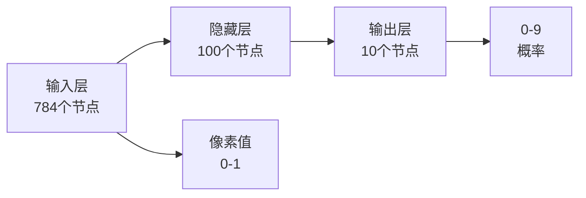
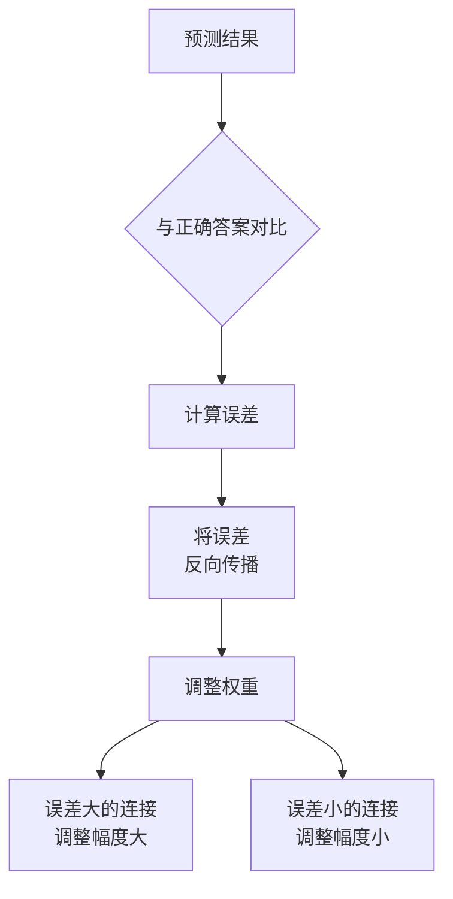
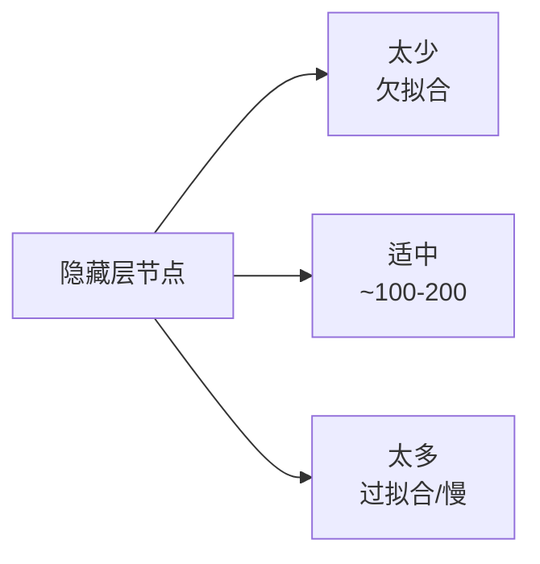
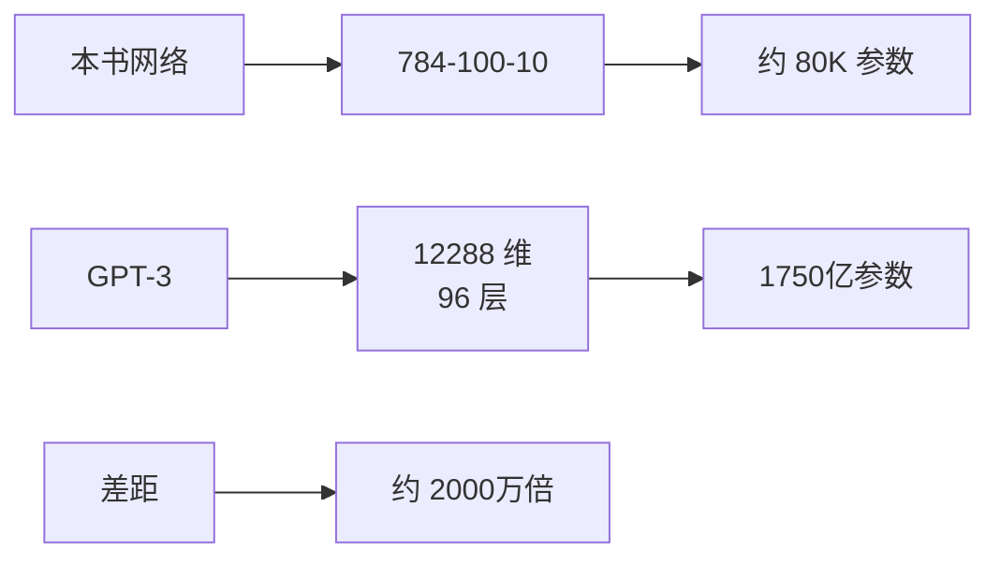

# Python 神经网络编程

> **资料来源**：Make Your Own Neural Network（Tariq Rashid 著）
> **适合人群**：完全零基础，希望用最简单方式理解神经网络
> **难度**：⭐⭐（容易）

---

## 1. 为什么从这本书开始

这是**最简单的神经网络入门书**，只需要高中数学水平。


**学完本书你将**：
- 完全理解神经网络是什么
- 亲手实现一个能识别手写数字的神经网络
- 对反向传播有直观的理解（而非复杂的数学推导）

---

## 2. 神经网络的本质

### 2.1 用极简语言解释

神经网络 = **多层可调参数的函数**

```
输入（784个像素） → [隐藏层处理] → 输出（10个数字概率）

就像流水线：
原材料 → 工位1加工 → 工位2加工 → 成品
```

### 2.2 三层结构



**为什么是 784 → 100 → 10？**
- 784：28×28 手写数字图像的像素数
- 100：隐藏层节点数（可调超参数）
- 10：0-9 共 10 个数字类别

---

## 3. 信号前向传播

### 3.1 单神经元的计算

```python
import numpy as np

class NeuralNetwork:
    def __init__(self, inputnodes, hiddennodes, outputnodes, learningrate):
        self.inodes = inputnodes
        self.hnodes = hiddennodes
        self.onodes = outputnodes

        # 初始化权重（正态分布）
        self.wih = np.random.normal(0.0, pow(self.hnodes, -0.5),
                                     (self.hnodes, self.inodes))
        self.who = np.random.normal(0.0, pow(self.onodes, -0.5),
                                     (self.onodes, self.hnodes))

        self.lr = learningrate

        # Sigmoid 激活函数
        self.activation_function = lambda x: 1 / (1 + np.exp(-x))

    def forward(self, inputs_list):
        # 1. 输入层到隐藏层
        inputs = np.array(inputs_list, ndmin=2).T
        hidden_inputs = np.dot(self.wih, inputs)
        hidden_outputs = self.activation_function(hidden_inputs)

        # 2. 隐藏层到输出层
        final_inputs = np.dot(self.who, hidden_outputs)
        final_outputs = self.activation_function(final_inputs)

        return final_outputs
```

### 3.2 矩阵运算的优势

```
不使用矩阵：   使用矩阵：
for i in range(100):     np.dot(W, x)
    for j in range(784):
        z[i] += W[i][j] * x[j]
        
矩阵运算不仅代码简洁，而且可以利用硬件加速（GPU）
```

---

## 4. 反向传播的直观理解

### 4.1 核心思想：误差分配



**类比**：

想象你在玩"蒙眼贴鼻子"游戏：
- 小朋友说"偏左了"（误差信息）
- 你根据反馈调整位置（权重更新）
- 偏得越多，调整越大（梯度大小）

### 4.2 关键公式（简化版）

**输出层误差**：
$$error_{output} = target - output$$

**隐藏层误差**（反向传播的核心）：
$$error_{hidden} = W_{hidden\_output}^T \cdot error_{output}$$

**权重更新**：
$$\Delta W = learning\_rate \times error \times output_{previous} \times (1 - output_{previous})$$

### 4.3 完整训练代码

```python
def train(self, inputs_list, targets_list):
    # 前向传播
    inputs = np.array(inputs_list, ndmin=2).T
    targets = np.array(targets_list, ndmin=2).T

    hidden_inputs = np.dot(self.wih, inputs)
    hidden_outputs = self.activation_function(hidden_inputs)

    final_inputs = np.dot(self.who, hidden_outputs)
    final_outputs = self.activation_function(final_inputs)

    # 反向传播
    output_errors = targets - final_outputs
    hidden_errors = np.dot(self.who.T, output_errors)

    # 更新权重
    self.who += self.lr * np.dot(
        (output_errors * final_outputs * (1.0 - final_outputs)),
        hidden_outputs.T
    )
    self.wih += self.lr * np.dot(
        (hidden_errors * hidden_outputs * (1.0 - hidden_outputs)),
        inputs.T
    )
```

---

## 5. MNIST 手写数字识别

### 5.1 数据准备

```python
# MNIST 数据格式
# 每行：label, pixel1, pixel2, ..., pixel784
# label: 0-9
# pixels: 0-255（灰度值）

def prepare_data(record):
    all_values = record.split(',')
    # 输入：归一化到 0.01-1.0
    inputs = (np.asfarray(all_values[1:]) / 255.0 * 0.99) + 0.01
    # 目标：one-hot 编码
    targets = np.zeros(10) + 0.01
    targets[int(all_values[0])] = 0.99
    return inputs, targets
```

### 5.2 训练与测试

```python
# 创建网络
nn = NeuralNetwork(inputnodes=784, hiddennodes=100,
                   outputnodes=10, learningrate=0.3)

# 训练
for record in training_data:
    inputs, targets = prepare_data(record)
    nn.train(inputs, targets)

# 测试
correct = 0
for record in test_data:
    inputs, _ = prepare_data(record)
    outputs = nn.forward(inputs)
    predicted = np.argmax(outputs)
    actual = int(record.split(',')[0])
    if predicted == actual:
        correct += 1

accuracy = correct / len(test_data)
print(f"准确率: {accuracy:.2%}")  # 通常可达 95%+
```

---

## 6. 超参数调优

### 6.1 隐藏层节点数



- 太少：模型容量不足，无法学习复杂模式
- 太多：可能过拟合，训练变慢
- 经验：输入和输出的几何平均数，或试错

### 6.2 学习率

| 学习率 | 效果 |
|--------|------|
| 太大（如 1.0） | 震荡不收敛 |
| 适中（如 0.3） | 稳定收敛 |
| 太小（如 0.001） | 收敛极慢 |

```
损失
 ↑    ╲      大学习率
 │     ╲    ╱ 震荡
 │      ╲  ╱
 │       ╲╱
 │        ╲___  适中学习率
 │            ╲ 平滑收敛
 │             ╲___
 └──────────────────→ 迭代次数
      
      小学习率
      ────────────→ 几乎不动
```

### 6.3 迭代次数（Epochs）

- 太少：模型未充分学习
- 太多：可能过拟合训练数据
- 技巧：监控验证集准确率，早停

---

## 7. 从本书到大模型

### 7.1 概念映射

| 本书概念 | 大模型中的对应 |
|----------|----------------|
| 输入层 784 节点 | Token Embedding |
| 隐藏层 100 节点 | Transformer 的 d_model（如 4096/8192） |
| Sigmoid 激活 | GELU/SwiGLU |
| 输出层 10 节点 | 词表大小（如 32000/100000+） |
| 权重更新 | AdamW 优化器 |
| 一次前向+反向 | 一个训练 step |

### 7.2 规模对比



**但核心原理相同**：
- 都是多层神经网络
- 都用反向传播训练
- 都通过调整权重来减少误差

### 7.3 下一步学习


---

## 8. 学习建议

1. **1-2 天通读**：本书非常薄，快速建立直觉
2. **运行代码**：亲手实现 MNIST 识别，观察结果
3. **修改超参数**：改变隐藏层节点数、学习率，看效果变化
4. **可视化权重**：训练后可视化隐藏层权重，看学到了什么模式
5. **不要停留**：理解核心概念后，尽快进入更系统的学习
