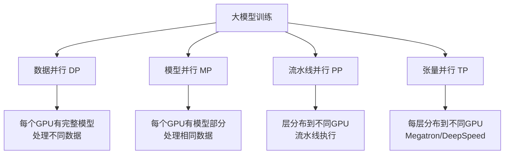

# PyTorch 深度学习实践（英文书籍精要）

> **资料来源**：多本英文 PyTorch 书籍精华
> **适合人群**：希望深入理解 PyTorch 细节的读者
> **难度**：⭐⭐⭐⭐（较难）

---

## 1. 推荐书籍列表

| 书名 | 重点内容 | 难度 |
|------|----------|------|
| Programming PyTorch for Deep Learning | 从入门到生产部署 | ⭐⭐⭐ |
| Deep Learning with PyTorch | PyTorch 官方推荐 | ⭐⭐⭐⭐ |
| PyTorch Deep Learning Hands-On | 项目驱动 | ⭐⭐⭐ |
| Fastai and PyTorch | fast.ai 课程配套 | ⭐⭐⭐ |

**何时阅读**：
- 中文教程已掌握，希望深入框架细节
- 准备阅读英文论文的代码实现
- 需要了解生产环境的部署和优化

---

## 2. 自定义组件

### 2.1 自定义 Dataset

```python
from torch.utils.data import Dataset

class TextDataset(Dataset):
    def __init__(self, texts, labels, tokenizer, max_length=512):
        self.texts = texts
        self.labels = labels
        self.tokenizer = tokenizer
        self.max_length = max_length

    def __len__(self):
        return len(self.texts)

    def __getitem__(self, idx):
        text = self.texts[idx]
        label = self.labels[idx]

        encoding = self.tokenizer(
            text,
            max_length=self.max_length,
            padding='max_length',
            truncation=True,
            return_tensors='pt'
        )

        return {
            'input_ids': encoding['input_ids'].squeeze(),
            'attention_mask': encoding['attention_mask'].squeeze(),
            'label': torch.tensor(label, dtype=torch.long)
        }
```

**关键设计模式**：
- `__init__`：加载数据和预处理
- `__len__`：返回数据集大小
- `__getitem__`：返回单个样本

### 2.2 自定义 Loss Function

```python
class FocalLoss(nn.Module):
    """处理类别不平衡的损失函数"""
    def __init__(self, alpha=1, gamma=2):
        super().__init__()
        self.alpha = alpha
        self.gamma = gamma

    def forward(self, inputs, targets):
        ce_loss = F.cross_entropy(inputs, targets, reduction='none')
        pt = torch.exp(-ce_loss)
        focal_loss = self.alpha * (1 - pt) ** self.gamma * ce_loss
        return focal_loss.mean()
```

### 2.3 自定义 Optimizer

```python
class SGDP(torch.optim.Optimizer):
    """带动量和权重衰减的 SGD"""
    def __init__(self, params, lr=0.01, momentum=0.9, weight_decay=0):
        defaults = dict(lr=lr, momentum=momentum, weight_decay=weight_decay)
        super().__init__(params, defaults)

    def step(self, closure=None):
        for group in self.param_groups:
            for p in group['params']:
                if p.grad is None:
                    continue

                grad = p.grad.data
                state = self.state[p]

                if len(state) == 0:
                    state['momentum_buffer'] = torch.zeros_like(p.data)

                buf = state['momentum_buffer']
                buf.mul_(group['momentum']).add_(grad)
                p.data.add_(buf, alpha=-group['lr'])
```

---

## 3. Hook 和回调机制

### 3.1 Forward/Backward Hook

```python
# 注册 hook 查看中间层输出
activation = {}
def get_activation(name):
    def hook(model, input, output):
        activation[name] = output.detach()
    return hook

# 使用
model.layer1.register_forward_hook(get_activation('layer1'))
output = model(input)
print(activation['layer1'].shape)
```

**应用场景**：
- 特征可视化（CNN 的 feature map）
- 梯度分析（检查梯度消失）
- 中间层监控

### 3.2 Callback 系统

```python
class Trainer:
    def __init__(self, model, callbacks=None):
        self.model = model
        self.callbacks = callbacks or []

    def fit(self, train_loader, epochs):
        for epoch in range(epochs):
            self._call_callbacks('on_epoch_begin', epoch)

            for batch in train_loader:
                self._call_callbacks('on_batch_begin', batch)
                # 训练步骤...
                self._call_callbacks('on_batch_end', loss)

            self._call_callbacks('on_epoch_end', epoch)

    def _call_callbacks(self, event, *args):
        for callback in self.callbacks:
            getattr(callback, event, lambda *a: None)(*args)

# 使用示例
class EarlyStopping:
    def __init__(self, patience=3):
        self.patience = patience
        self.best_loss = float('inf')
        self.counter = 0

    def on_epoch_end(self, val_loss):
        if val_loss < self.best_loss:
            self.best_loss = val_loss
            self.counter = 0
        else:
            self.counter += 1
            if self.counter >= self.patience:
                raise StopTraining("Early stopping triggered")
```

---

## 4. 生产部署

### 4.1 TorchScript

将动态图模型转换为可序列化的中间表示：

```python
import torch

class MyModel(nn.Module):
    def forward(self, x):
        return x * 2

model = MyModel()
model.eval()

# 方法1: Tracing
example_input = torch.rand(1, 3, 224, 224)
traced_model = torch.jit.trace(model, example_input)
traced_model.save("model_traced.pt")

# 方法2: Scripting（支持控制流）
scripted_model = torch.jit.script(model)
scripted_model.save("model_scripted.pt")

# 加载
loaded_model = torch.jit.load("model_traced.pt")
```

### 4.2 ONNX 导出

```python
import torch.onnx

torch.onnx.export(
    model,
    example_input,
    "model.onnx",
    input_names=['input'],
    output_names=['output'],
    dynamic_axes={'input': {0: 'batch_size'},
                  'output': {0: 'batch_size'}}
)
```

**ONNX 的优势**：
- 跨框架（PyTorch → TensorRT/OpenVINO）
- 推理优化（图优化、算子融合）
- 多平台部署（服务器/移动端/边缘设备）

### 4.3 TensorRT 优化

```python
import tensorrt as trt

# 从 ONNX 构建 TensorRT 引擎
logger = trt.Logger(trt.Logger.WARNING)
builder = trt.Builder(logger)
network = builder.create_network(1 << int(trt.NetworkDefinitionCreationFlag.EXPLICIT_BATCH))
parser = trt.OnnxParser(network, logger)

with open("model.onnx", "rb") as f:
    parser.parse(f.read())

config = builder.create_builder_config()
config.max_workspace_size = 1 << 30  # 1GB
engine = builder.build_engine(network, config)

# 序列化保存
with open("model.trt", "wb") as f:
    f.write(engine.serialize())
```

**TensorRT 的优化手段**：
- 层融合（Layer Fusion）
- 精度校准（FP16/INT8）
- 内核自动调优
- 动态张量内存

---

## 5. 大模型训练专题

### 5.1 混合精度训练

```python
from torch.cuda.amp import autocast, GradScaler

scaler = GradScaler()

for data, target in dataloader:
    optimizer.zero_grad()

    with autocast():  # 自动选择 FP16/FP32
        output = model(data)
        loss = criterion(output, target)

    scaler.scale(loss).backward()
    scaler.step(optimizer)
    scaler.update()
```

**原理**：
- 前向/反向传播用 FP16（快、省显存）
- 权重更新用 FP32（精度保证）
- Loss Scaling：防止 FP16 梯度下溢

### 5.2 梯度累积

```python
# 模拟大批量训练（显存不够时）
accumulation_steps = 4

for i, (data, target) in enumerate(dataloader):
    output = model(data)
    loss = criterion(output, target) / accumulation_steps
    loss.backward()

    if (i + 1) % accumulation_steps == 0:
        optimizer.step()
        optimizer.zero_grad()
```

### 5.3 分布式训练

```python
import torch.distributed as dist
from torch.nn.parallel import DistributedDataParallel as DDP

# 初始化
dist.init_process_group("nccl")
local_rank = int(os.environ["LOCAL_RANK"])
torch.cuda.set_device(local_rank)

# 包装模型
model = DDP(model, device_ids=[local_rank])

# 使用 DistributedSampler
from torch.utils.data.distributed import DistributedSampler
sampler = DistributedSampler(dataset)
dataloader = DataLoader(dataset, sampler=sampler, batch_size=batch_size)
```

**并行策略**：



---

## 6. 模型量化与压缩

### 6.1 动态量化

```python
import torch.quantization

model_int8 = torch.quantization.quantize_dynamic(
    model,
    {nn.Linear},  # 只量化 Linear 层
    dtype=torch.qint8
)

# 模型大小减半，CPU 推理加速
```

### 6.2 静态量化

```python
model.qconfig = torch.quantization.get_default_qconfig('fbgemm')
torch.quantization.prepare(model, inplace=True)
# 用校准数据运行模型
torch.quantization.convert(model, inplace=True)
```

### 6.3 大模型量化（GPTQ/AWQ）

```python
# 使用 transformers + auto-gptq
from transformers import AutoModelForCausalLM

model = AutoModelForCausalLM.from_pretrained(
    "model_name",
    load_in_4bit=True,  # 4-bit 量化
    bnb_4bit_compute_dtype=torch.float16
)
```

| 量化方法 | 精度 | 速度提升 | 适用场景 |
|----------|------|----------|----------|
| FP16 | 半精度 | 2x | 通用 |
| INT8 | 8-bit | 2-4x | 推理 |
| GPTQ INT4 | 4-bit | 4x+ | 大模型推理 |
| AWQ | 4-bit | 4x+ | 激活感知，效果更好 |

---

## 7. 核心主题速查

### 7.1 大模型训练 checklist

- [ ] 使用 AdamW 优化器（不是 Adam）
- [ ] 启用混合精度训练（amp）
- [ ] 配置梯度裁剪（clip_grad_norm）
- [ ] 使用学习率预热（warmup）
- [ ] 配置梯度检查点（checkpoint）节省显存
- [ ] 使用分布式数据并行（DDP）
- [ ] 定期保存检查点
- [ ] 监控显存使用（避免 OOM）

### 7.2 部署 checklist

- [ ] 模型导出为 TorchScript 或 ONNX
- [ ] 使用 TensorRT/OpenVINO 优化
- [ ] 配置批处理推理（batch inference）
- [ ] 考虑量化压缩
- [ ] 设置服务框架（Triton/vLLM）
- [ ] 监控延迟和吞吐量
