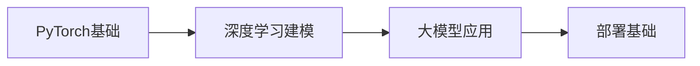
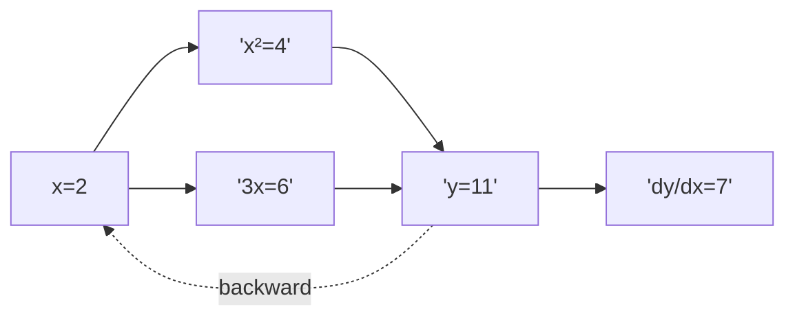
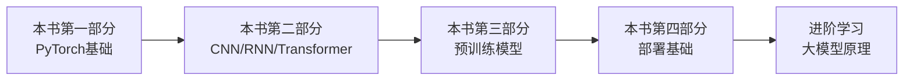

# 动手学 PyTorch 建模与应用

> **资料来源**：王国平《动手学 PyTorch 建模与应用：从深度学习到大模型》
> **适合人群**：希望从 PyTorch 基础一路学到应用大模型的读者
> **难度**：⭐⭐⭐（中等）

---

## 1. 书籍定位

本书的独特之处：**从深度学习直接延伸到大模型应用**，是一条完整的技能路径。



**核心价值**：填补了"深度学习"到"大模型"之间的 gap。

---

## 2. PyTorch 基础精要

### 2.1 张量操作

```python
import torch

# 创建张量
x = torch.tensor([[1, 2], [3, 4]])
x = torch.zeros(2, 3)
x = torch.randn(2, 3)  # 标准正态分布

# GPU 张量
x = x.cuda()           # 移到 GPU
x = x.cpu()            # 移回 CPU
x = x.to('cuda:0')     # 指定 GPU

# 关键操作
y = x.view(1, -1)      # reshape
y = x.squeeze()        # 去掉维度为1的轴
y = x.unsqueeze(0)     # 增加维度
y = x.permute(1, 0)    # 维度交换
```

### 2.2 自动求导（Autograd）

```python
x = torch.tensor([2.0], requires_grad=True)
y = x ** 2 + 3 * x + 1
y.backward()

print(x.grad)  # dy/dx = 2x + 3 = 7
```

**计算图可视化**：



### 2.3 nn.Module 构建网络

```python
class NeuralNet(nn.Module):
    def __init__(self, input_size, hidden_size, num_classes):
        super(NeuralNet, self).__init__()
        self.layer1 = nn.Linear(input_size, hidden_size)
        self.relu = nn.ReLU()
        self.dropout = nn.Dropout(0.2)
        self.layer2 = nn.Linear(hidden_size, num_classes)

    def forward(self, x):
        out = self.layer1(x)
        out = self.relu(out)
        out = self.dropout(out)
        out = self.layer2(out)
        return out

model = NeuralNet(784, 500, 10)
```

---

## 3. 深度学习建模

### 3.1 CNN 图像分类

```python
class CNN(nn.Module):
    def __init__(self):
        super(CNN, self).__init__()
        self.conv1 = nn.Conv2d(1, 32, kernel_size=3, padding=1)
        self.conv2 = nn.Conv2d(32, 64, kernel_size=3, padding=1)
        self.pool = nn.MaxPool2d(2, 2)
        self.fc1 = nn.Linear(64 * 7 * 7, 128)
        self.fc2 = nn.Linear(128, 10)
        self.dropout = nn.Dropout(0.5)

    def forward(self, x):
        x = self.pool(F.relu(self.conv1(x)))   # 28→14
        x = self.pool(F.relu(self.conv2(x)))   # 14→7
        x = x.view(-1, 64 * 7 * 7)
        x = F.relu(self.fc1(x))
        x = self.dropout(x)
        x = self.fc2(x)
        return x
```

**CNN 尺寸计算**：

```
输入: 28×28×1
Conv(3×3, padding=1): 28×28×32
Pool(2×2): 14×14×32
Conv(3×3, padding=1): 14×14×64
Pool(2×2): 7×7×64
Flatten: 3136
FC: 3136 → 128 → 10
```

### 3.2 RNN 序列建模

```python
class RNN(nn.Module):
    def __init__(self, input_size, hidden_size, num_layers, num_classes):
        super(RNN, self).__init__()
        self.hidden_size = hidden_size
        self.num_layers = num_layers
        self.lstm = nn.LSTM(input_size, hidden_size, num_layers,
                            batch_first=True, dropout=0.5)
        self.fc = nn.Linear(hidden_size, num_classes)

    def forward(self, x):
        # 初始化隐藏状态
        h0 = torch.zeros(self.num_layers, x.size(0), self.hidden_size)
        c0 = torch.zeros(self.num_layers, x.size(0), self.hidden_size)

        out, _ = self.lstm(x, (h0, c0))  # out: (batch, seq, hidden)
        out = self.fc(out[:, -1, :])      # 取最后一个时间步
        return out
```

### 3.3 Transformer 架构实现

```python
class TransformerModel(nn.Module):
    def __init__(self, vocab_size, d_model=512, nhead=8,
                 num_layers=6, dim_feedforward=2048, dropout=0.1):
        super().__init__()
        self.embedding = nn.Embedding(vocab_size, d_model)
        self.pos_encoder = PositionalEncoding(d_model, dropout)
        encoder_layers = nn.TransformerEncoderLayer(
            d_model, nhead, dim_feedforward, dropout, batch_first=True
        )
        self.transformer_encoder = nn.TransformerEncoder(encoder_layers, num_layers)
        self.fc = nn.Linear(d_model, vocab_size)

    def forward(self, src):
        src = self.embedding(src) * math.sqrt(d_model)
        src = self.pos_encoder(src)
        output = self.transformer_encoder(src)
        output = self.fc(output)
        return output

class PositionalEncoding(nn.Module):
    def __init__(self, d_model, dropout=0.1, max_len=5000):
        super().__init__()
        self.dropout = nn.Dropout(p=dropout)

        pe = torch.zeros(max_len, d_model)
        position = torch.arange(0, max_len, dtype=torch.float).unsqueeze(1)
        div_term = torch.exp(torch.arange(0, d_model, 2).float() *
                             (-math.log(10000.0) / d_model))
        pe[:, 0::2] = torch.sin(position * div_term)
        pe[:, 1::2] = torch.cos(position * div_term)
        self.register_buffer('pe', pe)

    def forward(self, x):
        x = x + self.pe[:x.size(1), :]
        return self.dropout(x)
```

---

## 4. 大模型应用

### 4.1 使用预训练语言模型

```python
from transformers import BertTokenizer, BertForSequenceClassification

# 加载预训练模型
tokenizer = BertTokenizer.from_pretrained('bert-base-chinese')
model = BertForSequenceClassification.from_pretrained(
    'bert-base-chinese',
    num_labels=2
)

# 文本编码
text = "这部电影非常精彩"
inputs = tokenizer(text, return_tensors='pt', padding=True, truncation=True)

# 推理
with torch.no_grad():
    outputs = model(**inputs)
    predictions = torch.argmax(outputs.logits, dim=-1)
```

### 4.2 模型微调

```python
from transformers import AdamW, get_linear_schedule_with_warmup

# 只训练分类头（参数高效）
for param in model.bert.parameters():
    param.requires_grad = False

# 或者使用 LoRA
from peft import LoraConfig, get_peft_model

config = LoraConfig(
    r=16,
    lora_alpha=32,
    target_modules=["query", "value"],
    lora_dropout=0.05,
    bias="none",
    task_type="SEQ_CLS"
)
model = get_peft_model(model, config)

# 训练配置
optimizer = AdamW(model.parameters(), lr=2e-5)
scheduler = get_linear_schedule_with_warmup(
    optimizer,
    num_warmup_steps=100,
    num_training_steps=1000
)

# 训练循环
model.train()
for batch in dataloader:
    optimizer.zero_grad()
    outputs = model(**batch)
    loss = outputs.loss
    loss.backward()
    optimizer.step()
    scheduler.step()
```

### 4.3 文本生成

```python
from transformers import GPT2Tokenizer, GPT2LMHeadModel

model = GPT2LMHeadModel.from_pretrained('gpt2')
tokenizer = GPT2Tokenizer.from_pretrained('gpt2')

# 生成文本
input_ids = tokenizer.encode("Once upon a time", return_tensors='pt')

output = model.generate(
    input_ids,
    max_length=100,
    num_return_sequences=1,
    temperature=0.8,
    top_k=50,
    top_p=0.95,
    do_sample=True,
    pad_token_id=tokenizer.eos_token_id
)

generated_text = tokenizer.decode(output[0], skip_special_tokens=True)
```

**采样参数**：

| 参数 | 作用 | 推荐值 |
|------|------|--------|
| temperature | 控制随机性，越高越随机 | 0.7-1.0 |
| top_k | 只从概率最高的 k 个词采样 | 50 |
| top_p (nucleus) | 从累积概率达 p 的词中采样 | 0.9-0.95 |
| do_sample | 是否采样（False=贪心） | True |

---

## 5. 大模型部署基础

### 5.1 模型保存与加载

```python
# 保存
torch.save({
    'model_state_dict': model.state_dict(),
    'optimizer_state_dict': optimizer.state_dict(),
    'epoch': epoch,
    'loss': loss,
}, 'checkpoint.pth')

# 加载
checkpoint = torch.load('checkpoint.pth')
model.load_state_dict(checkpoint['model_state_dict'])
optimizer.load_state_dict(checkpoint['optimizer_state_dict'])
```

### 5.2 推理优化

```python
# 推理模式
model.eval()

# 混合精度推理
from torch.cuda.amp import autocast

with torch.no_grad():
    with autocast():
        outputs = model(inputs)

# 批量推理
def batch_predict(model, texts, tokenizer, batch_size=32):
    results = []
    for i in range(0, len(texts), batch_size):
        batch = texts[i:i+batch_size]
        inputs = tokenizer(batch, padding=True, truncation=True,
                          return_tensors='pt')
        with torch.no_grad():
            outputs = model(**inputs)
        results.extend(outputs.logits.argmax(dim=-1).tolist())
    return results
```

### 5.3 Flask API 部署

```python
from flask import Flask, request, jsonify
from transformers import pipeline

app = Flask(__name__)
classifier = pipeline('sentiment-analysis', model='distilbert-base-uncased')

@app.route('/predict', methods=['POST'])
def predict():
    data = request.json
    text = data.get('text', '')
    result = classifier(text)
    return jsonify(result)

if __name__ == '__main__':
    app.run(host='0.0.0.0', port=5000)
```

---

## 6. 学习路径建议



**配合资料**：

| 本书内容 | 延伸阅读 | 目的 |
|---------|----------|------|
| Transformer 实现 | 《大模型基础》 | 深入理解注意力 |
| BERT 微调 | 《大规模语言模型》 | 掌握 SFT/RLHF |
| 大模型部署 | 《OpenClaw 橙皮书》 | 生产级部署 |
| 量化压缩 | vLLM/TensorRT 文档 | 高性能推理 |
