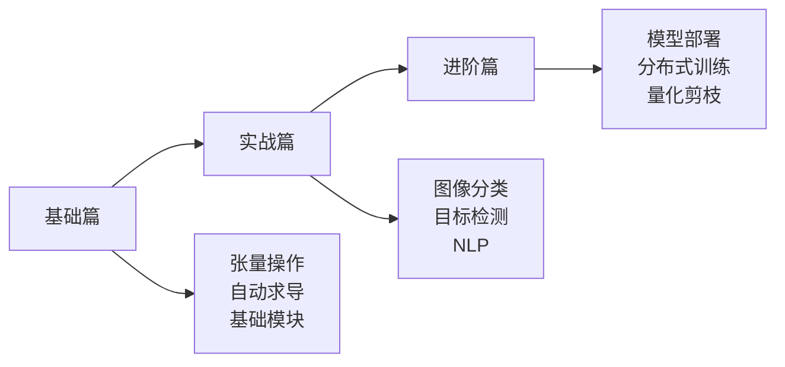
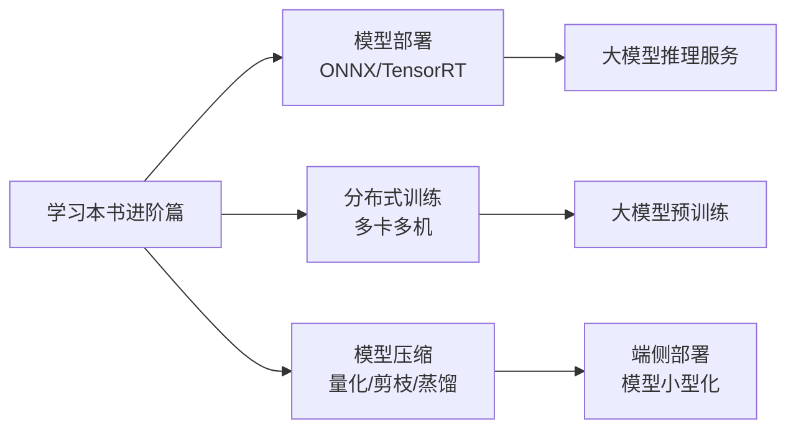

# PyTorch 实用教程（第二版）

> **资料来源**：余霆嵩《PyTorch 实用教程（第二版）》
> **适合人群**：需要系统性学习 PyTorch 的开发者
> **难度**：⭐⭐⭐（中等）

---

## 1. 教程特点

这是一本非常系统的 PyTorch 中文教程，覆盖从入门到进阶的完整内容。



---

## 2. 基础篇核心内容

### 2.1 Tensor 操作大全

```python
import torch

# 创建
x = torch.tensor([1, 2, 3])
x = torch.zeros(2, 3)
x = torch.ones(2, 3)
x = torch.eye(3)           # 单位矩阵
x = torch.arange(0, 10, 2) # [0, 2, 4, 6, 8]
x = torch.linspace(0, 1, 5) # 均匀间隔

# 形状操作
x.view(3, -1)      # reshape
x.unsqueeze(0)     # 增加维度
x.squeeze()        # 去掉size为1的维度
x.permute(1, 0)    # 维度重排
x.transpose(0, 1)  # 交换两个维度

# 数学运算
x + y              # 逐元素加
x * y              # 逐元素乘（Hadamard积）
x @ y              # 矩阵乘法
x.mm(y)            # 矩阵乘法
x.bmm(y)           # 批量矩阵乘法

# 聚合操作
x.sum()            # 求和
x.mean()           # 均值
x.max()            # 最大值
x.argmax()         # 最大值的索引
x.topk(3)          # 前3大值
```

### 2.2 自动求导深入

```python
# 创建需要梯度的张量
x = torch.tensor([2.0, 3.0], requires_grad=True)

# 构建计算图
y = x ** 2
z = y.sum()

# 反向传播
z.backward()

# 查看梯度
print(x.grad)  # [4.0, 6.0]  (dz/dx = 2x)

# 禁止梯度跟踪（推理时）
with torch.no_grad():
    y = model(x)

# 或者使用 detach
y_detached = y.detach()
```

**计算图机制**：


### 2.3 Dataset 和 DataLoader 设计模式

```python
from torch.utils.data import Dataset, DataLoader

class MyDataset(Dataset):
    def __init__(self, data_dir, transform=None):
        self.data_dir = data_dir
        self.transform = transform
        self.samples = self._load_samples()

    def _load_samples(self):
        # 加载数据列表
        pass

    def __len__(self):
        return len(self.samples)

    def __getitem__(self, idx):
        sample = self.samples[idx]
        image = load_image(sample['path'])
        label = sample['label']

        if self.transform:
            image = self.transform(image)

        return image, label

# 使用
dataset = MyDataset(data_dir='./data', transform=transform)
dataloader = DataLoader(
    dataset,
    batch_size=32,
    shuffle=True,
    num_workers=4,       # 多进程加载
    pin_memory=True,     # 加速GPU传输
    drop_last=True       # 丢弃不完整的最后一个batch
)
```

**关键参数**：

| 参数 | 作用 | 建议 |
|------|------|------|
| batch_size | 每批样本数 | 根据显存调整 |
| shuffle | 是否打乱 | 训练时True，验证时False |
| num_workers | 数据加载进程数 | CPU核心数-1 |
| pin_memory | 锁页内存 | GPU训练时True |
| collate_fn | 自定义batch组装 | 变长序列时需要 |

---

## 3. 实战篇

### 3.1 图像分类完整流程

```python
import torch
import torch.nn as nn
import torch.optim as optim
from torch.optim.lr_scheduler import StepLR

# 1. 数据准备
transform = transforms.Compose([
    transforms.RandomResizedCrop(224),
    transforms.RandomHorizontalFlip(),
    transforms.ToTensor(),
    transforms.Normalize([0.485, 0.456, 0.406],
                        [0.229, 0.224, 0.225])
])

train_dataset = ImageFolder('data/train', transform=transform)
train_loader = DataLoader(train_dataset, batch_size=32, shuffle=True)

# 2. 模型定义（使用预训练）
model = torchvision.models.resnet50(pretrained=True)
model.fc = nn.Linear(model.fc.in_features, num_classes)  # 替换分类头

# 3. 训练配置
criterion = nn.CrossEntropyLoss()
optimizer = optim.SGD(model.parameters(), lr=0.001, momentum=0.9)
scheduler = StepLR(optimizer, step_size=7, gamma=0.1)

# 4. 训练循环
def train_epoch(model, loader, criterion, optimizer, device):
    model.train()
    running_loss = 0.0
    correct = 0
    total = 0

    for inputs, labels in loader:
        inputs, labels = inputs.to(device), labels.to(device)

        optimizer.zero_grad()
        outputs = model(inputs)
        loss = criterion(outputs, labels)
        loss.backward()
        optimizer.step()

        running_loss += loss.item()
        _, predicted = outputs.max(1)
        total += labels.size(0)
        correct += predicted.eq(labels).sum().item()

    return running_loss / len(loader), correct / total

# 5. 主训练循环
device = torch.device('cuda' if torch.cuda.is_available() else 'cpu')
model = model.to(device)

for epoch in range(num_epochs):
    train_loss, train_acc = train_epoch(model, train_loader, criterion, optimizer, device)
    scheduler.step()
    print(f'Epoch {epoch}: Loss={train_loss:.4f}, Acc={train_acc:.4f}')
```

### 3.2 目标检测（简要）

```python
from torchvision.models.detection import fasterrcnn_resnet50_fpn

# 加载预训练模型
model = fasterrcnn_resnet50_fpn(pretrained=True)

# 推理
model.eval()
predictions = model(images)

# predictions包含:
# - boxes: 边界框坐标
# - labels: 类别标签
# - scores: 置信度
```

### 3.3 NLP 实战

```python
# 文本分类完整流程
import torch.nn as nn
from torchtext.data import Field, TabularDataset, BucketIterator

# 定义字段
TEXT = Field(tokenize='spacy', lower=True, include_lengths=True)
LABEL = Field(sequential=False, use_vocab=False)

# 加载数据
train_data, test_data = TabularDataset.splits(
    path='data',
    train='train.csv',
    test='test.csv',
    format='csv',
    fields=[('text', TEXT), ('label', LABEL)]
)

# 构建词表
TEXT.build_vocab(train_data, max_size=10000, vectors="glove.6B.100d")

# 迭代器
train_iterator = BucketIterator(
    train_data,
    batch_size=64,
    sort_within_batch=True,
    device=device
)

# LSTM 文本分类器
class LSTMClassifier(nn.Module):
    def __init__(self, vocab_size, embedding_dim, hidden_dim, output_dim):
        super().__init__()
        self.embedding = nn.Embedding(vocab_size, embedding_dim)
        self.lstm = nn.LSTM(embedding_dim, hidden_dim,
                           num_layers=2, bidirectional=True,
                           dropout=0.5)
        self.fc = nn.Linear(hidden_dim * 2, output_dim)

    def forward(self, text, text_lengths):
        embedded = self.embedding(text)
        packed = nn.utils.rnn.pack_padded_sequence(embedded, text_lengths)
        packed_output, (hidden, cell) = self.lstm(packed)
        hidden = torch.cat((hidden[-2,:,:], hidden[-1,:,:]), dim=1)
        return self.fc(hidden)
```

---

## 4. 进阶篇

### 4.1 模型部署（ONNX）

```python
# 导出 ONNX
dummy_input = torch.randn(1, 3, 224, 224)
torch.onnx.export(
    model,
    dummy_input,
    "model.onnx",
    export_params=True,
    opset_version=11,
    do_constant_folding=True,
    input_names=['input'],
    output_names=['output'],
    dynamic_axes={'input': {0: 'batch_size'},
                  'output': {0: 'batch_size'}}
)

# 验证
import onnx
model_onnx = onnx.load("model.onnx")
onnx.checker.check_model(model_onnx)
```

### 4.2 分布式训练

```python
import torch.distributed as dist
from torch.nn.parallel import DistributedDataParallel as DDP

# 初始化进程组
dist.init_process_group(backend='nccl')
local_rank = dist.get_rank()
torch.cuda.set_device(local_rank)

# 包装模型
model = DDP(model, device_ids=[local_rank])

# 分布式采样器
from torch.utils.data.distributed import DistributedSampler
sampler = DistributedSampler(dataset)
loader = DataLoader(dataset, sampler=sampler, batch_size=batch_size)

# 训练（每个进程处理一部分数据）
for epoch in range(epochs):
    sampler.set_epoch(epoch)  # 确保每个 epoch 打乱不同
    for batch in loader:
        # 训练步骤...
        pass
```

### 4.3 模型量化与剪枝

```python
# 动态量化
model_quantized = torch.quantization.quantize_dynamic(
    model,
    {nn.Linear, nn.LSTM},
    dtype=torch.qint8
)

# 知识蒸馏（大模型 → 小模型）
def distillation_loss(student_logits, teacher_logits, labels, T=2.0, alpha=0.5):
    # 软标签损失
    soft_loss = nn.KLDivLoss(reduction='batchmean')(
        F.log_softmax(student_logits/T, dim=1),
        F.softmax(teacher_logits/T, dim=1)
    ) * (T * T)

    # 硬标签损失
    hard_loss = F.cross_entropy(student_logits, labels)

    return alpha * soft_loss + (1 - alpha) * hard_loss
```

---

## 5. 与大模型学习的关联

### 5.1 NLP 部分的核心价值

本书的 NLP 部分包含：

| 内容 | 大模型应用 |
|------|-----------|
| 文本分类 | 指令微调的基础 |
| 序列标注 | Token 级任务理解 |
| Transformer 实现 | 理解大模型架构 |
| BERT 微调 | 迁移学习范式 |

### 5.2 进阶篇的生产价值



---

## 6. 学习建议

1. **逐章完成代码实践**：不要只看不练
2. **重点掌握 Dataset/DataLoader 设计模式**：这是 PyTorch 的核心抽象
3. **理解 nn.Module 的继承机制**：自定义层的必备技能
4. **关注 NLP 章节**：直接衔接大模型学习
5. **进阶篇选择性学习**：根据实际工作需求深入学习部署和优化
