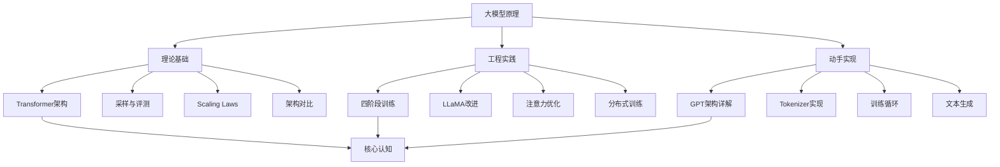
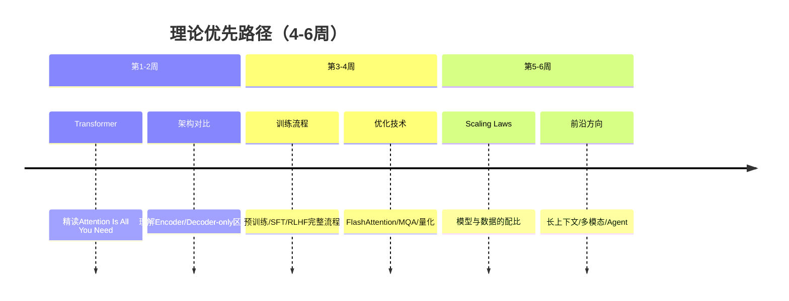
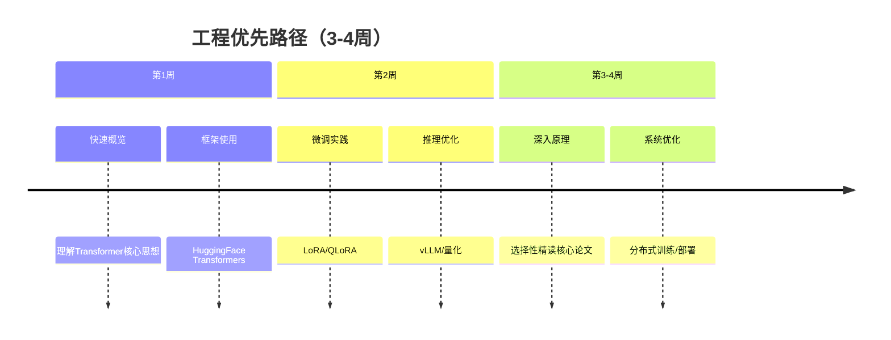
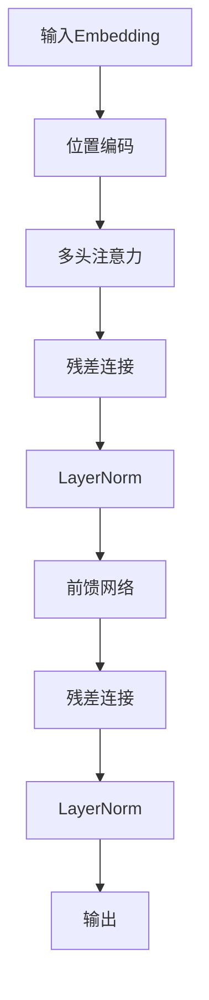

# 第六阶段：大模型原理

> **核心目标**：理解大语言模型的底层原理，从 Transformer 架构到训练、优化、部署的完整知识体系
> **难度**：⭐⭐⭐⭐（较难）

---

## 本阶段知识结构

---

## 学习路径建议

### 路径一：理论优先（研究者/架构师方向）

### 路径二：工程优先（应用开发/部署方向）

---

## 各章节导览

| 章节 | 内容 | 核心技能 |
|------|------|----------|
| [大模型基础](llm-foundation.md) | Transformer详解、采样方法、评测指标、Scaling Laws | 理论根基 |
| [大规模语言模型：从理论到实践](llm-theory-practice.md) | 四阶段训练、PyTorch实现、LLaMA、注意力优化 | 工程实现 |
| [从零构建大语言模型](build-llm-from-scratch.md) | GPT架构、BPE、训练流程、文本生成 | 动手实践 |
| [JHU LLM教程](jhu-llm-tutorial.md) | 术语体系、模型演进、高级主题 | 学术视野 |
| [AI Infra：大模型基础设施](ai-infra.md) | GPU集群、分布式训练框架、通信原语、监控与实验管理 | AI Infra |
| [推理优化技术](inference-optimization.md) | 量化、KV Cache优化、连续批处理、推测解码、推理引擎 | 推理优化 |

---

## 关键概念速查

### Transformer 核心组件

| 组件 | 功能 | 公式/关键点 |
|------|------|------------|
| Self-Attention | 捕捉序列内依赖 | `softmax(QK^T/√d_k)V` |
| Multi-Head | 并行多视角 | 拼接多个head输出 |
| FFN | 非线性变换 | 两个线性层+激活函数 |
| LayerNorm | 稳定训练 | 每样本独立归一化 |
| Residual | 缓解梯度消失 | 输入+子层输出 |

### 训练阶段对比

| 阶段 | 数据 | 目标 | 计算量 |
|------|------|------|--------|
| 预训练 | 海量未标注文本 | 语言建模 | 90%+ |
| SFT | 指令-回答对 | 指令遵循 | 5% |
| 奖励模型 | 偏好排序数据 | 学习人类偏好 | 3% |
| RLHF | 同一问题的多个回答 | 对齐人类价值观 | 2% |

### 采样方法对比

| 方法 | 特点 | 适用 |
|------|------|------|
| Greedy | 确定性，保守 | 精确任务 |
| Beam Search | 保留top-k候选 | 翻译/摘要 |
| Temperature | 调节分布锐度 | 通用 |
| Top-K | 限制候选集合 | 创意任务 |
| Top-P | 动态候选集合 | 推荐 |

---

## 面试高频考点

1. **Self-Attention 的计算复杂度？**
   - 时间复杂度：O(n²·d)，n为序列长度，d为维度
   - 空间复杂度：O(n²)（存储attention矩阵）

2. **为什么 Decoder-only 成为主流？**
   - 预训练任务简单（next token prediction）
   - 推理高效（只需KV Cache）
   - GPT-3证明scale后涌现能力强

3. **LLaMA相比原始Transformer的改进？**
   - Pre-LayerNorm → 更稳定
   - SwiGLU激活函数 → 更强表达能力
   - RoPE位置编码 → 更好的相对位置建模
   - RMSNorm → 计算简化

4. **LoRA为什么有效？**
   - 预训练权重矩阵是过参数化的
   - 低秩微调足以捕捉任务信息
   - 可训练参数降至0.1%~1%

5. **FlashAttention的核心思想？**
   - 分块计算，利用GPU SRAM
   - 避免存储中间矩阵
   - IO-aware，最大化内存层次利用

---

## 推荐论文阅读顺序

1. **Attention Is All You Need** (2017) - Transformer 起源
2. **BERT: Pre-training of Deep Bidirectional Transformers** (2018) - 双向预训练
3. **Language Models are Few-Shot Learners** (GPT-3, 2020) - 上下文学习
4. **Training language models to follow instructions** (InstructGPT, 2022) - RLHF
5. **LLaMA: Open and Efficient Foundation Language Models** (2023) - 开源LLM
6. **DeepSeek-R1** (2025) - 推理模型

---

## 实践建议

1. **手写Attention**：理解维度变换是关键
2. **加载真实模型**：用HuggingFace加载，打印每层形状
3. **微调一个模型**：体验从base到chat的转变
4. **对比不同架构**：BERT vs GPT vs T5的输出差异
5. **跟踪前沿**：关注arXiv cs.CL每日更新
