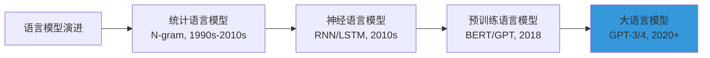
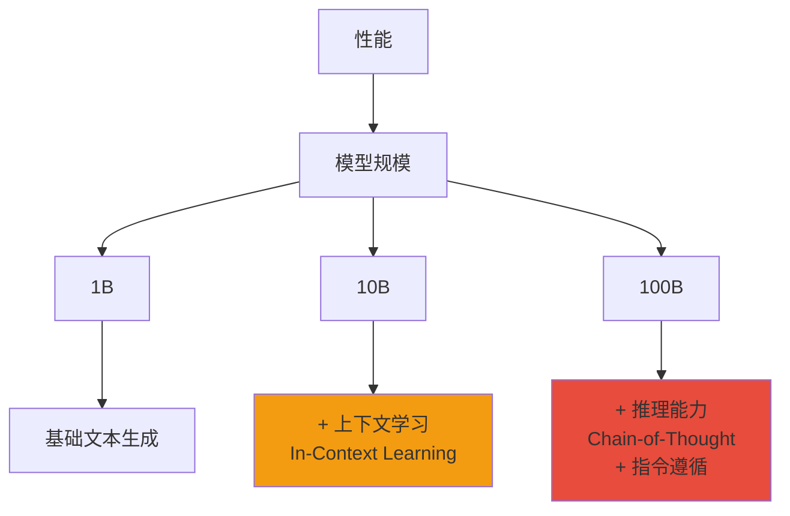
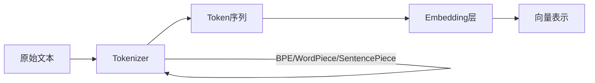
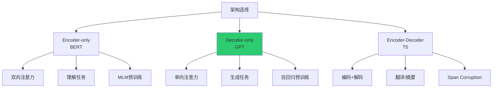
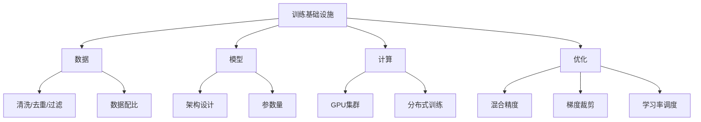
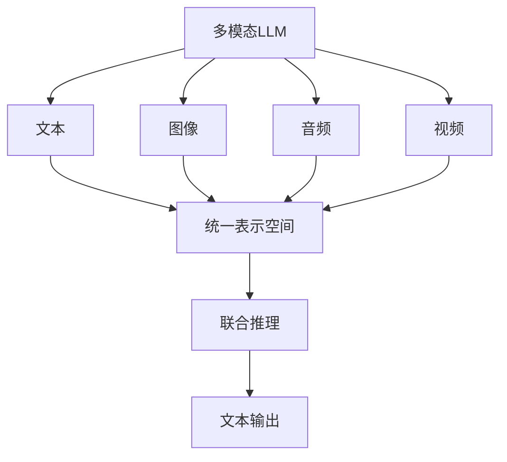
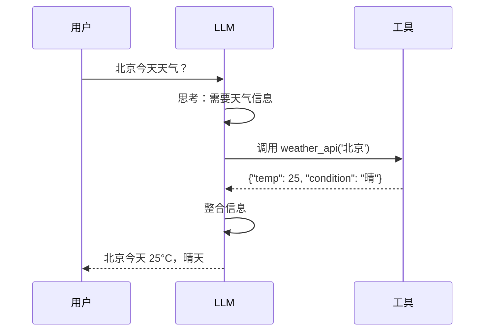
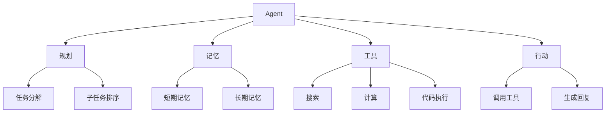

# 约翰霍普金斯大学 LLM 教程

> **资料来源**：Johns Hopkins University, Kevin Duh, "Large Language Models: the basics" (June 2024)
> **适合人群**：希望建立标准术语体系的学习者
> **难度**：⭐⭐⭐（中等）

---

## 1. 为什么 LLM  fundamentally different

### 1.1 从统计语言模型到神经语言模型



**统计语言模型（N-gram）**：
- 基于词频统计，预测下一个词
- 问题：稀疏性（没见过的 N-gram 概率为 0）
- 解决：平滑技术，但效果有限

**神经语言模型**：
- 用神经网络学习词的分布式表示
- Word2Vec、GloVe：词嵌入
- RNN/LSTM：捕捉序列信息

**预训练 + 微调范式**：
- 先在大规模语料上预训练（学习通用语言表示）
- 再在特定任务上微调（适配下游任务）
- 这是 LLM 时代的起点

### 1.2 规模带来的质变（Emergent Abilities）



**关键发现**：
- 模型规模达到某个阈值后，能力突然跃升
- 不是线性增长，而是"相变"
- 这就是 Emergent Abilities（涌现能力）

---

## 2. LLM 如何构建

### 2.1 Tokenization



**核心概念**：
- **Token**：模型处理的最小单元（可以是字、词、子词）
- **Vocabulary**：词表，所有已知 token 的集合
- **BPE（Byte-Pair Encoding）**：从字符开始，迭代合并最常见的字符对

**示例**：
```
原始文本："unhappiness"
BPE tokenization：["un", "##happiness"] 或 ["unhappy", "##ness"]
```

**不同模型的 token 差异**：
| 模型 | Tokenizer | 中文处理方式 |
|------|-----------|-------------|
| GPT-2/3 | BPE | 字或子词 |
| BERT | WordPiece | 字级别为主 |
| LLaMA | BPE | 字节回退（byte fallback）|
| DeepSeek | BPE | 优化的中文 token |

### 2.2 架构选择



**为什么 Decoder-only 成为主流？**
1. 自回归预训练简单高效
2. 与生成任务天然对齐
3. 可扩展性好（GPT-3 证明 scale 有效）
4. 推理时只需维护 KV Cache

### 2.3 预训练目标

**核心任务：Next Token Prediction**

$$P(w_t | w_1, w_2, ..., w_{t-1})$$

**训练过程**：
```
输入序列：[今天, 天气, 很, 好]

预测步骤：
Step 1: [今天] --> 预测 "天气"
Step 2: [今天, 天气] --> 预测 "很"
Step 3: [今天, 天气, 很] --> 预测 "好"
```

**自监督学习**：
- 不需要人工标注
- 文本本身就是监督信号
- 可训练数据几乎是无限的

### 2.4 训练基础设施



**训练成本估算**：
| 模型 | 参数量 | 训练数据 | GPU小时 | 估计成本 |
|------|--------|----------|---------|----------|
| GPT-3 | 175B | 300B tokens | ~3.14M | ~$12M |
| LLaMA-3 | 70B | 15T tokens | ~1.7M | ~$5M |
| DeepSeek-V3 | 671B | 14.8T tokens | ~2.8M | ~$5.6M |

---

## 3. 主流实现概览

### 3.1 GPT 系列

| 模型 | 时间 | 参数量 | 关键创新 |
|------|------|--------|----------|
| GPT-1 | 2018 | 117M | 预训练 + 微调 |
| GPT-2 | 2019 | 1.5B | 大规模无监督 |
| GPT-3 | 2020 | 175B | Few-shot learning |
| GPT-3.5 | 2022 | ~175B | 指令微调、RLHF |
| GPT-4 | 2023 | 未公开 | 多模态、推理能力 |
| GPT-4o | 2024 | 未公开 | 原生多模态 |
| o1/o3 | 2024 | 未公开 | 推理专用 |

### 3.2 LLaMA 系列

| 模型 | 时间 | 参数量 | 关键特点 |
|------|------|--------|----------|
| LLaMA-1 | 2023 | 7B-65B | 开源，性能优秀 |
| LLaMA-2 | 2023 | 7B-70B | 可商用，Code LLaMA |
| LLaMA-3 | 2024 | 8B-405B | 多语言，工具使用 |
| LLaMA-4 | 2025 | 17B-400B+ | 原生多模态，MoE |
| LLaMA-3 | 2024 | 8B-405B | 多语言，工具使用 |

**LLaMA 架构改进**：
- RMSNorm 替代 LayerNorm
- SwiGLU 激活函数
- RoPE 位置编码
- GQA（Grouped Query Attention）

### 3.3 其他重要模型

| 模型 | 开发者 | 特点 |
|------|--------|------|
| Claude | Anthropic | 长上下文，Constitutional AI |
| Gemini | Google | 多模态原生，长上下文 |
| Mistral | Mistral AI | 欧洲开源，性能强劲 |
| DeepSeek | DeepSeek | 推理能力，极致性价比 |
| Qwen | 阿里巴巴 | 中文优秀，多模态 |
| ChatGLM | 智谱 AI | 清华背景，国内部署友好 |

---

## 4. 高级主题

### 4.1 长上下文

**挑战**：Attention 复杂度 O(n²)，长序列内存爆炸

**解决方案**：
| 方法 | 原理 | 代表 |
|------|------|------|
| 位置插值 | 缩放位置编码 | LLaMA-2/3 长上下文版 |
| 稀疏注意力 | 只关注部分位置 | Longformer, BigBird |
| 线性注意力 | 降低复杂度到 O(n) | RWKV, Mamba |
| KV Cache 压缩 | 丢弃不重要的 KV | H2O, StreamingLLM |
| 递归/压缩 | 分块处理，递归摘要 | RAG + 长文档 |

### 4.2 多模态



**代表模型**：
- GPT-4V / GPT-4o：图像理解
- Gemini：原生多模态
- CLIP：图文对齐
- LLaVA：开源多模态

### 4.3 工具使用（Tool Use）

**核心能力**：模型决定何时调用外部工具



**实现方式**：
- Function Calling（OpenAI/DeepSeek 格式）
- Toolformer（微调学习工具使用）
- ReAct（推理 + 行动交替）

### 4.4 Agent

**定义**：能自主规划、使用工具、完成复杂任务的系统



---

## 5. 关键术语表

| 术语 | 英文 | 定义 |
|------|------|------|
| 大语言模型 | LLM (Large Language Model) | 参数量巨大的神经网络语言模型 |
| 预训练 | Pre-training | 在大规模数据上学习通用表示 |
| 微调 | Fine-tuning | 在特定任务数据上调整模型 |
| 提示 | Prompt | 输入给模型的文本指令 |
| 上下文学习 | In-Context Learning | 通过示例学习新任务 |
| 思维链 | Chain-of-Thought | 展示推理过程的提示技术 |
| 幻觉 | Hallucination | 模型生成虚假内容 |
| 对齐 | Alignment | 使模型行为符合人类期望 |
| RLHF | RL with Human Feedback | 基于人类反馈的强化学习 |
| RAG | Retrieval-Augmented Generation | 检索增强生成 |
| Token | Token | 模型处理的最小文本单元 |
| 嵌入 | Embedding | 文本的向量表示 |
| 注意力 | Attention | 模型关注输入不同部分的能力 |
| Transformer | Transformer | 基于自注意力的神经网络架构 |

---

## 学习建议

1. **本教程定位**：快速建立 LLM 的知识框架和术语体系
2. **配合实践**：每学一个概念，用实际模型验证
3. **批判性思维**：不是所有流行说法都准确，保持质疑
4. **持续跟进**：LLM 领域变化极快，定期更新知识
