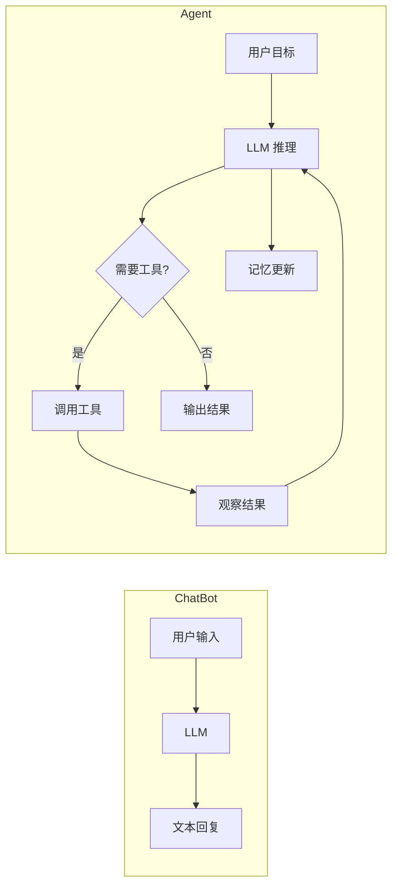
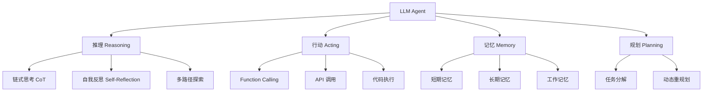
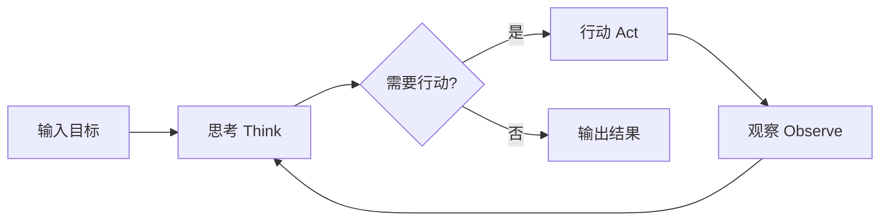
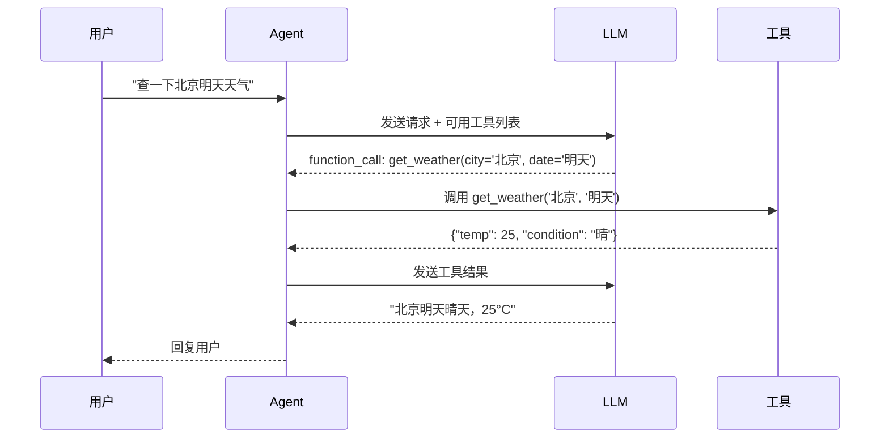
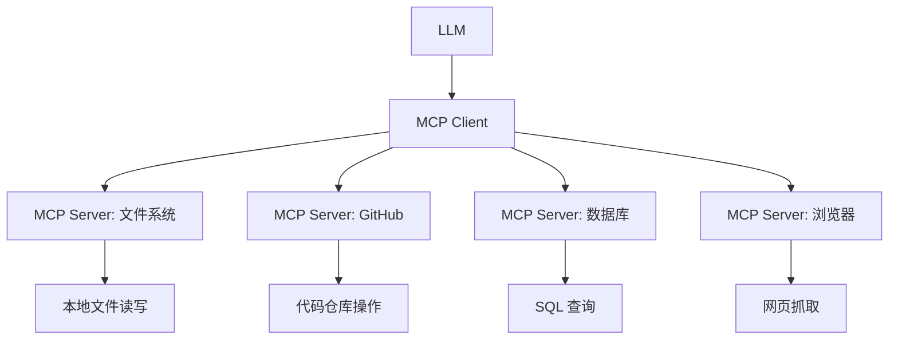
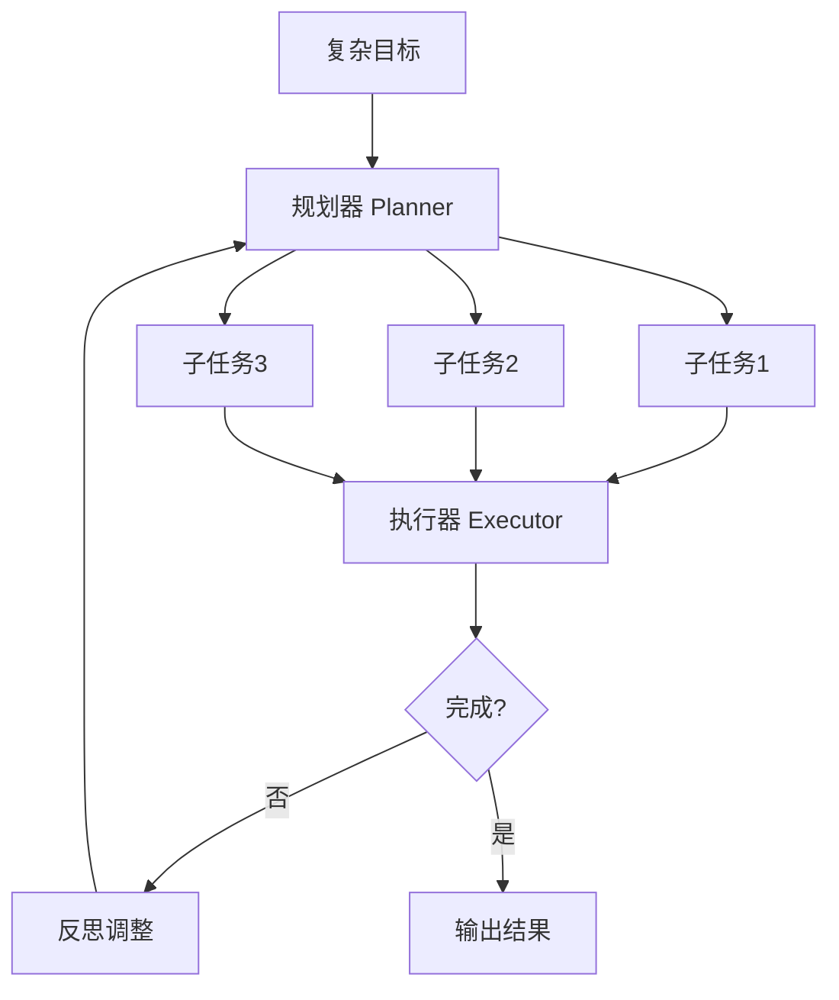
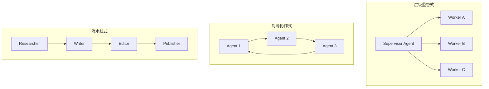
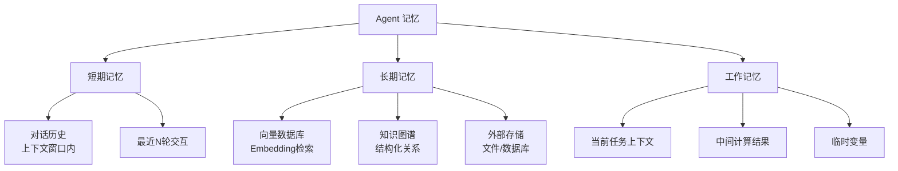
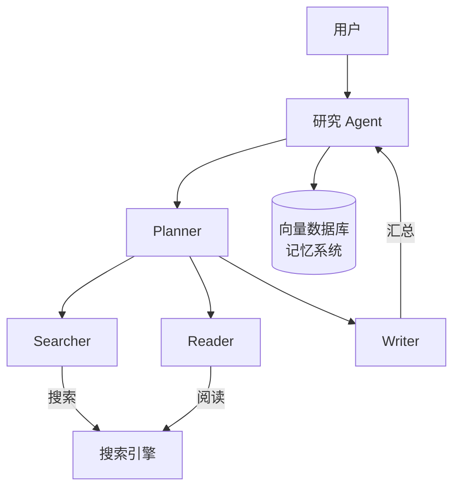
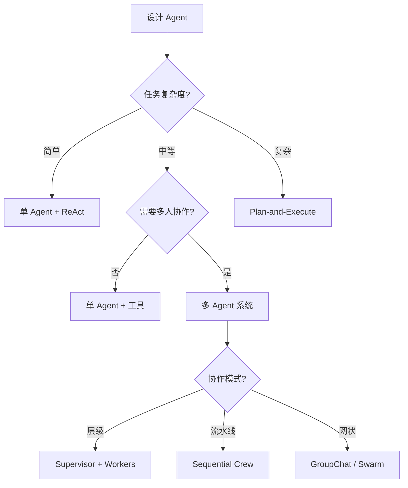

# LLM Agent 系统设计与实战

> **资料来源**：综合 ReAct 论文、OpenAI/DeepSeek Function Calling 文档、LangGraph/CrewAI/AutoGen 官方文档，以及 2025 年多智能体框架最新进展
> **适合人群**：希望构建自主 AI 应用的开发者
> **难度**：⭐⭐⭐⭐（较难）

---

## 1. 什么是 Agent

### 1.1 Agent vs ChatBot



**核心区别**：

| 维度 | ChatBot | Agent |
|------|---------|-------|
| 交互模式 | 被动响应 | 主动规划 |
| 能力边界 | 纯文本生成 | 工具调用 + 环境交互 |
| 记忆 | 对话历史 | 短期 + 长期 + 工作记忆 |
| 决策 | 单次生成 | 多轮推理-行动循环 |
| 典型应用 | 客服问答 | 自动研究、代码生成、数据分析 |

### 1.2 Agent 的核心能力



---

## 2. ReAct 框架：推理与行动的协同

### 2.1 ReAct 的核心思想

ReAct（Reasoning + Acting）是 Agent 最基础的模式，由 Yao et al. (2022) 提出。它将链式思考（Chain-of-Thought）与工具调用交错进行：

```
问题：2024年诺贝尔物理学奖得主是谁？他们的主要贡献是什么？

思考 1：我需要搜索 2024 年诺贝尔物理学奖的信息。
行动 1：调用 search_tool(query="2024 Nobel Prize Physics winners")
观察 1：搜索结果：John J. Hopfield 和 Geoffrey E. Hinton，表彰他们在人工神经网络和机器学习方面的基础性发现和发明。

思考 2：我需要了解他们的具体贡献。
行动 2：调用 search_tool(query="Hopfield Hinton Nobel Prize 2024 contributions")
观察 2：Hopfield 发明了联想记忆网络（Hopfield Network），Hinton 发明了反向传播和深度学习的核心方法。

思考 3：我已经获得足够信息，可以回答用户了。
行动 3：finish(answer="2024年诺贝尔物理学奖授予...")
```

### 2.2 ReAct 的循环结构



**关键设计**：
- **思考（Thought）**：LLM 的内部推理过程，决定下一步行动
- **行动（Action）**：调用外部工具（搜索、计算、API）
- **观察（Observation）**：工具返回的结果，作为下一次推理的输入

### 2.3 ReAct 的 Prompt 模板

```python
REACT_PROMPT = """
你是一位智能助手，可以访问以下工具：

{tools_description}

请使用以下格式回答问题：

问题：用户的问题
思考：分析当前情况，决定下一步行动
行动：工具名称，参数
观察：工具返回的结果
...（思考/行动/观察循环）...
思考：我已经获得足够信息
最终答案：对用户的回答

现在开始：

问题：{question}
思考："""
```

### 2.4 完整 ReAct 实现

```python
import json
import re

class ReActAgent:
    def __init__(self, llm_client, tools):
        self.llm = llm_client
        self.tools = {tool.name: tool for tool in tools}

    def run(self, question, max_steps=10):
        prompt = self._build_prompt(question)

        for step in range(max_steps):
            # 1. LLM 思考并决定行动
            response = self.llm.generate(prompt)
            print(f"Step {step + 1}: {response}")

            # 2. 解析思考、行动和观察
            thought = self._extract_thought(response)
            action = self._extract_action(response)

            if not action:
                # LLM 直接给出答案
                return self._extract_answer(response)

            # 3. 执行工具
            tool_name, tool_input = action
            if tool_name == "finish":
                return tool_input

            observation = self._execute_tool(tool_name, tool_input)

            # 4. 更新 prompt，加入观察结果
            prompt += f"\n{response}\n观察：{observation}\n思考："

        return "达到最大步数限制，未能完成任务。"

    def _extract_action(self, text):
        """从 LLM 输出中提取行动"""
        match = re.search(r'行动：(\w+)\s*(?:,\s*(.+))?', text)
        if match:
            return match.group(1), match.group(2) or ""
        return None

    def _execute_tool(self, name, input_str):
        """调用工具"""
        if name not in self.tools:
            return f"错误：未知工具 '{name}'"
        try:
            return self.tools[name].run(input_str)
        except Exception as e:
            return f"错误：{str(e)}"
```

---

## 3. Function Calling / Tool Use

### 3.1 Function Calling 机制

Function Calling 是 LLM 与外部世界交互的标准接口。现代模型（GPT-4、DeepSeek、Claude）都支持此能力。



### 3.2 工具定义（JSON Schema）

```python
tools = [
    {
        "type": "function",
        "function": {
            "name": "search",
            "description": "在互联网上搜索信息",
            "parameters": {
                "type": "object",
                "properties": {
                    "query": {
                        "type": "string",
                        "description": "搜索关键词"
                    },
                    "num_results": {
                        "type": "integer",
                        "description": "返回结果数量",
                        "default": 5
                    }
                },
                "required": ["query"]
            }
        }
    },
    {
        "type": "function",
        "function": {
            "name": "calculate",
            "description": "执行数学计算",
            "parameters": {
                "type": "object",
                "properties": {
                    "expression": {
                        "type": "string",
                        "description": "数学表达式，如 '2 + 2 * 3'"
                    }
                },
                "required": ["expression"]
            }
        }
    },
    {
        "type": "function",
        "function": {
            "name": "read_file",
            "description": "读取文件内容",
            "parameters": {
                "type": "object",
                "properties": {
                    "path": {
                        "type": "string",
                        "description": "文件路径"
                    }
                },
                "required": ["path"]
            }
        }
    }
]
```

### 3.3 工具调用完整流程

```python
from openai import OpenAI

client = OpenAI()

def agent_with_tools(user_message, tools):
    messages = [
        {"role": "system", "content": "你是一个有用的助手，可以使用工具来回答问题。"},
        {"role": "user", "content": user_message}
    ]

    # 第一轮：让模型决定使用什么工具
    response = client.chat.completions.create(
        model="gpt-4",
        messages=messages,
        tools=tools,
        tool_choice="auto"
    )

    message = response.choices[0].message

    # 检查是否有工具调用
    if message.tool_calls:
        # 将模型的工具调用请求加入对话历史
        messages.append({
            "role": "assistant",
            "content": message.content or "",
            "tool_calls": [tc.model_dump() for tc in message.tool_calls]
        })

        # 执行每个工具调用
        for tool_call in message.tool_calls:
            function_name = tool_call.function.name
            function_args = json.loads(tool_call.function.arguments)

            # 调用实际函数
            result = execute_function(function_name, function_args)

            # 将工具结果加入对话历史
            messages.append({
                "role": "tool",
                "tool_call_id": tool_call.id,
                "content": str(result)
            })

        # 第二轮：让模型基于工具结果生成最终回答
        final_response = client.chat.completions.create(
            model="gpt-4",
            messages=messages
        )

        return final_response.choices[0].message.content

    # 没有工具调用，直接返回答案
    return message.content
```

### 3.4 MCP（Model Context Protocol）

2024 年底 Anthropic 推出的 MCP 是 Agent 工具生态的重要标准化协议：



**MCP 的价值**：
- 标准化工具接口，一次接入多处使用
- 安全沙箱，控制 Agent 的权限边界
- 生态丰富，社区已贡献数百个 MCP Server

---

## 4. 规划与执行（Plan-and-Execute）

### 4.1 任务分解

复杂任务需要先规划再执行：



### 4.2 Plan-and-Execute 实现

```python
class PlanAndExecuteAgent:
    def __init__(self, planner_llm, executor_llm, tools):
        self.planner = planner_llm
        self.executor = executor_llm
        self.tools = tools

    def run(self, objective):
        # Step 1: 生成计划
        plan = self._create_plan(objective)
        print(f"计划：{plan}")

        # Step 2: 执行计划
        results = []
        for i, step in enumerate(plan):
            print(f"\n执行步骤 {i+1}: {step}")
            result = self._execute_step(step, results)
            results.append({"step": step, "result": result})

            # Step 3: 检查是否需要重规划
            if self._need_replan(results):
                print("检测到偏差，重新规划...")
                plan = self._create_plan(objective, results)

        # Step 4: 汇总结果
        return self._synthesize_results(objective, results)

    def _create_plan(self, objective, previous_results=None):
        context = ""
        if previous_results:
            context = f"\n之前的执行结果：{json.dumps(previous_results, ensure_ascii=False)}"

        prompt = f"""为以下目标制定详细的执行计划。将目标分解为具体的、可执行的步骤。

目标：{objective}{context}

要求：
1. 每个步骤应明确、具体、可执行
2. 步骤之间应有逻辑顺序
3. 如果某步骤可能失败，添加备选方案
4. 以 JSON 数组格式输出步骤列表

输出格式：["步骤1", "步骤2", ...]"""

        response = self.planner.generate(prompt)
        return json.loads(response)

    def _execute_step(self, step, previous_results):
        # 使用 ReAct 执行单个步骤
        react_agent = ReActAgent(self.executor, self.tools)
        return react_agent.run(step)

    def _need_replan(self, results):
        # 检查最近的执行结果是否表明需要重规划
        last_result = results[-1]["result"]
        return "错误" in last_result or "失败" in last_result
```

### 4.3 反思与自我修正

```python
class SelfReflectingAgent:
    def execute_with_reflection(self, task, max_attempts=3):
        for attempt in range(max_attempts):
            result = self.execute(task)

            # 自我评估
            reflection = self.reflect(task, result)

            if reflection["is_correct"]:
                return result

            # 根据反馈修正
            task = f"{task}\n之前的结果：{result}\n反馈：{reflection['feedback']}\n请修正。"

        return result

    def reflect(self, task, result):
        prompt = f"""评估以下任务执行结果的质量。

任务：{task}
结果：{result}

请判断：
1. 结果是否正确完整？（是/否）
2. 如果有问题，具体是什么？
3. 如何改进？

以 JSON 格式输出：
{{
    "is_correct": true/false,
    "feedback": "具体反馈",
    "suggestion": "改进建议"
}}"""

        response = self.llm.generate(prompt)
        return json.loads(response)
```

---

## 5. 多 Agent 系统

### 5.1 多 Agent 架构模式



### 5.2 框架对比（2025）

| 框架 | 编排模式 | 状态管理 | 学习曲线 | 适用场景 |
|------|----------|----------|----------|----------|
| **LangGraph** | 有向图 + 条件边 | 内置检查点、时间旅行调试 | 中 | 复杂、循环、状态敏感的工作流 |
| **CrewAI** | 角色化团队 + 流程 | 任务输出传递 | 低 | 快速原型、业务自动化 |
| **AutoGen/AG2** | 对话式 GroupChat | 对话历史 | 中 | 研究、代码协作、人机交互 |
| **OpenAI Agents SDK** | 显式交接 | 上下文变量 | 低 | OpenAI 生态内的简单委托 |

### 5.3 CrewAI 实战示例

```python
from crewai import Agent, Task, Crew, Process
from langchain_openai import ChatOpenAI

# 定义 LLM
llm = ChatOpenAI(model="gpt-4")

# 定义 Agent（角色化）
researcher = Agent(
    role="研究员",
    goal="深入研究给定主题，收集全面的信息",
    backstory="你是一位经验丰富的研究分析师，擅长从多个来源收集和验证信息。",
    llm=llm,
    verbose=True
)

writer = Agent(
    role="技术写手",
    goal="将研究结果转化为清晰、有深度的技术文章",
    backstory="你是一位资深技术写手，擅长将复杂的技术概念转化为易懂的文档。",
    llm=llm,
    verbose=True
)

editor = Agent(
    role="编辑",
    goal="审校文章，确保内容准确、结构清晰",
    backstory="你是一位严格的编辑，注重事实准确性和文章质量。",
    llm=llm,
    verbose=True
)

# 定义任务
research_task = Task(
    description="研究主题：{topic}。收集关键信息、数据、案例和不同观点。",
    expected_output="一份结构化的研究报告，包含关键发现和数据支撑。",
    agent=researcher
)

writing_task = Task(
    description="基于研究报告撰写一篇技术博客。要求：1000字左右，包含引言、正文、结论。",
    expected_output="一篇完整的技术博客文章（Markdown格式）。",
    agent=writer,
    context=[research_task]
)

editing_task = Task(
    description="审校博客文章，检查事实准确性、逻辑连贯性和语言表达。提出修改建议。",
    expected_output="审校报告 + 修改后的文章。",
    agent=editor,
    context=[writing_task]
)

# 组建 Crew
crew = Crew(
    agents=[researcher, writer, editor],
    tasks=[research_task, writing_task, editing_task],
    process=Process.sequential,
    verbose=True
)

# 运行
result = crew.kickoff(inputs={"topic": "LLM Agent 系统的最新进展"})
print(result)
```

### 5.4 LangGraph 状态机示例

```python
from typing import TypedDict, Annotated, Sequence
import operator
from langgraph.graph import StateGraph, END

# 定义状态
class AgentState(TypedDict):
    messages: Annotated[Sequence[dict], operator.add]
    next_step: str
    tool_results: list

# 定义节点函数
def planner(state: AgentState):
    """规划节点"""
    last_message = state["messages"][-1]["content"]
    plan = generate_plan(last_message)
    return {"messages": [{"role": "assistant", "content": f"计划：{plan}"}], "next_step": "execute"}

def executor(state: AgentState):
    """执行节点"""
    plan = extract_plan(state["messages"])
    result = execute_plan_step(plan)
    return {
        "messages": [{"role": "assistant", "content": f"执行结果：{result}"}],
        "tool_results": [result],
        "next_step": "review"
    }

def reviewer(state: AgentState):
    """审查节点"""
    results = state["tool_results"]
    review = review_results(results)

    if review["is_complete"]:
        return {"messages": [{"role": "assistant", "content": "任务完成！"}], "next_step": "end"}
    else:
        return {"messages": [{"role": "assistant", "content": f"需要修正：{review['feedback']}"}], "next_step": "execute"}

# 构建图
workflow = StateGraph(AgentState)

workflow.add_node("planner", planner)
workflow.add_node("executor", executor)
workflow.add_node("reviewer", reviewer)

workflow.set_entry_point("planner")
workflow.add_edge("planner", "executor")
workflow.add_edge("executor", "reviewer")
workflow.add_conditional_edges(
    "reviewer",
    lambda state: "end" if state["next_step"] == "end" else "executor",
    {"end": END, "executor": "executor"}
)

app = workflow.compile()

# 运行
result = app.invoke({"messages": [{"role": "user", "content": "分析2024年AI领域的投资趋势"}]})
```

---

## 6. 记忆系统

### 6.1 记忆类型



### 6.2 实现记忆系统

```python
class AgentMemory:
    def __init__(self, vector_store=None):
        self.short_term = []  # 短期记忆：对话历史
        self.long_term = vector_store  # 长期记忆：向量数据库
        self.working = {}     # 工作记忆：临时变量

    def add_interaction(self, user_msg, agent_msg):
        """添加交互到短期记忆"""
        self.short_term.append({
            "user": user_msg,
            "agent": agent_msg,
            "timestamp": time.time()
        })
        # 保持最近 N 条
        if len(self.short_term) > 20:
            self.short_term = self.short_term[-20:]

    def store_knowledge(self, text, metadata=None):
        """存储知识到长期记忆"""
        if self.long_term:
            self.long_term.add_texts([text], metadatas=[metadata or {}])

    def retrieve_relevant(self, query, k=3):
        """从长期记忆检索相关信息"""
        if not self.long_term:
            return []
        return self.long_term.similarity_search(query, k=k)

    def get_context(self, current_query):
        """构建完整上下文（短期 + 长期）"""
        # 短期记忆
        recent = self.short_term[-5:]
        short_context = "\n".join([
            f"用户：{r['user']}\n助手：{r['agent']}"
            for r in recent
        ])

        # 长期记忆
        relevant = self.retrieve_relevant(current_query)
        long_context = "\n".join([doc.page_content for doc in relevant])

        return f"""相关背景知识：
{long_context}

近期对话：
{short_context}

当前问题：{current_query}"""
```

### 6.3 MemGPT：无限上下文记忆架构

传统 Agent 的记忆受限于 LLM 的上下文窗口（如 128K tokens）。MemGPT 通过**操作系统式的内存管理**突破了这一限制。

#### 核心思想：虚拟内存映射

MemGPT 将 LLM 的上下文窗口视为"物理内存"，将外部存储视为"虚拟内存"：

```
操作系统虚拟内存：
  物理内存（RAM）有限 → 将不常用的数据换出到磁盘（Swap）
  需要时再从磁盘换入

MemGPT：
  上下文窗口（Context Window）有限 → 将不常用的记忆换出到外部存储
  需要时再从外部存储检索换入
```

#### 三种记忆层级

| 层级 | 位置 | 容量 | 访问速度 | 用途 |
|------|------|------|---------|------|
| **主上下文（Main Context）** | LLM 上下文窗口 | 8K-128K | 即时 | 当前对话、系统指令 |
| **召回存储（Recall Storage）** | 向量数据库 | 无限 | ~100ms | 历史对话、相关知识 |
| **归档存储（Archival Storage）** | 数据库/文件 | 无限 | ~1s | 长期知识、用户画像 |

#### 内存管理操作

MemGPT 定义了类似操作系统调用的函数：

```python
class MemGPTMemory:
    def __init__(self, llm, vector_store, db):
        self.llm = llm
        self.main_context = []      # 主上下文（有限）
        self.recall_storage = vector_store  # 召回存储
        self.archival_storage = db  # 归档存储
    
    def page_fault(self, query):
        """主上下文中找不到信息时，触发 page fault"""
        # 从召回存储检索
        results = self.recall_storage.search(query, k=5)
        
        # 将检索结果换入主上下文
        self.evict_oldest()  # 腾出空间
        self.main_context.extend(results)
    
    def evict_oldest(self):
        """将最旧的记忆换出到召回存储"""
        old_memories = self.main_context[:10]  # 最旧的 10 条
        self.main_context = self.main_context[10:]
        
        # 存入召回存储
        for mem in old_memories:
            self.recall_storage.add(mem)
    
    def archive(self, memory):
        """将重要记忆归档到长期存储"""
        self.archival_storage.save(memory)
```

#### 自我编辑（Self-Editing）

MemGPT 的独特能力：Agent 可以主动修改自己的系统指令和记忆。

```
场景：用户告诉 Agent "我喜欢 Python，不喜欢 Java"

传统 Agent：
  - 这条信息放在对话历史中
  - 几轮对话后被截断，Agent 遗忘

MemGPT：
  - Agent 识别这是"用户偏好"
  - 主动调用 `edit_system_prompt` 更新用户画像
  - 将"用户喜欢 Python"写入归档存储
  - 后续对话中，Agent 始终记得这一偏好
```

**自我编辑函数**：
- `core_memory_replace`：修改核心记忆（用户画像、Agent 身份）
- `core_memory_append`：追加核心记忆
- `send_message`：向用户发送消息
- `search_chat_history`：搜索历史对话

#### MemGPT 的工业价值

1. **突破上下文限制**：理论上支持无限长度的对话历史
2. **主动记忆管理**：Agent 自主决定记住什么、遗忘什么
3. **个性化持久化**：用户偏好跨会话保持
4. **成本优化**：只将最相关的信息加载到上下文窗口

**开源实现**：
- Letta（原 MemGPT 开源项目）
- 支持多种 LLM 后端（OpenAI、Anthropic、本地模型）
- 提供 REST API 和 Python SDK

---

## 7. Agent 评估

### 7.1 评估维度

| 维度 | 指标 | 测量方法 |
|------|------|----------|
| **任务完成度** | 成功率、准确率 | 人工标注 / 自动验证 |
| **效率** | 步骤数、Token 消耗、延迟 | 日志分析 |
| **工具使用** | 调用准确率、冗余调用 | 工具调用日志 |
| **推理质量** | 逻辑一致性、因果正确性 | LLM-as-Judge |
| **安全性** | 有害输出率、权限越界 | 红队测试 |
| **用户体验** | 响应相关性、交互轮数 | 用户反馈 |

### 7.2 LLM-as-Judge

```python
def evaluate_agent_response(question, expected, actual):
    """使用 LLM 评估 Agent 回答质量"""
    prompt = f"""评估以下 Agent 回答的质量。

问题：{question}
标准答案：{expected}
Agent 回答：{actual}

请从以下维度评分（1-10）：
1. 正确性：信息是否准确
2. 完整性：是否覆盖所有要点
3. 简洁性：是否简洁无冗余
4. 有用性：是否真正解决了问题

以 JSON 格式输出：
{{
    "correctness": 8,
    "completeness": 7,
    "conciseness": 9,
    "helpfulness": 8,
    "comments": "评价意见"
}}"""

    response = llm.generate(prompt)
    return json.loads(response)
```

### 7.3 Agent 评估基准（Benchmarks）

2025 年 Agent 评估从人工判断走向标准化基准测试。

#### SWE-bench：软件工程能力评估

**任务**：给定一个真实的 GitHub Issue，Agent 需要定位问题、修改代码、通过测试。

```
输入：
  - GitHub Issue 描述（如"登录按钮在某些浏览器下不工作"）
  - 完整代码仓库
  
期望输出：
  - 修复代码的 Patch
  - 通过所有现有测试
```

**评估指标**：
- **Resolved Rate**：Issue 被正确解决的比例
- 人类开发者基线：~30%
- GPT-4 + Agent：~40%（2024）→ ~55%（2025，o3）

**对工程的意义**：
- SWE-bench 是评估编程 Agent 的黄金标准
- 但注意：这些 issue 经过筛选，不代表真实开发的全部复杂度

#### WebArena：网页交互能力评估

**任务**：在真实网站上完成复杂任务（如"在亚马逊上找到最便宜的 4K 显示器并加入购物车"）。

**评估环境**：
- 真实的电商、社交、协作网站（非模拟环境）
- 需要登录、搜索、筛选、填写表单
- 任务有明确的成功标准（如"购物车中有正确商品"）

**关键发现**：
- 即使是 GPT-4，在 WebArena 上的成功率也只有 ~15%
- 主要失败原因：界面变化适应、长流程记忆、错误恢复

#### OSWorld：操作系统交互评估

**任务**：在真实操作系统（Ubuntu）中完成复杂任务（如"安装 Node.js 并运行一个 React 项目"）。

**评估能力**：
- 文件系统操作（创建、移动、删除文件）
- 软件安装（apt、npm、pip）
- 配置修改（编辑配置文件）
- 多步骤任务的规划和执行

**当前水平**：
- GPT-4V + Agent：~20% 成功率
- 人类：~75% 成功率
- 差距仍然巨大，说明通用计算机操作仍是难题

#### GAIA：通用 AI 助手评估

**任务**：回答需要多步推理和工具使用的开放性问题。

**三个难度级别**：
- **Level 1**：单步问答（如"2024 年诺贝尔物理学奖得主是谁？"）
- **Level 2**：需要搜索和推理（如"比较特斯拉和比亚迪 2024 年的销量"）
- **Level 3**：需要复杂规划和执行（如"分析某公司的财务状况并预测下季度收入"）

**当前最高分**：
- 人类：~92%
- GPT-4 + 工具：~40%
- 专用 Agent 系统：~65%

#### 评估基准选择建议

| 场景 | 推荐基准 | 关键指标 |
|------|---------|---------|
| 编程 Agent | SWE-bench | Resolved Rate |
| Web Agent | WebArena | 任务成功率 |
| 通用计算机操作 | OSWorld | 多步骤任务完成率 |
| 通用助手 | GAIA | 三级难度通过率 |
| 多 Agent 协作 | AgentBench | 协作效率、冲突解决 |

---

## 8. 实战：构建研究 Agent

### 8.1 系统架构



### 8.2 完整代码

```python
import os
from typing import List, Dict
from openai import OpenAI
import requests
from bs4 import BeautifulSoup

class ResearchAgent:
    """自主研究 Agent：搜索 → 阅读 → 分析 → 总结"""

    def __init__(self):
        self.client = OpenAI()
        self.memory = []  # 记忆：已收集的信息

    def research(self, topic: str, depth: int = 3) -> str:
        """
        对指定主题进行深度研究

        Args:
            topic: 研究主题
            depth: 搜索深度（迭代次数）
        """
        print(f"🔬 开始研究：{topic}")

        # Step 1: 生成搜索查询
        queries = self._generate_queries(topic)
        print(f"📋 生成 {len(queries)} 个搜索查询")

        # Step 2: 搜索并收集信息
        for query in queries[:depth]:
            print(f"\n🔍 搜索：{query}")
            search_results = self._search(query)

            for result in search_results[:2]:  # 每个查询取前2条
                content = self._fetch_content(result['url'])
                if content:
                    self.memory.append({
                        'query': query,
                        'source': result['url'],
                        'content': content[:2000]  # 截断
                    })
                    print(f"  ✅ 已收集：{result['title']}")

        # Step 3: 分析信息
        print("\n🧠 分析信息...")
        analysis = self._analyze(topic)

        # Step 4: 生成报告
        print("📝 生成报告...")
        report = self._generate_report(topic, analysis)

        return report

    def _generate_queries(self, topic: str) -> List[str]:
        """生成多个搜索查询角度"""
        prompt = f"""为研究主题生成5个不同的搜索查询。每个查询从不同角度切入。

主题：{topic}

要求：
1. 查询应具体、有针对性
2. 覆盖不同方面（定义、最新进展、应用、挑战）
3. 使用中文或英文（视主题而定）

以 JSON 数组输出：["查询1", "查询2", ...]"""

        response = self.client.chat.completions.create(
            model="gpt-4",
            messages=[{"role": "user", "content": prompt}]
        )

        content = response.choices[0].message.content
        # 提取 JSON
        import json
        import re
        match = re.search(r'\[.*?\]', content, re.DOTALL)
        if match:
            return json.loads(match.group())
        return [topic]

    def _search(self, query: str) -> List[Dict]:
        """执行搜索（使用 Serper API 或模拟）"""
        # 实际项目中使用 Serper/Google API
        # 这里返回模拟数据
        return [
            {"title": f"Result for {query}", "url": "https://example.com/1"},
            {"title": f"Another result for {query}", "url": "https://example.com/2"}
        ]

    def _fetch_content(self, url: str) -> str:
        """获取网页内容"""
        try:
            response = requests.get(url, timeout=10)
            soup = BeautifulSoup(response.text, 'html.parser')
            # 提取正文
            paragraphs = soup.find_all('p')
            return ' '.join([p.get_text() for p in paragraphs[:10]])
        except Exception as e:
            return ""

    def _analyze(self, topic: str) -> str:
        """分析收集到的信息"""
        context = "\n\n".join([
            f"来源：{m['source']}\n内容：{m['content']}"
            for m in self.memory[:5]  # 取最近5条
        ])

        prompt = f"""基于以下收集到的信息，对"{topic}"进行分析。

收集到的信息：
{context}

请分析：
1. 核心概念和定义
2. 最新进展和趋势
3. 主要应用场景
4. 面临的挑战
5. 未来发展方向

保持客观，标注不确定性。"""

        response = self.client.chat.completions.create(
            model="gpt-4",
            messages=[{"role": "user", "content": prompt}]
        )
        return response.choices[0].message.content

    def _generate_report(self, topic: str, analysis: str) -> str:
        """生成最终研究报告"""
        sources = "\n".join([f"- {m['source']}" for m in self.memory])

        report = f"""# {topic} 研究报告

## 摘要

{analysis[:500]}...

## 详细分析

{analysis}

## 参考来源

{sources}

---
*本报告由 Research Agent 自动生成，信息仅供参考。*
"""
        return report


# 使用示例
if __name__ == "__main__":
    agent = ResearchAgent()
    report = agent.research("2025年多模态大模型技术进展", depth=3)
    print(report)
```

---

## 9. Agent 设计模式速查

### 9.1 模式选择决策树



### 9.2 关键设计原则

1. **工具最小化**：只给 Agent 必要的工具，减少决策空间
2. **明确的退出条件**：设定最大步数、超时、成功标准
3. **容错设计**：工具调用失败时提供降级方案
4. **可观测性**：记录每一步的思考、行动、观察，便于调试
5. **成本控制**：监控 Token 消耗，复杂任务考虑使用便宜模型做初步筛选

---

## 10. 工业界 Agent 实现（Industrial Agent Implementations）

本节分析 OpenAI、Anthropic 等公司在生产环境中如何实现 Agent 系统，以及这些实现与学术研究方案的关键差异。

### 10.1 OpenAI 的 Agent 技术栈

OpenAI 从 GPT-4 的 Function Calling 到 Assistants API，再到 GPTs，展现了清晰的 Agent 产品化路径。

#### Function Calling 的演进（2023-2024）

| 版本 | 能力 | 工业影响 |
|------|------|---------|
| **GPT-3.5/4 (2023.06)** | 初版 Function Calling | 首次让 LLM 稳定输出结构化 JSON 工具调用 |
| **Parallel Function Calling (2023.11)** | 一次调用多个工具 | 大幅提升复杂任务效率 |
| **Strict Mode (2024)** | 100% 符合 JSON Schema | 消除解析失败，适合关键业务 |
| **Predicted Outputs (2024)** | 加速已知前缀生成 | 降低 tool calling 的延迟 |

**严格模式（Strict Mode）的工程意义**：
- 传统 Function Calling 使用通用 JSON 生成，偶尔产生格式错误（如字段缺失、类型不匹配）
- Strict Mode 在推理时约束输出，确保 100% 符合 JSON Schema
- 实现方式：使用 constrained decoding（约束解码），在生成每个 token 时只采样符合 schema 的 token
- 对金融、医疗等关键场景是刚需

#### Assistants API 的架构设计

OpenAI Assistants API 是一个**托管式 Agent 运行时**，隐藏了以下复杂性：

```
用户请求
   ↓
[Thread 管理] ──→ 自动维护对话历史，支持 128K 上下文
   ↓
[Run 执行] ──→ 调用模型，自动处理 Function Calling 循环
   ↓
[工具执行] ──→ Code Interpreter（沙箱 Python）、File Search（RAG）、Functions（自定义）
   ↓
[状态持久化] ──→ Run 状态、Step 记录、输出文件全部托管
```

**关键设计决策**：
1. **有状态托管**：Thread、Run、Message 全部在服务端持久化，客户端只需维护 thread_id
2. **自动轮询**：Run 对象有生命周期（queued → in_progress → requires_action → completed），客户端轮询状态
3. **Code Interpreter 沙箱**：在隔离容器中执行 Python 代码，带网络限制和超时控制
4. **File Search 内置 RAG**：向量索引 + 重排序，支持 10K 文件，自动分块和嵌入

#### GPTs 与 GPT Store

GPTs 是 OpenAI 的**零代码 Agent 构建平台**：
- 用户通过自然语言描述 Agent 的行为、知识和能力
- 支持上传知识文件（自动 RAG）、配置 Actions（HTTP API 调用）
- 底层使用 Assistants API 的相同基础设施

**对工程师的启示**：
- Agent 的产品化需要**降低使用门槛**（GPTs）和**保留高级控制**（Assistants API）两条线并行
- 托管运行时的价值在于隐藏状态管理和错误恢复

### 10.2 Anthropic 的 Computer Use 与工具生态

Anthropic 在 Claude 3.5 Sonnet 中推出的 Computer Use 代表了 Agent 能力的质变。

#### Computer Use 的技术架构

**核心能力**：Claude 可以"看到"屏幕截图，"操作"鼠标和键盘，像人类一样使用计算机。

```
输入: 用户目标 + 屏幕截图（base64 PNG）
   ↓
Claude 3.5 Sonnet (多模态)
   ↓
输出: 结构化操作指令
   {
     "action": "screenshot" | "key" | "type" | "mouse_move" | "left_click" | "right_click",
     "coordinate": [x, y],  // 鼠标移动目标
     "text": "..."          // 输入文本
   }
   ↓
[操作执行层] ──→ 在沙箱环境中执行操作
   ↓
新截图 → 再次输入 Claude（循环直到完成）
```

**工程挑战与解决方案**：

| 挑战 | Anthropic 的解决方案 |
|------|---------------------|
| 截图分辨率 | 使用 1024×768 缩放，平衡信息量和 token 数 |
| 操作延迟 | 每次操作后等待页面加载，超时重试 |
| 错误恢复 | 操作失败时自动截图分析，调整策略 |
| 安全性 | 完全隔离的 Docker 沙箱，无网络访问 |

**与纯文本 Agent 的本质区别**：
- 传统 Agent：通过 API 与结构化世界交互
- Computer Use：通过 GUI 与非结构化世界交互，通用性极强但可靠性较低
- 适用场景：自动化测试、数据录入、跨系统操作（无 API 的老系统）

#### MCP（Model Context Protocol）

Anthropic 2024 年底推出的 MCP 是 Agent 工具的 **"USB-C 接口"**：

```
传统工具集成：
  Agent A ──→ 工具 X (自定义集成)
  Agent B ──→ 工具 X (重新集成)
  每个 Agent-工具组合都要写适配代码

MCP 标准化：
  Agent A ──┐
            ├──→ MCP Server (工具 X)  ← 一次开发
  Agent B ──┘         ↑
                 MCP Client (标准协议)
```

**MCP 的核心协议**：
- **Tools**：模型可调用的功能（类似 Function Calling）
- **Resources**：模型可读取的上下文（文件、数据库记录）
- **Prompts**：预定义的交互模板

#### A2A 协议：Agent 之间的通信标准

Google 2025 年推出的 A2A（Agent-to-Agent）协议，与 MCP 形成互补：

```
MCP vs A2A 的定位差异：

MCP: Agent ↔ 工具（Tool）
  - 解决"Agent 如何调用外部工具"的问题
  - 单向：Agent 调用工具，获取结果
  
A2A: Agent ↔ Agent
  - 解决"多个 Agent 如何协作"的问题
  - 双向：Agent 之间可以协商、委托、同步状态
```

**A2A 的核心能力**：
1. **能力发现（Capability Discovery）**：Agent 发布自己的能力清单
2. **任务委托（Task Delegation）**：一个 Agent 将任务委托给另一个 Agent
3. **状态同步（State Synchronization）**：多 Agent 共享任务进度
4. **安全协商（Secure Negotiation）**：Agent 之间验证身份和权限

**应用场景**：
- 企业采购流程：采购 Agent 与供应商 Agent 自动协商价格和交期
- 智能客服：前端接待 Agent 识别需求后，转交给专业售后 Agent
- 跨组织协作：不同公司的 Agent 在共同项目下协作

**A2A + MCP 的组合架构**：
```
用户请求
   ↓
[协调 Agent] ──→ 发现可用的专业 Agent
   ↓
[专业 Agent A] ←──A2A──→ [专业 Agent B]
      ↓ MCP                  ↓ MCP
   [工具X]                [工具Y]
```

### 10.3 编程 Agent 的爆发（2025）

2025 年是编程 Agent 的元年，多个产品从原型走向可用。

#### Claude Code（Anthropic）

Claude Code 是 Anthropic 推出的终端编程 Agent：

```
Claude Code 的工作模式：

用户在终端输入自然语言指令：
  "> 给这个 React 项目添加用户登录功能"

Claude Code 的操作流程：
  1. 分析项目结构，理解现有代码
  2. 阅读相关文件（package.json, App.tsx, 等）
  3. 规划修改方案（创建 Login.tsx, 修改路由, 添加验证）
  4. 执行修改（读写文件）
  5. 运行测试验证
  6. 向用户汇报修改摘要
```

**技术特点**：
- 直接操作文件系统（读写、执行命令）
- 多轮迭代开发（写代码 → 测试 → 修复 → 再测试）
- 上下文感知（理解整个代码库的依赖关系）
- 与 Claude 3.5 Sonnet 深度集成

#### OpenAI Codex

OpenAI 2025 年推出的 Codex 是 Claude Code 的直接竞争对手：

| 特性 | Claude Code | OpenAI Codex |
|------|-------------|--------------|
| **运行环境** | 本地终端 | 云端沙箱 |
| **模型** | Claude 3.5 Sonnet | GPT-4o / o3 |
| **代码理解** | 强（长上下文） | 强（文件级分析） |
| **安全隔离** | 本地权限 | 云端容器隔离 |
| **适用场景** | 日常开发、调试 | 复杂重构、多文件修改 |

#### Devin 与 SWE-agent

**Devin（Cognition AI）**：
- 首个"自主软件工程师"概念的实现
- 可以独立完成从需求分析到部署的完整流程
- 使用浏览器、终端、编辑器完成开发任务
- 局限性：目前只在特定领域（如 Python 后端）表现可靠

**SWE-agent（OpenAI + 普林斯顿）**：
- 专门解决 GitHub Issue 的 Agent
- 在 SWE-bench 基准上达到人类水平
- 工作流程：理解 issue → 定位代码 → 修改 → 测试 → 提交 PR

**编程 Agent 的共同架构**：

```python
class CodingAgent:
    def __init__(self, llm, workspace):
        self.llm = llm
        self.workspace = workspace  # 代码仓库访问
        self.tools = {
            'read_file': self.read_file,
            'write_file': self.write_file,
            'run_command': self.run_command,
            'search_code': self.search_code,
            'run_tests': self.run_tests,
        }
    
    def solve_task(self, task_description):
        # 1. 理解任务和代码库
        context = self.analyze_workspace()
        
        # 2. 规划修改方案
        plan = self.llm.plan(task_description, context)
        
        # 3. 执行修改（迭代循环）
        for step in plan:
            result = self.execute_step(step)
            if result.failed:
                # 自我修正
                plan = self.llm.replan(step, result.error)
        
        # 4. 验证
        test_results = self.run_tests()
        return self.generate_report(test_results)
```

### 10.4 Deep Research 与自主研究 Agent

2025 年另一个重要趋势是**自主研究 Agent**——能够独立进行信息收集、分析和报告生成。

#### OpenAI Deep Research

OpenAI 推出的 Deep Research 可以：
- 接收研究主题（如"分析全球电动汽车市场趋势"）
- 自主进行数十次搜索
- 阅读和分析数百个网页
- 生成带有引用来源的综合报告
- 耗时 5-30 分钟，相当于人类研究员数小时的工作

**工作流程**：
```
主题输入
   ↓
[查询生成] ──→ 将主题分解为多个子查询
   ↓
[并行搜索] ──→ 同时搜索多个子查询
   ↓
[信息筛选] ──→ 阅读网页，提取相关信息
   ↓
[迭代深入] ──→ 根据新发现调整搜索方向
   ↓
[综合分析] ──→ 整合所有信息，发现模式和趋势
   ↓
[报告生成] ──→ 结构化报告，带引用和来源
```

#### Perplexity Deep Research

Perplexity 的 Deep Research 功能类似，但强调：
- **实时信息**：基于最新搜索结果（而非训练数据）
- **多源验证**：交叉验证多个来源的信息
- **透明度**：清晰标注每个事实的来源

#### 自主研究 Agent 的核心技术

```python
class DeepResearchAgent:
    def research(self, topic, max_iterations=10):
        findings = []
        queries = self.generate_queries(topic)
        
        for i in range(max_iterations):
            # 并行搜索
            results = self.parallel_search(queries)
            
            # 提取信息
            new_findings = self.extract_information(results)
            findings.extend(new_findings)
            
            # 评估信息完整性
            coverage = self.assess_coverage(topic, findings)
            
            if coverage.is_sufficient:
                break
            
            # 生成新的探索方向
            queries = self.generate_follow_up_queries(findings, coverage.gaps)
        
        return self.synthesize_report(findings)
```

### 10.5 Web Agent 与浏览器自动化

2025 年 Web Agent 从概念验证走向实用化。

#### 浏览器自动化的三代技术

| 代际 | 技术 | 代表 | 特点 |
|------|------|------|------|
| **第一代** | RPA 规则驱动 | Selenium + 脚本 | 固定流程，无法适应界面变化 |
| **第二代** | 视觉 + LLM | Claude Computer Use | 基于截图理解界面，通用性强 |
| **第三代** | 浏览器原生 API | Browser Use / Stagehand | 直接访问 DOM + AI 决策，更可靠 |

#### Browser Use（开源框架）

Browser Use 是 2025 年流行的开源 Web Agent 框架：

```python
from browser_use import Agent

agent = Agent(
    task="在亚马逊上找到评分最高的无线耳机，价格低于 100 美元",
    llm=openai_client
)

result = agent.run()
# Agent 自动：打开亚马逊 → 搜索耳机 → 筛选价格 → 排序评分 → 返回结果
```

**技术特点**：
- 直接控制 Playwright 浏览器（而非基于截图）
- 可以读取 DOM 结构、表单字段、按钮文本
- 比 Computer Use 更快（无需截图/ OCR）
- 比 RPA 更灵活（AI 决策下一步操作）

#### Stagehand（浏览器 AI SDK）

Stagehand 提供了更细粒度的浏览器控制：
- `act()`：执行具体操作（点击、输入、滚动）
- `extract()`：从页面提取结构化数据
- `observe()`：观察页面状态，等待条件满足

```python
from stagehand import Stagehand

stagehand = Stagehand()

# 执行复杂的多步操作
await stagehand.goto("https://github.com")
await stagehand.act("点击登录按钮")
await stagehand.act("输入用户名和密码")
await stagehand.act("点击 Sign in")

# 提取数据
repos = await stagehand.extract({
    "repositories": [{
        "name": "string",
        "stars": "number",
        "description": "string"
    }]
})
```

### 10.6 结构化输出与工具生态进化

2025 年结构化输出成为 Agent 的基础设施。

#### JSON Mode → Strict Mode → Pydantic

**JSON Mode（2023）**：
```python
response = client.chat.completions.create(
    model="gpt-4",
    messages=[...],
    response_format={"type": "json_object"}  # 保证输出有效 JSON
)
```

**Strict Mode（2024）**：
```python
response = client.chat.completions.create(
    model="gpt-4",
    messages=[...],
    tools=[{
        "type": "function",
        "function": {
            "name": "get_weather",
            "strict": True,  # 100% 符合 schema
            "parameters": {...}
        }
    }]
)
```

**Pydantic 集成（2025）**：
```python
from pydantic import BaseModel
from openai import OpenAI

class WeatherResponse(BaseModel):
    city: str
    temperature: float
    condition: str
    forecast: list[str]

client = OpenAI()
completion = client.beta.chat.completions.parse(
    model="gpt-4o",
    messages=[{"role": "user", "content": "北京今天天气怎么样？"}],
    response_format=WeatherResponse,
)

weather = completion.choices[0].message.parsed
print(weather.temperature)  # 类型安全的访问
```

**对 Agent 开发的影响**：
- Agent 的输出可以直接映射到 Python 对象
- 类型检查在编译时就能发现问题
- 与 FastAPI、数据库 ORM 无缝集成

#### 工具生态的成熟（2025）

2025 年 Agent 工具生态呈现爆发式增长：

| 类别 | 代表工具 | 用途 |
|------|---------|------|
| **文件系统** | filesystem MCP | 读写本地文件 |
| **数据库** | PostgreSQL MCP | SQL 查询和数据操作 |
| **浏览器** | Playwright MCP | 网页自动化 |
| **Git** | Git MCP | 代码版本管理 |
| **Docker** | Docker MCP | 容器管理 |
| **Slack** | Slack MCP | 消息发送和读取 |
| **日历** | Google Calendar MCP | 日程管理 |
| **API 集成** | Stripe MCP, GitHub MCP | 第三方服务 |

**工具选择建议**：
- 简单 Agent（5-10 个工具）：直接手写 Function Calling
- 复杂 Agent（20+ 工具）：使用 MCP 统一管理
- 企业级 Agent：A2A + MCP 组合，支持跨团队协作

### 10.7 2025 年中国 Agent 产品

中国团队在 2025 年也推出了有竞争力的 Agent 产品。

#### Manus（Monica.im）

Manus 是 2025 年初引起广泛关注的通用 Agent：

**产品定位**："全球首款通用 AI Agent"

**核心能力**：
- 在云端虚拟机中自主执行任务
- 支持浏览器操作、文件处理、代码编写
- 可以运行数小时完成复杂任务（如市场调研、数据分析）
- 任务完成后生成详细报告

**技术架构**：
```
用户指令
   ↓
[任务规划] ──→ 分解为多个子任务
   ↓
[沙箱执行] ──→ 在隔离的云端环境中执行
   ├── 浏览器自动化
   ├── 代码执行
   ├── 文件处理
   └── 工具调用
   ↓
[结果汇总] ──→ 生成结构化报告
```

**争议与局限**：
- 邀请码机制导致"一码难求"
- 实际效果与宣传有差距（复杂任务仍需人工干预）
- 与 Devin、Operator 定位重叠

#### 字节跳动 Coze / 扣子

Coze 是中国版的 GPTs + Assistants API：
- 零代码构建 Agent
- 支持插件生态（类似 MCP）
- 集成抖音、飞书等字节生态
- 国内合规，无需翻墙

#### 百度 AgentBuilder

百度基于文心大模型的 Agent 平台：
- 面向企业客户
- 集成百度搜索（实时信息）
- 支持知识库 RAG
- 与百度智能云深度集成

### 10.8 开源 Agent 框架的工业落地

#### LangGraph 的生产实践

LangGraph 从原型工具发展为生产级 Agent 编排框架：

**核心优势**：
1. **图状态机**：用图（节点+边）定义 Agent 工作流，比线性链更灵活
2. **持久化检查点**：每个步骤自动保存状态，支持故障恢复和人工审核
3. **人机协同**：在关键节点暂停，等待人类输入后再继续
4. **流式执行**：支持 token 级流式输出和步骤级流式执行

**典型生产架构**：
```python
# LangGraph 的 ReAct Agent 实现
from langgraph.prebuilt import create_react_agent
from langgraph.checkpoint.memory import MemorySaver

# 创建有状态、可持久化的 Agent
agent = create_react_agent(
    model=gpt4,
    tools=[search, calculator, code_executor],
    checkpointer=MemorySaver()  # 自动保存每一步状态
)

# 支持中断和人工审核
config = {"configurable": {"thread_id": "user_123"}}
for event in agent.stream(inputs, config, stream_mode="values"):
    print(event)  # 流式输出每一步状态
```

#### CrewAI 的企业应用

CrewAI 主打**角色化多 Agent 协作**，在以下场景有实际落地：

- **内容营销团队**：研究员 → 写手 → 编辑 → SEO 优化师，流水线协作
- **代码审查**：架构师 Agent 设计 → 开发 Agent 实现 → 测试 Agent 验证
- **投资研究**：数据收集 Agent → 分析师 Agent → 报告撰写 Agent

**与 LangGraph 的选择建议**：
- 需要**复杂循环、条件分支、人工介入** → LangGraph
- 需要**快速搭建角色化团队** → CrewAI
- 两者都支持 Function Calling 和多种 LLM 后端

### 10.4 工业界 Agent 的核心挑战

#### 可靠性（Reliability）

生产环境对 Agent 的可靠性要求远高于原型：

| 挑战 | 学术方案 | 工业实践 |
|------|---------|---------|
| **工具调用失败** | 假设工具可用 | 超时、重试、降级、熔断 |
| **LLM 输出不可控** | 依赖 prompt engineering | 结构化输出（JSON Mode）、约束解码 |
| **无限循环** | 设 max_steps | 超时控制、循环检测、token 预算 |
| **状态丢失** | 内存存储 | 持久化数据库、分布式会话 |
| **并发安全** | 单线程 | 请求隔离、乐观锁、幂等设计 |

**OpenAI 的可靠性策略**：
- Assistants API 的 Run 对象有明确的终态（completed / failed / cancelled）
- 自动重试失败的 tool calls（指数退避）
- 超时长运行任务支持异步 polling

**Anthropic 的可靠性策略**：
- Computer Use 的每次操作都有超时和截图验证
- 操作失败时自动回退（如点击不到元素时尝试滚动）
- 提供 "stop" 机制，用户可随时中断 Agent

#### 延迟与成本

Agent 的多轮调用特性使其延迟和成本远高于单次 LLM 调用：

```
单次问答: 1 次 API 调用
  延迟: 1s, 成本: $0.01

ReAct Agent 完成一个任务: 5-10 次 API 调用 + 工具执行
  延迟: 5-30s, 成本: $0.05-$0.50

优化策略：
  1. 使用便宜模型做初步规划（GPT-4o-mini → GPT-4）
  2. 缓存常见工具调用结果
  3. 并行调用独立工具（Parallel Function Calling）
  4. 预设工具模板，减少 LLM 决策次数
```

#### 安全与权限

生产 Agent 必须处理以下安全问题：

1. **工具权限最小化**
   - 每个工具独立配置权限范围
   - 敏感操作（写数据库、发送邮件）需要二次确认

2. **沙箱隔离**
   - Code Interpreter 在 Docker 中运行，无网络、文件系统隔离
   - Computer Use 的虚拟机完全隔离，会话结束后销毁

3. **审计日志**
   - 记录每一步的思考、行动、观察
   - 支持回溯和合规审计

4. **Prompt Injection 防御**
   - 工具返回的内容可能包含恶意指令
   - 需要输入过滤和输出验证

### 10.5 未来趋势：从 Agent 到 Agent 生态

#### Operator（自主 Agent）

OpenAI 2025 年初发布的 Operator 是 Agent 的下一个形态：
- **完全自主**：给定目标后无需人类干预，自动浏览网页、填写表单、完成交易
- **安全性**：在云端浏览器中运行，与用户本地环境隔离
- **局限性**：当前仅支持简单、结构化的网页任务

#### Agent 即服务（Agent-as-a-Service）

- **Devin (Cognition)**：自主编程 Agent，可独立完成任务
- **SWE-agent (OpenAI/普林斯顿)**：专门修复 GitHub issue 的 Agent
- **通用趋势**：Agent 从"工具"演变为"虚拟员工"，需要任务分配、进度跟踪、质量评估的管理系统

### 10.6 面试高频考点：工业界 Agent

1. **OpenAI Assistants API 与直接调用 Chat API 做 Agent 的区别？**
   > 答：Assistants API 提供托管状态（Thread/Run/Message 持久化）、内置 RAG（File Search）、Code Interpreter 沙箱、自动轮询。直接用 Chat API 需要自己管理状态、实现 RAG、处理 tool calling 循环。

2. **Anthropic 的 Computer Use 与传统 RPA（机器人流程自动化）的区别？**
   > 答：RPA 基于预定义的规则和坐标操作，只能处理固定流程；Computer Use 基于视觉理解和自然语言推理，可适应界面变化，通用性更强但可靠性较低。

3. **MCP 解决了什么问题？**
   > 答：传统上每个 Agent 框架需要为每个工具写适配代码。MCP 定义了标准化的工具接口协议（类似 LSP），工具开发者实现一次 MCP Server，所有兼容 Agent 都能使用。

4. **生产环境 Agent 的可靠性如何保证？**
   > 答：多层保障：结构化输出确保格式正确；超时和重试处理工具失败；持久化状态支持故障恢复；token 预算防止无限循环；沙箱隔离确保安全；审计日志支持追溯。

5. **为什么 Agent 的延迟优化比单次 LLM 调用更复杂？**
   > 答：Agent 涉及多轮 LLM 调用 + 工具执行的网络往返。优化策略包括：并行工具调用、使用便宜模型做规划、缓存工具结果、流式输出减少感知延迟、预设模板减少决策轮数。

---

## 11. 面试高频考点

1. **ReAct 和 Function Calling 的区别？**
   - ReAct 是推理+行动的循环范式；Function Calling 是 LLM 输出结构化工具调用的能力。ReAct 可以用 Function Calling 实现行动部分。

2. **单 Agent vs 多 Agent 怎么选？**
   - 简单任务单 Agent；需要角色分工、并行处理、复杂协作时选多 Agent。多 Agent 有协调开销，不是银弹。

3. **Agent 的幻觉问题怎么解决？**
   - 工具调用提供事实依据、RAG 注入知识、自我反思验证、Maker-Checker 模式、人工审核关键步骤。

4. **MCP 是什么？为什么重要？**
   - Model Context Protocol，Anthropic 提出的标准化工具接口协议。让 Agent 工具生态互联互通，一次开发到处使用。

5. **LangGraph 和 CrewAI 的区别？**
   - LangGraph：图状态机，适合复杂循环工作流，有检查点恢复能力。
   - CrewAI：角色化团队，适合快速构建协作式 Agent，学习曲线更低。

6. **Agent 的记忆系统如何设计？**
   - 短期：对话历史（截断/摘要）；长期：向量数据库 + 知识图谱；工作：临时变量和中间结果。

7. **MCP 和 A2A 有什么区别？**
   - MCP（Model Context Protocol）是 Agent 与工具的通信标准，解决"Agent 如何调用工具"的问题。A2A（Agent-to-Agent）是 Agent 之间的通信协议，解决"多个 Agent 如何协作"的问题。两者互补：MCP 连接 Agent 与工具，A2A 连接 Agent 与 Agent。

8. **Claude Code 与传统 IDE 插件（如 Copilot）的区别？**
   - Copilot 是代码补全工具，被动响应；Claude Code 是自主编程 Agent，可以分析项目结构、规划修改、执行多文件重构、运行测试验证。前者是"助手"，后者是"工程师"。

9. **MemGPT 如何解决上下文窗口限制？**
   - MemGPT 将 LLM 上下文窗口视为"物理内存"，外部存储视为"虚拟内存"。通过 page_fault、evict、archive 等操作，主动管理记忆换入换出。Agent 可以自主决定记住什么、遗忘什么，理论上支持无限对话历史。

10. **Deep Research 与传统搜索的区别？**
    - 传统搜索返回相关网页列表，用户自行阅读；Deep Research 是自主研究 Agent，自动分解查询、并行搜索、筛选信息、迭代深入、综合生成带引用的报告。相当于"AI 研究员"vs"搜索引擎"。

11. **SWE-bench 是什么？为什么重要？**
    - SWE-bench 是评估编程 Agent 的黄金标准，要求 Agent 根据 GitHub Issue 描述修复真实代码库的 bug。Resolved Rate（解决率）从 GPT-4 的 ~40% 提升到 o3 的 ~55%，接近人类开发者水平。

12. **结构化输出对 Agent 开发的价值？**
    - 从 JSON Mode（保证有效 JSON）到 Strict Mode（100% 符合 Schema）再到 Pydantic 集成（类型安全），结构化输出让 Agent 的输出可以直接映射到 Python 对象，与 FastAPI、数据库 ORM 无缝集成，减少解析错误。
