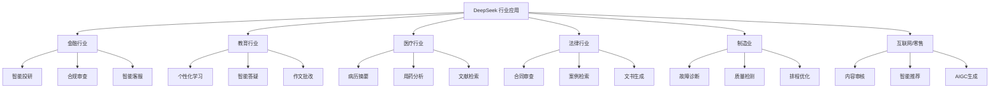
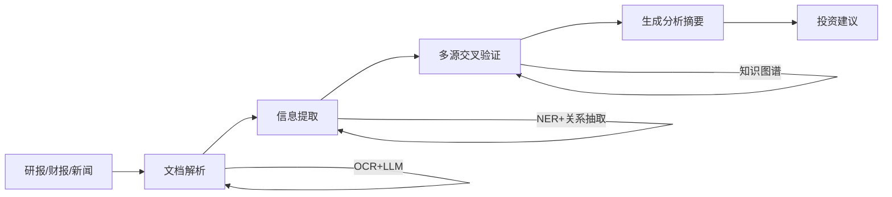
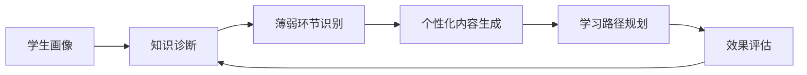
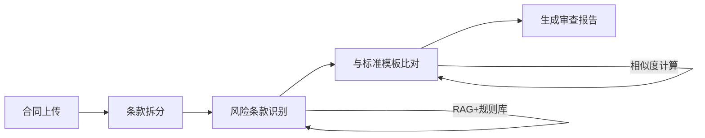
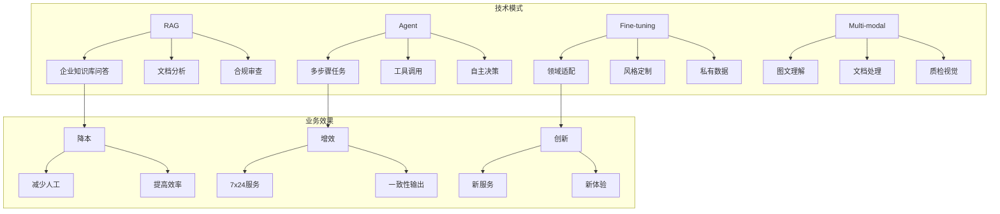
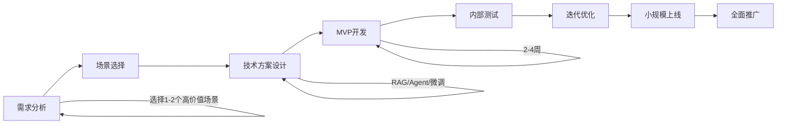

# DeepSeek 行业应用案例集

> **资料来源**：浙江大学《DeepSeek 行业应用案例集》
> **适合人群**：寻找大模型落地场景的开发者
> **难度**：⭐⭐（容易）

---

## 1. 案例总览



---

## 2. 金融行业

### 2.1 智能投研

**场景**：分析师需要阅读大量研报、财报、新闻，提取关键信息并生成投资建议。

**痛点**：
- 信息过载：每天数百份研报，人工无法读完
- 一致性差：不同分析师观点可能矛盾
- 时效性要求：市场变化快，需要实时分析

**DeepSeek 解决方案**：



**技术栈**：
- DeepSeek-R1：复杂财务计算和推理
- RAG：连接内部知识库和历史数据
- 多模态：处理 PDF、Excel、图表

**Prompt 示例**：
```
你是一位资深证券分析师。请基于以下信息生成投资分析报告：

公司信息：{company_info}
财报数据：{financial_data}
近期新闻：{news}
行业对比：{peer_comparison}

要求：
1. 财务健康度评分（1-10）及理由
2. 竞争优势和劣势分析
3. 风险因素识别
4. 未来 12 个月业绩预测
5. 投资建议（买入/持有/卖出）及目标价区间

输出格式：Markdown，每个部分一个二级标题
```

### 2.2 合规审查

**场景**：金融产品的宣传材料、合同条款需要符合监管要求。

**技术方案**：
- 构建监管规则知识库（RAG）
- 用 DeepSeek-R1 逐条比对材料与规则
- 自动标记不合规内容并给出修改建议

**效果**：
- 审查时间从 3 天缩短到 30 分钟
- 漏检率降低 80%

---

## 3. 教育行业

### 3.1 个性化学习系统

**场景**：每个学生基础不同，需要个性化学习路径和内容。



**DeepSeek 应用**：
- **知识诊断**：分析学生答题记录，识别薄弱知识点
- **内容生成**：根据学生水平生成难度适配的练习题
- **智能答疑**：7×24 小时回答学生问题
- **作文批改**：从结构、语言、逻辑多维度评分

**Prompt 示例（生成练习题）**：
```
请为一位 {grade} 年级学生生成 {subject} 练习题。

学生情况：
- 当前水平：{level}
- 薄弱知识点：{weak_points}
- 目标：巩固基础，逐步提升

要求：
1. 5 道选择题（基础概念）
2. 3 道填空题（计算/应用）
3. 2 道解答题（综合运用）
4. 难度递增
5. 每题附详细解析

输出格式：每题包含题干、选项（如适用）、答案、解析
```

### 3.2 智能答疑

**方案架构**：
- 教材知识库（RAG）
- 多轮对话（保持上下文）
- 苏格拉底式引导（不直接给答案，引导思考）

**优势**：
- 比通用聊天机器人更专业
- 可解释性强，引用教材原文
- 支持数学公式和图表

---

## 4. 医疗行业

### 4.1 病历摘要与结构化

**场景**：医生每天需要阅读大量病历，快速了解患者情况。

**技术方案**：
```
输入：非结构化病历文本
处理：DeepSeek 提取关键信息
输出：结构化摘要

结构化字段：
- 主诉
- 现病史（时间线）
- 既往史
- 过敏史
- 用药记录
- 检查检验结果
- 诊断
- 治疗计划
```

**价值**：
- 医生查房时间缩短 50%
- 减少信息遗漏
- 支持后续数据分析

### 4.2 用药相互作用分析

**场景**：患者可能同时服用多种药物，需要检查相互作用。

**DeepSeek-R1 推理示例**：
```
患者当前用药：
1. 华法林（抗凝药）
2. 阿司匹林
3. 维生素 K 补充剂

请分析：
1. 药物间相互作用（增强/减弱/冲突）
2. 潜在风险等级（高/中/低）
3. 监测建议（需要关注哪些指标）
4. 如有冲突，给出替代方案建议

注意：本分析仅供参考，最终用药决策需由医生做出。
```

---

## 5. 法律行业

### 5.1 智能合同审查

**场景**：企业每天签署大量合同，需要快速识别风险条款。

**技术架构**：


**审查维度**：
- 付款条款（账期、违约金）
- 知识产权归属
- 保密义务
- 违约责任
- 争议解决方式
- 不可抗力

**Prompt 示例**：
```
你是一位资深合同律师。请审查以下合同，重点关注：

1. 对甲方（我方）不利的条款
2. 缺失的关键条款
3. 表述模糊可能引发争议的条款
4. 与行业惯例不符的条款

对于每个问题：
- 指出具体条款位置
- 说明风险
- 给出修改建议

合同文本：
"""
{contract_text}
"""
```

### 5.2 案例检索与类案推荐

**方案**：
- 将历史判决书向量化存入数据库
- 输入新案件描述，检索相似案例
- DeepSeek 分析类案的判决逻辑和结果
- 生成类案分析报告

---

## 6. 制造业

### 6.1 设备故障诊断

**场景**：生产线设备故障，需要快速定位原因。

**知识库构建**：
- 设备手册
- 历史故障记录
- 维修方案库

**应用流程**：
```
输入：故障现象描述 + 设备日志
处理：
  1. RAG 检索相似历史故障
  2. DeepSeek-R1 分析日志中的异常模式
  3. 生成故障原因假设（按概率排序）
  4. 给出排查步骤
输出：诊断报告 + 维修建议
```

### 6.2 质量检测报告生成

**场景**：质检员需要对产品进行外观/尺寸检测，生成报告。

**多模态方案**：
- 图片输入：产品照片
- DeepSeek-V3 分析：识别缺陷类型、位置、严重程度
- 自动生成检测报告（含图片标注说明）

---

## 7. 互联网与零售

### 7.1 智能内容审核

**场景**：UGC 平台需要审核用户生成内容。

**分级审核策略**：
| 内容类型 | 处理方式 | DeepSeek 作用 |
|---------|---------|--------------|
| 明显违规 | 自动拦截 | 快速分类 |
| 疑似违规 | 人工复核 | 给出审核理由 |
| 正常内容 | 直接通过 | 语义理解 |
| 边缘案例 | 多模型投票 | 多角度分析 |

### 7.2 AIGC 内容生成

**场景**：电商平台需要批量生成商品描述、营销文案。

**Prompt 模板**：
```
请为以下商品生成营销文案。

商品信息：
- 名称：{product_name}
- 品类：{category}
- 卖点：{selling_points}
- 目标用户：{target_audience}
- 价格区间：{price_range}

生成内容：
1. 短标题（20字以内，适合首页展示）
2. 长标题（50字以内，含关键词）
3. 商品描述（200字，突出卖点）
4. 5 个用户可能关心的问答
5. 3 条社交媒体推广文案

语气：{tone}
```

---

## 8. 跨行业技术模式总结



| 行业 | 核心痛点 | 主要技术 | 关键指标 |
|------|---------|---------|---------|
| 金融 | 信息过载、合规风险 | RAG + 推理 | 审查效率、准确率 |
| 教育 | 个性化难、师资不均 | Agent + 内容生成 | 学习效果、覆盖率 |
| 医疗 | 知识更新快、工作量大 | RAG + 结构化 | 诊断效率、一致性 |
| 法律 | 检索困难、成本高 | RAG + 比对 | 检索召回率、审查时间 |
| 制造 | 经验依赖、响应慢 | 知识库 + 诊断 | 故障解决时间 |
| 互联网 | 内容量大、实时性 | 分类 + 生成 | 审核准确率、生成质量 |

---

## 9. 从案例到实践

### 9.1 落地步骤



### 9.2 技术选型决策树

```
是否需要使用私有数据？
├── 否
│   └── 直接用 DeepSeek API + Prompt Engineering
└── 是
    └── 数据是否频繁更新？
        ├── 是（如新闻、政策）
        │   └── RAG（检索增强）
        └── 否（如产品手册）
            └── 是否需要改变模型行为？
                ├── 是（特定风格/格式）
                │   └── Fine-tuning
                └── 否
                    └── RAG 或 长上下文直接输入
```

---

## 学习建议

1. **找到你的行业**：选择与你目标行业相关的案例深入理解
2. **分析技术架构**：每个案例背后的技术方案是什么？
3. **思考可改进之处**：如果你来做，会怎么优化？
4. **动手复现**：用一个开源工具栈复现最简单的场景
