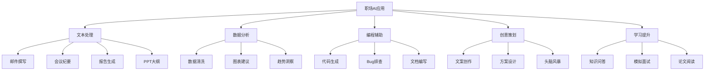
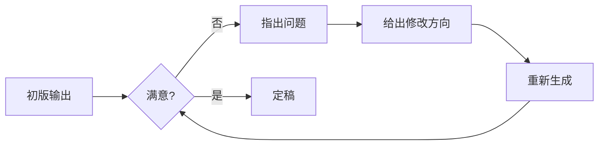
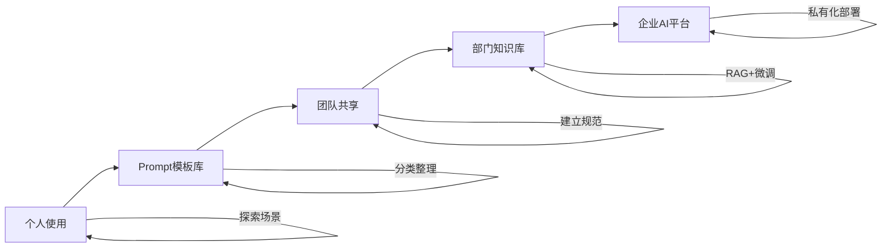

# DeepSeek 赋能职场

> **资料来源**：清华大学《DeepSeek 赋能职场》《DeepSeek 如何赋能职场应用》
> **适合人群**：希望用 AI 提升工作效率的职场人士
> **难度**：⭐（非常容易）

---

## 1. 职场 AI 应用全景



---

## 2. 文本处理场景

### 2.1 邮件撰写

**场景**：快速起草各类商务邮件。

**Prompt 模板**：
```
请帮我写一封{type}邮件。

邮件要素：
- 收件人：{recipient}（上级/客户/同事/下属）
- 目的：{purpose}
- 关键信息：{key_info}
- 期望对方行动：{expected_action}
- 语气：{tone}（正式/友好/紧急/委婉）

要求：
1. 主题行简洁有力（20字以内）
2. 正文不超过 {word_count} 字
3. 段落清晰，每段一个要点
4. 结尾有明确的 Call to Action
```

**示例**：
```
请帮我写一封跟进邮件。

收件人：潜在客户张总
目的：跟进上周的产品演示，推进签约
关键信息：我们提供了 15% 的早期客户折扣，有效期到月底
期望行动：安排下周的详细技术对接会
语气：专业友好
```

### 2.2 会议纪要

**Prompt 模板**：
```
请将以下会议内容整理为结构化会议纪要。

会议信息：
- 主题：{topic}
- 时间：{time}
- 参与者：{participants}

原始记录：
"""
{raw_notes}
"""

输出格式：
## 会议概况
（时间、地点、参与人、主题）

## 讨论要点
（按议题分类，每个议题下记录关键讨论内容）

## 决议事项
（编号列表，明确的决定）

## 行动项
| 任务 | 负责人 | 截止日期 | 优先级 |

## 待解决问题
（需要后续跟进的事项）
```

### 2.3 工作报告

**Prompt 模板**：
```
请帮我撰写一份工作周报/月报。

基本信息：
- 岗位：{position}
- 汇报周期：{period}
- 重点项目：{projects}

本周完成：
{completed_tasks}

下周计划：
{planned_tasks}

遇到的问题：
{challenges}

要求：
1. 用 STAR 法则描述关键成果
2. 包含量化数据
3. 体现思考和复盘
4. 结构清晰，适合向上汇报
```

### 2.4 PPT 大纲生成

**Prompt 模板**：
```
请为以下主题生成 PPT 大纲。

主题：{topic}
目标受众：{audience}
演讲时长：{duration} 分钟
目的：{goal}（汇报/提案/培训）

要求：
1. 包含封面、目录、内容页、总结页
2. 每页明确标题和要点（bullet points）
3. 标注每页建议的图表类型
4. 设计一个互动环节或问答环节
5. 总页数控制在 {page_count} 页以内

输出格式：
第 X 页：[标题]
- 要点1
- 要点2
- 建议图表/视觉元素
```

---

## 3. 数据分析场景

### 3.1 数据清洗脚本生成

**Prompt 模板**：
```
请帮我编写 Python 代码清洗以下数据。

数据描述：
- 来源：{data_source}
- 格式：{format}（CSV/Excel/JSON）
- 行数：{row_count}
- 列数：{column_count}

已知问题：
{data_issues}

清洗要求：
1. 处理缺失值（策略：{missing_strategy}）
2. 处理异常值（策略：{outlier_strategy}）
3. 数据类型转换
4. 去重
5. 生成清洗报告（各字段的统计信息）

输出：完整的 Python 代码 + 清洗说明
```

### 3.2 数据可视化建议

**Prompt 模板**：
```
我有以下数据，请推荐合适的可视化方案。

数据字段：
{field_descriptions}

分析目标：{analysis_goal}

要求：
1. 推荐 3-5 种图表类型
2. 每种图表说明适用场景和原因
3. 给出 Python（matplotlib/seaborn/plotly）代码示例
4. 提供配色建议
```

### 3.3 业务洞察提取

**Prompt 模板**：
```
请基于以下业务数据提取关键洞察。

数据概览：
{data_summary}

业务背景：
{business_context}

要求：
1. 发现 3-5 个关键趋势或异常
2. 每个洞察包含：现象描述、可能原因、业务影响
3. 提出 2-3 个 actionable 建议
4. 用 Markdown 表格和 bullet points 呈现
```

---

## 4. 编程辅助场景

### 4.1 代码生成

**Prompt 模板**：
```
请用 {language} 实现以下功能：
{feature_description}

约束条件：
{constraints}

要求：
1. 代码注释清晰
2. 包含错误处理
3. 时间/空间复杂度优化
4. 包含 3 个测试用例
```

### 4.2 Bug 排查

**Prompt 模板**：
```
请帮我排查以下代码的 bug。

代码：
```
{code}
```

错误信息：
{error_message}

预期行为：
{expected_behavior}

要求：
1. 分析错误原因
2. 给出修复后的代码
3. 解释修复思路
4. 提出预防措施
```

### 4.3 技术文档生成

**Prompt 模板**：
```
请为以下代码生成技术文档。

代码：
```
{code}
```

文档类型：{doc_type}（API文档/使用说明/架构说明）

要求：
1. 功能概述
2. 参数说明（名称、类型、必填、描述）
3. 返回值说明
4. 使用示例
5. 异常说明
```

---

## 5. 创意策划场景

### 5.1 营销文案

**Prompt 模板**：
```
请为以下产品/活动创作营销文案。

产品/活动：{product}
目标受众：{audience}
核心卖点：{selling_points}
发布渠道：{channel}（微信/小红书/抖音/邮件）

要求：
1. {channel} 风格（了解平台调性）
2. 包含标题 + 正文 + CTA
3. 使用情感化语言
4. 长度适合 {channel}
```

### 5.2 活动策划

**Prompt 模板**：
```
请帮我策划一场 {type} 活动。

基本信息：
- 活动主题：{theme}
- 目标人群：{target}
- 预算：{budget}
- 时间：{date}
- 规模：{scale}

要求：
1. 活动流程（时间线）
2. 所需资源（人力/物料/场地）
3. 风险预案
4. 效果评估指标
5. 用甘特图或时间线描述执行计划
```

---

## 6. 学习提升场景

### 6.1 知识问答

**Prompt 模板**：
```
请用费曼学习法的思路向我解释 {topic}。

要求：
1. 假设我是 {level}（初学者/有基础/进阶）
2. 用类比和生活中的例子
3. 分步骤讲解
4. 最后出 3 道自测题检验理解
```

### 6.2 模拟面试

**Prompt 模板**：
```
请扮演一位 {role} 面试官，对我进行模拟面试。

岗位：{position}
级别：{level}（初级/中级/高级）
技术栈：{tech_stack}

要求：
1. 每次问 1 个问题
2. 问题难度递增
3. 我回答后给出评价和改进建议
4. 最后给出综合评分和改进方向

现在开始第一个问题。
```

### 6.3 论文阅读辅助

**Prompt 模板**：
```
请帮我理解以下论文内容。

论文标题：{title}
论文摘要：
"""
{abstract}
"""

要求：
1. 用 3 句话概括核心贡献
2. 解释关键概念（如有生僻术语）
3. 与已有方法对比（优势/劣势）
4. 评估实验设计的严谨性
5. 指出可以跟进的研究方向
```

---

## 7. 高效使用技巧

### 7.1 角色设定法

为不同场景设定专业角色，显著提升输出质量：

| 场景 | 角色设定 | 效果提升 |
|------|----------|----------|
| 写邮件 | "你是一位资深商务经理" | 语言更专业 |
| 写代码 | "你是一位资深架构师" | 代码更规范 |
| 数据分析 | "你是一位数据科学家" | 分析更深入 |
| 写文案 | "你是一位创意总监" | 更有创意 |
| 法律咨询 | "你是一位执业律师" | 更严谨 |

### 7.2 分步提问法

复杂任务不要一次问完，拆分为多轮：

```
第一轮：生成大纲
"请为'数字化转型'主题生成演讲大纲"

第二轮：展开内容
"请详细展开第 3 部分，包含案例和数据"

第三轮：优化表达
"请将以上内容改写为更口语化的演讲稿"

第四轮：生成辅助材料
"请为这场演讲设计 3 个互动问题"
```

### 7.3 结果迭代法



**常用迭代指令**：
- "太长了，压缩到 200 字"
- "太正式了，改成轻松语气"
- "缺少具体数据，请补充"
- "请增加一个反面案例"
- "请用表格替代文字描述"

---

## 8. 安全与注意事项

### 8.1 数据安全

| 风险 | 预防措施 |
|------|----------|
| 上传敏感文件 | 脱敏后再上传，或本地部署 |
| 涉及商业机密 | 使用私有化部署方案 |
| 个人隐私信息 | 隐去姓名、电话、地址等 |
| 密码/密钥 | 绝不输入任何凭证信息 |

### 8.2 结果验证

- **事实核查**：AI 可能产生幻觉，关键数据必须人工验证
- **逻辑检查**：确保推理过程合理
- **合规审查**：涉及法律、医疗等领域需专业人士审核
- **偏见识别**：注意输出是否含有性别、地域等偏见

---

## 9. 从个人到团队的升级路径



| 阶段 | 特点 | 投入 | 产出 |
|------|------|------|------|
| 个人 | 自由探索 | 时间 | 个人效率提升 |
| 模板库 | 分类沉淀 | 整理时间 | 可复用资产 |
| 团队共享 | 协作规范 | 培训成本 | 团队效率提升 |
| 部门知识库 | 系统化 | 技术投入 | 组织能力升级 |
| 企业平台 | 规模化 | 大量资源 | 核心竞争力 |

---

## 学习建议

1. **从高频场景开始**：邮件、会议纪要、报告是最快见效的
2. **建立自己的 Prompt 库**：按场景分类，持续积累
3. **培养"AI 思维"**：遇到任务先想"AI 能帮我做什么"
4. **保持批判性**：AI 是助手不是替代，关键决策需人工把关
5. **关注更新**：模型能力快速迭代，及时学习新特性
