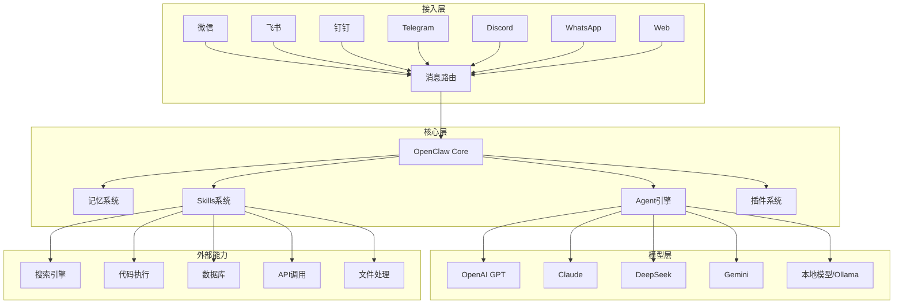
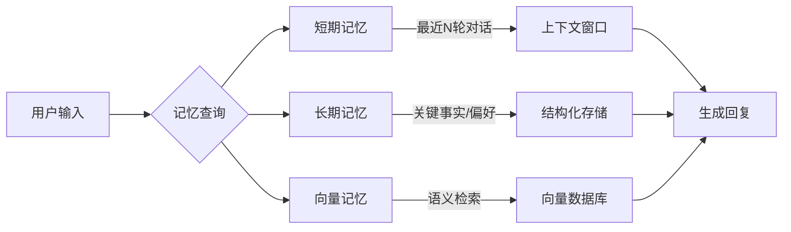
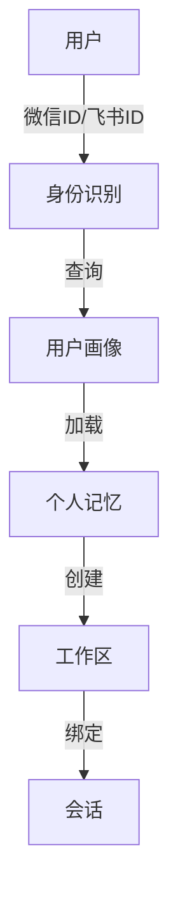
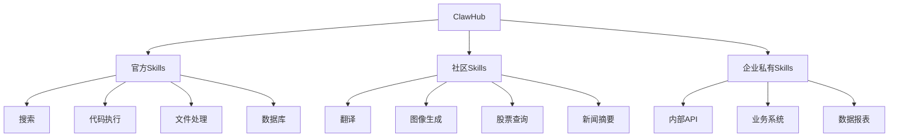
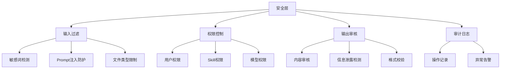

# OpenClaw 橙皮书：AI Agent 系统实战

> **资料来源**：花叔《OpenClaw 橙皮书：从入门到精通》（v1.0, 2026年3月）
> **适合人群**：希望构建 AI Agent 系统的开发者
> **难度**：⭐⭐⭐（中等）

---

## 1. OpenClaw 是什么

OpenClaw 是一个**开源、自托管的 AI Agent 系统**，核心理念是让 AI 从「聊天工具」升级为「能自主执行任务的数字员工」。

### 1.1 与 ChatGPT 的核心区别

| 维度 | ChatGPT | OpenClaw |
|------|---------|----------|
| 交互模式 | 你问它答 | 自主执行任务 |
| 运行环境 | 网页/App | 自托管服务器，接入20+消息平台 |
| 可扩展性 | GPTs 商店 | ClawHub 技能市场（13000+ Skills） |
| 数据控制 | 数据在 OpenAI | 完全本地，你拥有所有数据 |
| 模型选择 | 仅 GPT 系列 | Claude / GPT / DeepSeek / Gemini / Ollama |
| 开源协议 | 否 | MIT License，完全开源 |

### 1.2 核心架构



---

## 2. 技术架构详解

### 2.1 记忆系统（Memory）

OpenClaw 的记忆系统分三层：



| 记忆类型 | 存储内容 | 实现方式 | TTL |
|---------|---------|---------|-----|
| 短期记忆 | 当前会话的完整对话历史 | 内存/Redis | 会话结束 |
| 长期记忆 | 用户偏好、重要事实、身份识别 | SQLite/PostgreSQL | 永久 |
| 向量记忆 | 对话摘要、知识片段 | Chroma/Pinecone | 永久 |

**记忆优先级算法**：
1. 先匹配短期记忆（最近对话上下文）
2. 再检索向量记忆（语义相似的历史对话）
3. 最后查询长期记忆（用户画像和偏好）

### 2.2 Agent 工作区（Workspace）

每个对话会话是一个独立的工作区，包含：
- **上下文状态**：当前对话的完整历史
- **临时变量**：Skill 执行过程中的中间数据
- **文件存储**：用户上传和生成的文件
- **执行日志**：Agent 的思考和行动记录

### 2.3 Session 与用户识别



**多平台统一身份**：
- 同一个用户在微信、飞书、钉钉的账号可以关联
- 跨平台的对话历史和偏好共享

---

## 3. Skills 系统

Skills 是 OpenClaw 的核心扩展机制，相当于 AI 的「工具箱」。

### 3.1 Skill 结构

```yaml
# 示例 Skill：天气查询
name: weather
version: "1.0.0"
description: 查询指定城市的天气信息
author: openclaw-team

# 触发方式
triggers:
  - keyword: "天气"
  - keyword: "气温"
  - regex: ".*?(今天|明天|后天).*?天气"

# 参数定义
parameters:
  city:
    type: string
    description: 城市名称
    required: true
  date:
    type: string
    description: 日期，默认今天
    required: false
    default: "today"

# 执行逻辑
handler: |
  async function(ctx, params) {
    const { city, date } = params;
    const weather = await ctx.tools.http.get(
      `https://api.weather.com/v1/current?city=${city}&date=${date}`
    );
    return `${city} ${date}天气：${weather.condition}，${weather.temp}°C`;
  }
```

### 3.2 ClawHub 技能市场



**热门 Skills 分类**：

| 分类 | 代表 Skills | 使用场景 |
|------|------------|----------|
| 信息获取 | 搜索、新闻、股票、天气 | 实时信息查询 |
| 内容生成 | 图像生成、文案、翻译 | 创意工作 |
| 代码开发 | 代码执行、Git操作、部署 | 开发辅助 |
| 办公效率 | 日程管理、邮件、待办 | 日常办公 |
| 数据分析 | 图表生成、统计分析 | 数据工作 |
| 企业服务 | CRM、ERP、OA 集成 | 业务系统 |

### 3.3 自建 Skill 指南

**开发环境准备**：
```bash
# 安装 OpenClaw CLI
npm install -g @openclaw/cli

# 创建新 Skill
claw skill create my-skill

# 本地测试
claw skill test my-skill

# 打包发布
claw skill publish my-skill
```

**Skill 开发最佳实践**：
1. **单一职责**：每个 Skill 只做一件事
2. **参数校验**：严格验证输入参数
3. **错误处理**：所有外部调用都有 try-catch
4. **权限控制**：敏感操作需要用户授权
5. **日志记录**：记录执行过程和结果

---

## 4. 部署方案

### 4.1 部署方式对比

| 方式 | 难度 | 成本 | 适用场景 |
|------|------|------|----------|
| **本地安装** | ⭐⭐ | 低 | 个人开发测试 |
| **Docker 部署** | ⭐⭐⭐ | 中 | 小团队/创业公司 |
| **云服务器** | ⭐⭐⭐ | 中 | 中小规模生产 |
| **K8s 集群** | ⭐⭐⭐⭐⭐ | 高 | 大规模企业部署 |

### 4.2 Docker 一键部署

```yaml
# docker-compose.yml
version: '3.8'
services:
  openclaw:
    image: openclaw/openclaw:latest
    ports:
      - "3000:3000"
    environment:
      - DATABASE_URL=postgresql://user:pass@db:5432/openclaw
      - REDIS_URL=redis://redis:6379
      - OPENAI_API_KEY=${OPENAI_API_KEY}
      - DEEPSEEK_API_KEY=${DEEPSEEK_API_KEY}
    volumes:
      - ./data:/app/data
      - ./skills:/app/skills
    depends_on:
      - db
      - redis

  db:
    image: postgres:15
    environment:
      POSTGRES_USER: user
      POSTGRES_PASSWORD: pass
      POSTGRES_DB: openclaw
    volumes:
      - pgdata:/var/lib/postgresql/data

  redis:
    image: redis:7-alpine
    volumes:
      - redisdata:/data

volumes:
  pgdata:
  redisdata:
```

**部署命令**：
```bash
# 克隆配置模板
git clone https://github.com/openclaw/docker-template.git
cd docker-template

# 配置环境变量
cp .env.example .env
# 编辑 .env 填入 API Key

# 启动服务
docker-compose up -d

# 查看日志
docker-compose logs -f openclaw
```

### 4.3 模型配置

**多模型切换**：
```yaml
# config/models.yml
models:
  default: deepseek-v3

  providers:
    openai:
      api_key: ${OPENAI_API_KEY}
      models:
        - gpt-4o
        - gpt-4o-mini

    anthropic:
      api_key: ${ANTHROPIC_API_KEY}
      models:
        - claude-3-5-sonnet

    deepseek:
      api_key: ${DEEPSEEK_API_KEY}
      base_url: https://api.deepseek.com/v1
      models:
        - deepseek-chat
        - deepseek-reasoner

    ollama:
      base_url: http://localhost:11434
      models:
        - llama3:70b
        - qwen2:72b
```

**路由策略**：
- **按任务类型路由**：推理任务 → DeepSeek-R1，日常对话 → DeepSeek-V3
- **按成本路由**：简单任务 → 便宜模型，复杂任务 → 高级模型
- **按响应时间路由**：紧急任务 → 快模型，不紧急 → 慢但准的模型
- **Fallback**：主模型失败时自动切换备用模型

---

## 5. 渠道接入

### 5.1 支持的平台

| 类型 | 平台 | 接入方式 |
|------|------|----------|
| 国内IM | 微信（个人号/企业微信） | itchat/企业微信API |
| 国内IM | 飞书 | 飞书机器人 |
| 国内IM | 钉钉 | 钉钉机器人 |
| 国际IM | WhatsApp | WhatsApp Business API |
| 国际IM | Telegram | Bot API |
| 国际IM | Discord | Bot API |
| 国际IM | Slack | App API |
| 网页 | Web Chat | 嵌入 JS SDK |
| 邮件 | Email | IMAP/SMTP |

### 5.2 配置示例（飞书）

```yaml
# config/channels.yml
channels:
  feishu:
    type: feishu
    enabled: true
    app_id: ${FEISHU_APP_ID}
    app_secret: ${FEISHU_APP_SECRET}
    encrypt_key: ${FEISHU_ENCRYPT_KEY}
    verification_token: ${FEISHU_VERIFICATION_TOKEN}
    
    # 消息处理
    message_handler: default
    
    # 群聊配置
    group_chat:
      enabled: true
      at_only: true  # 只在被@时响应
      
    # 私聊配置
    private_chat:
      enabled: true
```

---

## 6. 安全与成本

### 6.1 安全模型



**安全措施**：
- **数据加密**：数据库加密存储，传输 HTTPS
- **沙箱执行**：Skill 代码在隔离环境运行
- **敏感操作确认**：涉及资金、删除等操作需用户确认
- **审计日志**：所有操作可追溯

### 6.2 成本控制

**成本构成**：
| 项目 | 说明 | 优化策略 |
|------|------|----------|
| API 费用 | 模型调用费用 | 模型路由、缓存、压缩 |
| 服务器 | 托管费用 | 按需扩展、Spot 实例 |
| 存储 | 数据、日志 | 定期清理、冷热分离 |
| 带宽 | 消息传输 | CDN、压缩 |

**成本优化技巧**：
1. **响应缓存**：相同/相似问题直接返回缓存结果
2. **模型降级**：根据问题复杂度选择合适模型
3. **上下文压缩**：历史对话摘要替代完整历史
4. **批量处理**：非实时任务批量调用 API
5. **本地模型**：简单任务用 Ollama 本地模型

---

## 7. 与职业发展关联

| 目标职位 | 核心技能 | OpenClaw 实践 |
|---------|---------|--------------|
| 大模型应用开发工程师 | Agent 开发、多平台集成 | 开发自定义 Skills、接入新渠道 |
| 大模型架构师 | 系统设计、多模型管理 | 设计路由策略、优化记忆系统 |
| 企业级部署工程师 | 私有化部署、运维监控 | Docker/K8s 部署、安全加固 |

---

## 8. 快速开始

```bash
# 1. 安装
npm install -g @openclaw/cli

# 2. 初始化项目
claw init my-agent
cd my-agent

# 3. 配置模型
claw config set-model deepseek-chat

# 4. 添加 Skill
claw skill install search
claw skill install weather

# 5. 启动
claw start

# 6. 测试
claw chat "北京今天天气怎么样？"
```

---

## 学习建议

1. **先部署再开发**：先跑起来，再深入定制
2. **从 Skill 开始**：开发几个简单 Skill 理解扩展机制
3. **关注社区**：ClawHub 有大量现成 Skills 可供学习
4. **对比其他框架**：与 LangChain、Dify 对比，理解设计差异
