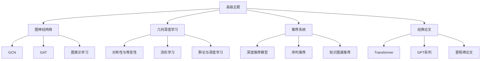
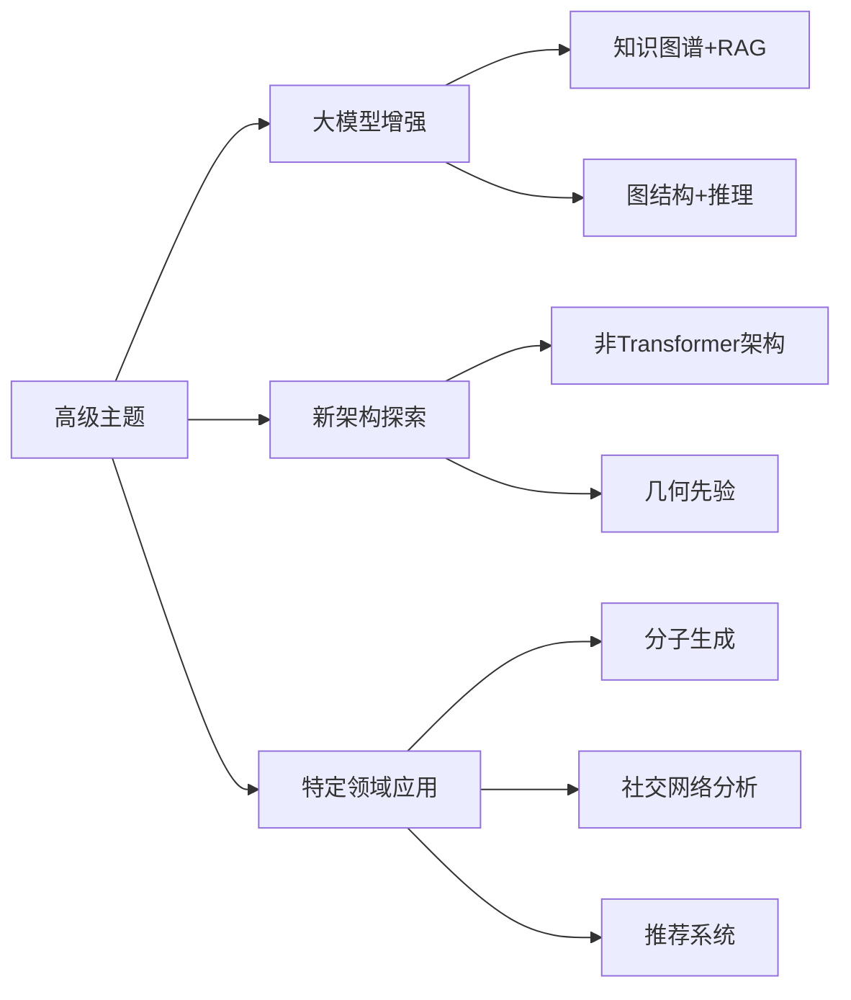

# 第八阶段：高级主题

> **核心目标**：拓展视野，了解大模型领域的前沿方向和扩展技术
> **难度**：⭐⭐⭐⭐⭐（极难）

---

## 本阶段知识结构

---

## 为什么需要学习高级主题

### 对职业发展的价值

| 方向 | 相关主题 | 应用场景 |
|------|----------|----------|
| 大模型架构师 | 所有高级主题 | 设计更优的模型架构 |
| 推荐算法工程师 | GNN + 推荐系统 | 构建智能推荐引擎 |
| AI研究员 | 经典论文 + 前沿方向 | 发表顶会论文 |
| 知识图谱工程师 | GNN | 构建企业知识库 |

### 与大模型的关联

---

## 各章节导览

| 章节 | 内容 | 适合人群 |
|------|------|----------|
| [图神经网络](gnn.md) | GCN、GAT、GraphSAGE、应用 | 需要处理图数据的开发者 |
| [几何深度学习](geometric-dl.md) | 对称性、等变性、流形、群论 | 研究者、对数学感兴趣的人 |
| [深度推荐系统](dl-recommender.md) | 深度模型在推荐中的应用 | 推荐算法工程师 |
| [大模型经典论文](classic-papers.md) | 里程碑论文精读 | 研究者、准备学术面试的人 |
| [MoE 与多模态架构](moe-and-multimodal.md) | MoE原理、视觉编码器、多模态融合、视频理解 | 架构师、研究者 |

---

## 学习建议

1. **按需学习**：不是所有内容都需要深入，根据职业方向选择
2. **先广度后深度**：先了解各方向的基本概念，再选1-2个深入
3. **关注交叉点**：GNN + LLM、推荐 + LLM 是当前热门交叉方向
4. **读论文**：高级主题必须以论文为主要学习材料

---

## 前沿方向（拓展）

### 当前研究热点

| 方向 | 核心问题 | 代表工作 |
|------|----------|----------|
| **长上下文** | 如何高效处理100K+ tokens | Ring Attention, LongRoPE, YaRN |
| **多模态** | 统一建模文本、图像、音频、视频 | GPT-4o, Gemini, Qwen2.5-VL |
| **MoE** | 稀疏激活的大参数模型 | Mixtral, DeepSeek-V3, Qwen-MoE |
| **世界模型** | AI理解物理世界 | Sora, Genie |
| **Agent** | 自主决策和行动 | ReAct, MCP, A2A |
| **高效架构** | 替代Transformer | Mamba, TTT, Griffin |
| **对齐** | 让模型更安全、更可控 | DPO, KTO, RLHF, Constitutional AI |
| **推理增强** | 提升数学和逻辑推理 | CoT, ToT, o1/o3, DeepSeek-R1 |

### 推荐阅读资源

- **arXiv**: cs.CL, cs.LG, cs.AI
- **Papers With Code**: 论文+代码
- **HuggingFace Blog**: 模型和技术解读
- **Distill.pub**: 可视化解释
- **Lil'Log**: 技术博客（ Transformer、扩散模型等）
