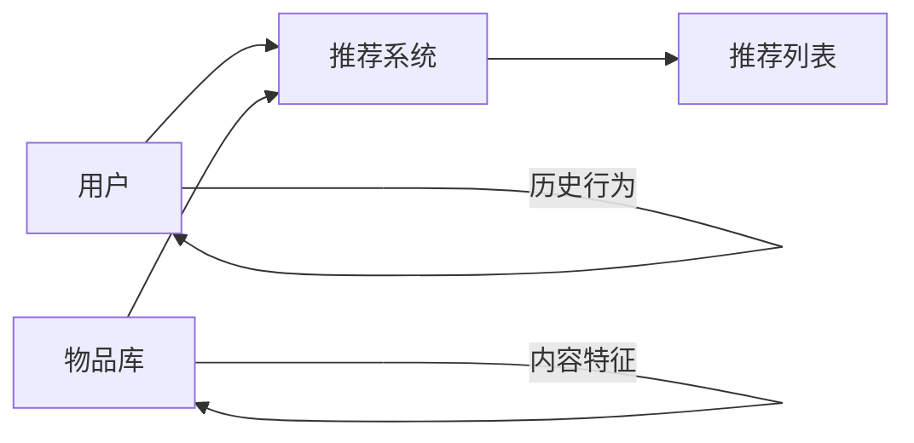
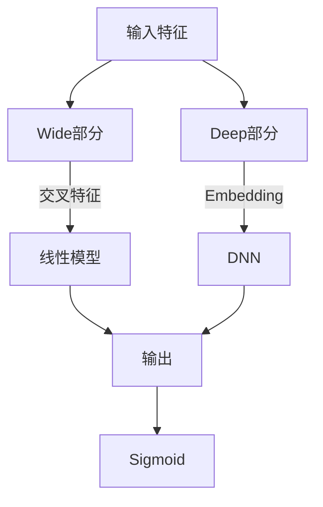
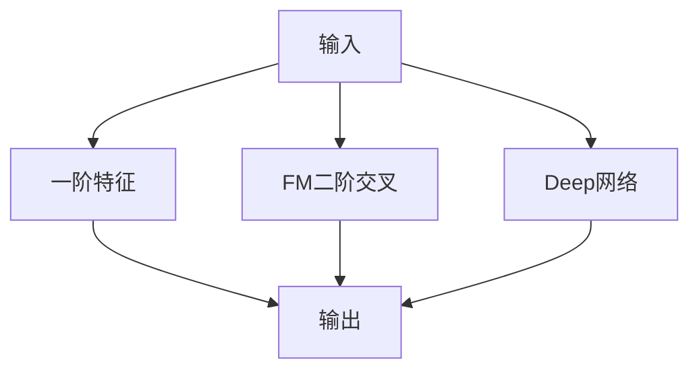
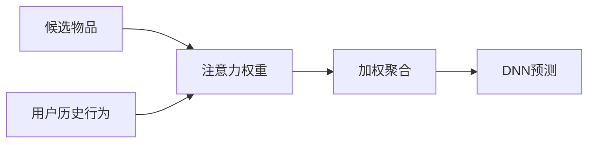
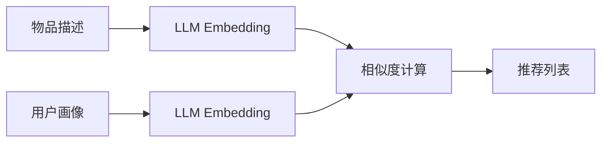
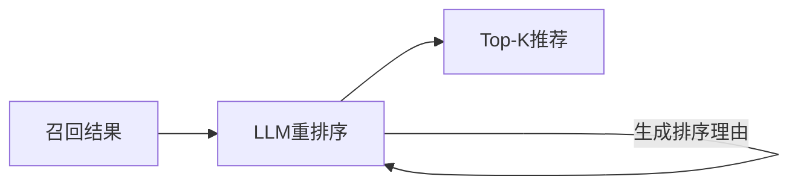
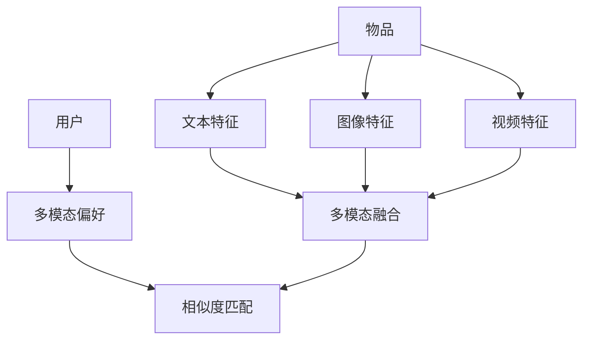
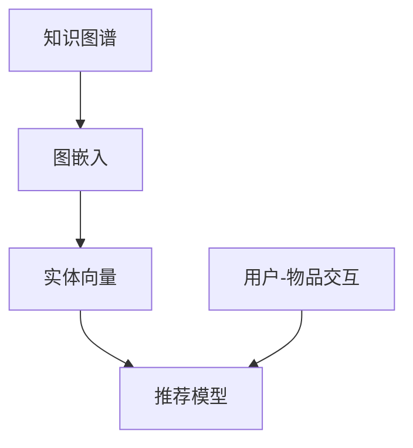
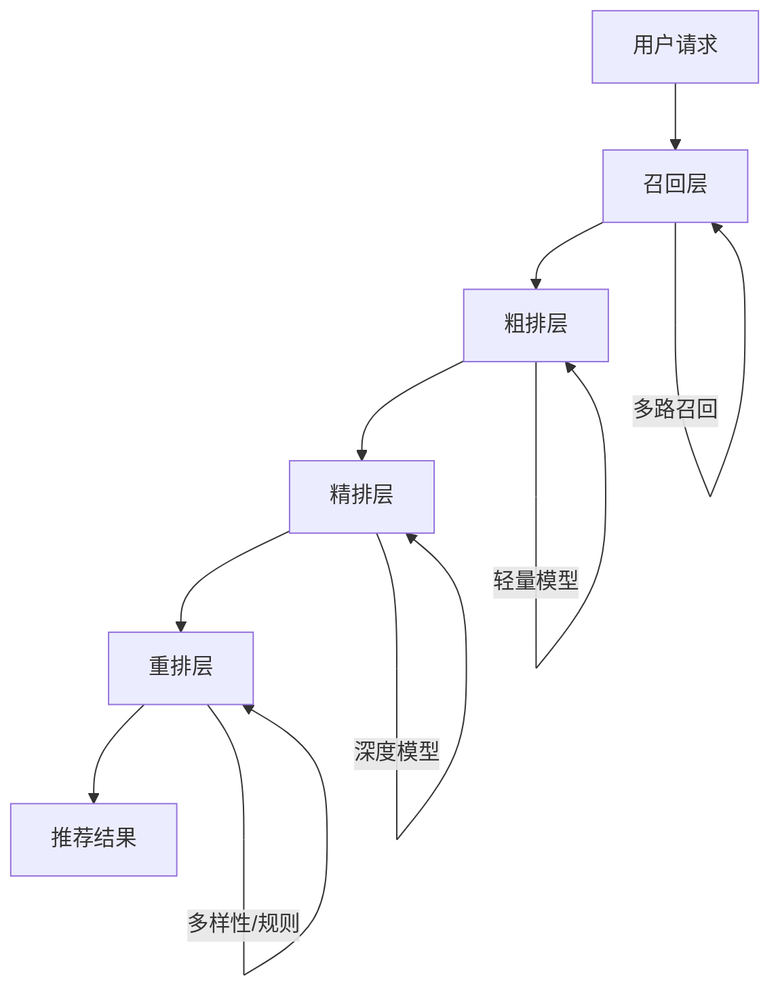

# 深度学习推荐系统

> **资料来源**：Deep Learning Recommender Systems (CRC Press)
> **适合人群**：推荐系统方向的工程师
> **难度**：⭐⭐⭐⭐（较难）

---

## 1. 推荐系统基础

### 1.1 核心问题



**预测目标**：
$$\hat{r}_{ui} = f(u, i)$$

即预测用户 $u$ 对物品 $i$ 的偏好分数。

### 1.2 经典方法回顾

| 方法 | 原理 | 优点 | 缺点 |
|------|------|------|------|
| **协同过滤** | 找相似用户/物品 | 无需内容分析 | 冷启动、稀疏性 |
| **矩阵分解** | 分解用户-物品矩阵 | 可扩展 | 线性，表达能力有限 |
| **基于内容** | 匹配用户画像和物品特征 | 无冷启动 | 难以发现新兴趣 |

---

## 2. 深度推荐模型

### 2.1 Wide & Deep（Google, 2016）

**核心思想**：结合记忆（memorization）和泛化（generalization）



- **Wide**：线性模型 + 交叉特征，记忆历史规律
- **Deep**：DNN + Embedding，学习泛化特征组合

**适用场景**：Google Play 应用推荐

### 2.2 DeepFM（Huawei, 2017）

**改进**：用 FM 替代 Wide 部分的特征工程



- **FM（Factorization Machine）**：自动学习二阶特征交叉
- **Deep**：DNN 学习高阶特征交叉
- **优势**：无需人工特征工程

### 2.3 DIN（Deep Interest Network, Alibaba, 2018）

**核心创新**：注意力机制建模用户动态兴趣



**关键洞察**：
- 用户对不同候选物品，历史行为的重要性不同
- 用注意力机制自动学习权重
- 例：看体育新闻时，历史体育行为权重高；看娱乐时，娱乐行为权重高

**注意力公式**：
$$w_i = \text{softmax}(e_i \cdot e_a)$$

其中 $e_i$ 是历史物品嵌入，$e_a$ 是候选物品嵌入。

### 2.4 DIEN（Deep Interest Evolution Network）

**改进**：建模用户兴趣的**演化过程**

- 使用 GRU 建模行为序列
- 引入注意力更新门
- 捕捉兴趣随时间的变化

### 2.5 序列推荐模型

**SASRec（Self-Attentive Sequential Recommendation）**：
- 用 Transformer 建模用户行为序列
- 自注意力捕捉长距离依赖
- 位置编码保留时序信息

```
用户行为序列：[手机, 手机壳, 耳机, 充电器]
                    ↓
              Transformer
                    ↓
            预测下一个：充电宝？
```

---

## 3. 大模型时代的推荐系统

### 3.1 LLM 作为推荐器

**Prompt-based 推荐**：

```
用户历史：
1. 看了《三体》
2. 看了《流浪地球》
3. 看了《星际穿越》

请推荐下一部可能喜欢的电影，并说明理由。
```

**优势**：
- 强大的语义理解能力
- 可解释性强（给出推荐理由）
- 零样本/少样本能力

**劣势**：
- 延迟高（生成式）
- 成本高（调用 API）
- 缺乏协同信号

### 3.2 LLM 增强的推荐

**方案一：LLM 生成 Embedding**



- 用 LLM 编码物品描述文本
- 语义相似度匹配
- 解决冷启动（新物品有描述即可）

**方案二：LLM 生成特征**

- LLM 分析用户评论，提取情感、偏好特征
- LLM 分析物品描述，提取类别、属性特征
- 传统模型用这些特征做推荐

**方案三：LLM 做重排序**



- 先用传统方法召回候选集（快）
- 再用 LLM 精排（准）

### 3.3 生成式推荐

**直接生成推荐列表**：

```
输入：用户画像 + 场景
输出：推荐物品列表（文本形式）

示例：
用户：25岁，男性，喜欢科幻和科技
场景：周末休闲

推荐：
1. 《沙丘2》- 史诗级科幻，视觉效果震撼
2. Apple Vision Pro - 沉浸式娱乐体验
3. 《黑客帝国》重映 - 经典回顾
```

---

## 4. 多模态推荐

**场景**：推荐包含文本、图像、视频的物品



**融合策略**：
| 策略 | 方法 | 特点 |
|------|------|------|
| 早期融合 | 拼接特征 | 简单，但模态间干扰 |
| 晚期融合 | 分别预测再组合 | 灵活，但丢失交互 |
| 注意力融合 | 学习模态权重 | 自适应，效果好 |

---

## 5. 知识图谱增强推荐

### 5.1 为什么需要知识图谱

**传统推荐的局限**：
- 只依赖交互数据（谁买了什么）
- 不理解物品之间的关系
- 无法做跨域推荐

**知识图谱的价值**：
```
《三体》 --作者--> 刘慈欣
《三体》 --类型--> 科幻
《三体》 --系列--> 三体三部曲
刘慈欣 --国籍--> 中国
科幻 --父类--> 小说
```

**应用**：
- 基于路径的推荐："喜欢《三体》→ 喜欢刘慈欣 → 喜欢《流浪地球》"
- 可解释推荐："因为您喜欢科幻小说"

### 5.2 KG 与 GNN 结合



**代表模型**：
- RippleNet：用户兴趣沿 KG 传播
- KGCN：用 GNN 聚合 KG 邻居信息
- KGAT：注意力机制选择重要的 KG 关系

---

## 6. 工业实践

### 6.1 推荐系统架构



| 层 | 数量 | 延迟要求 | 模型复杂度 |
|----|------|----------|-----------|
| 召回 | 万级 → 千级 | < 50ms | 简单 |
| 粗排 | 千级 → 百级 | < 20ms | 中等 |
| 精排 | 百级 → 十级 | < 50ms | 复杂 |
| 重排 | 十级 | < 10ms | 规则/启发式 |

### 6.2 评估指标

| 指标 | 定义 | 适用 |
|------|------|------|
| **AUC** | ROC曲线下面积 | 二分类（点击/不点击）|
| **NDCG** | 归一化折损累积增益 | 排序质量 |
| **HR@K** | K 以内命中率 | 召回效果 |
| **Coverage** | 推荐覆盖的物品比例 | 多样性 |
| **Novelty** | 推荐物品的新颖度 | 探索能力 |

---

## 7. 面试考点

1. **Wide & Deep 中 Wide 和 Deep 各解决什么问题？**
   - Wide：记忆能力，捕捉历史出现的特征组合
   - Deep：泛化能力，学习未出现过的特征组合

2. **DIN 的注意力机制与传统注意力有何不同？**
   - 传统：查询-键-值来自不同来源
   - DIN：查询是候选物品，键和值是用户历史
   - 动态权重：不同候选触发不同的历史兴趣

3. **冷启动问题如何解决？**
   - 新用户：基于人口统计学、引导选择
   - 新物品：内容特征、相似物品推荐
   - LLM：利用描述文本生成 Embedding

4. **推荐中的偏差问题**
   - 位置偏差：用户更可能点击排在前面的物品
   - 流行度偏差：热门物品被过度推荐
   - 解决：IPS（逆倾向评分）、因果推断

---

## 学习建议

1. **先理解经典模型**：Wide&Deep、DeepFM、DIN 是面试常考
2. **关注工业实践**：阿里、字节、美团的技术博客
3. **了解 LLM+推荐**：这是当前研究热点
4. **动手实现**：用 PyTorch 复现一个简单推荐模型
