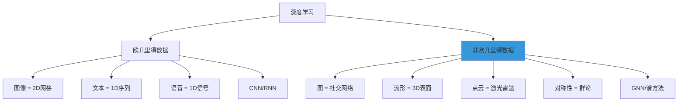
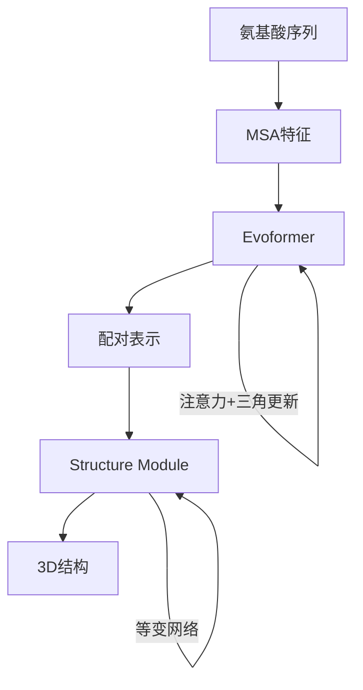

# 几何深度学习

> **资料来源**：Geometric Deep Learning (Michael M. Bronstein 等)
> **适合人群**：希望理解图数据和几何结构深度学习的读者
> **难度**：⭐⭐⭐⭐⭐（很难）

---

## 1. 什么是几何深度学习

Geometric Deep Learning (GDL) 是一个**统一的数学框架**，将深度学习推广到**非欧几里得数据**（图、流形、网格、点云等）。



---

## 2. 核心思想：对称性与不变性

### 2.1 从对称性看深度学习

```mermaid
graph LR
    A[数据] --> B[对称群G]
    B --> C[不变性]
    B --> D[等变性]
    C --> E[f(g·x) = f(x)]
    D --> F[f(g·x) = g·f(x)]
```

| 数据域 | 对称群 | 性质 | 网络 |
|--------|--------|------|------|
| 集合 | 置换群 $S_n$ | 置换不变 | DeepSets |
| 网格/图像 | 平移群 $\mathbb{Z}^2$ | 平移等变 | CNN |
| 图 | 置换群（节点重标号） | 置换不变/等变 | GNN |
| 流形/网格 | 等距群 | 等距不变/等变 | 谱CNN |
| 点云 | 欧几里得群 $E(3)$ | 旋转平移等变 | E(3)-等变网络 |

### 2.2 关键定义

**不变性（Invariance）**：输入经过变换后，输出不变
$$f(g \cdot x) = f(x)$$

**等变性（Equivariance）**：输入变换后，输出按相同方式变换
$$f(g \cdot x) = g \cdot f(x)$$

**示例**：
- 图像分类：图像平移 → 类别不变（不变性）
- 语义分割：图像平移 → 分割结果平移（等变性）
- 分子能量预测：分子旋转 → 能量不变（不变性）

---

## 3. 几何深度学习的五类架构

### 3.1 全局对称性（Global Symmetry）

**特点**：整个输入空间具有统一的对称性

| 架构 | 对称性 | 代表工作 |
|------|--------|----------|
| CNN | 平移 | LeNet, ResNet |
| RNN | 时移 | LSTM, GRU |
| Transformer | 置换（注意力） | BERT, GPT |
| DeepSets | 置换 | PointNet (早期) |

### 3.2 局部对称性（Local Symmetry / Gauge Symmetry）

**特点**：每个局部区域有自己的坐标系，需要坐标无关的表示

| 架构 | 应用 | 代表工作 |
|------|------|----------|
| 谱CNN | 流形/网格 | Bruna et al. 2013 |
| MeshCNN | 3D网格 | MeshCNN (2019) |
| 测地线CNN | 表面 | Masci et al. 2015 |

### 3.3 图上的学习

**特点**：不规则结构，置换对称性

详见 [图神经网络](gnn.md) 章节。

### 3.4 群等变网络

**特点**：对特定群（如旋转群 SO(3)）等变

**应用场景**：
- 分子性质预测（分子旋转不应改变能量）
- 3D 物体识别
- 物理模拟

**代表工作**：
- TFN (Tensor Field Network)
- SE(3)-Transformer
- E(3)-NN

### 3.5 生成模型

**特点**：学习生成具有特定几何结构的数据

| 类型 | 应用 |
|------|------|
| 图生成 | 分子设计、社交网络合成 |
| 点云生成 | 3D 物体重建 |
| 网格生成 | 3D 建模 |

---

## 4. 谱方法 vs 空间方法

### 4.1 谱图理论

**图拉普拉斯矩阵**：
$$L = D - A$$

归一化形式：
$$L_{sym} = D^{-1/2}LD^{-1/2} = I - D^{-1/2}AD^{-1/2}$$

**特征分解**：
$$L = U\Lambda U^T$$

其中 $U$ 是特征向量矩阵，$\Lambda$ 是特征值对角矩阵。

**谱卷积**：
$$x *_{G} y = U((U^T x) \odot (U^T y))$$

### 4.2 谱方法与空间方法对比

| 特性 | 谱方法 | 空间方法 |
|------|--------|----------|
| 基础 | 图傅里叶变换 | 邻居聚合 |
| 局部性 | 全局（需近似） | 局部 |
| 归纳能力 | 弱（依赖特定图） | 强 |
| 计算效率 | $O(n^2)$ | $O(|E|)$ |
| 代表 | ChebNet | GCN, GraphSAGE, GAT |

**趋势**：空间方法更实用，谱方法提供理论洞察

---

## 5. 应用案例

### 5.1 AlphaFold：蛋白质结构预测



**几何先验**：
- 旋转平移不变性（SE(3) 等变）
- 反演对称性（手性）

### 5.2 分子发现

**任务**：发现具有特定性质的新分子

**流程**：
```
分子图 → GNN编码器 → 性质预测 → 优化 → 新分子
```

**几何约束**：
- 分子能量在旋转下不变
- 键角、键长有物理约束

### 5.3 3D 计算机视觉

**点云处理**：
- PointNet：置换不变网络
- PointNet++：层次化特征学习
- DGCNN：动态图卷积

**旋转等变**：
- 物体识别不应受视角影响
- 旋转等变网络保证这一点

---

## 6. 与大模型的关联

### 6.1 Transformer 是图神经网络

**关键洞察**：
- Transformer 的注意力机制 = 全连接图上的 GAT
- 序列中的每个 token = 图中的一个节点
- 自注意力 = 节点间的消息传递

```
Transformer: 每个 token 关注所有其他 token
            = 全连接图的 GNN

区别：
- Transformer 有位置编码（序列顺序）
- GNN 有图结构（邻接关系）
```

### 6.2 知识图谱增强 LLM

- 将结构化知识（图）注入语言模型
- 减少幻觉，提升推理能力
- 代表：KG-BERT、ERNIE、KGLM

### 6.3 多模态大模型中的几何

- 处理 3D 数据（分子、蛋白质、点云）
- 需要几何先验（等变性、不变性）
- 代表：Uni-Mol、GearNet

---

## 7. 数学基础

### 7.1 群论基础

**群（Group）**：一个集合 $G$ 配上一个二元运算，满足：
1. 封闭性：$g_1 \cdot g_2 \in G$
2. 结合律：$(g_1 \cdot g_2) \cdot g_3 = g_1 \cdot (g_2 \cdot g_3)$
3. 单位元：$\exists e \in G, g \cdot e = e \cdot g = g$
4. 逆元：$\exists g^{-1} \in G, g \cdot g^{-1} = e$

**常见群**：
| 群 | 运算 | 应用 |
|----|------|------|
| $SO(2)$ | 2D 旋转 | 图像旋转 |
| $SO(3)$ | 3D 旋转 | 分子/3D物体 |
| $SE(3)$ | 3D 旋转+平移 | 刚体变换 |
| $S_n$ | 置换 | 集合/图 |

### 7.2 表示理论

**群表示**：将群元素映射为矩阵
$$\rho: G \to GL(V)$$

**等变映射**：与群表示交换的映射
$$f(\rho(g) \cdot x) = \rho'(g) \cdot f(x)$$

**在深度学习中的应用**：
- 设计等变网络层
- 保证网络满足对称性约束

---

## 学习建议

1. **先学 GNN**：Geometric DL 的入门路径
2. **理解对称性**：这是核心思想，不只是技术
3. **关注应用**：分子发现、3D视觉是最有前景的方向
4. **数学基础**：线性代数、群论、微分几何
5. **跟踪前沿**：关注 Michael Bronstein、Max Welling 等学者
