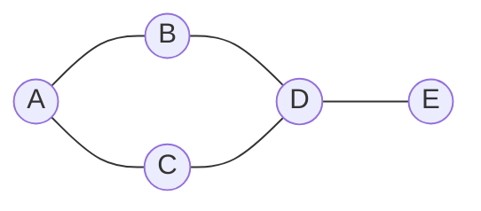
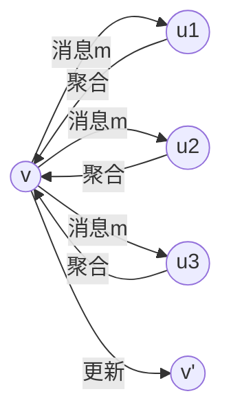
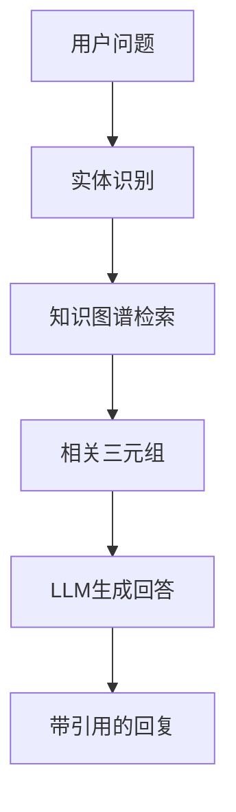

# 图神经网络

> **资料来源**：《图神经网络导论》、《图神经网络实战》
> **适合人群**：需要处理图结构数据的开发者
> **难度**：⭐⭐⭐⭐（较难）

---

## 1. 为什么需要图神经网络

许多现实世界的数据天然是**图结构**：

| 领域 | 节点 | 边 | 应用场景 |
|------|------|-----|----------|
| 社交网络 | 用户 | 关注/好友关系 | 社区发现、影响力分析 |
| 知识图谱 | 实体 | 关系 | 问答系统、推理 |
| 推荐系统 | 用户/物品 | 交互 | 个性化推荐 |
| 分子化学 | 原子 | 化学键 | 药物发现、性质预测 |
| 交通网络 | 路口 | 道路 | 路况预测、路径规划 |
| 代码分析 | 函数/类 | 调用关系 | 漏洞检测、代码补全 |

**传统深度学习的局限**：
- CNN：处理网格数据（图像），需要平移不变性
- RNN：处理序列数据（文本），需要时序结构
- 图数据：节点数不固定、邻居数不固定、无固定顺序

---

## 2. 图基础

### 2.1 图的表示



**数学表示**：
- 图 $G = (V, E)$，其中 $V$ 是节点集合，$E$ 是边集合
- 邻接矩阵 $A \in \{0,1\}^{n \times n}$，$A_{ij} = 1$ 表示节点 $i$ 和 $j$ 之间有边
- 度矩阵 $D$，$D_{ii} = \sum_j A_{ij}$（节点 $i$ 的邻居数）
- 特征矩阵 $X \in \mathbb{R}^{n \times d}$，每行是节点的特征向量

### 2.2 图上的机器学习任务

| 任务类型 | 目标 | 示例 |
|---------|------|------|
| **节点分类** | 预测节点的标签 | 用户画像、蛋白质功能 |
| **链接预测** | 预测两个节点间是否有边 | 好友推荐、知识图谱补全 |
| **图分类** | 预测整个图的标签 | 分子性质、文档分类 |
| **图生成** | 生成新的图结构 | 分子设计、社交网络模拟 |

---

## 3. 消息传递框架（Message Passing）

### 3.1 核心思想



**通用公式**：

$$h_v^{(l+1)} = \text{UPDATE}\left(h_v^{(l)}, \text{AGGREGATE}\left(\{h_u^{(l)} : u \in N(v)\}\right)\right)$$

其中：
- $h_v^{(l)}$：节点 $v$ 在第 $l$ 层的特征
- $N(v)$：节点 $v$ 的邻居集合
- AGGREGATE：聚合邻居信息（sum/mean/max）
- UPDATE：更新节点表示（通常用神经网络）

### 3.2 聚合函数对比

| 聚合函数 | 公式 | 特点 |
|---------|------|------|
| **Mean** | $\frac{1}{|N(v)|}\sum_{u \in N(v)} h_u$ | 平滑，适合度数均匀分布 |
| **Sum** | $\sum_{u \in N(v)} h_u$ | 保留度数信息，但可能偏向高度数节点 |
| **Max** | $\max_{u \in N(v)} h_u$ | 保留最显著特征，适合离散特征 |

---

## 4. 经典 GNN 架构

### 4.1 GCN（Graph Convolutional Network）

**核心思想**：将谱图卷积简化为一阶近似

**传播规则**：

$$H^{(l+1)} = \sigma\left(\tilde{D}^{-\frac{1}{2}}\tilde{A}\tilde{D}^{-\frac{1}{2}}H^{(l)}W^{(l)}\right)$$

其中：
- $\tilde{A} = A + I$（加上自环）
- $\tilde{D}$ 是 $\tilde{A}$ 的度矩阵
- $W^{(l)}$ 是可学习的权重矩阵
- $\sigma$ 是激活函数

**直观理解**：
- 每个节点的更新 = 自身特征 + 邻居特征的加权平均
- 归一化项 $\tilde{D}^{-1/2}\tilde{A}\tilde{D}^{-1/2}$ 防止高度数节点主导

**PyTorch Geometric 实现**：
```python
import torch.nn as nn
from torch_geometric.nn import GCNConv

class GCN(nn.Module):
    def __init__(self, in_channels, hidden_channels, out_channels):
        super().__init__()
        self.conv1 = GCNConv(in_channels, hidden_channels)
        self.conv2 = GCNConv(hidden_channels, out_channels)

    def forward(self, x, edge_index):
        # x: 节点特征 (N, in_channels)
        # edge_index: 边索引 (2, E)
        x = self.conv1(x, edge_index).relu()
        x = self.conv2(x, edge_index)
        return x
```

### 4.2 GraphSAGE

**核心创新**：归纳式学习（Inductive Learning）

- GCN 是直推式（Transductive）：训练时需要整个图
- GraphSAGE 是归纳式：可以处理训练时没见过的节点

**聚合方式**：

$$h_v^{(l+1)} = \sigma\left(W^{(l)} \cdot \text{CONCAT}\left(h_v^{(l)}, \text{AGGREGATE}\left(\{h_u^{(l)}, \forall u \in N(v)\}\right)\right)\right)$$

**采样策略**：
- 不聚合所有邻居，而是采样固定数量（如 K=25）
- 大幅降低计算和内存开销

### 4.3 GAT（Graph Attention Network）

**核心创新**：为每个邻居学习不同的注意力权重

**注意力系数**：

$$\alpha_{vu} = \frac{\exp(\text{LeakyReLU}(a^T[Wh_v \| Wh_u]))}{\sum_{k \in N(v)}\exp(\text{LeakyReLU}(a^T[Wh_v \| Wh_k]))}$$

**输出**：

$$h_v^{(l+1)} = \sigma\left(\sum_{u \in N(v)} \alpha_{vu} W h_u^{(l)}\right)$$

**多头注意力**：
- 类似 Transformer，并行计算多个注意力头
- 拼接或平均多个头的输出

**优势**：
- 自动学习邻居重要性
- 可解释性强（注意力权重可视化）
- 性能通常优于 GCN

### 4.4 GIN（Graph Isomorphism Network）

**核心创新**：理论上与 Weisfeiler-Lehman (WL) 图同构测试一样强大

**更新公式**：

$$h_v^{(l+1)} = \text{MLP}\left((1 + \epsilon)h_v^{(l)} + \sum_{u \in N(v)} h_u^{(l)}\right)$$

**为什么更强？**
- GCN/GraphSAGE 的聚合函数（mean/max）可能丢失信息
- GIN 的 sum 聚合 + MLP 更新可以区分更多图结构

### 4.5 模型对比

| 模型 | 聚合方式 | 归纳能力 | 注意力 | 表达能力 |
|------|----------|----------|--------|----------|
| GCN | 归一化均值 | 否 | 无 | 中 |
| GraphSAGE | 采样 + 均值/池化 | 是 | 无 | 中 |
| GAT | 注意力加权 | 是 | 有 | 高 |
| GIN | Sum + MLP | 是 | 无 | 最高 |

---

## 5. 图上的预训练

类似 BERT 的预训练-微调范式：

### 5.1 节点级别预训练

- **属性预测**：预测节点属性（如分子中原子类型）
- **上下文预测**：预测节点的上下文结构

### 5.2 图级别预训练

- **图属性预测**：预测整个图的属性（如分子毒性）
- **图对比学习**：对比不同增强视图的图表示

### 5.3 知识图谱预训练

- **链接预测**：预测缺失的关系
- **实体对齐**：对齐不同知识图谱中的相同实体

---

## 6. 与大模型的结合

### 6.1 知识图谱 + LLM



**价值**：
- 减少幻觉：用结构化知识约束生成
- 可解释性：回答可以追溯知识来源
- 实时更新：知识图谱可以动态更新

### 6.2 图结构增强的 RAG

- 传统 RAG：基于文本相似度检索
- 图 RAG：结合实体关系和文本内容
- 可以回答需要多跳推理的问题

### 6.3 分子发现

**场景**：发现具有特定性质的新分子

**流程**：
```
分子图 → GNN编码 → 性质预测 → 优化 → 新分子
```

**代表工作**：
- AlphaFold：蛋白质结构预测
- Graphormer：分子表示学习
- GNN + 生成模型：分子生成

---

## 7. PyTorch Geometric 实战

### 7.1 安装

```bash
pip install torch-geometric
# 根据 CUDA 版本选择
pip install pyg-lib torch-scatter torch-sparse -f https://data.pyg.org/whl/torch-2.0.0+cu118.html
```

### 7.2 节点分类完整示例

```python
import torch
import torch.nn.functional as F
from torch_geometric.nn import GCNConv
from torch_geometric.datasets import Planetoid

# 加载数据集（Cora：论文引用网络）
dataset = Planetoid(root='/tmp/Cora', name='Cora')
data = dataset[0]

class GCN(torch.nn.Module):
    def __init__(self):
        super().__init__()
        self.conv1 = GCNConv(dataset.num_features, 16)
        self.conv2 = GCNConv(16, dataset.num_classes)

    def forward(self, data):
        x, edge_index = data.x, data.edge_index
        x = self.conv1(x, edge_index)
        x = F.relu(x)
        x = F.dropout(x, training=self.training)
        x = self.conv2(x, edge_index)
        return F.log_softmax(x, dim=1)

# 训练
device = torch.device('cuda' if torch.cuda.is_available() else 'cpu')
model = GCN().to(device)
data = data.to(device)
optimizer = torch.optim.Adam(model.parameters(), lr=0.01)

model.train()
for epoch in range(200):
    optimizer.zero_grad()
    out = model(data)
    loss = F.nll_loss(out[data.train_mask], data.y[data.train_mask])
    loss.backward()
    optimizer.step()

# 测试
model.eval()
pred = model(data).argmax(dim=1)
acc = (pred[data.test_mask] == data.y[data.test_mask]).sum().item() / data.test_mask.sum().item()
print(f'Test Accuracy: {acc:.4f}')  # 约 0.81
```

---

## 8. 面试考点

1. **GCN 的归一化为什么要用 $D^{-1/2}AD^{-1/2}$？**
   - 对称归一化，防止高度数节点主导
   - 保持谱性质，对应于图拉普拉斯的归一化

2. **GNN 的过平滑问题（Over-smoothing）**
   - 深层 GNN 中，所有节点表示趋于相同
   - 解决：残差连接、DropEdge、Jumping Knowledge

3. **GraphSAGE 的采样策略**
   - 固定采样 K 个邻居，控制计算复杂度
   - 支持归纳式学习（新节点无需重新训练）

4. **GAT 的注意力机制与 Transformer 的区别**
   - GAT：注意力的对象是图邻居
   - Transformer：注意力的对象是序列中的所有位置
   - Transformer 可以看作全连接图的 GAT

5. **GNN 在大规模图上的挑战**
   - 内存：无法加载整个图
   - 解决：图采样（GraphSAGE）、子图训练（Cluster-GCN）、邻居采样

---

## 学习建议

1. **理解消息传递**：这是所有 GNN 的核心
2. **动手实现**：先用 PyTorch 手写简单 GCN，再用 PyG
3. **可视化**：画出图结构和注意力权重，建立直观理解
4. **关注应用**：GNN + LLM 是当前热门方向
