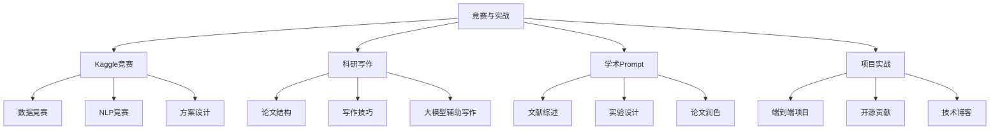
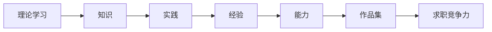
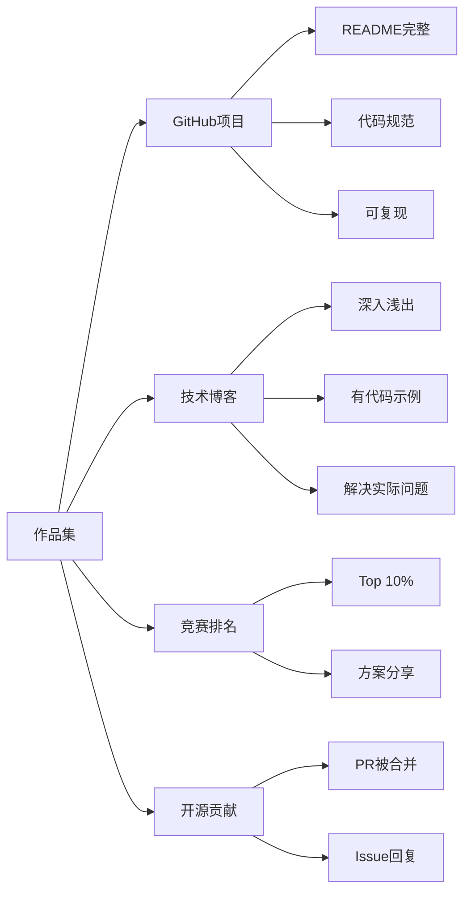

# 第九阶段：竞赛与实战

> **核心目标**：通过竞赛和项目实践巩固所学知识，积累可展示的作品
> **难度**：⭐⭐⭐（中等）

---

## 本阶段知识结构

---

## 为什么需要实战

**理论与实践的差异**：

| 方面 | 理论学习 | 实战 |
|------|----------|------|
| 数据 | 干净、规范 | 脏、缺失、不一致 |
| 环境 | 理想条件 | 资源受限、时间压力 |
| 评估 | 单一指标 | 多维度、业务导向 |
| 结果 | 知道原理 | 知道什么work什么不work |

---

## 各章节导览

| 章节 | 内容 | 目标 |
|------|------|------|
| [Kaggle修炼手册](kaggle-guide.md) | 竞赛平台使用、方案设计、提分技巧 | 积累竞赛经验和排名 |
| [科研论文写作](science-writing.md) | 论文结构、写作技巧、工具 | 提升学术写作能力 |
| [DeepSeek学术指令](deepseek-academic-prompts.md) | 50个学术场景Prompt模板 | 用AI提升学术效率 |

---

## 实战项目建议

### 项目一：个人知识库问答系统

**技术栈**：RAG + DeepSeek/Qwen + Chroma + Gradio
**难度**：⭐⭐
**亮点**：
- 支持PDF、Word、Markdown上传
- 语义检索 + 重排序
- 引用溯源
- 适合面试展示

### 项目二：AI Agent助手

**技术栈**：LangChain/LlamaIndex + Function Calling + 记忆系统
**难度**：⭐⭐⭐
**亮点**：
- 多工具调用（搜索、计算、代码执行）
- 多轮对话 + 上下文记忆
- 任务分解与执行

### 项目三：领域模型微调

**技术栈**：Transformers + PEFT + DeepSpeed
**难度**：⭐⭐⭐⭐
**亮点**：
- 构建领域数据集
- LoRA/QLoRA微调
- 模型评估与对比
- 部署为API服务

### 项目四：模型推理优化

**技术栈**：vLLM + TensorRT-LLM + 量化
**难度**：⭐⭐⭐⭐
**亮点**：
- 多种量化方案对比（INT8/INT4/GPTQ/AWQ）
- 推理性能benchmark
- 连续批处理 + 流式输出

---

## 竞赛平台

| 平台 | 特点 | 适合 |
|------|------|------|
| **Kaggle** | 最大数据科学社区 | 数据竞赛、学习 |
| **天池** | 阿里出品，中文友好 | 国内竞赛 |
| **DataFountain** | 国内竞赛平台 | 学生竞赛 |
| **AI Challenger** | 中文NLP竞赛 | NLP专项 |
| **CodaLab** | 学术竞赛 | 研究竞赛 |

---

## 求职作品集构建

**作品集 checklist**：
- [ ] 1个完整的端到端项目（含前端/后端/模型）
- [ ] 2-3个技术博客（深入分析某个技术点）
- [ ] 1个竞赛经历（有排名和方案总结）
- [ ] GitHub 活跃（绿格子）
- [ ] 1个开源贡献（PR被合并）

---

## 学习建议

1. **先完成再完美**：不要等"学完了"再开始做项目
2. **记录过程**：写博客记录踩坑和解决方案
3. **参与社区**：在GitHub、知乎、掘金分享经验
4. **持续迭代**：项目做完后不断优化
