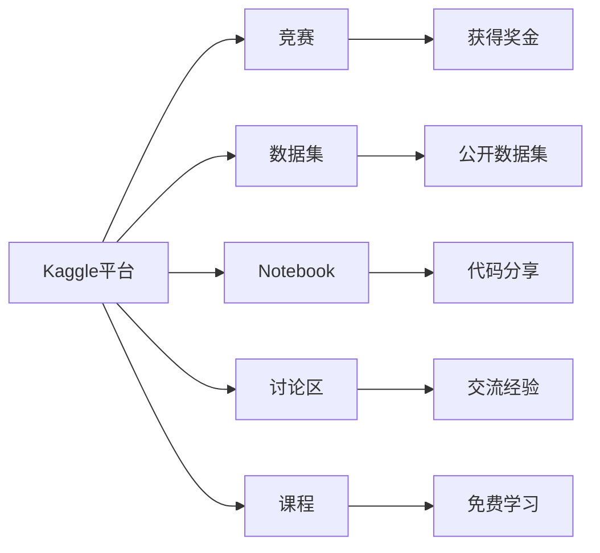
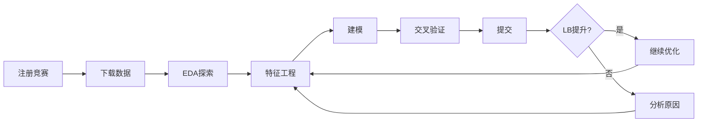
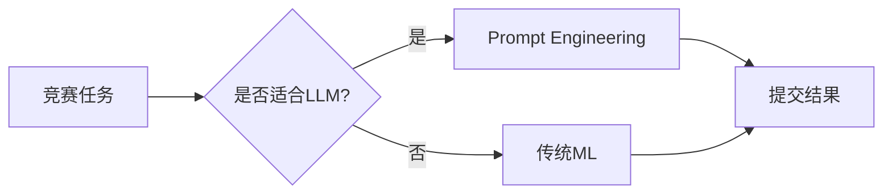

# Kaggle 修炼手册

> **资料来源**：Susan《Kaggle 修炼手册：零基础入门，玩转数据科学竞赛！》
> **适合人群**：希望参加数据科学竞赛的初学者
> **难度**：⭐⭐（容易）

---

## 1. Kaggle 简介

Kaggle 是全球最大的数据科学竞赛平台，由 Google 拥有。它提供了：
- 真实业务数据集
- 即时排行榜反馈
- 社区 Notebook 分享
- 求职加分项



---

## 2. 竞赛类型

| 类型 | 说明 | 奖金 | 适合阶段 |
|------|------|------|----------|
| **Getting Started** | 入门教程，永久开放 | 无 | 初学者 |
| **Featured** | 正式竞赛，企业赞助 | $10K-$1M | 有经验者 |
| **Research** | 科研竞赛 | 通常无 | 研究者 |
| **Recruitment** | 招聘竞赛 | 工作机会 | 求职者 |
| **Community** | 社区自发组织 | 无 | 兴趣驱动 |

---

## 3. 竞赛流程



---

## 4. 核心技能

### 4.1 数据探索（EDA）

**目标**：理解数据分布、发现问题、产生洞察

```python
import pandas as pd
import matplotlib.pyplot as plt
import seaborn as sns

# 加载数据
train = pd.read_csv('train.csv')
test = pd.read_csv('test.csv')

# 基本统计
print(train.shape)
print(train.describe())
print(train.info())

# 缺失值分析
missing = train.isnull().sum()
missing = missing[missing > 0].sort_values(ascending=False)

# 目标变量分布
plt.figure(figsize=(10, 4))
plt.subplot(1, 2, 1)
train['target'].hist(bins=50)
plt.title('Target Distribution')

plt.subplot(1, 2, 2)
sns.boxplot(y=train['target'])
plt.title('Target Boxplot')
plt.show()

# 特征相关性
corr = train.corr()
sns.heatmap(corr, annot=True, fmt='.2f')
```

### 4.2 特征工程

**数值特征**：
```python
# 对数变换（处理右偏分布）
df['log_feature'] = np.log1p(df['feature'])

# 分箱（处理异常值）
df['feature_bin'] = pd.qcut(df['feature'], q=10, labels=False)

# 标准化
from sklearn.preprocessing import StandardScaler
scaler = StandardScaler()
df['feature_scaled'] = scaler.fit_transform(df[['feature']])
```

**类别特征**：
```python
# One-Hot 编码（低基数）
df = pd.get_dummies(df, columns=['category'])

# Target Encoding（高基数，小心过拟合）
from category_encoders import TargetEncoder
encoder = TargetEncoder(cols=['high_cardinality_feature'])
df = encoder.fit_transform(df, df['target'])

# Label Encoding（树模型）
from sklearn.preprocessing import LabelEncoder
le = LabelEncoder()
df['category_encoded'] = le.fit_transform(df['category'])
```

**特征交叉**：
```python
# 数值交叉
df['feature_product'] = df['feature1'] * df['feature2']
df['feature_ratio'] = df['feature1'] / (df['feature2'] + 1e-8)

# 类别交叉
df['category_combo'] = df['cat1'].astype(str) + '_' + df['cat2'].astype(str)
```

### 4.3 模型选择

**梯度提升树（表格数据首选）**：

| 模型 | 优点 | 缺点 |
|------|------|------|
| **XGBoost** | 速度快，生态成熟 | 参数较多 |
| **LightGBM** | 更快，内存友好 | 对过拟合敏感 |
| **CatBoost** | 自动处理类别特征 | 训练较慢 |

**深度学习**：
- TabNet：注意力机制 + 稀疏性
- DeepFM：自动特征交叉
- FT-Transformer：将表格数据当作文本处理

**集成方法**：
```python
# Stacking
from sklearn.ensemble import StackingRegressor
from sklearn.linear_model import Ridge

estimators = [
    ('lgb', lgb.LGBMRegressor()),
    ('xgb', xgb.XGBRegressor()),
    ('cat', cat.CatBoostRegressor())
]

stack = StackingRegressor(
    estimators=estimators,
    final_estimator=Ridge()
)
```

### 4.4 交叉验证

**K-Fold**：
```python
from sklearn.model_selection import KFold

kf = KFold(n_splits=5, shuffle=True, random_state=42)
for fold, (train_idx, val_idx) in enumerate(kf.split(X)):
    X_train, X_val = X.iloc[train_idx], X.iloc[val_idx]
    y_train, y_val = y.iloc[train_idx], y.iloc[val_idx]
    # 训练模型...
```

**Stratified K-Fold**（分类问题，保持类别比例）：
```python
from sklearn.model_selection import StratifiedKFold
skf = StratifiedKFold(n_splits=5, shuffle=True, random_state=42)
```

**Time Series Split**（时间序列）：
```python
from sklearn.model_selection import TimeSeriesSplit
tscv = TimeSeriesSplit(n_splits=5)
```

---

## 5. 大模型相关竞赛

### 5.1 LLM 推理竞赛

- **LLM 20 Questions**：模型通过 20 问猜出答案
- **Science Exam**：测试模型科学推理能力
- **Code Generation**：类似 HumanEval

### 5.2 使用大模型的策略



**适合 LLM 的任务**：
- 文本分类、情感分析
- 文本生成、摘要
- 问答系统
- 代码生成

**不适合 LLM 的任务**：
- 纯数值预测
- 图像分类（除非多模态）
- 需要严格可解释性的任务

---

## 6. 进阶技巧

### 6.1 对抗验证（Adversarial Validation）

**目的**：检查训练集和测试集分布是否一致

```python
from sklearn.ensemble import RandomForestClassifier
from sklearn.model_selection import cross_val_score

# 合并数据，创建标签（train=0, test=1）
train['is_test'] = 0
test['is_test'] = 1
combined = pd.concat([train, test], axis=0)

# 训练分类器区分 train/test
X = combined.drop('is_test', axis=1)
y = combined['is_test']

clf = RandomForestClassifier()
score = cross_val_score(clf, X, y, cv=5, scoring='roc_auc')

print(f'AUC: {score.mean():.4f}')
# AUC ~ 0.5：分布一致
# AUC > 0.7：分布差异大，需要处理
```

### 6.2 Pseudo Labeling

**思想**：用模型预测测试集，将高置信度预测作为伪标签加入训练

```python
# 1. 训练初始模型
model.fit(X_train, y_train)

# 2. 预测测试集
preds = model.predict_proba(X_test)

# 3. 选择高置信度样本
confident_idx = np.where((preds > 0.9) | (preds < 0.1))[0]

# 4. 加入训练集
X_pseudo = X_test.iloc[confident_idx]
y_pseudo = (preds[confident_idx] > 0.5).astype(int)

# 5. 重新训练
model.fit(
    pd.concat([X_train, X_pseudo]),
    np.concatenate([y_train, y_pseudo])
)
```

### 6.3 模型融合

**Weighted Average**：
```python
# 根据验证集表现分配权重
weights = {'lgb': 0.4, 'xgb': 0.35, 'cat': 0.25}
final_pred = (
    weights['lgb'] * lgb_pred +
    weights['xgb'] * xgb_pred +
    weights['cat'] * cat_pred
)
```

---

## 7. 面试价值

| 竞赛成绩 | 求职价值 |
|---------|----------|
| 1 枚金牌 | 顶级公司敲门砖 |
| 多枚银牌 | 强有力的加分项 |
| 铜牌/排名靠前 | 证明实践能力 |
| 参与并完成 | 展示学习态度 |

**如何写进简历**：
- 不要只写"参加 Kaggle 竞赛"
- 要写："在 XXX 竞赛中获得 Top X%（X/XXXX 队伍），使用 YYY 技术"
- 附上竞赛链接和 Notebook

---

## 学习建议

1. **从 Getting Started 开始**：Titanic、House Prices
2. **阅读 Discussion**：Top 方案分享
3. **Fork Notebook**：从别人的代码学习
4. **建立 Pipeline**：可复现的实验流程
5. **记录实验**：用 Excel/Weights&Biases 追踪
