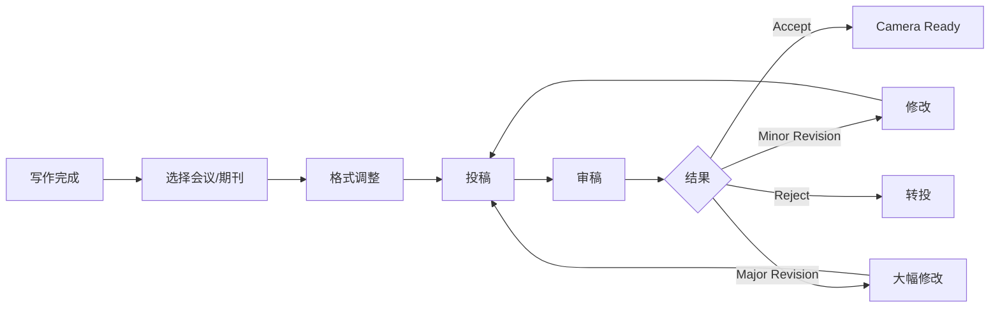

# 科研论文写作

> **资料来源**：Science Research Writing
> **适合人群**：需要撰写学术论文的研究者
> **难度**：⭐⭐⭐（中等）

---

## 1. 为什么需要学论文写作

即使你从事工业界工作，论文写作能力也很重要：

- **技术博客**：分享经验，建立个人品牌
- **专利申请**：清晰描述技术创新
- **内部文档**：良好的写作提升团队协作效率
- **学术合作**：与高校合作时需要

---

## 2. 论文结构详解

### 2.1 Abstract（摘要）

**结构（150-250 词）**：

```
1. 研究背景（1 句）
   "Transformer 架构已成为 NLP 的主流..."

2. 问题定义（1 句）
   "然而，其二次复杂度的注意力机制限制了长序列处理能力..."

3. 方法概述（2-3 句）
   "本文提出 XXX，通过 YYY 实现 ZZZ..."

4. 实验结果（1-2 句）
   "在 Benchmark 上，我们的方法相比基线提升 X%..."

5. 贡献总结（1 句）
   "代码已开源：github.com/xxx"
```

**写作要点**：
- 独立成篇：不读全文也能理解核心贡献
- 避免引用：摘要中一般不引用文献
- 数字具体：用具体数字代替"显著"、"大量"

### 2.2 Introduction（引言）

**结构**：


**贡献列表的写法**：

❌ 模糊：
> "本文提出了一种新的方法，取得了很好的效果。"

✅ 具体：
> "本文的主要贡献包括：
> 1. 提出 XXX 架构，首次将 YYY 应用于 ZZZ 任务；
> 2. 设计了一种高效的 WWW 算法，将时间复杂度从 O(n²) 降至 O(n log n)；
> 3. 在 3 个标准数据集上取得了 SOTA 性能，代码已开源。"

### 2.3 Related Work（相关工作）

**组织方式**：

**按方法分类**：
```
2.1 基于 CNN 的方法
    [引用1] 提出...
    [引用2] 改进...

2.2 基于 Attention 的方法
    [引用3] 首次应用...
    [引用4] 提出多头...

2.3 与本文方法的区别
    上述方法都假设...，本文不同之处在于...
```

**写作技巧**：
- 不要简单罗列："A 做了 X，B 做了 Y"
- 要有逻辑："早期方法关注 X，近期转向 Y，本文提出 Z"
- 明确指出与本文的关系：相似性 + 差异性

### 2.4 Method（方法）

**写作原则**：
- **清晰**：让审稿人能复现你的工作
- **完整**：不要遗漏关键细节
- **聚焦**：突出创新点，常规操作简要说明

**推荐结构**：
```
3.1 问题定义
    数学符号、输入输出定义

3.2 整体架构
    系统框图 + 各组件概述

3.3 核心创新点 A
    详细公式、算法流程、示意图

3.4 核心创新点 B
    ...

3.5 训练细节
    损失函数、优化器、超参数

3.6 推理流程
    如何使用训练好的模型
```

### 2.5 Experiments（实验）

**必备内容**：

| 内容 | 说明 | 注意 |
|------|------|------|
| 数据集 | 名称、规模、划分方式 | 使用标准数据集 |
| 评价指标 | 每个指标的公式/含义 | 与基线使用相同指标 |
| 基线方法 | 列出对比方法 | 选择有代表性的基线 |
| 实现细节 | 框架、GPU、训练时间 | 便于复现 |
| 主实验 | 与基线的对比表格 | 粗体标注最佳结果 |
| 消融实验 | 验证各组件的贡献 | 控制变量 |
| 案例分析 | 展示具体例子 | 增加可信度 |

**实验表格示例**：

| 方法 | Dataset1 | Dataset2 | Dataset3 | 平均 |
|------|----------|----------|----------|------|
| Baseline-A | 85.2 | 78.3 | 82.1 | 81.9 |
| Baseline-B | 86.5 | 79.8 | 83.4 | 83.2 |
| **Ours** | **88.1** | **81.2** | **85.6** | **85.0** |

### 2.6 Conclusion（结论）

**结构**：
1. 工作总结（1 段）：概括方法和结果
2. 局限性（1 段）：诚实指出不足
3. 未来方向（1 段）：展望后续研究

**局限性示例**：
> "本文方法在 XXX 场景下效果有限，主要因为 YYY。未来工作将探索 ZZZ 来缓解这一问题。"

---

## 3. 写作工具

| 工具 | 用途 | 推荐度 |
|------|------|--------|
| **Overleaf** | LaTeX 在线协作 | ⭐⭐⭐⭐⭐ |
| **Grammarly** | 语法检查 | ⭐⭐⭐⭐ |
| **Zotero** | 文献管理 | ⭐⭐⭐⭐⭐ |
| **Connected Papers** | 文献图谱 | ⭐⭐⭐⭐ |
| **Writefull** | 学术写作辅助 | ⭐⭐⭐⭐ |

---

## 4. 大模型辅助写作

### 4.1 合理使用场景

| 场景 | 如何使用 | 注意事项 |
|------|----------|----------|
| 初稿生成 | 给大纲，让模型扩展 | 需大幅修改 |
| 语言润色 | 输入段落，要求改进表达 | 检查术语准确性 |
| 语法检查 | 输入全文，找出错误 | 人工复核 |
| 摘要生成 | 输入全文，生成摘要 | 需精简到字数限制 |
| 相关工作整理 | 提供论文列表，要求分类 | 核实每篇论文内容 |

### 4.2 提示词模板

**润色段落**：
```
请润色以下学术论文段落，要求：
1. 保持学术语气和专业术语
2. 提高逻辑连贯性
3. 精简冗余表达
4. 修正语法错误

原文：
"""
{paragraph}
"""
```

**生成相关工作段落**：
```
请帮我撰写相关工作段落。

主题：{topic}
相关论文：
1. {paper1}: {brief_description}
2. {paper2}: {brief_description}
3. {paper3}: {brief_description}

本文创新点：{our_innovation}

要求：
1. 按方法类别组织
2. 每类 2-3 篇论文
3. 最后一段说明与本文的区别
```

### 4.3 注意事项

⚠️ **风险**：
- **幻觉**：模型可能编造不存在的论文
- **抄袭**：模型输出可能与他人论文相似
- **不准确**：模型可能误解技术细节

✅ **最佳实践**：
- 大模型辅助 ≠ 大模型代写
- 关键事实必须人工核查
- 使用查重工具检查

---

## 5. 投稿流程



### 主要会议/期刊

| 领域 | 顶会 | 顶刊 |
|------|------|------|
| NLP | ACL, EMNLP, NAACL | TACL, Computational Linguistics |
| ML | NeurIPS, ICML, ICLR | JMLR, TPAMI |
| CV | CVPR, ICCV, ECCV | IJCV, TPAMI |
| 数据挖掘 | KDD, WWW, WSDM | TKDE, VLDB |

---

## 6. 写作 checklist

投稿前检查：

- [ ] 摘要独立成篇，包含背景、方法、结果
- [ ] 引言清晰指出问题、贡献、创新点
- [ ] 相关工作分类清晰，与本文关系明确
- [ ] 方法可复现，关键细节完整
- [ ] 实验使用标准数据集和评价指标
- [ ] 消融实验验证各组件贡献
- [ ] 案例分析展示具体例子
- [ ] 结论诚实指出局限性
- [ ] 参考文献格式正确，无遗漏
- [ ] 语法和拼写检查通过
- [ ] 图表清晰，标注完整
