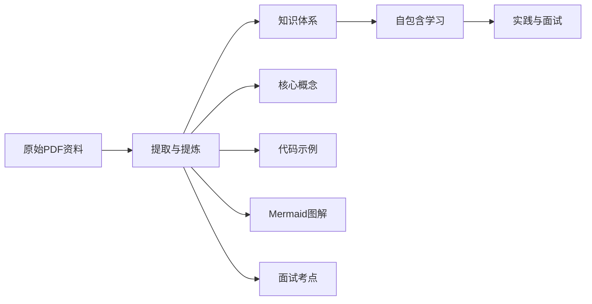
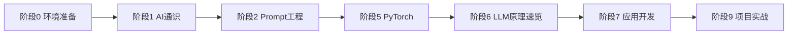
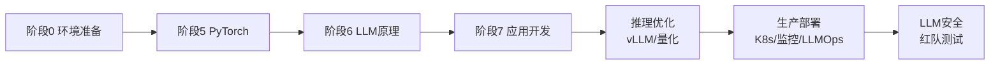

# 大模型知识体系 - 学习指南

> 系统性整理大模型学习资料，从通识到原理，从应用到部署，助力成为大模型应用开发工程师、架构师或企业级部署专家。

---

## 本书定位

这是一本**自包含的大模型学习手册**。所有知识点都经过提炼、总结和补充，目标是：**除非很有必要，你不需要打开原始材料就能完成学习**。



**本书特色**：
- **内容提取**：将原始 PDF 的核心内容提炼到 markdown 中
- **知识补充**：内容不够深入时，用已有知识和互联网资料补充
- **图形辅助**：用 Mermaid 图解架构、流程和概念
- **面试导向**：每个章节包含面试高频考点
- **搜索友好**：mdbook 内置全文检索，支持 `Ctrl+K` 快速查找

---

## 十个阶段学习路径

```mermaid
graph LR
    Z[第零阶段<br/>环境准备] --> A[第一阶段<br/>AI通识]
    A --> B[第二阶段<br/>Prompt工程]
    B --> C[第三阶段<br/>数学与ML]
    C --> D[第四阶段<br/>深度学习]
    D --> E[第五阶段<br/>PyTorch]
    E --> F[第六阶段<br/>大模型原理]
    F --> G[第七阶段<br/>应用开发]
    G --> H[第八阶段<br/>高级主题]
    H --> I[第九阶段<br/>竞赛实战]

    style Z fill:#f3e5f5
    style A fill:#e3f2fd
    style B fill:#e3f2fd
    style C fill:#e8f5e9
    style D fill:#e8f5e9
    style E fill:#e8f5e9
    style F fill:#fff3e0
    style G fill:#fff3e0
    style H fill:#fce4ec
    style I fill:#fce4ec
```



| 阶段 | 主题 | 目标 | 预计时间 |
|:---:|:---|:---|:---:|
| 0 | 环境准备 | 搭建开发环境 | 0.5 天 |
| 1 | AI 与大模型通识 | 建立全局视野 | 1 周 |
| 2 | Prompt 工程与应用 | 掌握与大模型对话的核心技能 | 1 周 |
| 3 | 数学与机器学习基础 | 夯实理论基础 | 3-4 周 |
| 4 | 深度学习核心 | 理解神经网络原理 | 3-4 周 |
| 5 | PyTorch 框架实践 | 动手编程能力 | 2-3 周 |
| 6 | 大模型原理与架构 | 深入 LLM 内核 | 4-6 周 |
| 7 | 大模型应用开发 | 工程化落地能力 | 3-4 周 |
| 8 | 高级主题与前沿 | 跟进研究前沿 | 按需 |
| 9 | 竞赛与实战 | 综合应用能力 | 持续 |

---

## 职业目标对应路径

### 大模型应用开发工程师



**核心技能**：Prompt Engineering、RAG、Agent、微调、API 开发、测试评估

### 大模型架构师


**核心技能**：Transformer 原理、分布式训练、模型优化、架构设计、数据工程

### 企业级应用部署工程师



**核心技能**：模型量化、推理引擎、服务部署、性能优化、LLMOps、安全审计

---

## 如何使用本书

### 1. 检索学习

使用右上角搜索框（`Ctrl+K` / `Cmd+K`），按关键词查找相关知识点：
- 搜索 "LoRA" → 找到微调方法详解
- 搜索 "KV Cache" → 找到推理优化原理
- 搜索 "面试" → 找到各章面试考点

### 2. 按阶段学习

每阶段包含 `README.md` 作为导学，明确：
- 学习目标和推荐顺序
- 与 LLM 的关联点
- 需要动手实践的章节

### 3. 交叉参考

各章节通过链接相互引用，形成知识网络：

```
Transformer 架构 ←→ 注意力机制 ←→ 优化技术
     ↓                  ↓              ↓
  大模型原理      从零构建 LLM     FlashAttention
     ↓                  ↓              ↓
  应用开发(RAG)   预训练与微调    推理加速
```

### 4. 实践为主

**每阶段标注了需要动手实践的章节**，建议：
- 看完理论后，用 PyTorch 复现关键代码
- 在 HuggingFace 上加载真实模型，观察行为
- 完成至少一个端到端项目

---

## 资料来源说明

本知识体系基于以下资料整理：

| 类别 | 资料 |
|------|------|
| 入门 | 《图解人工智能》、清华大学 DeepSeek 系列教程 |
| Prompt | Google 提示工程白皮书、Prompting Guide 101 |
| 数学 | 《Foundation Mathematics for CS》、《理解机器学习》 |
| 深度学习 | 《深度学习入门：基于Python》、《动手学深度学习》、李宏毅教程 |
| PyTorch | 《PyTorch 实用教程》、《动手学 PyTorch 建模与应用》 |
| 大模型原理 | 《大模型基础》、《从零构建大语言模型》、JHU LLM 教程 |
| 应用开发 | 《OpenClaw 橙皮书》、吴恩达大模型通关手册 |
| 高级主题 | Geometric Deep Learning、图神经网络、推荐系统 |
| 实战 | Kaggle 修炼手册、Science Research Writing |

---

## 学习建议

1. **不要从第一章开始逐页阅读**：根据目标职位选择路径，按需学习
2. **建立知识卡片**：每学完一章，用自己的话总结核心概念
3. **代码即笔记**：运行书中的代码示例，修改参数观察效果
4. **参与社区**：在 GitHub、知乎、掘金分享学习笔记
5. **持续迭代**：大模型领域发展极快，保持每周阅读 arXiv 的习惯

---

> **提示**：本书使用 mdbook 构建，支持全文搜索。按 `Ctrl+K` 或 `Cmd+K` 快速检索任何知识点。
